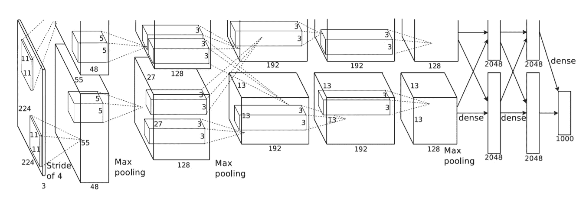
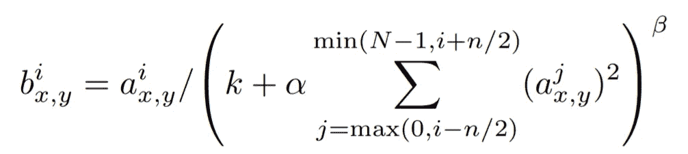
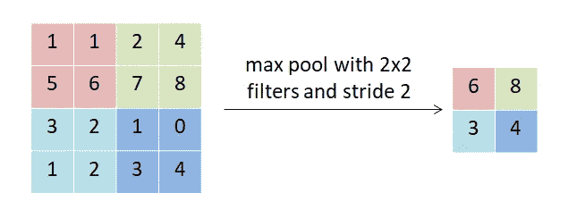
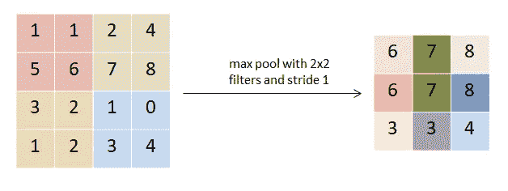
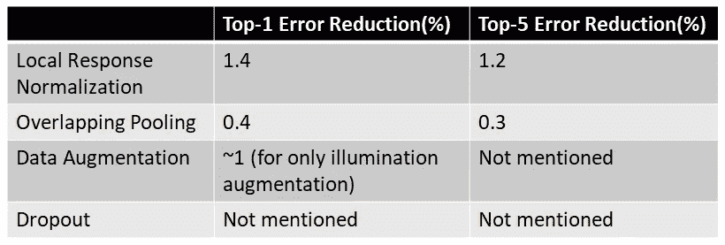
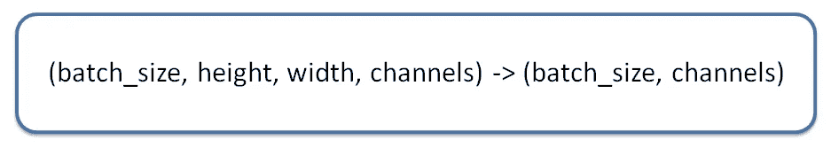

# AlexNet

> 原文：<https://towardsdatascience.com/alexnet-8b05c5eb88d4?source=collection_archive---------18----------------------->

## 用代码解释论文

照片由[好股票照片](https://goodstock.photos/)

2012 年秋季 9 月，AlexNet 首次参加了 ImageNet 大规模视觉识别挑战赛(ILSVRC)，并展示了 GPU 在深度学习方面的异常实力。点燃图像深度学习整个领域的火花是这样的。由 Alex Krizhevsky 与当今深度学习的大腕 Ilya Sutskever 和 Geoffrey Hinton 一起创建。这是任何进入深度学习领域的人阅读的第一篇论文。

所以，让我们回顾一下这篇论文，看看我们怎样才能重新创造，使它重现往日的辉煌。

# 网络

来源:[https://papers . nips . cc/paper/4824-imagenet-class ification-with-deep-convolutionary-neural-networks . pdf](https://papers.nips.cc/paper/4824-imagenet-classification-with-deep-convolutional-neural-networks.pdf)

由于网络设计时 GPU 内存不足，因此必须通过结合 2 个 GPU 来训练。

*   我们的输入是 **224x224x3** 的图片。(论文中给出的是 150，528 维，有点混乱)
*   接下来，**执行 96 个 11×11**的卷积(今天，没有看到任何网络采用如此大的卷积)，步长为 4 。然后，**响应规范化**(稍后解释)和池应用于层外。在这一层之后，网络分裂成两个相同的主干，直到完全连接。这样设计是为了考虑 GPU 的内存需求。
*   接下来是 **256 个 5x5** 的滤波器，每个滤波器然后再次被响应归一化(稍后解释)并被汇集。
*   第三、第四、第五层与 **384 个内核相同，每个内核为 3×3**。
*   由于这里内存的限制，作者不得不将 4096 个神经元分成两部分，每部分 2048 个。每个部分都从两个主干获得数据。
*   当从两个茎获得数据时，再次重复完全连接的层
*   最后，我们输入 1000 个神经元的**密集层，即 ImageNet 中的类的数量。**

网络的成功在于他们用过的伎俩。

# 局部响应标准化

这是他们使用的巧妙伎俩之一。

什么是局部响应正常化？

我们先来看看 ReLU。

> ReLU(x) = max(0，x)

ReLU 最好的一点是，即使极少量的训练样本有一些激活，也会有学习。但是，缺点是它们是无限的。因此，他们控制他们的权重，并且，为了产生更好的特性，我们使用局部响应标准化。

来源:[https://papers . nips . cc/paper/4824-imagenet-class ification-with-deep-convolutionary-neural-networks . pdf](https://papers.nips.cc/paper/4824-imagenet-classification-with-deep-convolutional-neural-networks.pdf)

这个公式乍一看很吓人，所以，我们来理解一下。

首先，在**求和算子**中，存在激活，我们对其求平方以消除正负效应。

现在，让我们来看看，求和运算符的范围是什么，给定一个 **n** ，它在其左侧迭代 **n/2，在其右侧迭代**N/2，同时考虑边界，即 0 和 N-1。

这进一步乘以因子 **α** ，以减少其与分子相比的值，从而保持分子中的激活值(如果 **α** 高，则分子中的激活将减少，从而导致渐变消失，如果太低，将导致渐变爆炸)。

**增加 k** 是为了防止被零除的错误。

最后，将 **β** 作为一个指数来决定该局部响应对所讨论的激活的影响，较高的 **β** 将更多地惩罚对其邻居的激活，而较低的 **β** 将不会对其邻居的所讨论的激活产生太多影响。

因此，局部反应标准化有助于我们找出那些对其邻居表现更好的激活。这也有助于提高网络的效率，因为一些神经元将充当网络的核心，所以计算将会很快。

此外，它有助于减少冗余特征，假设许多相邻神经元具有高值，则它们将通过局部响应归一化来归一化，从而抑制冗余的连续特征。

因此，局部反应正常化也在相邻神经元之间产生竞争，以更好地学习将自己与邻近的其他神经元区分开来。所以，你可以称之为**竞争正常化**。

局部响应标准化不再使用，因为我们更喜欢批量标准化，它在批量水平上工作，以消除内部协变量的变化。

与不可训练并且没有正则化效果的局部响应归一化相比，批量归一化是可训练的并且具有正则化效果。

# 重叠池

这是他们用过的下一个酷招。

通常，我们使用非重叠池，如下所示:

**图一**(来源:[阿布舍克·维尔马](https://medium.com/@deeptechtalker))

但是，在 AlexNet 中，使用了重叠池。

**图二**(来源:[阿布舍克·维尔马](https://medium.com/@deeptechtalker))

我们来了解一下背后的直觉。

照片由[迈克尔·达姆](https://unsplash.com/@michaeldam?utm_source=medium&utm_medium=referral)在 [Unsplash](https://unsplash.com?utm_source=medium&utm_medium=referral) 上拍摄

给定一幅图像，我们推断出图像中物体的形状和边界，因为边界的两边有明显的区别。这也有助于我们确定物体在图像中的位置。

让我们以上图为例。我们的注意力集中在图像的对象上，也就是说，在这种情况下，是女孩。我们可以清楚地定位图像中的女孩，因为我们可以在脑海中围绕女孩画出边界。

这就是我们推断的图像中的空间信息。

在非重叠汇集的情况下，我们可以看到，由于汇集的不连续性，将会丢失一定量的空间信息，因为所有高值都将被捕获。

但是，在重叠汇集的情况下，我们可以看到，随着高值，一些低值密度高的区域，它们也将得到保护。空间信息是两者的结果，因此，在重叠池的情况下，它将被更好地保存。

> 什么是过度拟合？
> 
> 当网络开始关注某个特定的特征时，任何偏离都会导致错误的预测。这种超敏感性导致泛化能力差。

因此，如果使用非重叠池，那么，网络将继续集中主要特征，只会导致灾难性的过度拟合。

但是，在重叠池的情况下，由于空间信息是守恒的，网络不会轻易溢出。

现在我还没有看到这种技术被普遍使用。最合理的原因是批量标准化，它具有正则化效果，还可以防止过度拟合。因此，为了节省空间，我们使用正常的非重叠池。

# 数据扩充

他们使用的第三个技巧是数据扩充。

我们希望我们的神经网络能够很好地泛化，因此，我们通过进行一些简单的操作和动态操作来增强我们的数据，即增强的图像是在训练时生成的(就像在 AlexNet 中一样)。

AlexNet 使用图像翻译和水平反射。在他们拥有的 256x256 的图像中，他们随机选取了 224x224 的图像以及它们的水平反射。因此，随机获取补丁的行为就是图像转换。至于水平翻转，我们来看这个例子:

来源:[阿布舍克·维尔马](https://medium.com/@deeptechtalker)

他们使用的第二种增强手段是我在别处从未见过的。他们改变了训练样本中 RGB 通道的强度。

他们首先对整个 ImageNet 训练数据集的 RGB 像素执行 PCA。他们提取了每个通道的主要成分。然后，他们将这些主成分的随机部分添加到图像的每个像素中。

它对图像所做的是改变照明的颜色和强度。因此，它利用了自然图像的一个特性，即物体的标签对于光照参数是不变的。一只狗是一只在明亮的白光和黄灯下的狗，句号！

这是我第一次与这种增强幽会，还没有看到它被使用。由于当今数据的巨大规模，当我们今天有其他随机操作用于增强时，如缩放、倾斜等，经历寻找主成分的痛苦似乎是低效的。

# 拒绝传统社会的人

这是他们用的第四招。老实说，这不需要介绍，因为这是今天减少神经网络过度拟合的*事实上的*方法。

丢弃是随机关闭一些神经元，这样，每个神经元被迫学习不依赖于其邻居的特征，从而导致更健壮的特征。

最后，让我们来统计一下对这个网络帮助最大的是什么:

来源:[阿布舍克·维尔马](https://medium.com/@deeptechtalker)

如果您对什么是前 1 名和前 5 名错误感到困惑，那么，我们知道 ImageNet 总共有 1000 个类。正常的方法是预测对应于最终层中最高值的类别，这里称为 top-1。另一种方法是采用 top-k 方法(在这种情况下，k = 5)，这里，我们将预测作为对应于最终层中具有前 5 个最高值的单元的类。如果在这 5 条中，有任何一条符合事实，那么，我们认为这是一个成功的预测。

# 培训策略

他们使用的优化器 **SGD with momentum** 至今仍在使用，但需要一个适当的训练计划，因此很难训练。所以，事实上的优化者是亚当。在 AlexNet 的情况下使用了 0.9 的动量。

训练批量 128，不错，符合所有关于深度学习的建议。**批量样本数量越多，模型越好。**

**重量衰减**也使用了 0.0005 的值。体重下降在今天仍然很流行，并被用于模特身上来提高她们的表现。

**权重初始化**使用标准偏差为 0.01 的零均值高斯分布完成。在偏置初始化的情况下，在第二、第四、第五和更高密度层的情况下，它们已经用 1 初始化偏置，而其他层的偏置用 0 初始化。这种初始化最初通过给 ReLU 正输入来帮助网络。

**学习率**最初设定为 0.01，每当验证错误率停止提高时，学习率就会降低 10 倍。

我们终于了解了 AlexNet 的一切。

# 编码时间

资料来源:[阿布舍克·维尔马](https://medium.com/@deeptechtalker)

**如果你想试试这段代码，我建议 Google 的**[**COLAB**](https://colab.research.google.com/)**。这个用的是 TensorFlow 2.2.0。**我在这里使用了简单的 MNIST 数据集，并调整其大小以适应 AlexNet 输入。为什么？因为如果我们输入 28x28 图像可用 MNIST，这不会编译。试试看！第一次卷积后，就没有什么可以应用最大池了。

现在，我已经尽我所能从[论文](https://papers.nips.cc/paper/4824-imagenet-classification-with-deep-convolutional-neural-networks.pdf)中吸收了更多的内容。首先，我没有使用两个词干，因为这不是 GPU 空间匮乏的古代。所以，我用了一个单独的茎。

在要点的第 37 行之前，我已经加载了 MNIST 的数据并对其进行了整形。我只取了 MNIST 的一小部分，因为加载它并调整它的大小会溢出内存，导致内核被转储。

在**第 38 行**，我已经用`tf.keras.layers.Conv2D`定义了第一层。滤镜数量为 96，滤镜大小为 11x11，激活为`relu`，我用过的最后一个不熟悉的`kernel_initializer`是用均值为 0，标准差为 0.01 的高斯分布初始化权重，在[论文](https://papers.nips.cc/paper/4824-imagenet-classification-with-deep-convolutional-neural-networks.pdf)中有提到。如果你想知道偏差，默认情况下，它们被设置为零。

在**行 42** 处，我们有`tf.keras.layers.MaxPooling2D`，其中我将过滤器大小设置为 3x3，步幅设置为(2，2)。

在**行 44** 处，我们又有了`tf.keras.layers.Conv2D`。在这里，有一点改变了，我也使用了一个保存值`ones`的`bias_initializer`。如[论文](https://papers.nips.cc/paper/4824-imagenet-classification-with-deep-convolutional-neural-networks.pdf)中所述，这是为了在该层设置偏差 1。

在**线 48** 处，我们有一个`tf.keras.layers.MaxPooling2D`就像 42 线一样。

在**50 线**，我们有`tf.keras.layers.Conv2D`。滤波器数量为 384，滤波器大小为 3x3，激活为`relu`，`kernel_initializer`已用于使用均值为 0、标准差为 0.01 的高斯分布初始化权重，如论文中所述，最后`bias_initializer`已用于将偏差设置为 1，如论文[中所述](https://papers.nips.cc/paper/4824-imagenet-classification-with-deep-convolutional-neural-networks.pdf)。

在**线 53 和 57** 处，遵循与线 50 相同的模式。

在**线 61** 处，我们有一个`tf.keras.layers.MaxPooling2D`就像 42 线一样。

在第 63 行的**处，一个`Flatten`层被用来去掉多余的尺寸。这是正在发生的转变:**

来源:Deep Tech Talker

在**第 65 行**，`Dense`层使用了 4096 个单位(在论文中，每个词干有 2048 个单位)，`kernel_initializer`被用于初始化平均值为 0、标准差为 0.01 的高斯分布的权重，`bias_initializer`被用于初始化偏差为 1，如[论文](https://papers.nips.cc/paper/4824-imagenet-classification-with-deep-convolutional-neural-networks.pdf)中所述。

在**行 69** 处，`Dropout`已被使用并设置为`0.5`。在论文中，辍学的价值并没有具体提到与网络的关系，但是，在关于辍学的讨论中，他们谈到了这个价值，因此，我使用了它。没有明确提到所使用的辍学。

在**线 71** 处，遵循与线 65 相同的模式。

在**线 75** 处，遵循与线 69 相同的模式。

在**第 77 行**，我们有预测层，这里，我们有 10 个类，相比之下，在 AlexNet 中使用的 ImageNet 中有 1000 个类。使用激活`softmax`和 10 个单位的`Dense`层进行预测。此外，`kernel_initializer`已被用于初始化具有平均值 0 和标准偏差 0.01 的高斯分布的权重。偏差隐含地为 0。

在**第 83 行**，我们有`model.compile`，在这里我们决定优化器、损失和模型的指标。作者使用了动量为 0.9、重量衰减为 0.0005 的 SGD，但是在 TensorFlow 中没有 SGD 的重量衰减功能。所以，我只用过动量 0.9 的 SGD。根据[论文](https://papers.nips.cc/paper/4824-imagenet-classification-with-deep-convolutional-neural-networks.pdf)已经使用了 0.01 的学习率。[论文](https://papers.nips.cc/paper/4824-imagenet-classification-with-deep-convolutional-neural-networks.pdf)中的指标是前 1 名(相当于准确性)和前 5 名。这两个指标都设置在这一行中。损失是用于多级分类的`categorical_crossentropy`。

在**第 89 行**处，当验证误差没有改善时，我使用了`ReduceLROnPaleau`来降低学习率。对于多少个时代，他们看到它是否在改变，这在[的论文](https://papers.nips.cc/paper/4824-imagenet-classification-with-deep-convolutional-neural-networks.pdf)中没有提到。这由所用函数中的`patience`属性设置。`factor`属性允许我们在[论文](https://papers.nips.cc/paper/4824-imagenet-classification-with-deep-convolutional-neural-networks.pdf)中提到的学习率没有提高时，将学习率除以 10。`min_lr`显示了学习率的下限，这是作者在训练时设定的最小学习率。

在**线 93** 处，我们拟合模型。根据[文件](https://papers.nips.cc/paper/4824-imagenet-classification-with-deep-convolutional-neural-networks.pdf)设定了 128 个批次和 90 个时期。

今天，我们回顾并了解了第一个将 GPU 带到阳光下的开创性网络。这个网络单枪匹马撬动了图像深度学习的时代。它让 GPU 变得流行起来，而且它们会一直存在下去。