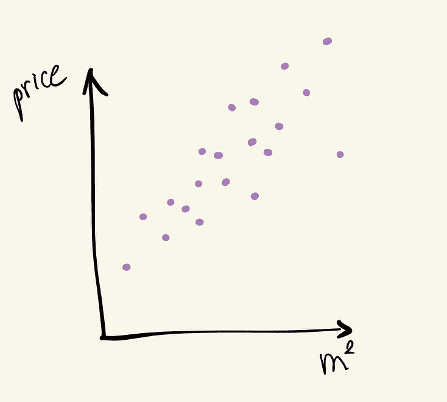
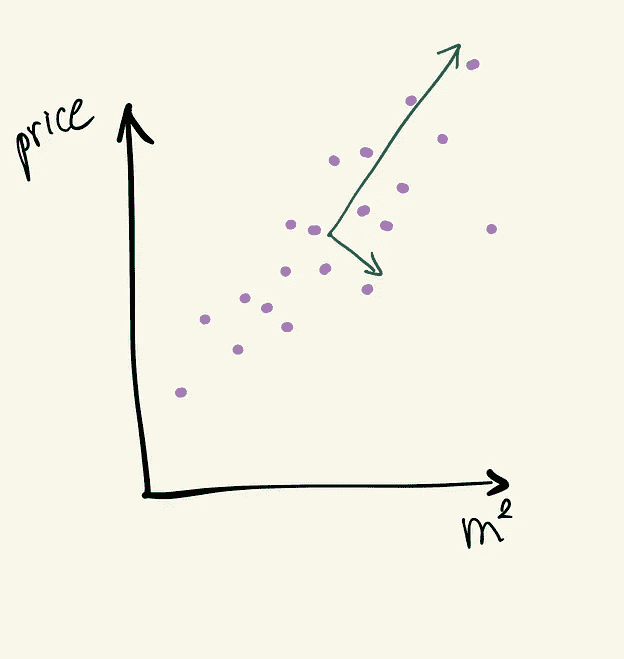
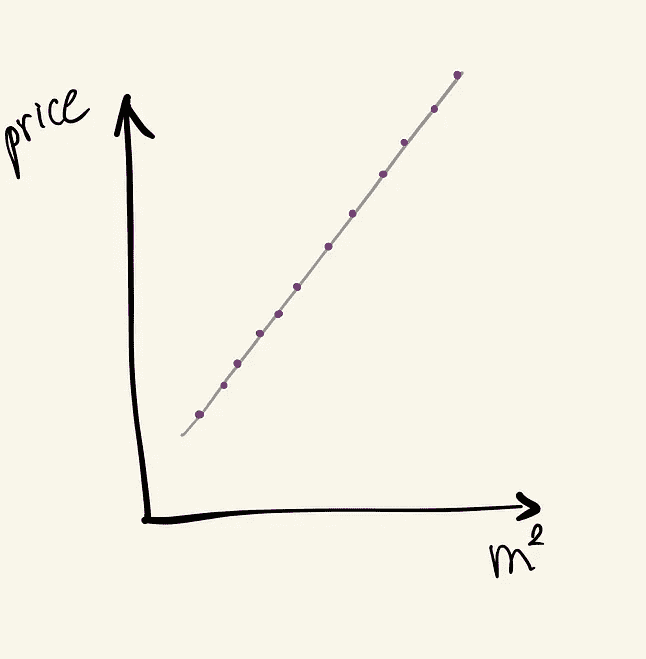

# PCA 背后的代数

> 原文：<https://towardsdatascience.com/algebra-behind-pca-7d801226f4e6?source=collection_archive---------49----------------------->

## 让 PCA 变得伟大的代数概要！

罗马法师在 [Unsplash](https://unsplash.com?utm_source=medium&utm_medium=referral) 上拍摄的照片

在我进行的一些采访中，我们最终会谈到降维技术。PCA 绝对是最受考生欢迎的一个。我个人不喜欢深入挖掘与角色不相关的领域，因为我自己可能也不知道答案！但是我喜欢问他们是否知道 PCA 是如何工作的。虽然我并不期望应聘者知道确切的代数，但我喜欢看他们是否有一些直觉，他们是否只是不知道(这对我来说完全没问题)，或者他们是否试图假装他们知道，这就是我的大脑用黄色旗帜提醒我的地方。

一些候选人开始谈论 *PCA 如何使用特征向量来计算最终特征*。这里是我喜欢问的地方，**什么是特征向量，PCA 计算**的特征向量是什么？这是大多数候选人开始动摇的地方。同样，即使这不是成为一名数据科学家必须知道的事情，我个人也更愿意得到诸如*我不确定*之类的答案，而不是候选人不知道的事情。

在这篇文章中，我希望能帮助人们对 PCA 的实际工作原理有一些基本的直觉，并且在面试中有信心回答这个问题。

# 特征分解:特征值和特征向量

Eigen 来自德语，意思是*拥有*，因此可以将特征向量和特征值转换为矩阵的自向量和自值。但这实际上意味着什么呢？

让我们后退一步，把本征态的定义正式化。我们将矩阵 ***A*** 的特征值 ***a*** 定义为:

***一个 v =一个 v***

换句话说，对向量*实施线性变换(保持和与乘的变换)，通过标量*改变*。因此，当且仅当 ***v*** 是 ***A*** 的特征向量时，对 ***v*** 应用矩阵 ***A*** 的点积只会改变向量的长度而不会改变其方向！注意 ***A*** 是一个*n×n*矩阵，在做特征分解时会有 *n 个*特征向量和 *n 个*特征值。***

***只是澄清一下，不是所有矩阵和向量之间的点积都满足这个条件。***

*****必须是一个方阵(行数与列数相同)才能进行特征分解。除此之外，为了很好地定义特征向量，所有特征值必须互不相同。*****

***最后，同样重要的是要注意，所有的特征向量都是相互垂直的，每个特征向量都有自己的特征值。***

# *****PCA 的代数*****

***为了理解 PCA 的代数是如何工作的，我们先来思考一下 PCA 的目标是什么。使用 PCA，我们希望减少完整数据集中的特征数量，尽可能多地保留原始数据中的信息，并删除最高的相关性。***

***但是等等！我们如何衡量这些相关性来确定方向的优先级？嗯，我们确实有一个矩阵来跟踪不同特征之间的相关性，这就是 [**协方差矩阵**](https://en.wikipedia.org/wiki/Covariance_matrix) ，所以让我们使用它吧！***

****关于这一点，有一个快速说明:有其他矩阵可用于 PCA，但协方差矩阵是最流行和直观的一种。****

**因此，我们可以对协方差矩阵进行特征分解，看看哪些是具有更高特征值的特征向量。对应于最高特征值( *x1* )的特征向量将是指示数据中最高方差的特征向量，因此是特征之间相关性最小的方向。第二个( *x2* )将是垂直于 *x1* 的第二高方差方向，以此类推。**

**简而言之，一旦计算出协方差矩阵，如果想将 n 维从 *n* 维减少到 *m* 维，就很简单:**

*   ****第一步**:计算协方差矩阵的特征向量。**
*   ****第二步**:设置特征值最高的前 *m* 个特征向量。这将是你的旋转矩阵 ***W，*** 其中 ***W*** 中的每一行对应于排序后的顶部 *m* 特征向量。 ***W*** 是一个 *m* x *n* 矩阵。**
*   ****步骤 3** :给定一个数据点 ***x，*** 可以通过执行线性变换***x’= W x .***找到在 *m* 维空间中的投影，给定 ***W*** 是一个 *m* x *n* 矩阵，***x’*****

## **例子**

**让我们看看下面的例子，以便更清楚地了解发生了什么:**

**假设我们有两个特征:给定城市中一套公寓的大小和该套公寓的价格。我们的任务是将数据缩减到 1D 空间。给定的数据集如下左图所示。**

**一个人应该采取的步骤是(*)同样，有多种方法可以做到这一点，我们只是举一个例子！*):**

*   ****第一步:**根据你的数据定义协方差矩阵，计算你的协方差矩阵的特征向量。**
*   ****第二步:**特征向量在中间的图片中显示为绿色。最长的特征向量是对应于最高特征值的特征向量(特征向量通常被归一化为 1，这只是为了可视化的目的)。很明显，它是指向最高方差的方向。这是一个人想要保持的方向，因为它包含了最多的信息。**
*   ****第三步:**一旦确定了最高特征值对应的特征向量，就要把数据点投影到后者定义的直线上。如右图所示。**

************

**图 1:(从左到右)a)原始数据集 b)原始数据集连同协方差矩阵特征向量 c)原始数据集在最高特征值对应的特征向量所定义的直线上的投影。**

**我希望这能让你对使用 PCA 时发生的事情有一个基本的概念！**