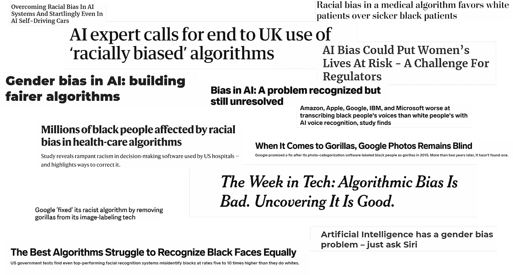
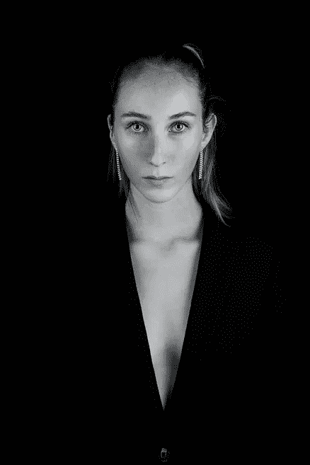

# 人工智能中的算法偏差需要讨论(和解决)

> 原文：<https://towardsdatascience.com/algorithm-bias-in-artificial-intelligence-needs-to-be-discussed-and-addressed-8d369d675a70?source=collection_archive---------20----------------------->

## 你在这件事上有责任…

# 介绍

当人工智能用于解决全球性问题时，算法偏差可能会开始出现，并可能导致意想不到的不便、负面影响和损害。

对于那些不熟悉术语“*算法偏差*”的人，我将在本文中提供一个合适的定义。

但是，如果你曾经遇到过一篇新闻文章，指出某种形式的歧视是由人工智能或自动化系统传达的，那么你就会遇到算法偏见。

新闻标题中的人工智能偏见

算法偏差这个话题并不新鲜，我将提供几年前的几个偏差的例子。

我现在写这篇文章的原因是因为人工智能系统和机器学习解决方案在解决全球问题方面的快速应用。

更具体地说，在撰写本文时，有[公司](https://www.forbes.com/sites/bernardmarr/2020/03/13/coronavirus-how-artificial-intelligence-data-science-and-technology-is-used-to-fight-the-pandemic/#737b79955f5f) [、数据科学家、机器学习工程师](https://spectrum.ieee.org/the-human-os/artificial-intelligence/medical-ai/companies-ai-coronavirus)和人工智能爱好者已经接过了衣钵，利用他们的技能来帮助对抗新冠肺炎·疫情。

理应如此。

但同样重要的是，这些公司和有才华的个人要明白，大量的人使用他们的系统，所以当涉及到算法偏差的问题时，需要某种形式的审查。

让我们开始吧

## 算法偏差

算法偏差这个话题很重要，也有些复杂，但是它的定义很简单。

算法偏差是从计算机系统的输出中出现的缺乏公平性。《算法偏差》中描述的不公平有多种形式，但可以总结为一个群体基于特定分类的歧视。

算法偏见有几种形式，例如，[种族偏见](https://www.washingtonpost.com/health/2019/10/24/racial-bias-medical-algorithm-favors-white-patients-over-sicker-black-patients/)，年龄歧视，[性别偏见](https://www.socialeurope.eu/artificial-intelligence-made-by-men-for-men)等。

我不知道读者的年龄、种族或性别，但我可以向你保证，每个人都容易受到算法偏见的危害。

## 原因

Artem Maltsev 在 [Unsplash](https://unsplash.com/s/photos/question-mark?utm_source=unsplash&utm_medium=referral&utm_content=creditCopyText) 上拍摄的照片

算法偏差的真正原因是什么，我们真的能指责谁吗？

今天，算法和机器学习系统中的偏见是许多情况的结果。

深度学习模型的工作方式是利用神经网络的模式识别能力。

因此，可以说深度学习模型不能通过设计直接产生偏差，任何偏差的出现或原因都是神经网络的架构和设计之外的。

机器学习模型和人工智能系统产生的输出只是它们所接触的训练数据集的反映。

所以，我们需要退一步，观察训练数据。

对于那些不知道的人来说，训练数据是输入到神经网络的预期类别的例子。这些示例反映了在现实生活场景中使用时暴露给神经网络的数据。

我认为，在人工智能系统中，训练数据主要通过两种方式导致算法偏差。

*   **数据收集者持有的个人偏见**
*   **环境偏差**在数据收集过程中有意或无意地施加。

*请注意，训练数据可能会以其他方式导致算法偏差。我就着重说上面提到的两个。*

像你我这样的人通常会收集训练数据。有意或无意地，我们都有内部偏见，这些偏见可以在建立机器学习模型时涉及的数据收集过程中反映出来。

环境偏差可能是为旨在全球范围内使用的人工智能系统在本地获取训练数据的结果。人工智能系统可能没有用足够的数据进行训练，这些数据代表了它预期运行的实际场景。

## 它发生了，而且还在发生！

2015 年，Jacky Alciné写了下面这条推文。他的推文表达了他对谷歌照片背后的分类算法的担忧。该算法把他的朋友误归类为大猩猩。

谷歌声称已经解决了这个问题。但在 2018 年，[《连线》再次测试了该系统](https://www.theverge.com/2018/1/12/16882408/google-racist-gorillas-photo-recognition-algorithm-ai)，似乎谷歌的解决方案是避免将大猩猩和其他一些灵长类动物完全分类。他们似乎只是简单地解决了这个问题。

时间快进到 2020 年 4 月，仍有消息称[谷歌图片标签服务在对装有物品的手臂进行分类时表现出种族偏见](https://algorithmwatch.org/en/story/google-vision-racism/)。这个标签系统似乎把一个拿着一个物体的黑手归类为枪。

手持的物体是一个温度计，很多你可能在最近的新闻中看到过。在当前的新冠肺炎疫情期间，这些温度计正成为一种熟悉的景象，因为它们被用作识别患病个体的方法。

这种形式的偏见，以及许多其他形式的偏见，正在实时发生。

想象一下，在未来的五十年里，先进的机器人执法系统开始管理社区，它们无法区分一个持有非威胁性物品的有色人种和一把真正的枪。

更可悲的是，这与许多人今天面临的[现实并不遥远。唯一的区别就是缺少机器人。但这是一个完全不同的对话，这是不断提出的。](https://www.amnestyusa.org/another-year-another-unarmed-black-man-killed-by-police/)

***我们来谈谈解决方案。***

## 解决方案？

当想到算法和人工智能偏差的解决方案时，一个词浮现在脑海中。

> ***多样性。***

图片来自 [Unsplash](https://unsplash.com/)

向前迈出的一步将是**在人工智能行业的任何流程或项目的早期阶段纳入多样性工作**。我们甚至可以追溯到鼓励学术机构的多样性。

我经历过技术领域缺乏多样性。在我读机器学习和计算机视觉理学硕士期间，我能数清整个课程中黑人学生的数量。准确地说是四个，包括我自己。这门课有 200 多名学生。

机构内部缺乏多样性可能不是故意的，但这一问题应该得到可悲的解决。如果我们有更多具有不同背景的个人收集数据并建立人工智能系统，我们可能会看到以前可能被忽略的数据集片段的包含。

在整篇文章中，我关注的是人工智能系统中存在的种族偏见。但我们也应该意识到可能出现的其他形式的偏见。例如，卡内基梅隆大学的研究人员在 2015 年进行的[研究](https://content.sciendo.com/view/journals/popets/2015/1/article-p92.xml)揭示了谷歌广告中存在的性别歧视。

长话短说，与男性同行相比，女性不太可能看到高薪工作广告。

同样，这些系统中偏差的原因不能直接确定，但是解决方案可以在与 AI 产品开发相关的所有过程中实施。

一个良好的开端将是确保训练数据确实代表这些人工智能系统被利用的实际场景。

在法律和决策部门可以看到另一种解决办法。有组织的[机构](https://fra.europa.eu/sites/default/files/fra_uploads/fra-2018-focus-big-data_en.pdf)正在**推动关键的政策制定者确保减少算法偏差的措施是一项强制性措施，而不是一项选择**。

在大多数情况下，构建人工智能系统的工程师并没有内在的偏见和对特定人群的偏见。

然而，由于缺乏对其他文化和各行各业的接触，在开发系统预期运行的实际现实和创造者打算如何使用它之间可能存在脱节。

**公司和组织内部的道德教育**是减少算法偏差的解决方案之一。对员工进行文化和生活方式差异方面的教育可以让他们意识到社会中可能被忽视甚至没有考虑到的群体。

Jonas Jacobsson 在 [Unsplash](https://unsplash.com/s/photos/education-ethics?utm_source=unsplash&utm_medium=referral&utm_content=creditCopyText) 上拍摄的照片

一些公司正在人工智能领域做出积极努力，以增加学术机构和人工智能课程中代表性不足的群体。就拿 [**DeepMind 奖学金项目**](https://www.windsor-fellowship.org/deepmind-scholarship) 来说吧。

该项目提供的奖学金面向低收入背景的个人；非洲或加勒比遗产或妇女。

要解决全球性的挑战，需要来自各种背景的优秀人才和个人的共同努力。这就是我们开始看到的。

[走向可信的人工智能开发](https://arxiv.org/pdf/2004.07213.pdf)是由研究人员共同努力定义的一套指导方针，使开发人员能够在他们的人工智能系统开发中负责任。

## 你从哪里进来

这篇文章的大部分读者可能受雇于人工智能行业，有些人甚至可能直接参与设计在几个软件产品中使用的机器学习模型。我赞扬您花时间阅读这篇文章，并邀请您进一步探讨这个主题。

你是算法偏差整体解决方案的重要组成部分。解决方案从你开始。数据收集者、机器学习工程师、数据科学家和研究人员都扮演着至关重要的角色。

[陈奕迅](https://unsplash.com/@austinchan?utm_source=unsplash&utm_medium=referral&utm_content=creditCopyText)在 [Unsplash](https://unsplash.com/s/photos/personal?utm_source=unsplash&utm_medium=referral&utm_content=creditCopyText) 上的照片

## 每个机器学习从业者都应该意识到算法偏差可能导致的问题和潜在损害。

这篇文章不是为了羞辱个人或公司而写的。

相反，它是为了向人工智能社区表明，在算法偏见的问题上存在着争论。

我相信，为减少人工智能偏见而采取的对话和行动的增加，应该与人工智能本身的进步速度成比例。

感谢阅读。

 [## 作为机器学习工程师你需要的 5 个软技能(以及为什么)

### 包括成为任何劳动力的有用组成部分的提示

towardsdatascience.com](/5-soft-skills-you-need-as-a-machine-learning-engineer-and-why-41ef6854cef6)  [## 机器学习工程师和研究人员之间的 7 个关键区别(包括工资)

### 包含有关期望薪资、工作量、可交付成果以及更多关键差异的信息。

towardsdatascience.com](/7-key-differences-between-machine-learning-engineers-and-researchers-salaries-included-b62c3aaebde9)