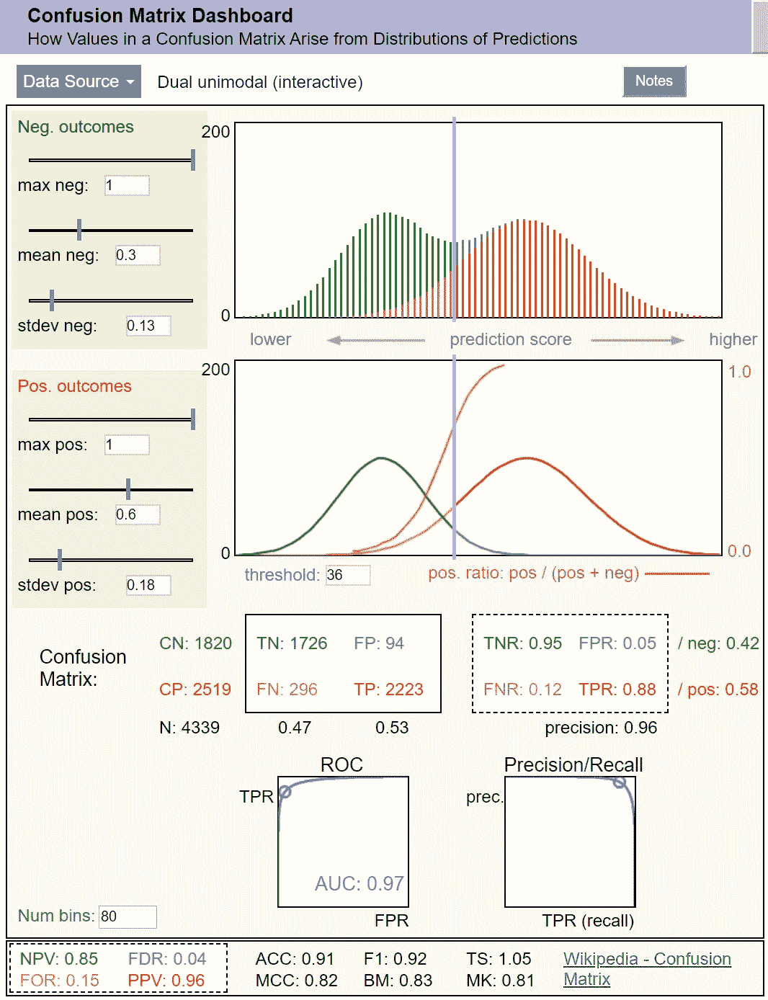
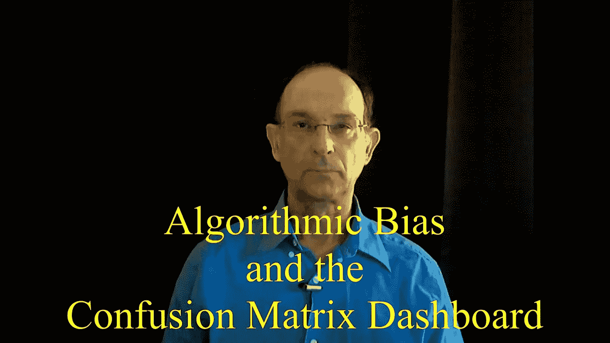
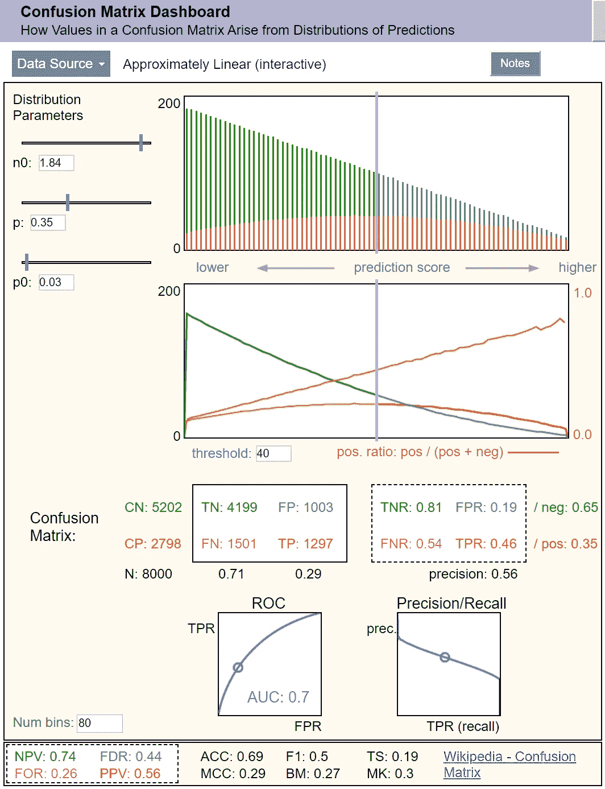
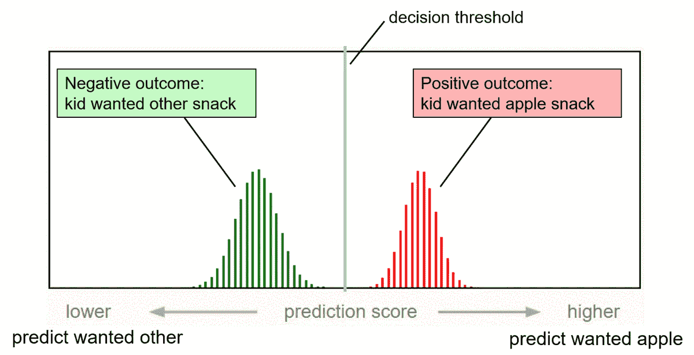
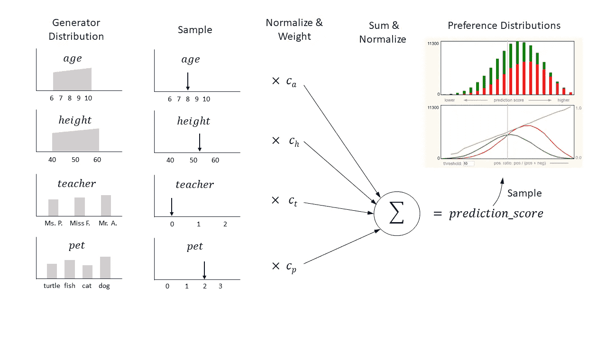
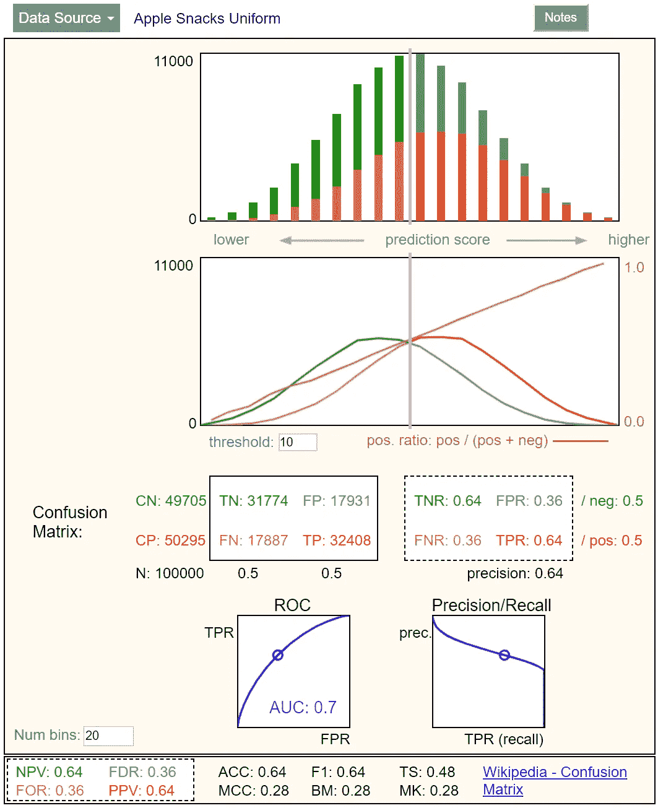
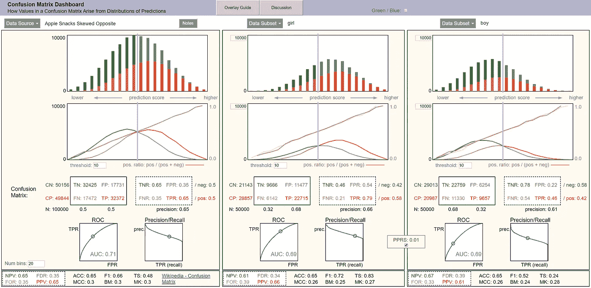
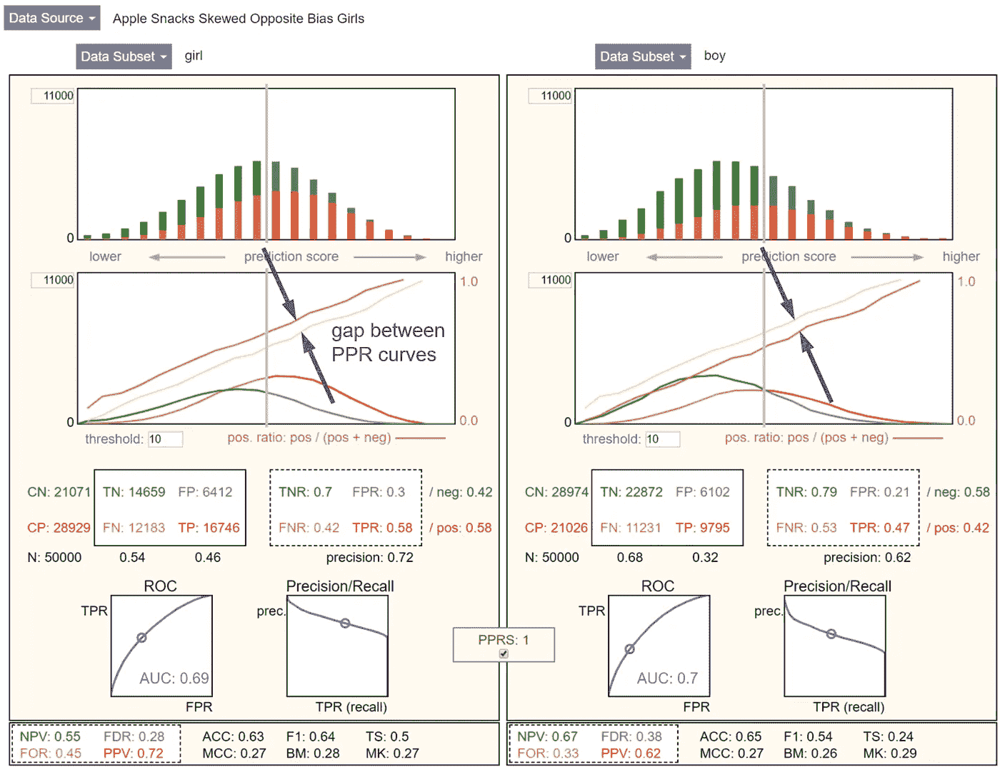
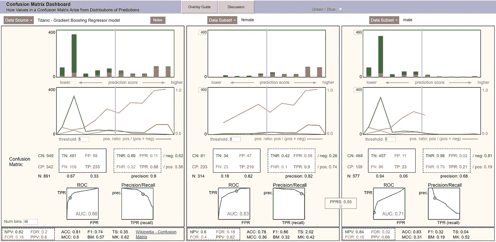
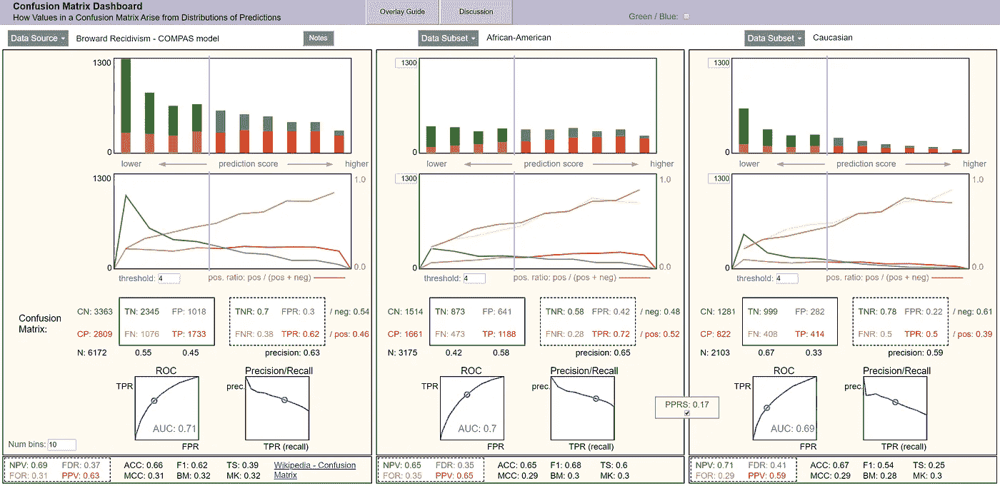

# 算法偏差和混淆矩阵仪表板

> 原文：<https://towardsdatascience.com/algorithmic-bias-and-the-confusion-matrix-dashboard-3926e0c0d329?source=collection_archive---------35----------------------->

## 在预测分数的分布下，混淆矩阵如何表现

随着算法越来越多地对人类事务做出决策，这些算法及其所依赖的数据必须公平和无偏见，这一点非常重要。算法偏差的诊断之一是*混淆矩阵*。混淆矩阵是一个表格，显示了在预测中会出现什么样的错误。虽然每个处理数据的人都知道什么是混乱矩阵 ***什么是*** ，但是对于它*在不同种类的预测和结果分布以及可能的决策阈值范围下如何表现，获得直觉是一件更微妙的事情。*

*在本文中，我将介绍一个交互式的 [**混淆矩阵仪表板**](http://www.saund.org/cm-dashboard/CMDashboard.html) ，您可以使用它来探索不同的数据集和预测模型，并观察混淆矩阵的行为。您可以加载自己的数据。其中两个数据集是纯粹的合成分布，你可以调整旋钮。另一组数据包含了一些综合的例子，这些例子说明了算法偏差是如何与环境不平衡区分开来的。我所说的环境失衡是指不同的群体可能天生拥有不同的特征分布，从而导致不同的结果分布。我提出了一种预测偏差的新方法，称为阳性预测比得分(PPRS ),它独立于混淆矩阵，而是比较预测得分范围内的阳性结果比曲线。*

**

*混淆矩阵仪表板——钟形负面和正面结果分布。*

*[混淆矩阵仪表板](http://www.saund.org/cm-dashboard/CMDashboard.html)还包括两组关于严重事件的真实数据，并附有一些预测模型。一个有趣的模型是用于预测刑事累犯的 COMPAS 模型。COMPAS 模型因所谓的算法偏差而受到抨击。这种说法是基于不同种族群体的混淆矩阵中出现假阳性和假阴性率的方式。然而，没有单一一致的方法来定义算法偏差。混淆矩阵仪表板允许我们探索潜在的数据分布和预测模型可能引起可能被误导的偏见指控的方式。*

*为了配合本文，我准备了一些视频来介绍主要概念。这篇文章的 2 分钟宣传片是:*

**

*[本文视频版本。](https://youtu.be/LvfNv-Dy8r0)*

*[**算法偏差和混淆矩阵仪表盘—宣传片**](https://youtu.be/LvfNv-Dy8r0)*

## *预测得分*

*为了理解混淆矩阵的目的，考虑一个为二元结果变量产生*预测分数*的过程。分配分数后，我们进行实验并进行观察。观察结果被记录为正面或负面。多次这样做，我们可以建立两个结果分布作为预测分数的函数，一个分布用于正面结果，一个用于负面结果。*

*混乱矩阵仪表板允许你试验两种不同的交互式合成分布。一个合成分布定义了正面和负面结果的分数，这些分数以凸起或“钟形曲线”的形式下降。您可以控制正负分数凸起的高度、宽度和位置。第二种分布沿预测分数轴更均匀地放置正面和负面结果分数。随着分数的增加，你可以玩这些分布的上升和下降。*

**

## *例如:苹果零食*

*这是一个真实的虚构的例子。这个例子开始很简单，但是它允许我们评估算法偏差和公平性的概念。*

*假设你正在为 500 个孩子的学校野餐打包快餐盒。一些孩子喜欢苹果，而另一些喜欢其他东西，如爆米花、饼干或饼干。你有两种点心盒，一种装苹果，一种装别的东西。你必须事先决定给每个孩子哪种盒子，然后贴上他们的名字，分发给他们。当每个孩子打开他们的零食盒子时，他们要么会对他们的零食感到满意，然后说“耶！”，否则他们会失望地说“Awwww”。*

**

*为了帮助你做出决定，你可以根据一些经验来预测每个孩子喜欢哪种零食。大一点的孩子喜欢苹果，而小一点的孩子不喜欢。高个子孩子喜欢苹果，而矮个子孩子不喜欢。阿普尔鲍姆先生班上的孩子倾向于喜欢苹果，而爆米花女士班上的孩子想要别的。没有硬性规定，只是有根据的猜测。*

*对于每个孩子，你给他们一个分数，表明他们想要一个苹果的预测。10 分意味着你很确定他们会想要一个苹果，比如在阿普尔鲍姆先生的班上，一个 10 岁的高个子。1 分意味着你确信他们不会想要苹果，就像爆米花女士班上一个较矮的 6 岁小孩。*

*对于每个孩子，在计算他们的预测分数后，你做出决定。你可以在 5 分的中间点做决定。或者，您可以将苹果零食阈值设置得更高或更低。例如，如果孩子们吃水果很重要，你就把门槛设得低一些，这样你就能抓住更多喜欢吃苹果的孩子。或者，如果你想尽量减少扔进垃圾桶的苹果片，那么你可以把门槛设得更高，这样分发的苹果零食就更少了。换句话说，您的决定取决于对不同类型错误的权衡。*

*野餐时，你记录下孩子们的反应。你写下你给他们的预测分数是多少，你是否根据决策阈值给了他们一个苹果，他们的反应是什么。这是你的决定的回报。*

*我们在一个表格中记录结果，表格中的行对应于孩子的偏好，列对应于你给每个孩子一份苹果零食或其他零食的决定。混淆矩阵计算表中每个象限的数字和比率。*

*原始计数表位于左上方，而比率表位于右侧。*

**

*混淆矩阵:计数、比率、条件使用测量。*

## *评估绩效*

*你的表现取决于几个因素:*

*   *你的预测与每个孩子的需求有多吻合。理想情况下，你的预测会将所有想要苹果的孩子(红色)分布在右边，而所有没有苹果的孩子(绿色)分布在左边。这样你就可以把门槛放在中间，正确预测每个孩子的偏好。*

**

*零食偏好的理想可分分布。*

*   *有多少孩子真的想要苹果。这是基本比率，红色苹果小孩和绿色非苹果小孩的总比例。*

*此时，您可能需要花点时间在[混淆矩阵仪表板](http://www.saund.org/cm-dashboard/CMDashboard.html)中玩一下双单峰分布合成器。用分数排列正(红)和负(绿)凸起，使分布完全分开。然后，通过让分布重叠来增加决策的难度。左右滑动阈值，查看混淆矩阵中的计数和比率如何变化。*

*评估你的表现有多种方法。你可以关注你预测正确的孩子的比例(TPR 和 TNR)。(TPR:真阳性率又称为 ***敏感性*** ，TNR:真阴性率又称为 ***特异性*** 。)或者你可以专注于你弄错的孩子(FPR:假阳性率，FNR:假阴性率)。或者，你可以关注你认为想要苹果的孩子的比例，然后他们真的想要了。这叫*精度*。精度，也称为正预测值(PPV)，是 Berk 等人称为*条件使用*度量[1]的四个术语之一，如底部表格所示。*

*然后，这些度量可以进一步组合成聚合度量，其名称如“准确性”、F1 分数和 MCC。*

*[ROC(接收器工作特性)](https://en.wikipedia.org/wiki/Receiver_operating_characteristic)和 [Precision/Recall](https://en.wikipedia.org/wiki/Precision_and_recall) 曲线显示了随着决策阈值的变化，一些指标如何相互权衡。你可以在维基百科和许多其他解释网站上阅读所有关于这些措施的内容。*

*虽然这里我们只考虑二元决策，但多变量预测会产生更多行和列的混淆矩阵，以及对其他性能指标的阐述。*

## *预测偏差*

*考虑两个孩子群体，其中一个总体上更喜欢苹果(较高的基本比率)，而其他人不太喜欢苹果(较低的基本比率)。然后，从数学上证明，如果正分布和负分布重叠(通过设置决策阈值不能完全分离)，那么这两个群体的混淆矩阵条目*在假阳性率、假阴性率、假发现率和假遗漏率方面*不可能相同【2】【3】。然而，这些都是评估决策过程中的公平性和偏见的有效候选者。换句话说，不存在单一的方法来确定一个决策过程是否偏向于或反对预测一个群体对另一个群体的正面和负面结果。*

*为了更深刻地理解这一事实，我为苹果零食决策问题生成了合成数据。一个孩子相对于其他孩子对苹果零食偏好被认为是四个属性的线性函数，这四个属性是年龄、身高、老师和宠物。公式如下:*

**

*年龄从 6 岁持续到 10 岁。身高从 40 到 60 英寸不等。Class 接受三个分类值中的一个，{Ms. Popcorn=0，Miss Fruitdale=1，Mr. Applebaum=2}。宠物取四个值之一，{乌龟=0，鱼=1，猫=2，狗=3}。系数 *c* 为属性提供权重。为了简单起见，我们将所有系数设置为 1.0，但是将属性值规范化为范围 0 到 1。这样，所有属性都同等重要。预测分数被标准化为 0 到 1 的范围，然后被视为孩子更喜欢苹果零食(1.0)或其他零食(0.0)的概率。为了绘制图表，预测分数被划分成一定数量的箱。对于这个问题，20 个箱很好地显示了分布曲线。*

**

*产生孩子们对零食的偏好。*

*为了生成合成孩子、他们的预测分数和偏好结果，我们对四个属性的*生成器分布*进行采样。对于年龄和身高这两个连续的属性，让我们使用一个线性生成器分布，它可以在整个范围内是均匀的，也可以向下限或上限倾斜。如果年龄的发生器分布向上倾斜，那么年龄大的假装孩子会比年轻的多。因为对苹果的偏好随着年龄的增长而增加，那么这将使预测得分的分布更加倾斜。*

*类似地，对于这两个分类属性，我们可以说所有的教师被分配的概率相等，或者不同。例如，如果将更多的孩子分配给 Applebaum 先生，那么分数分布将会倾斜得更高，因为 Applebaum 先生贡献的预测分数因子为 2(在范围规范化之前)，而 Popcorn 女士的预测分数因子为 0。*

*一旦通过从生成器分布中取样给一个孩子分配了属性，我们就可以将他们的预测分数视为偏好苹果零食的概率。然后，根据概率，通过投掷一枚有偏向的硬币来为那个孩子生成一个假装的偏好结果，从而完成样本。由于统计的可变性，每个预测得分箱的阳性和阴性结果的数量将随着试验的不同而不同。出于这个原因，在这些例子中，我选取了 100，000 个假装的孩子作为样本，只是为了平滑统计数据。*

*结果是正面结果偏好分布(偏好苹果零食)和负面结果的分布(偏好其他零食)。[混淆矩阵仪表板](http://www.saund.org/cm-dashboard/CMDashboard.html)包括五种不同的实验条件，不同的发电机分布:*

***条件 1。统一:**所有属性在其范围内被统一采样。由于[中心极限定理](https://en.wikipedia.org/wiki/Central_limit_theorem)，这产生了预测分数的钟形分布。作为基于预测分数产生孩子实际偏好的结果，这导致积极结果和消极结果的分布在空间上有些分离。在中间设置阈值表明，这种分布实现了 0.64 的真阳性和真阴性率，以及 0.36 的假阳性和假阴性率。精确度和阴性预测值都是. 64。ROC 曲线的面积为 0.7，这通常被认为是可接受的预测能力，但远非完美。*

**

*苹果零食条件 1:均匀发电机分布。*

*为了探索算法偏差的问题，我按性别分离了生成器分布。女孩为四个属性中的每一个获得一个生成器分布，而男孩可能获得不同的一个。这反映了一个事实，不管出于什么原因，结果可能是女孩在人群中有不同的年龄范围，不同的身高范围，被不同地分配给教师，或者对宠物有不同的偏好。统一实验从对男孩和女孩使用相同的生成器分布开始。因此，毫不奇怪，它们各自的预测分布是相同的。*

***条件二。偏斜相同:**所有属性都用偏向高端的生成器分布进行采样。越来越多的年长和高的孩子出生，然后越来越年轻和矮。与爆米花女士相比，更多的孩子被安排在阿普尔鲍姆先生的班级。更多的孩子把狗作为宠物，而不是乌龟。结果，零食偏好倾向于更喜欢苹果零食而不是其他零食。在偏斜相同的条件下，女孩和男孩的生成元分布是完全偏斜的。因此，他们得到的苹果零食偏好分布是相同的。*

***条件 3。偏斜相反:**女生的属性采样为偏高的生成器分布，而男生的属性偏低，即男生更年轻，更矮，在爆米花先生的班级里更多，有更多的乌龟和鱼而不是猫和狗。因此，女孩偏爱苹果，而男孩偏爱其他零食。总体而言，女孩喜欢苹果的基本比率为 58%，而男孩喜欢其他的基本比率也是 58%。*

**

*苹果零食合成数据——女孩和男孩倾向相反的偏好。*

*最有趣的是比较混淆矩阵的四个象限。(我将使用近似值来说明采样噪声。)以 10 为阈值，在预测得分范围的中间，女生表现出的真实正率为. 79，真实负率仅为. 46。这是因为女孩的偏好偏向偏好分数中点右侧的苹果偏好女孩(红色)更多。对男孩来说，情况正好相反。类似地，女孩显示出 0.54 的假阳性率，因为她们对绿色(其他零食)的偏好有一半落在阈值的右边。他们的假阴性率只有. 21。同样，对男孩来说，情况正好相反。有趣的是，Precision (PPV)和 NPV 更接近，虽然不完全相同。*

*人们可能会看到这些混乱矩阵，并决定预测评分和决策过程是有偏见的。我认为，对女孩的偏见取决于你是否喜欢苹果。然而，有一种方法可以将 TNR、FPR、FNR 和 TPR 这四个象限统一起来。即向上调整女生的决策阈值，向下调整男生的决策阈值，直到隔着三个 bin。例如，将女孩阈值设置为 12，将男孩阈值设置为 9。当您在[混淆矩阵仪表板](http://www.saund.org/cm-dashboard/CMDashboard.html)中进行这些调整时，您可以看到各个 ROC 曲线上的决策点发生了变化。*

*由于前面提到的数学约束，这种调整使对准的精度(PPV)更加*于*之外，并随之带来其他条件使用度量 NPV、FDR 和 FOR。你不能拥有一切。但是，如果您愿意，您可以调整阈值，使四个条件使用术语更加一致，代价是使女孩和男孩的四个正比率和负比率度量值进一步分离。*

*一般来说，学者和政策专家会举手表示，由于在混淆矩阵中找不到算法偏差的单一统一度量，因此必须根据政策来确定。也就是说，人群之间哪种性能指标的差异是可接受的，哪种是不可接受的？*

*毫无疑问，基于政策的权衡决策是必不可少的。但是作为一个技术问题，在评估预测偏差时，我们可以做得比仅仅依赖混淆矩阵更好。*

*受苹果零食实验的启发，让我们考虑一种不同的方法来判断预测分数是否有偏差。这种方法关注分数的一致性来预测结果。对于一个给定的预测分数箱，结果是否显示女孩和男孩以相等的比例更喜欢苹果零食或其他零食，而不管多少女孩或男孩碰巧有那个分数？这就是所谓的*校准*公平性【2】。该属性源自一个名为阳性预测比率的值，该值就是每个条柱中阳性结果的比例。在预测分数的范围内，阳性预测率描绘出一条曲线，在[混淆矩阵仪表板](http://www.saund.org/cm-dashboard/CMDashboard.html)中用褐色绘制。*

***正向预测比得分***

*在偏斜的相反发生器分布下，女孩和男孩的积极预测比率曲线是相同的。点击 PPRS 标签下的复选框，将它们叠加起来进行比较。这意味着预测分数准确地反映了模拟孩子的偏好，不管这个孩子是喜欢苹果零食还是其他零食的人群中的一员。*

*这一观察激发了基于两个群体的阳性预测比率曲线之间的差异的偏倚的汇总测量。具体来说，计算两条曲线之间的*面积*的函数。有许多方法可以做到这一点。我选了一个非常简单的:*

**

*这是两个群体(1 和 2)的阳性结果与所有结果之比 *r* 的平方差在预测分数仓上的总和，通过因子进行加权和归一化。加权因子是两个总体之间每个箱中的最小计数。这种加权的动机是当样本很少时，在样本噪声下概率可能变化很大。当任一群体在一个箱中放置少量样本时，阳性预测率的差异不显著。PPRS 测量受到统计噪声的影响，这取决于每个箱的样本大小。*

*偏斜相反情况的 PPRS 是 0.01。一般来说，在我的估计中，低于 0 . 2 的分数表示相对一致的阳性预测比率曲线，可以认为是无偏的，而高于 0 . 6 左右的分数表示曲线中有一些显著的偏差，并表明预测偏差。*

*预测偏差是什么样子的？接下来的两个生成器分布提供了示例。*

***条件 4。偏斜相反偏向女孩:**像偏斜相反实验一样，生成器分布被设置成使女孩的零食偏好偏向高的一边，而男孩则偏向低的一边。但这一次，女生的预测分数统一下移 0.1(左移 2 格)。*

**

*请注意，在这种情况下，女孩和男孩的偏好分布表面上看起来比条件 3 更相似。绿色和红色曲线更接近对齐。但是通过改变女孩的预测分数，在每个箱中，男孩和女孩之间的积极预测与箱中孩子数量的比率现在非常不同。女孩得到的苹果会比她们喜欢的少。这种差异反映在阳性预测比率曲线中，这些曲线现在明显分开。它们之间的差距提供了 1.0 的 PPRS，这是预测偏差的重要指标。*

***条件 5。均匀随机化女孩:**这个实验从女孩和男孩的相同均匀发生器分布开始，与条件 1 相同。除了这一次，一半的女孩被随机选中，并被分配一个*随机*预测分数。你可以看到女孩的积极和消极结果分布(红色和绿色曲线)变平了。ROC AUC(曲线下面积)下降，越来越少的女孩得到她们喜欢的零食。PPRS 是相对较高的 0.75。*

*这个项目的 GitHub repo 中提供了使用您自己版本的生成器发行版来生成苹果点心样本的 Python 代码[4]。*

## *真实世界数据:泰坦尼克号生存*

*我们可以在[混淆矩阵仪表板](http://www.saund.org/cm-dashboard/CMDashboard.html)中检查真实数据。一个众所周知的数据集列出了 1912 年泰坦尼克号沉没时幸存和遇难的乘客。对于每位乘客，数据集将年龄、性别、家庭规模、票价等级和票价等特征制成表格。泰坦尼克号的生存预测任务是 Kaggle.com 号的一个开始项目，80%的准确率是典型的。对于这个数据集，我建立了两个模型；他们的预测包含在混淆矩阵仪表板中。一个简单的模型是逻辑回归，它为每个可能的特征值计算一个权重因子(在一些简单的特征工程之后)。更复杂的机器学习算法是梯度推进回归器。这使用了决策树的集合，并且可以考虑观察到的特征之间的复杂非线性相互作用。对于该数据集和特征，GBR 模型的表现略好于逻辑回归，AUC 为. 86，最佳 f1 值为. 78(决策阈值= 4)。*

**

*泰坦尼克号的生存——梯度推进回归模型。*

*泰坦尼克号模型展示了许多有趣的特性。男性的存活率为 19%，而女性为 74%。女人和孩子先上救生艇！适当地，预测算法显示两个相距很远的凸起。查看男性和女性数据子集，绿色的阴性结果冲击发生在男性亚群中，而红色的阳性结果冲击发生在女性中。在中点决策阈值为 5 时，女性的真实阳性率(预测存活，并且确实存活)和男性的真实阴性率(预测不存活，并且没有存活)都非常高。男性和女性乘客的假阳性和假阴性率高度不对称(FNR = .79(m)/.1(f)，FPR = .02(m)/.58(f))。这反映了大多数男性的生存概率较低，而大多数女性的生存概率较低，尽管两个方向都有异常值。由于提供了相对简单的乘客特征集，模型无法可靠地预测异常值。在这些泰坦尼克号生存模型的男性/女性分类下，阳性预测比率曲线和 PPRS 不能提供信息，因为结果分布几乎没有重叠，为比较中等范围分数仓中的阳性预测比率留下非常稀疏的统计数据。*

## *真实世界数据:布劳沃德县累犯*

*2016 年 5 月， [ProPublica](https://www.propublica.org/) 发表了一项名为[“机器偏见:全国各地都有用来预测未来罪犯的软件。而且对黑人有偏见。”](https://www.propublica.org/article/machine-bias-risk-assessments-in-criminal-sentencing/)【5】。这篇文章评估了一种叫做 [COMPAS](https://en.wikipedia.org/wiki/COMPAS_(software)) 的算法，该算法用于预测刑事案件中的累犯率。伴随本文的是一个 [github 知识库](https://github.com/propublica/compas-analysis)，其中包含了用于评估 COMPAS 算法性能的数据和数据分析方法。*

*ProPublica 的文章提出了以下主张:*

*正如霍尔德所担心的那样，我们还发现了明显的种族差异。在预测谁会再次犯罪时，该算法对黑人和白人被告犯错误的比率大致相同，但方式非常不同。*

*   **该公式特别容易错误地将黑人被告标记为未来的罪犯，错误地将他们标记为白人被告的比例几乎是白人被告的两倍。**
*   **白人被告比黑人被告更容易被误标为低风险。”**

*关于算法偏差的说法令人担忧，这篇文章被大量引用。毕竟，公平起见，在无偏算法下，我们可能期望两个方向上的误差平均分布。ProPublica 的指控是基于黑人和白人亚群混淆矩阵中假阳性率和假阴性率的差异。*

*然而，我们从苹果零食的例子中看到，对偏见或不公平的解释并不简单。基本比率、混淆矩阵中的正比率和负比率以及条件使用度量(其中最著名的是精确度(PPV)，但也包括负预测值(NPV)、错误遗漏率(FOR)和错误发现率(FDR))之间存在很强的相互作用。犯罪学、统计学和计算机科学文献已经详细讨论了这些算法之间的权衡，COMPAS 算法的公平性也引起了激烈的争论[1，6，7，8，9]。苹果零食的例子表明，不同群体之间偏好分布或结果概率的差异本身并不是预测偏差的指标。总的来说，不管出于什么原因，参加野餐的女孩可能比男孩更喜欢苹果零食。*

*我们可以使用[混淆矩阵仪表板](http://www.saund.org/cm-dashboard/CMDashboard.html)查看布劳沃德县累犯数据，并测试不同的决策阈值如何影响混淆矩阵及其导数分数。布劳沃德县的 COMPAS 决策阈值设定在十分位数 4。ProPublica 数据集不仅提供了由 COMPAS 算法产生的累犯预测，还提供了实际的预测分数，这些分数被称为“十分位数”，因为 COMPAS 报告的预测分数范围是从 1 到 10。该信息还允许我们比较亚群体间的阳性预测率曲线，并计算 PPRS(阳性预测率得分)。*

*检查[混淆矩阵仪表板](http://www.saund.org/cm-dashboard/CMDashboard.html)中的数据源 Broward recipiency-COMPAS 模型，我们证实，的确，在阈值为 4 时，黑人被告的假阳性率为. 42，而白人被告的假阳性率仅为. 22。白人被告的假阴性率是 0.5，而黑人被告的假阴性率是 0.28。*

*这种差异必须根据黑人被告的基本税率为 0.52，而白人被告的基本税率为 0.39 这一事实来评估。这反映在黑人被告堆积柱状图中红色(正)柱的数量更大。然而，类似于我们在苹果零食实验条件 3 中看到的，这种差异可以通过将黑人被告的决策阈值向上调整到 5，将白人被告的决策阈值向下调整到 3 来消除。这使两个群体的 TPR/FPR 点在 ROC 曲线上一致，尽管它进一步加剧了精确度和阴性预测值的差异。显然，为不同的受保护群体设置不同的门槛会被认为是不公平的。*

*问题是，FPR 和 TPR 的差异是由于预测偏差，还是由于两个亚人群之间环境特征的差异？值得注意的是，COMPAS 算法根据两组的实际累犯结果一致地分配预测分数。阳性预测比率曲线非常好地对齐，并且它们之间的间隙的 PPRS 测量获得相对小的值 0.17，表明良好的校准准确度。*

**

*布劳沃德累犯模型。*

*COMPAS 算法在 1-10 的十分位数范围内分配相对均匀的预测分数；与苹果零食合成数据不同，分布不是钟形的。除了基本比率之外，黑人和白人被告人群之间最明显的差异是黑人被告被分配到大致相同的位置，而白人被告被发现在较低的十分位数分数中所占比例更大，随着十分位数分数的增加而稳步下降。您可以使用[混淆矩阵仪表板](http://www.saund.org/cm-dashboard/CMDashboard.html)的近似线性数据源下拉菜单来近似这些分布，并查看混淆矩阵中的项如何响应。*

## *布劳沃德县累犯的独立预测模型*

*调查累犯数据集的另一种方法是建立一个独立的模型，保证排除种族因素。假设我们观察到累犯与种族或性取向相关。那么这些因素实际上将是累犯的预测因素，在统计基础上。但是，在一个公平的社会中，我们同意应该根据个人的优点而不是根据他们碰巧属于哪个身份阶层来判断个人。*

*ProPublica 报道说，在大多数被告被关进监狱的时候，他们会回答 COMPAS 的调查问卷。这些信息被输入到 COMPAS 算法中。不清楚该算法到底使用了什么信息。如果使用种族或其他受保护的阶级因素，那么这可能是不公平的。*

*为了消除这种可能性，我们可以只提取直接基于犯罪记录的数据，并从中建立一个模型。与泰坦尼克号数据一样，我建立了线性回归模型和梯度推进回归模型。作为比较，两者都包含在[混淆矩阵仪表板](http://www.saund.org/cm-dashboard/CMDashboard.html)中。我仅从数据记录中提取了以下特征:*

*   *年龄*
*   *少年 _ 恶魔 _ 计数*
*   *juv_misd_count*
*   *青少年 _ 其他 _ 计数*
*   *先验计数*
*   *电荷度*
*   *desc 充电*

*这些特征与年龄、前科和指控类型有关。在此数据集中，预订时只输入了一项费用，因此原始 c_charge_degree 和 c_charge_desc 要素有且只有一个值。*

*为了在算法中使用这样的特征，数据科学家将它们转换成可能与我们想要预测的结果相关的数字。因此，我做了一些特征工程。我将原始年龄分为五个年龄组:{ 18–22，23–33，34–50，51–59，60+}我将计数特征分为四个或五个类别的组。对于电荷描述，我创建了一个“一键”向量。我把所有与毒品相关的指控归为一项。我将少于 10 个实例的所有费用描述归入一个名为“其他”的费用类别。然后，对于每个类别，如果该费用在原始“c_charge_desc”特征中报告，则我指定 1，否则指定 0。最后，我加入了一个数字特征，这是适用的指控描述的平均累犯率。*

*为了训练模型，我们注意到报告变量的观察值‘two _ year _ recid’。如果被告再犯，结果值(或因变量)为 1，如果他们在两年内没有再犯，结果值为 0。*

*在预测时，独立特征被输入到模型中以产生预测分数。下面是 GBR 模型的结果，显示在[混淆矩阵仪表板](http://www.saund.org/cm-dashboard/CMDashboard.html)中。预测分布的形状不同于 COMPAS 模型。但是黑人被告和白人被告之间假阳性率和真阳性率的差距仍然存在。与 COMPAS 模型一样，通过为两个子群体选择不同的决策阈值(这被认为是不公平的)，可以使这些混淆矩阵条目一致。最后，与 COMPAS 模型一样，阳性预测比率曲线排列良好，预测偏差的 PPRS 较低，徘徊在约 0.09。同样，这是排除了种族和性别特征的模型。*

**

*预测模型的一个问题是数据泄漏。尽管种族、性别或其他受保护的特征可能被正式排除在考虑之外，但这些因素有时可以从其他因素中推断出来。例如，众所周知，在设定保险费率时，邮政编码红线被用作种族的替代特征。*

*在女孩和男孩具有不同特征生成器分布的合成苹果零食数据的情况下，人们可能会将年龄、身高、老师和宠物这些看似良性的特征解释为孩子性别的反向通道指标。没关系。即使你直接把性别作为一个特征包括进来，女生和男生分布的形状还是一样的。我们在苹果零食条件 4 和 5 中实现预测偏差的方式不是通过在预测分布的形成中引入性别因素，而是通过干扰预测分数的应有值。*

*在布劳沃德累犯数据的情况下，有可能使用诸如年龄、前科、指控严重程度等特征。反映了刑事司法系统或社会中的种族偏见。我们不能在这里解决这些因素，我们也不能对基础数据或整个刑事司法系统的公正性下结论。在这里，我们只是根据收集的数据集，关注对未来实际记录在案的累犯的预测。*

*我的结论是，布劳沃德预测算法是*而不是*有偏的，因为它们在这两个亚群体之间的预测分数有差异分布。在保留基本比率(再分(红色)和非再分(绿色)计数的总数)的同时，将被告铲到预测得分轴的其他地方，会扭曲相应的正预测比率曲线，并增加预测偏差的 PPRS 度量。更正确的解释是，根据获取数据特征和结果的方式，黑人被告亚群固有地表现出更大比例的特征，这些特征将他们置于更高的预测分数。FPR、TPR 和有条件使用措施的差异是其不可避免的后果。*

## *结论*

*这将是一个很好的逃避难题的选择不相容的和令人困惑的所谓偏见的措施仅仅基于混淆矩阵和它的衍生指标。在这篇文章中，我提出了一个新的预测偏差的衡量标准，积极预测比得分(PPRS)。这更直接地比较了作为亚群体间预测得分函数的结果的一致性，而不考虑控制混淆矩阵中术语的决策阈值。PPRS 测量与校准准确度一致，并且当群体具有不同的基础率和分布时，它不试图校正由于在决策阈值中进行选择而产生的比率差异。根据这一标准，在 Broward 累犯数据中观察到的种族群体之间的差异是由于其特征特性的环境分布的差异，而不是由于任何预测算法的偏见。*

*公平合理地使用算法和数据是一个巨大而困难的问题。社会通过无数的数据收集和决策过程发挥作用。早在信息时代到来之前，规则、指导方针和程序就已经进化到在经济和治理方面取得系统性成果。从这个意义上说，当人类遵循既定的政策时，他们是在执行一种算法决策。人类的判断带有主观性的好处和代价。除了严格的规则和正式的指导方针之外，人们还能够考虑那些数字和分类账不容易捕捉到的因素。因此，他们可能会有意识或无意识地权衡超出合法范围的因素。他们带来同情和洞察力，怨恨和怨恨。*

*形式化数据收集和算法的一个承诺就是效率和规模。要素的数量以及处理它们的速度和效率远远超过了训练有素的专业人员、官员和代理人的能力。*

*算法的第二个承诺是，它们允许在决策过程中控制因素和一致性。输入变量可能不会对人类背景故事进行编码，而人类背景故事可能会令人同情地左右决策。但是他们也排除了基于不公正的偏见而影响决策的因素。形式化算法的影响必须在系统层面进行评估。这包括理解如何收集数据，如何从数据中提取特征，以及如何做出算法决策。*

*因为计算算法采用了普通人不熟悉的技术，有时甚至连专家都难以完全理解或解释的过程(如一些机器学习算法)，所以它们受到怀疑和审查是自然和适当的。当算法因为有偏差的数据或设计不当而做出糟糕的决策时，就必须被叫出来。相反，算法不应该因为正确计算出反映其系统环境令人不快的属性的结果而受到诽谤。这样做将会失去一个强大的工具，这个工具能够消除偏见和成见，增加社会的公平性。*

*混淆矩阵是一个相对简单的概念，无论预测分数是通过机器算法还是其他方式分配的。但是它在不同类型的数据下的行为是微妙而复杂的。通过交互式[混淆矩阵仪表板](http://www.saund.org/cm-dashboard/CMDashboard.html)，我们打算让算法和人类预测和决策的行为更加容易理解和透明。*

## *参考*

*[1] R. Berk，H. Heidari，S. Jabbari，M. Kearns 和 A. Roth，《刑事司法风险评估中的公平性:现状》，*社会学方法&研究，*第 1–42 页，2017 年。*

*[2] J. Kleinberg、S. Mullainathan 和 M. Raghavan，“公平确定风险分值的内在权衡”，载于*第八届会议。论理论计算机科学的创新(ITCS)* ，2017。*

*[3] S. Goel，E. Pierson 和 S. Corbett-Davies，“算法决策和公平的成本”，载于*2017 年第 23 届 ACM SIGKDD 知识发现和数据挖掘国际会议*。*

*[4] E .索恩，“索恩/算法偏差”，2020 年。【在线】。可用:[https://github.com/saund/algorithmic-bias](https://github.com/saund/algorithmic-bias)。*

*[5] J. Angwin、J. Larson、S. Mattu 和 L. Kirchner，“机器偏见:全国各地都有用来预测未来罪犯的软件。而且对黑人有偏见”2016 年 5 月。【在线】。可用:[https://www . propublica . org/article/machine-bias-risk-assessments-in-criminal-pending/。](https://www.propublica.org/article/machine-bias-risk-assessments-in-criminal-sentencing/)*

*[6] A. Flores，K. Bechtel 和 C. Lowenkamp，“假阳性、假阴性和假分析:对《机器偏见:全国各地都有用来预测未来罪犯的软件》的反驳。而且对黑人有偏见。”、“*联邦缓刑，*2016 年第 80 卷。*

*[7] W. Dieterich，C. Mendoza 和 T. Brennan，“COMPAS 风险量表:证明准确性、公平性和预测性”，2016 年 7 月 8 日。【在线】。可用:[https://www . document cloud . org/documents/2998391-ProPublica-commentation-Final-070616 . html .](https://www.documentcloud.org/documents/2998391-ProPublica-Commentary-Final-070616.html.)*

*[8] J. Angwin 和 J. Larson，“ProPublica 回应公司对机器偏见故事的批评”，2016 年 7 月 29 日。【在线】。可用:[https://www . propublica . org/article/propublica-responses-to-companies-critical-of-machine-bias-story。](https://www.propublica.org/article/propublica-responds-to-companys-critique-of-machine-bias-story.)*

*[9] J. Angwin 和 J. Larson，“研究人员说，犯罪风险得分的偏差在数学上是不可避免的”，2016 年 12 月 30 日。【在线】。可用:[https://www . propublica . org/article/bias-in-criminal-risk-scores-is-mathematical-ability-researchers-say。](https://www.propublica.org/article/bias-in-criminal-risk-scores-is-mathematically-inevitable-researchers-say.)*