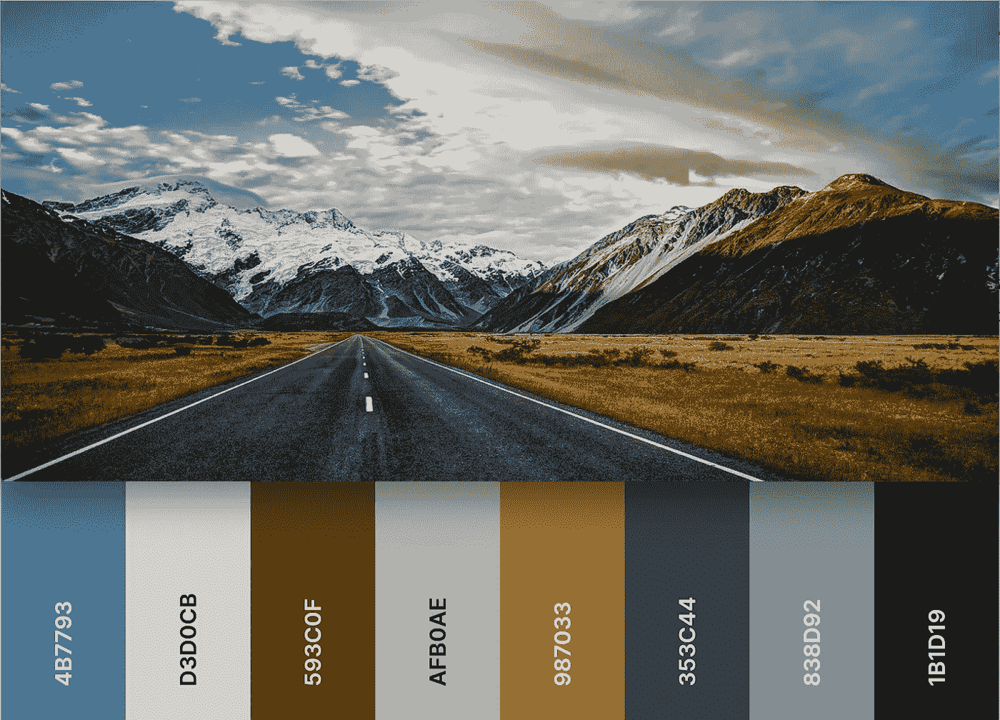
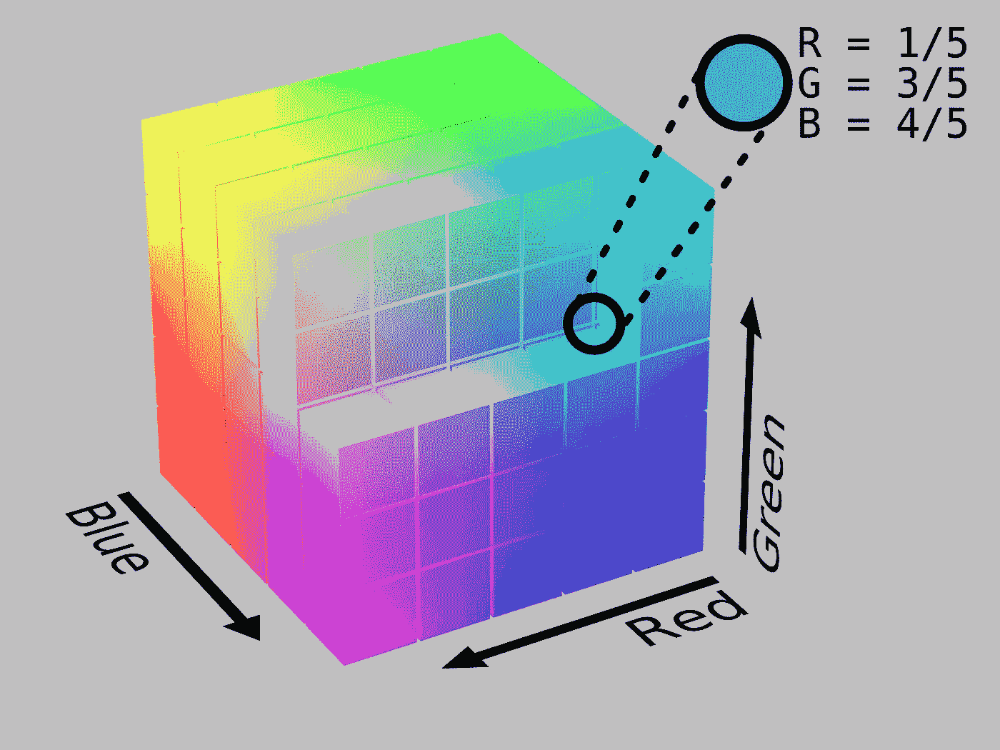
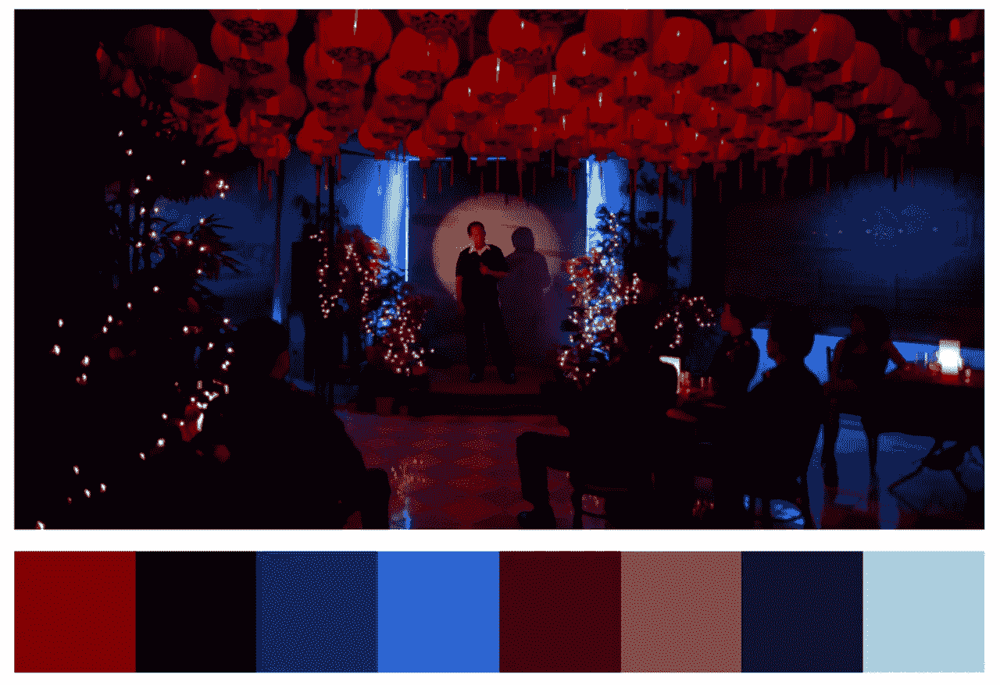
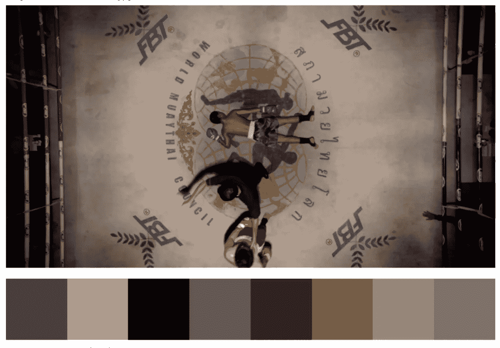
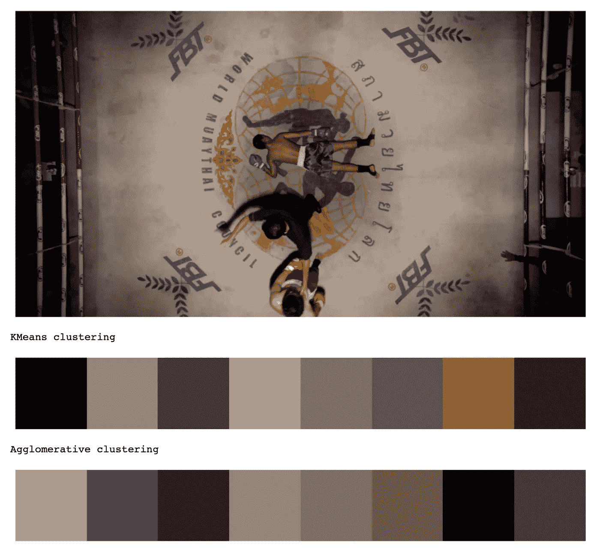
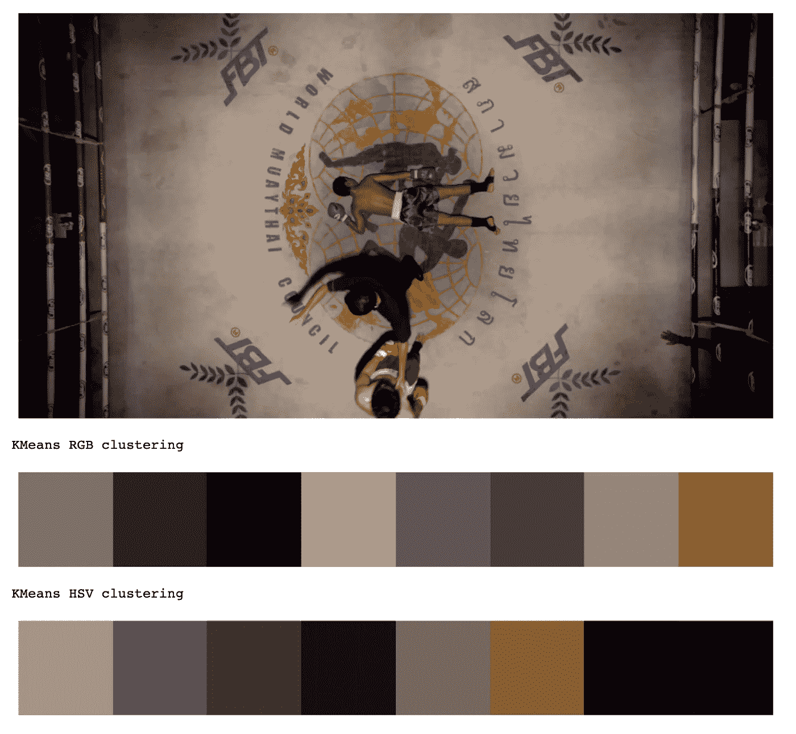
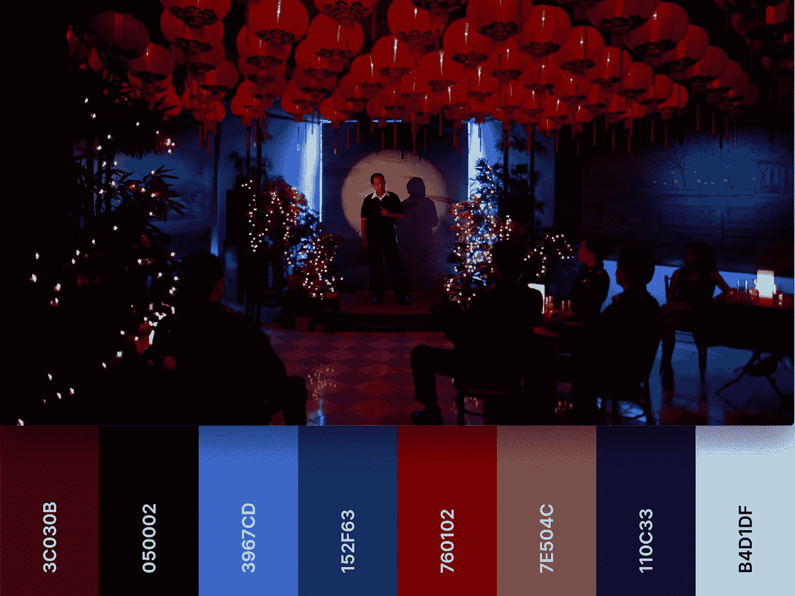

# 算法调色板

> 原文：<https://towardsdatascience.com/algorithmic-color-palettes-a110d6448b5d?source=collection_archive---------29----------------------->

## 使用机器学习从图像生成调色板

由[特雷·拉特克利夫](https://www.flickr.com/photos/stuckincustoms/) ( [来源](https://www.flickr.com/photos/stuckincustoms/8837173497/))用我生成的调色板拍摄的照片。

我最近在做一个项目，在这个项目中，我希望能够比较图像的外观和感觉，这促使我寻找一种使用机器学习来创建调色板的方法。

生成调色板可以被认为是一个伪装的聚类问题。我们希望将一幅图像的所有像素划分成最能代表该图像的 k 个不同的组。

来源:[维基百科–RGB 色彩空间](https://en.wikipedia.org/wiki/File:RGB_Cube_Show_lowgamma_cutout_b.png)

我们可以把我们的图像看作是在 3D 色彩空间[中绘制的点的阵列，而不是把我们的图像看作是像素的网格——每个像素都有一个红色、绿色和蓝色的值。红色有一个维度，绿色有一个维度，蓝色有一个维度，在每个维度中，一个点可以位于`0`和`255`之间的任何位置。](https://en.wikipedia.org/wiki/RGB_color_space)

假设我们希望创建一个由 8 种颜色组成的调色板来代表每张图片。这意味着我们想要找到 8 个能够给出每幅图像的最佳可能表示的聚类或分区。

有许多不同的聚类算法可供选择——每种算法都有自己的优缺点——但是为了这个项目的目的，我尝试了 K-Means 聚类和凝聚聚类。

我从电影[只有上帝宽恕(2013)](https://en.wikipedia.org/wiki/Only_God_Forgives) (使用网站 [FILMGRAB](http://film-grab.com/) )中挑选了 5 张样本剧照，因为它有丰富的调色板。

仍然来自[只有上帝宽恕(2013)](https://en.wikipedia.org/wiki/Only_God_Forgives) ，由 [FILMGRAB](http://film-grab.com/) 提供，使用 k-means 生成调色板。

上面是一个使用 K-Means 生成的电影静止图像和调色板的例子。正如你所看到的，该算法做了一个相当好的工作，没有太多的超参数调整，使一个很好的代表性调色板。此外，它允许您指定调色板的大小——这是其他一些聚类算法(例如 DBSCAN)所不具备的。

你可以在我的[笔记本](https://nbviewer.jupyter.org/github/a-poor/color-palettes/blob/main/color-palettes.ipynb#)中看到更多生成调色板的例子。

# 算法挑战

事实证明，像 K-Means 这样的算法更喜欢高容量的颜色，而不是稀疏但突出的颜色。例如，参见下面的静止图像。

仍然来自[《只有上帝宽恕》(2013)](https://en.wikipedia.org/wiki/Only_God_Forgives) ，由 [FILMGRAB](http://film-grab.com/) 提供，使用 k-means 生成调色板。

K-Means 调色板可以很好地近似大多数颜色，但在查看图像时，您可能会期望它包含一些蓝色(如摔倒的拳击手的垫子或短裤上)或红色(如绳子上，或站立的拳击手的手套/服装等)。

回想一下 K-Means 是如何工作的，该算法试图将图像中的颜色划分为 *k* 组，由颜色空间中的 *k* 个平均点表示。在这种情况下，图像中没有足够的蓝色或红色被算法提取出来，所以它们被其他类似的、更丰富的颜色洗掉了。

为了解决这个问题，我们可以尝试一些方法。

仍然来自[《只有上帝宽恕》(2013)](https://en.wikipedia.org/wiki/Only_God_Forgives) ，由 [FILMGRAB](http://film-grab.com/) 提供，使用 K-Means 和聚合生成的调色板。

上图显示了使用 K-Means 和凝聚聚类生成的调色板。凝聚聚类选择在调色板中包括蓝色，尽管它失去了柔和的黄色，仍然没有包括任何红色。

仍然来自[Only God forgible(2013)](https://en.wikipedia.org/wiki/Only_God_Forgives)，由 [FILMGRAB](http://film-grab.com/) 提供，带有 k-means RGB 和 HSV 生成的调色板。

另一种方法是将图像的颜色从`RGB`转换为`HSV`。`RGB`将颜色表示为红色、绿色和蓝色通道强度的组合，而`HSV`将颜色表示为色调(基色的光谱)、饱和度(颜色的强度)和值(颜色的相对亮度或暗度)——你可以在这里了解更多关于[的信息。上图显示了使用 K-Means 聚类和`RGB`颜色和`HSV`颜色为同一幅图像生成的调色板。正如你所看到的，HSV 方法包括蓝色和黄色(尽管仍然没有红色)。](https://en.wikipedia.org/wiki/HSL_and_HSV)

为了进一步改善结果，一些选项包括组合技术(即凝聚聚类+ HSV 颜色)，超参数调整，使用不同的算法(如 DBSCAN)，以及调整颜色距离度量(如果你感兴趣，可以在这里阅读更多关于颜色差异的信息[)。](https://en.wikipedia.org/wiki/Color_difference)

# 烧瓶应用程序

作为最后的奖励，我决定创建一个简单的概念验证 API，用于从图像生成调色板。API 将图像 URL 作为参数，并使用 K-Means 生成调色板。

此外，我发现网站 [Coolors](https://coolors.co/) 使得创建调色板 URL 变得很容易，因此 API 可以将调色板作为颜色的 2D 数组或 Coolors 调色板的 URL 返回。

例如，使用此图像…

还是出自[只有上帝会原谅(2013)](https://en.wikipedia.org/wiki/Only_God_Forgives) ，承蒙 [FILMGRAB](http://film-grab.com/)

API 将产生以下链接…

 [## Coolors.co

### 在 Coolors.co 上查看和编辑调色板或创建自己的配色方案。

coolors.co](https://coolors.co/3c030b-050002-3967cd-152f63-760102-7e504c-110c33-b4d1df) 

一起看，你会得到…

仍然来自[《只有上帝宽恕》(2013)](https://en.wikipedia.org/wiki/Only_God_Forgives) ，由 [FILMGRAB](http://film-grab.com/) 提供，k-means 生成调色板由 [Coolors](https://coolors.co/3c030b-050002-3967cd-152f63-760102-7e504c-110c33-b4d1df) 提供。

你可以在我的 GitHub repo 里查看 Flask app，[这里](https://github.com/a-poor/color-palettes)。

# 结论

这是一个很短但很有趣的副业，这里肯定还有很多值得探索的地方。如果你认为你可能会感兴趣，一定要去看看[电影抓取](https://film-grab.com/)和[酷人](https://coolors.co/)。

你可以在 [GitHub](https://github.com/a-poor/color-palettes) 上找到我的代码，或者用 [nbviewer](https://nbviewer.jupyter.org/github/a-poor/color-palettes/blob/main/color-palettes.ipynb#) 或 [Binder](https://mybinder.org/v2/gh/a-poor/color-palettes/main?filepath=color-palettes.ipynb) 查看笔记本。

感谢阅读！我很想听听你的想法。请在下面发表评论，或者在 LinkedIn 或 Twitter 上联系我。