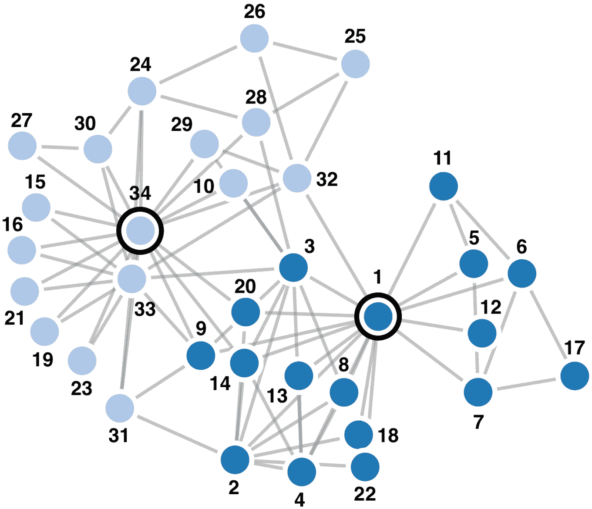
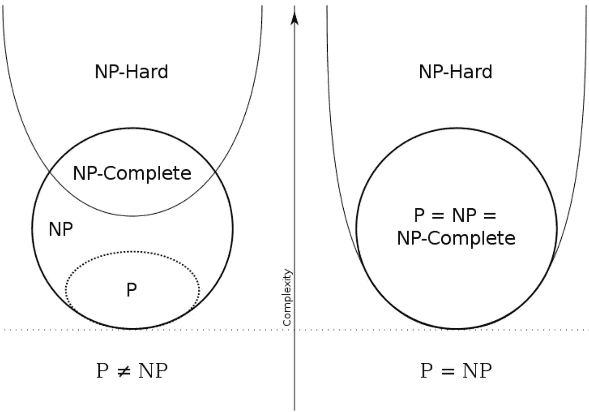
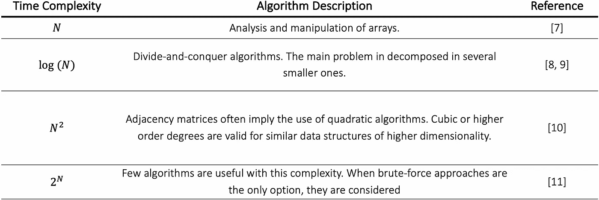

# 算法复杂性

> 原文：<https://towardsdatascience.com/algorithmic-complexity-244bde1c3548?source=collection_archive---------43----------------------->

## 真实网络中的社区发现算法

扎卡里的空手道俱乐部网络与 2 个社区确定。

由于真实网络的规模，使用强力算法来定义社区有时是不可行的。用于处理这些问题的算法，在最好的情况下，在多项式时间内运行。虽然，大多数时候，有必要探索随着网络规模增长的指数数量的可能性。第一个问题叫做 *P 问题*，第二个问题叫做 *NP 问题*。

在接下来的章节中，我们将探究 *P = NP* 的问题，并大致介绍这种证实或反驳的后果。之后，介绍了一个根据算法的速度和内存需求来描述算法复杂性的系统——Big-O 符号。

# p 对 NP 问题

P vs NP 问题由 Stephen Cook [1]于 1971 年提出，并在 2000 年被认为是计算机科学中最重要的公开问题之一[2]。这是克莱数学研究所定义的七个千年奖问题[3]中的六个问题之一。能够解决其中一个问题的人将获得 100 万美元的奖金。 *P vs NP 问题*可以表述为:*每一个其解可以被计算机快速验证的问题是否也可以被计算机快速求解？*【4】。

*P 问题*的特征在于可通过确定性图灵机(DTM)在多项式时间内求解。另一方面， *NP* 范畴包括那些仅使用非确定性图灵机(NTM)在多项式时间内可解的。它们都是一组二元决策问题的一部分。DTM 是一台没有分支的机器，每次只能进行下一步。这是一台普通电脑的工作原理。NTM 是一台概念性的机器，能够在每一步同时分析多项式数量的不同选项。因此，一个分支装置。一个*快速验证的*解意味着它可以在多项式时间内找到。计算机这个词指的是决定性的图灵机(DTM)。

虽然 P = NP 这个问题还没有答案，但是根据定义，这两个组之间存在联系。 *NP 问题*包括那些在 DTM 中其解可能无法得到但可以在多项式时间内验证的问题。这意味着每一个 P 问题都属于 NP 问题，验证一个解决方案总是比找到它容易。他们可以在多项式时间内找到它。平凡地，𝑃 ⊂ 𝑁𝑃.

一类不同的问题是 NP 完全问题。不仅是 NP，也是 NP 难(图 1)。当一个属于 NP 的算法可以化简为第一类中的另一个算法时，问题就是 NP 难的。这意味着 NP-hard 类中的任何问题至少和 NP 中的任何问题一样难解决。简化项意味着问题𝐴的输入可以使用多项式时间算法转换为问题𝐵的输入，并提供完全相同的输出。如果𝐴被简化为𝐵，这将会带来几个直接的后果:

1.  If𝐵∈𝑃，然后是𝐴∈𝑃；
2.  If𝐵∈𝑁𝑃，然后是𝐴∈𝑁𝑃；
3.  如果𝐴是 NP 难的，那么𝐵就是 NP 难的。

因此，如果找到了 NP 完全问题的多项式时间的解，那么 *P 对 NP 问题*被解决，并且𝑃 = 𝑁𝑃.因此，不仅找到多项式解，而且证明𝑋问题是 NP 完全的也是基本的。根据上述定义，这可以分为两个步骤:

1.  显示𝑋属于 NP。这可以通过在多项式时间内验证给定的解或找到𝑋的非确定性算法来完成；
2.  展示𝑋是 NP 难的。通过将一个已知的 NP 完全问题简化为𝑋.问题在这种情况下，上面得到的第三个结果意味着𝑋是 NP 难的。

**图 1** *P vs NP 问题*图示表示[5]。

尽管没有得到证实，但大多数计算机科学家𝑃 ≠ 𝑁𝑃相信这一点[6]。证明𝑃 = 𝑁𝑃将在现实世界中产生重要的影响。不仅生物模型将得到加强，而且运输系统、多媒体处理、经济模拟等方面的效率也将大大提高。另一方面，有基于𝑃 ≠ 𝑁𝑃.事实的真实系统其中之一是现代密码系统，它依靠质因数分解来保护数据。这个问题被认为是 *NP* 。

网络科学中很大一部分问题是 NP、NP 难或 NP 完全的。因此，该解决方案在例如寻找系统发育网络中的社区中的重要性就不足为奇了。

接下来给出算法时间/存储器复杂性的数学表示。

# 大 O 符号

在分析算法性能时，通常会考虑时间和内存的复杂性。当计算能力有限，需要进行大数据分析时，它们尤为重要。

在某些情况下，同一问题的解决方案可以在不同的时间范围内找到。出于这个原因，重要的是要有一种方法来上限绑定算法的执行时间，而且要估计它的平均值。这导致了 Big-O 符号的产生。

根据算法必须执行的指令数量和输入的大小，运行时间会有所不同。Big-O 符号提供了一种量化算法执行需求的方法，独立于运行它的机器。确定的复杂度可以是线性的、对数的、二次的、三次的、指数的…表 1 给出了一个有序的列表，按照最常见算法的执行时间(有一些例子)。

**表 1** 一些最知名的算法方法的时间复杂度。

在确定了算法的复杂性之后，就有可能预测执行该算法的机器的时间和内存需求。

## 定义

一个函数𝑓(𝑁)称为𝑂(𝑔(𝑁))如果常数𝑘和𝑁0 存在，使得 0 ≤ 𝑓(𝑁) ≤ 𝑘 × 𝑔(𝑁)对于全𝑁≥𝑁0 [12]。

# 参考

[1] S. A. Cook，“定理证明程序的复杂性”，*第三届 ACM 计算理论年会论文集(STOC'71)* ，1971 年。

[2] L. Fortnow，“P 与 NP 问题的现状”，*《美国计算机学会通讯》，*，第 52 卷，第 9 期，第 78–86 页，2009 年。

[3] C. M .研究所，“P 对 NP 问题”，[在线]。可用:[https://www.claymath.org/millennium-problems/p-](https://www.claymath.org/millennium-problems/p-)vs-NP-问题。[访问日期:2019 年 5 月 15 日]。

[4] N. Viswarupan，“P vs NP 问题”，Medium，2017 年 8 月 17 日。【在线】。可用:[https://medium.com/@niruhan/p-vs-np-problem-8d2b6fc2b697.](https://medium.com/@niruhan/p-vs-np-problem-8d2b6fc2b697.)【2019 年 5 月 15 日获取】。

[5]“P 对 NP 问题”，维基百科，[在线]。可用:[https://en.wikipedia.org/wiki/P_versus_NP_problem.](https://en.wikipedia.org/wiki/P_versus_NP_problem.)【2019 年 5 月 12 日访问】。

[6] J. Rosenberger，“P 与 NP 民意测验结果”，*《美国计算机学会通讯》，*第 55 卷，第 5 期，第 10 页，2012 年。

[7] E. Ravasz，A. L. Somera，D. A. Mongru，Z. N. Oltvai 和 A. L. Barabá si，“代谢网络中模块化的层次组织”，*《科学》，*第 297 卷，第 5586 期，第 1551-1555 页，2002 年。

[8] M. E.J .纽曼和 m .格文，“发现和评估网络中的社区结构”，*《物理评论》。统计、非线性和软物质物理学，*第 69 卷，2004 年。

[9] M .格文和 M. E. J .纽曼，“社会和生物网络中的社区结构”，*美国国家科学院学报，*第 99 卷，第 12 期，第 7821-7826 页，2002 年。

[10] M. E. J. Newman，“检测网络中社团结构的快速算法”，*物理评论 E，*2004 年第 69 卷第 6 期。

[11] G. Palla，I. Deré nyi，I .法卡什和 T. Vicsek，“揭示自然和社会中复杂网络的重叠社区结构”，*《自然》，*第 435 卷，第 814-818 页，2005 年。

[12] T. H. Cormen，C. E. Leiserson，R. L. Rivest 和 C. Stein,《算法导论》,麻省剑桥:麻省理工学院出版社，2003 年。