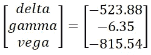
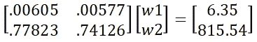
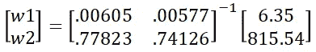

# 算法投资组合对冲

> 原文：<https://towardsdatascience.com/algorithmic-portfolio-hedging-9e069aafff5a?source=collection_archive---------6----------------------->

## 动态套期保值的 Python 和 Black-Scholes 定价


来自[佩克斯](https://www.pexels.com/photo/red-white-and-green-chameleon-751682/?utm_content=attributionCopyText&utm_medium=referral&utm_source=pexels)的[叶戈尔·卡梅列夫](https://www.pexels.com/@ekamelev?utm_content=attributionCopyText&utm_medium=referral&utm_source=pexels)的照片

***来自《走向数据科学》编辑的提示:*** *虽然我们允许独立作者根据我们的* [*规则和指导方针*](/questions-96667b06af5) *发表文章，但我们并不认可每个作者的贡献。你不应该在没有寻求专业建议的情况下依赖一个作者的作品。详见我们的* [*读者术语*](/readers-terms-b5d780a700a4) *。*

# 期权投资组合

直接暴露于特殊和系统风险的股票。另一方面，期权不仅暴露于标的资产，还暴露于利率、时间和波动性。这些风险是布莱克-斯科尔斯期权定价模型的输入(参见[推导布莱克-斯科尔斯模型](https://medium.com/swlh/deriving-the-black-scholes-model-5e518c65d0bc))。由于这些输入会影响所讨论的期权的价值，函数的偏导数可以告诉我们，当其中一个风险敞口发生变化，而其他风险敞口保持不变时，期权的价值会如何变化。让我们首先讨论这个期权定价模型的所有偏导数，然后用 Python 编写一个算法对冲系统。

# 希腊人

使用泰勒级数展开，我们可以得到所有的希腊人。希腊人告诉我们，当一个或多个期权敞口发生变化时，我们可以预期一个期权或期权组合会发生变化。需要注意的是，所有一阶近似都是线性的，而期权定价函数是非线性的。这意味着基础参数偏离初始偏导数计算越多，它就越不精确。这就是为什么希腊人通常是实时更新的，所以当*某事*发生变化时，我们可以不断地对期权或投资组合价值有一套新的预期(更多信息请参见 Python 中的[期权希腊人](/option-greeks-in-python-97980df3ab0b))。

*注意:在以下情景中，我们通常会考虑看涨和看跌期权，一些更高级的价差可能是多头或空头，具有不同的敞口平价。*

## 三角洲

Black-Scholes 方程的基础资产的一阶偏导数称为 delta。Delta 是指当基础资产价格发生变化时，期权价值如何变化。在其他参数保持不变的情况下，将 delta 乘以标的资产的+/-1 美元的变化，将得到期权的新价值。对于多头买入和空头卖出头寸，Delta 为正值，对于空头买入和多头卖出头寸，Delta 为负值。

## 微克

Black-Scholes 方程的基础资产的二阶偏导数称为 gamma。Gamma 是指当基础资产价格发生变化时，期权的 delta 如何变化。将 gamma 乘以标的资产的+/-1 美元变化，保持所有其他参数不变，将得到期权 delta 的新值。本质上，gamma 告诉我们 delta 的变化率，给定基础资产价格的+-1 变化。*对于多头头寸，Gamma 始终为正，对于空头头寸，Gamma 始终为负。*

## 低湿平原

Black-Scholes 方程的基础资产波动率的一阶偏导数称为 vega。Vega 是指当标的资产波动率发生变化时，期权价值如何变化。将 vega 乘以标的资产波动率的+-1%的变化，保持所有其他参数不变，将得到期权的新价值。 *Vega 对多头头寸为正，对空头头寸为负。*

## 希腊字母的第八字

Black-Scholes 方程中期权到期前时间的一阶偏导数称为θ。θ是指期权价值如何改变久而久之。一般按年计算，theta 指的是一个期权在一天过去后的价值变化。*对于空头头寸，θ为正，对于多头头寸，θ为负。*

## 希腊字母的第 17 字

Black-Scholes 方程关于无风险利率的一阶偏导数称为 rho。Rho 是指期权价值随着利率的变化而如何变化。将ρ乘以利率的+-1%的变化，保持所有其他参数不变，将得到期权的新价值。 *Rho 对于多头买入和空头卖出头寸为正，对于空头买入和多头卖出头寸为负。*

# 动态对冲

## 考虑以下情况:

一位同事目前持有 1000 份 NVDA 看涨期权的空头头寸，她希望对冲波动率、标的资产的变动以及标的资产的变动速度的风险。你在风险管理台上，提议构建一个动态对冲，每天进行再平衡(稍后会有更多)。我们怎样才能中和她对织女星，德尔塔和伽玛的暴露？

我们可以利用线性代数的第一周来帮助我们构建一个解决方案。

首先要意识到的是，为了中和对希腊的风险敞口，我们需要在其他期权中建立抵消头寸。有三个希腊人要中和，所以我们需要三个期权来创建三个希腊人和带有三个未知数的权重(其他可交易期权中的权重)的方程。然而，这里的技巧是认识到基础资产对自身的偏导数只是 1，这意味着基础资产的 delta 是 1，而所有其他希腊值都是 0。这意味着我们可以构建两个可交易期权的投资组合，找到适当的权重来中和希腊人，然后在基础资产中建立抵消头寸——有效地中和对所有三个希腊人的敞口。

# 用于动态对冲的 Python

考虑以下模拟欧式看涨和看跌期权的代码…

对于上述情况，请考虑以下条件…

*   **短 1000** NVDA **来电** @ **545**
*   NVDA 价格 **$543**
*   NVDA 隐含波动率 **53%** (参见[什么是隐含波动率？](https://medium.com/swlh/what-is-implied-volatility-35a94b9afbef))
*   **期权到期前 1 个月**
*   30 天伦敦银行同业拆放利率 **1.5%**

使用这些输入，我们可以找到我们同事的期权头寸的理论价值…

```
32264.05329034736
```

这意味着我们的同事将因出售期权而获得 32264.05 美元的溢价。

希腊人呢？为了找到我们的同事在希腊语中的位置，我们可以把它们打印出来，然后乘以位置…

```
-523.8788365375873
-6.3495209433350475
-815.5392717775394
```

这意味着净投资组合 delta、gamma 和 vega 是…

*   增量: **-523.88**
*   伽马: **-6.35**
*   织女星: **-815.54**

现在让我们考虑另外两个可交易的看涨期权，所有其他参数都相同，但两个执行价格分别是 **550** 和 **555** …

```
0.49991533666729754
0.006059078318647928
0.7782345099310374
0.47616874797224407
0.005771264702719988
0.741267420785845
```

**调用选项 A:**

*   增量: **0.49991**
*   伽玛: **0.00605**
*   织女星: **0.77823**

**调用选项 B:**

*   增量: **0.47616**
*   伽玛: **0.00577**
*   织女星: **0.74126**

**基础资产(NVDA 股票):**

*   △:**1**
*   伽玛: **0**
*   织女星: **0**

使用这些资产的组合，我们可以中和我们的投资组合对 delta、gamma 和 vega 的风险敞口。问题是怎么做？答案:线性代数。

## 希腊中性化

我们有兴趣中和当前投资组合中的希腊人可以表示为一个向量…



目标是找到我们能够交易的三种资产的权重，以抵消这些价值。首先，我们将设法压制 gamma 和 vega，然后使用底层资产压制 delta…



这意味着通过对包含可交易期权希腊价值的矩阵求逆，我们可以找到合适的权重…



我们可以使用 Python 来做到这一点…

*注意:虽然我们在原始选项中有一个短位置，但我们乘以一个正 1000，因为我们想将矩阵反转为正伽玛，织女星位置*

```
[[-1850\.    25.]
 [ 1950\.   -25.]]
```

我们已经有效地找到了矩阵的逆矩阵，点积将是两个可交易期权的最终权重…

```
[[ 8641.86804927]
 [-8006.91595494]]
```

利用这些重量，我们将有效地中和伽马射线和织女星的辐射…

```
[[ 0.]
 [-0.]]
```

现在伽马射线和织女星的辐射被中和了我们需要中和新的德尔塔的辐射。为了找到我们的新敞口，我们取我们投资组合中所有期权头寸与其各自 deltas 的和积…

```
[[-46.]
 [  0.]
 [ -0.]]
```

在我们的新期权头寸乘以原始希腊头寸后，我们发现我们的净 delta 头寸是-46。这意味着通过购买基础资产(NVDA)的 46 股，我们将拥有 delta、gamma 和 vega 中性投资组合。这意味着当基础资产价格、基础资产波动性或基础资产价格变化速度发生变化时，我们的期权组合的价值不会改变。这里列出的代码可以直接在一个实时交易系统中实现(参见[算法交易系统开发](https://medium.com/swlh/algorithmic-trading-system-development-1a5a200af260)或[Python 算法交易](/algorithmic-trading-with-python-8fbf1c279e77))

## 最终 Delta、Gamma 和 Vega 中性投资组合

*   -1000 个 NVDA 电话
*   8641 调用 A 选项
*   -8006 调用 B 选项
*   46 股 NVDA 股票

# 下一步是什么？

看看我的其他文章，了解更多关于期权、理论定价和波动交易的知识…

*   [波动交易 101](/volatility-trading-101-6f934cce5be3)
*   [风险中性投资组合管理](https://medium.com/swlh/risk-neutral-portfolio-management-e448ed2aa103)
*   [推导布莱克-斯科尔斯模型](https://medium.com/swlh/deriving-the-black-scholes-model-5e518c65d0bc)
*   [布莱克-斯科尔斯算法 Delta 套期保值](https://medium.com/swlh/black-scholes-algorithmic-delta-hedging-c2cdd42ce175#:~:text=This%20is%20the%20process%20of,to%20match%20the%20new%20delta.)