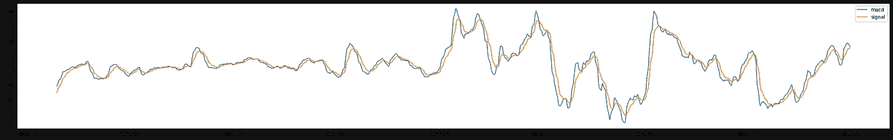

# MACD 和 Python 的算法交易

> 原文：<https://towardsdatascience.com/algorithmic-trading-with-macd-and-python-fef3d013e9f3?source=collection_archive---------7----------------------->

## 有了 MACD 十字战略


Photo by [贝莉儿 DANIST](https://unsplash.com/@danist07?utm_source=unsplash&utm_medium=referral&utm_content=creditCopyText) on [Unsplash](https://unsplash.com/s/photos/architecture?utm_source=unsplash&utm_medium=referral&utm_content=creditCopyText)

机器学习交易对于每天进行数千笔交易的大型对冲基金来说效果很好。然而，私人交易者只是没有实时运行具有数百万参数的机器学习模型的设施。这就是为什么私人算法交易者使用技术指标进行自动交易。

# 什么是 MACD？

我今天要用的技术指标是 MACD，移动平均线收敛发散，这是一个动量指标，显示了两条移动平均线之间的关系。MACD 的计算方法是从 12 期均线中减去 26 期均线。

这条 MACD 线画在信号线上(9 周期均线)。这两条线的交点就是 MACD 指标的信号。如果 MACD 指标从下方与信号线交叉，这将是上升趋势。如果 MACD 指标从信号线上方交叉，这将是一个下降趋势。

# 概念:

为了在编程时有效率，为了心中有一个明确的目标，有必要创建一个关于程序应该如何工作的总体想法。这个程序应该能够绘制 MACD 信号和 MACD 线，并根据 MACD 指标的信号进行交易。一个好的程序还应该能够评估交易策略的盈利能力，从而对其进行优化。

# 代码:

```
import yfinance
import talib
from matplotlib import pyplot as plt
```

这些是我将在程序中使用的库。yfinance 用于下载股票的财务数据，talib 用于计算 MACD 指标的值。Matplotlib 用于绘制数据，以更好地理解技术指标。

```
data = yfinance.download('NFLX','2016-1-1','2020-1-1')
data["macd"], data["macd_signal"], data["macd_hist"] = talib.MACD(data['Close'])
fig = plt.figure()
```

这个脚本下载数据，然后计算 macd 值，比如信号和定义趋势的直方图。



作者图片

这是 MACD 指示器和信号线两条线的图形。这只是对程序进行故障排除，以确保指示器正常工作。正如我们所看到的，该指标显然是有效的，因为两条线经常相交。

```
def intersection(lst_1,lst_2):
    intersections = []
    insights = []
    if len(lst_1) > len(lst_2):
        settle = len(lst_2)
    else:
        settle = len(lst_1)
    for i in range(settle-1):
        if (lst_1[i+1] < lst_2[i+1]) != (lst_1[i] < lst_2[i]):
            if ((lst_1[i+1] < lst_2[i+1]),(lst_1[i] < lst_2[i])) == (True,False):
                insights.append('buy')
            else:
                insights.append('sell')
            intersections.append(i)
    return intersections,insightsintersections,insights = intersection(data["macd_signal"],data["macd"])
```

交集函数使用一种非常规的方式来寻找交集:

1.  如果列表 1 中的值大于列表 2 中相同索引的值，则存储 True。否则，存储 False。
2.  将此函数应用于大于 1 的索引。如果存储的值不同，则一定发生了交集。

这是计算相交的唯一方法，因为相交可能发生在真实点之间，使得不可能在两个列表中找到相似的点。

我们使用这个函数来寻找交叉点，并记下程序是卖还是买股票。

要做好一个股票交易程序，我们必须评估程序的盈利能力。

```
profit = 0
pat = 1
for i in range(len(intersections)-pat):
    index = intersections[i]
    true_trade= None
    if data['Close'][index] < data['Close'][index+pat]:
        true_trade = 'buy'
    elif data['Close'][index] > data['Close'][index+pat]:
        true_trade = 'sell'
    if true_trade != None:
        if insights[i] == true_trade:
            profit += abs(data['Close'][index]-data['Close'][index+1]) 
        if insights[i] != true_trade:
            profit += -abs(data['Close'][index]-data['Close'][index+1])
```

这个程序通过计算 true_trade 来计算盈利能力，true _ trade 存储值是上升还是下降。如果交易符合真实交易变量，交易就是盈利的。如果交易不匹配，交易就会失败。

运行程序时，利润为-288.26。什么？

# 发生了什么事？

我发现了这个错误，并一直试图扰乱耐心值，也就是交叉点形成后多久，交易就完成了。所有的值都是负数。当面对这样的问题时，其中值的极性都是错误的，人们可以很容易地改变极性。

在这种情况下，这是因为交集顺序不正确！当我们做交叉点时，我们做了与我们描述的策略相反的洞察！例如，如果 MACD 线从上方相交，程序会将其标记为价格上涨！这将使所有被认为是有利可图的交易变成亏损！

通过将交叉点代码更改为:

```
def intersection(lst_1,lst_2):
    intersections = []
    insights = []
    if len(lst_1) > len(lst_2):
        settle = len(lst_2)
    else:
        settle = len(lst_1)
    for i in range(settle-1):
        if (lst_1[i+1] < lst_2[i+1]) != (lst_1[i] < lst_2[i]):
            if ((lst_1[i+1] < lst_2[i+1]),(lst_1[i] < lst_2[i])) == (True,False):
                insights.append('buy')
            else:
                insights.append('sell')
            intersections.append(i)
    return intersections,insightsintersections,insights = intersection(data["macd_signal"],data["macd"])
```

我们获得 298 美元的利润！

# 结论:

我写了另一篇关于 RSI 的文章，那个程序用同样的数据只赚了 58 美元。这个项目赚了 298 美元，每笔交易买一股。这里有一些方法可以改进我的程序:

1.  调整耐心变量

这个变量是相交后多长时间，将进行交易。用这个值做玩具，找到一个模式，并优化它以获得更好的结果。

2.找到最好的份额

这个算法对哪只股票最有效？在不同的公司上测试这个程序以进行评估。

# 我的链接:

如果你想看更多我的内容，点击这个 [**链接**](https://linktr.ee/victorsi) 。