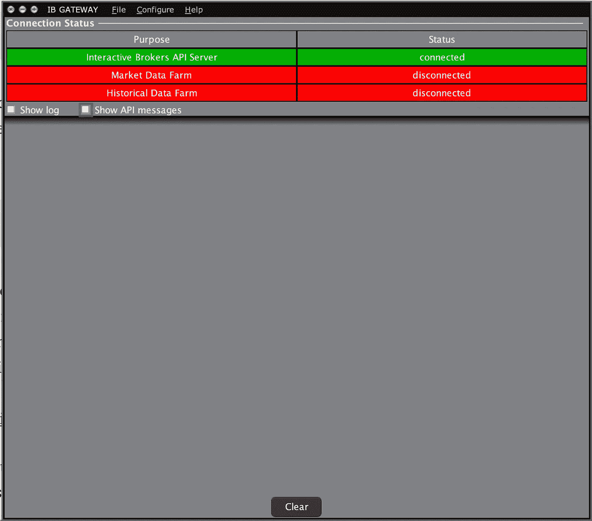
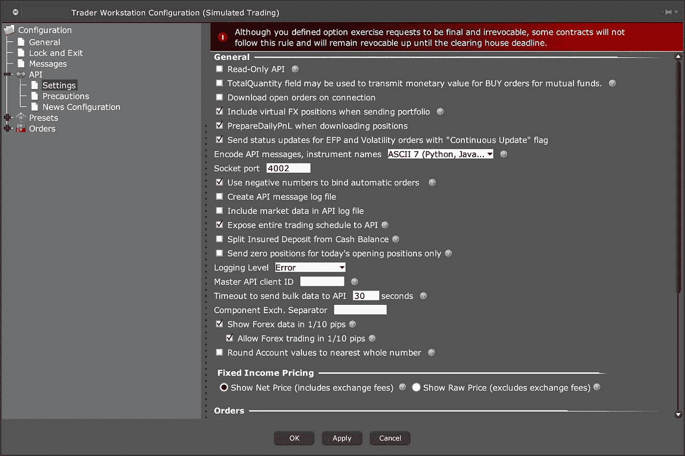

# 用 Python 进行算法交易

> 原文：<https://towardsdatascience.com/algorithmic-trading-with-python-8fbf1c279e77?source=collection_archive---------12----------------------->

## 为期货市场建立一个算法交易系统


[照片致谢](https://gbksoft.com/blog/algorithmic-trading-software/)

# 定量发展

Python 已经迅速成为数据科学、机器学习和人工智能领域最强大的计算语言之一。在用 Java 写了一本关于[算法交易系统开发的指南之后，我觉得是时候为 Python 写一本了；尤其是考虑到 Interactive Broker 新支持的 Python API。本文是一个 API 指南，通过定期参考我自己的实现和官方文档，帮助您入门和运行。](https://medium.com/swlh/algorithmic-trading-system-development-1a5a200af260)

# 装置

假设您已经正确安装了 Python 并建立了适当的环境变量，要安装交互式代理的 Python API，您可以在命令行中调用 pip 包管理器。

```
pip install ibapi
```

这将把 ibapi 包安装到 Python 的默认版本中。如果你有多个版本的 Python(甚至可能是 Python2)，你可能想安装 Python3 的包。

```
pip3 install ibapi
```

需要特别注意的是，如果您成功安装了软件包，但仍然出现 ModuleNotFound 错误，那么您很可能是在使用安装了 API 的不同 Python 版本运行 Python 脚本。如果你想下载源代码，或者看看 Java、C++和其他语言的 API 实现，你可以在这里下载:【https://www.interactivebrokers.com/en/index.php?f=5041。

接下来，我们需要一个网关来发出请求和接收来自交互代理的数据，我称之为服务器。从上面的链接(页面底部)下载 IB 网关，当你登录时，你会看到一个类似这样的界面…



导航到配置→设置→ API →设置，您可以配置您的 API 设置(主机、端口、只读等)。



# 连通性

在成功安装了交互式代理的 Python API 之后，就到了实现的时候了。直观上，这个 API 可以分为两个通信通道，一个从服务器读取，另一个向服务器写入…

## EClient

EClient 类负责向服务器发送请求。这些请求被保存在一个队列中，直到这个队列被 **run()** 函数清除。该类将 EWrapper 作为参数，因为该 EWrapper 的实例是服务器用回调进行响应的地方。

## 新闻记者

EWrapper 类负责在回调函数中接收数据。

## 多线程操作

要构建一个算法交易系统，多个进程必须同时发生，这就是为什么我们必须将 EClient 持久化在它自己的线程上，这样读写就可以异步发生。如果你想了解更多关于多线程的知识，我写了一个快速入门指南，介绍如何用 Python 为金融开发[多线程。](https://medium.com/p/fc1425664e74/edit)

## TradingApp 主类

要创建读写服务器的能力，需要创建 EClient 和 EWrapper 的两个子类。我将把 EWrapper 子类声明为 APIController，把 EClient 声明为 APISocket。主类将成为这两个实现的子类。

让我们分析一下这是怎么回事。正如我之前所说，EClient 类负责向服务器发出请求，而服务器则响应 EWrapper 类。通过创建 APISocket 和 APIController 子类，我们可以覆盖超类函数并编写自定义实现。在这个例子中，您可以看到 APIController 有两个回调，一个用于错误，一个用于连接。服务器只会调用@iswrapper 函数来响应对服务器的请求。为了在 main 类中发出连接请求，我们引用 self(API socket)并用 host、port 和 clientId 参数调用 connect。这将请求放在 EClient 队列中，但是正如我所说的，要构建一个算法系统，必须有并发读写的能力，所以我们将支持在请求队列自己的线程上清除请求队列(通过发出请求)。在运行 TradingApp 类的一个实例后，您将得到一个成功连接到服务器的消息，这个连接在 EClient 线程的生命周期中是持久的。

成功建立连接后，您将可以通过各种请求的形式访问来自服务器的所有类型的数据，在他们的[文档](https://interactivebrokers.github.io/tws-api/introduction.html)中可以找到请求的完整列表。

# 流式市场数据

*如果你对实时市场数据感兴趣，你需要购买一份市场数据订阅服务，最低账户金额为 2000 美元。*

## 创建合同

合约是告诉服务器我们对什么工具感兴趣的交易/流/分析的类。输入参数非常简单，只引用感兴趣的特定证券。我一直在交易 E-mini NASDAQ-100，并将在这个例子中使用它。

```
# Create a new contract object for the E-mini NASDAQ-100
contract = Contract()
contract.symbol = "NQ"
contract.localSymbol = "NQM0"
contract.secType = "FUT"
contract.exchange = "GLOBEX"
contract.currency = "USD"
```

## 请求数据

要请求数据流，只需将请求放在连接请求下。

```
self.connect('127.0.0.1', 4002, 1)
self.reqMktData(1001, contract, "", False, False, [])
```

## 接收数据

要从服务器接收数据，请向 APIController 添加 tickPrice 和 tickSize 回调函数。

```
[@iswrapper](http://twitter.com/iswrapper)
    def tickPrice(self, reqId, tickType, price, attrib):
        super().tickPrice(reqId, tickType, price, attrib)
        # Do something with trading price[@iswrapper](http://twitter.com/iswrapper)
    def tickSize(self, reqId, tickType, size):
        super().tickSize(reqId, tickType, size)
        # Do something with trading volume
```

# 来自回调的请求

对实时数据流执行分析相对简单，因为数据可以间隔存储在数据缓存中，也可以内部存储在 APIController 中。然而，从回调函数发出服务器请求有点复杂，我想提供一个创造性的解决方案。

用 EClient 和 Contract 参数创建一个名为 signal 的新类(我用它在回调函数中下订单，但其他请求也可以),允许主类作为 EClient 作为 Signal 类的参数。那么这个 signal 类就是 APIController 的一个新参数，这样控制器就可以直接引用 self.signal.FUNCTION_IN_signal 或者 self . SIGNAL . e client . server _ REQUEST，分别在 SIGNAL 类或者 direct requests 中进行定制请求实现。

# 想要现场解说？

我制作了一个视频指南，进一步分解了交互式经纪人 API。