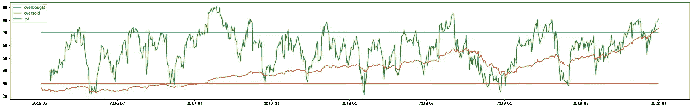

# 使用 Python 的 RSI 算法交易

> 原文：<https://towardsdatascience.com/algorithmic-trading-with-rsi-using-python-f9823e550fe0?source=collection_archive---------4----------------------->

## 使用 talib 和 yfinance


美国宇航局在 [Unsplash](https://unsplash.com/s/photos/cosmic?utm_source=unsplash&utm_medium=referral&utm_content=creditCopyText) 拍摄的照片

机器学习是计算密集型的，因为算法是不确定的，因此必须随着时间的推移不断调整。然而，技术指标要快得多，因为等式不会改变。因此，这提高了它们用于实时交易的能力。

这里是 [github 回购](http://motriael.com/6QX2)(广告)。

# 什么是 RSI？

要创建一个使用 RSI 的程序，首先要了解 RSI 指标。RSI 是相对强度指数的缩写。它是一个动量指标，使用价格变化的幅度来评估证券是超买还是超卖。

如果 RSI 值超过 70，则认为该证券超买，如果低于 30，则认为超卖。超买是指由购买产生的泡沫可能很快破裂，因此价格会下跌。这创造了一个强有力的切入点。

然而，好的做法是，只有当 RSI 值与超买线相交时，才卖出订单，因为这是一种更保守的方法。至少可以猜测 RSI 何时会达到最高点。

# 概念:

这个程序试图使用 talib(技术分析)库来实现 RSI 线和超卖超买线的交叉。该程序的大部分不是来自于对指标的编程(因为它已经在库中创建了)，而是如何使用超卖和超买区域进行交易的实现。

# 代码:

```
import yfinance
import talib
from matplotlib import pyplot as plt
```

这些是该计划的先决条件。Yfinance 用于下载股票数据，talib 用于计算指标值。Matplotlib 当然是将数据绘制成图形。

```
data = yfinance.download('NFLX','2016-1-1','2020-1-1')
rsi = talib.RSI(data["Close"])
```

该脚本访问数据，并根据以下两个等式计算 rsi 值:

*RSI step 1*= 100[100/(1+平均损耗/平均增益)]

*RSI step 2*= 100[100/(1+平均平均损耗÷13+当前损耗/先前平均增益÷13+当前增益)]

```
fig = plt.figure()
fig.set_size_inches((25, 18))
ax_rsi = fig.add_axes((0, 0.24, 1, 0.2))
ax_rsi.plot(data.index, [70] * len(data.index), label="overbought")
ax_rsi.plot(data.index, [30] * len(data.index), label="oversold")
ax_rsi.plot(data.index, rsi, label="rsi")
ax_rsi.plot(data["Close"])
ax_rsi.legend()
```

该图显示了所有的超买和超卖区域，以及为股票收盘价计算的 RSI 值。这给了股票数据一个很好的可视化



作者图片

这是合成图。随着时间的推移，我们可以看到 RSI 值在不同部分之间波动。RSI 的好处在于它是相对的。这意味着信号的强度与实际值无关，而是与过去值的关系有关。

# 缺少的步骤:

通常，文章到此为止。他们在给出股票交易程序的初步代码后结束。有必要更进一步，真正评估股票交易程序，基于程序的盈利能力。这就是为什么我要交程序。

```
section = None
sections = []
for i in range(len(rsi)): 
    if rsi[i] < 30:
        section = 'oversold'
    elif rsi[i] > 70:
        section = 'overbought'
    else:
        section = None
    sections.append(section)
```

这个脚本记录了每个点所在的部分。它要么在超买，超卖或无区域，这是指在两条线之间。

```
trades = []
for i in range(1,len(sections)):
    trade = None
    if sections[i-1] == 'oversold' and sections[i] == None:
        trade = True
    if sections[i-1] == 'overbought' and sections[i] == None:
        trade = False
    trades.append(trade)
```

这个脚本整合了 RSI 交易的基本策略。交易策略是当价值离开超买和超卖部分时，进行适当的交易。例如，如果它离开超卖区，就进行买入交易。如果它离开了超买区，就进行卖出交易。

```
acp = data['Close'][len(data['Close'])-len(trades):].values
profit = 0
qty = 10
for i in range(len(acp)-1):
    true_trade = None
    if acp[i] < acp[i+1]:
        true_trade = True
    elif acp[i] > acp[i+1]:
        true_trade = False
    if trades[i] == true_trade:
        profit += abs(acp[i+1] - acp[i]) * qty
    elif trades[i] != true_trade:
        profit += -abs(acp[i+1] - acp[i]) * qty
```

这个脚本使用程序进行的交易来计算每笔交易的利润或损失。这给出了程序的最佳评价，因为它准确地锁定了要寻找的变量。qty 变量计算购买了多少股票。

运行程序后，计算的利润为:

```
Profit : $58.3
```

# 结论:

事实上，当考虑到风险回报比时，58.3 美元的利润实际上不是一个很好的投资。有很多方法可以改进我的程序:

1.  调整耐心变量

这个变量是在 RSI 值之后多久，将进行交易。用这个值做玩具，找到一个模式，并优化它以获得更好的结果。

2.找到最好的公司

这个算法对哪只股票最有效？在不同的公司上测试这个程序以进行评估。

# 我的链接:

如果你想看更多我的内容，点击这个 [**链接**](https://linktr.ee/victorsi) 。