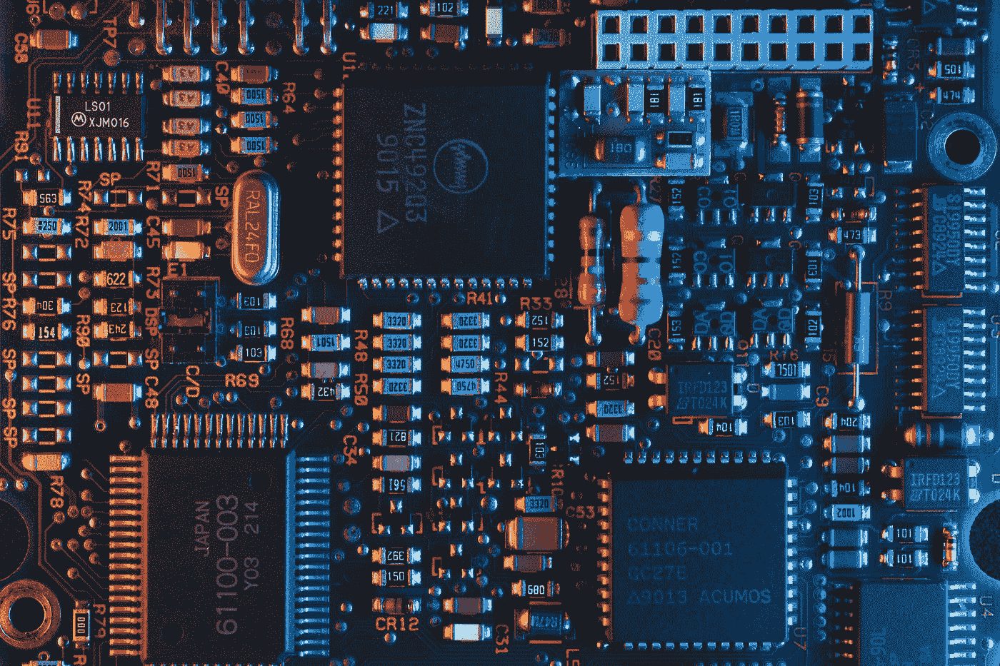

# 算法是不够的

> 原文：<https://towardsdatascience.com/algorithms-are-not-enough-fdee1d65e536?source=collection_archive---------4----------------------->

## [意见](https://towardsdatascience.com/tagged/opinion)

## 人工智能的下一个突破需要重新思考我们的硬件

[翁贝托](https://unsplash.com/@umby?utm_source=medium&utm_medium=referral)在 [Unsplash](https://unsplash.com?utm_source=medium&utm_medium=referral) 上的照片

现在的 AI 有一个问题:贵。训练 Resnet-152，一个现代计算机视觉模型，估计花费大约 100 亿次浮点运算，这与现代语言模型相比相形见绌。OpenAI 最近的自然语言模型 GPT-3 的训练预计将花费 3000 亿万亿次浮点运算，这在商用 GPU 上至少需要 500 万美元。相比之下，人脑可以识别人脸，回答问题，驾驶汽车，只需一根香蕉和一杯咖啡。

## 我们是怎么到这里的？

我们已经走了很长一段路。第一台计算机是专用机器。1822 年，英国数学家查尔斯·巴贝奇创造了“差分机”，它的唯一目的是计算多项式函数。1958 年，康奈尔大学教授弗兰克·罗森布拉特(Frank Rosenblatt)创造了“Mark I”，这是一种用于机器视觉任务的单层感知机的物理化身。在早期，硬件和算法是一回事。

随着*冯诺依曼架构*的引入，硬件和算法的统一性发生了变化，这是一种由用于计算的处理单元和用于存储数据和程序指令的存储单元组成的芯片设计。这种范式转变使得制造通用机器成为可能，这些机器可以被编程来完成任何期望的任务。冯-诺依曼体系结构已经成为现代数字计算机的蓝图。

但是，有一个条件。数据密集型程序需要内存和计算单元之间的大量通信，从而降低了计算速度。这种“冯-诺依曼瓶颈”是人工智能早期尝试失败的原因。标准 CPU 在大型矩阵乘法(深度神经网络中的核心计算操作)方面效率低下。由于现有硬件的瓶颈，早期的神经网络太浅，性能不佳。

这个问题的解决方案不是来自学术界，而是来自游戏行业，这是历史的讽刺之一。GPU 是 20 世纪 70 年代为加速视频游戏而开发的，它通过数千个计算核心并行处理数据密集型操作。这种并行性是解决冯-诺依曼瓶颈的有效方法。GPU 能够训练更深层次的神经网络，并已成为现代人工智能的现状硬件。

Riho Kroll 在 [Unsplash](https://unsplash.com?utm_source=medium&utm_medium=referral) 上拍摄的照片

## 硬件彩票

人工智能的研究有一点纯粹的运气成分。谷歌研究员萨拉·胡克称之为“[硬件彩票](https://hardwarelottery.github.io/)”:早期的人工智能研究人员只是运气不好，因为他们被缓慢的 CPU 卡住了。在 GPU 出现的时候，恰好在该领域的研究人员“赢得”了硬件彩票。他们可以通过训练由高效 GPU 加速提供动力的深度神经网络来取得快速进展。

硬件彩票的问题是，一旦这个领域作为一个整体确定了赢家，就很难探索新的东西。硬件开发速度缓慢，而且需要芯片制造商在回报不确定的情况下进行大量前期投资。一个安全的赌注是简单地优化矩阵乘法，这已经成为现状。但从长远来看，这种对硬件和算法的特定组合的关注会限制我们的选择。

让我们回到最初的问题。为什么当今的人工智能如此昂贵？答案可能是我们还没有合适的硬件。硬件彩票的存在，加上商业激励，使得经济上很难打破目前的现状。

作为一个例子，考虑杰弗里辛顿的胶囊神经网络，一种计算机视觉的新方法。谷歌研究人员 Paul Barham 和 Michael Isard [发现](https://dl.acm.org/doi/pdf/10.1145/3317550.3321441)这种方法在 CPU 上工作得相当好，但在 GPU 和 TPU 上表现不佳。原因？加速器已经针对最频繁的操作进行了优化，例如标准矩阵乘法，但是缺少针对胶囊卷积的优化。他们的结论(这也是他们论文的标题): *ML 系统停滞不前*。

人工智能研究人员存在“过度适应”现有硬件的风险，从长远来看，这将抑制该领域的创新。

## 前进的道路

> “下一个突破可能需要一种根本不同的方式，用硬件、软件和算法的不同组合来建模世界。”莎拉·胡克，谷歌大脑

在人脑中，记忆和计算不是两个独立的组件，而是发生在同一个地方:神经元。记忆来自神经元通过突触连接在一起的方式，而计算来自神经元放电和传播来自感觉输入的信息的方式。硬件和算法是一回事，很像早期的计算机。这与我们今天做人工智能的方式完全不同。

由 GPU 和 TPU 支持的深度神经网络，即使它们在今天的许多任务中表现得非常好，从长远来看可能不是前进的方向。也许在硬件和算法架构的可能组合的广阔前景中，它们只是局部最优。

前进的道路始于认识到算法是不够的。对于下一代人工智能，我们需要在硬件和算法上进行创新。在 GPU 之前，AI 研究被卡住了。硬件上没有新的突破，就有可能再次卡住。

 [## 监督学习是不够的

### 为了在人工智能方面取得进展，我们的模型需要学会应对混乱的现实世界

towardsdatascience.com](/supervised-learning-is-not-enough-8254814dfcc5)  [## 智能行为的起源

### 为什么真正的人工智能需要的不仅仅是模式识别

towardsdatascience.com](/the-origin-of-intelligent-behavior-3d3f2f659dc2)