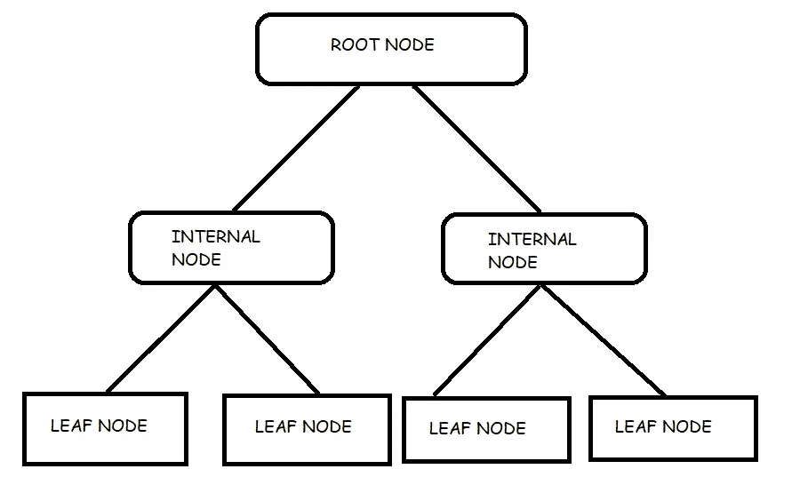
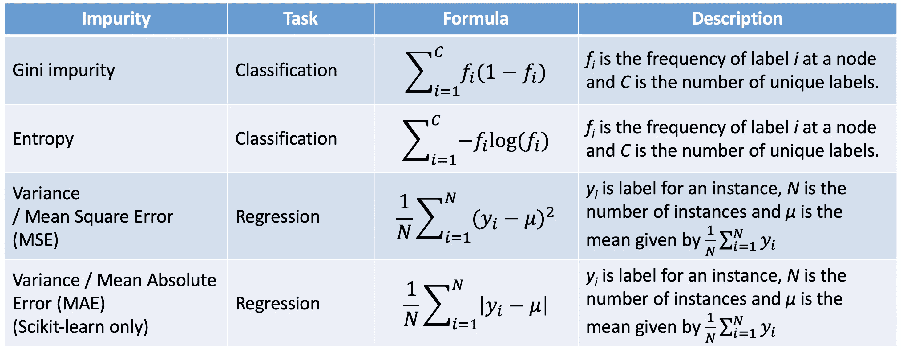
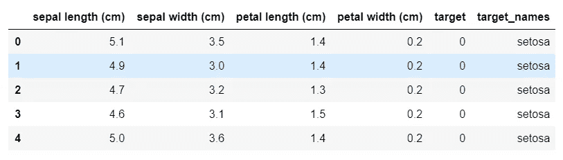
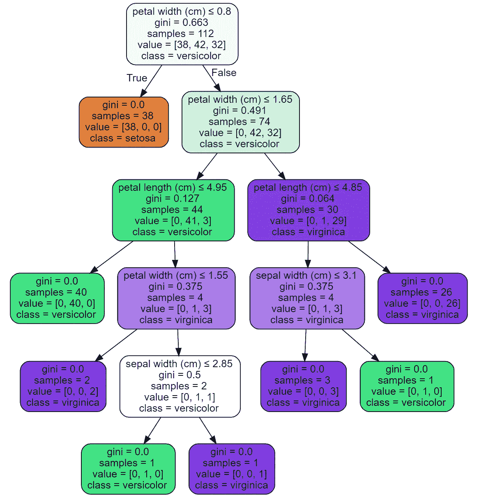

# 从零开始的算法:决策树

> 原文：<https://towardsdatascience.com/algorithms-from-scratch-decision-tree-1898d37b02e0?source=collection_archive---------21----------------------->


约翰·西门子在 [Unsplash](https://unsplash.com?utm_source=medium&utm_medium=referral) 上拍摄的照片

## [从零开始的算法](https://towardsdatascience.com/tagged/algorithms-from-scratch)

## 从头开始详述和构建决策树模型

熟悉我早期作品的人会记得，我曾经写过一篇关于随机森林算法的概述。决策树的坚实基础是理解随机森林内部工作的先决条件；随机森林构建多个决策树，并输出回归问题中每棵树预测的平均值，在分类问题中，它输出每棵树预测的相对多数。

[](/random-forest-overview-746e7983316) [## 随机森林概述

### 随机森林的概念概述

towardsdatascience.com](/random-forest-overview-746e7983316) 

基于上面的故事，我将更加关注决策树学习算法，因为它是机器学习领域的一个基本算法。许多模型的结构基于决策树模型，如随机森林和梯度提升树。此外，我将从头开始做这个算法的 Python 实现，以进一步扩展我们对算法中发生的事情的直觉。

## 定义术语

*   **参数模型**:用于对总体参数进行推断，但是如果所有假设都不满足，这些推断就无效。
*   **非参数模型**:不假设数据或总体有任何特征结构。

## 决策树(购物车)

由于其可理解性和简单性而广受欢迎，决策树是最容易可视化和解释的算法之一，在向非技术观众展示结果时非常方便，这是行业中经常需要的。如果我们简单地考虑一棵处于类似流程图状态的树，从根到叶，其中从根到叶的路径定义了关于特征的决策规则，那么我们已经有了理解决策树学习所需的良好的直觉水平。

与我们在从零开始的[算法](https://towardsdatascience.com/tagged/algorithms-from-scratch)系列中介绍的前两种算法([线性回归](/algorithms-from-scratch-linear-regression-c654353d1e7c)和[逻辑回归](/algorithms-from-scratch-logistic-regression-7bacdfd9738e))不同，决策树算法是一种非参数算法，这意味着它不对数据或总体做出假设。这确实对我们的模型有影响，因为我们在训练期间在模型中用偏差换取方差，使得决策树更容易过度拟合。

在机器学习领域，有两种主要的**决策树模型。我们使用的方法取决于我们试图预测的目标变量的类型:**

C **分类树**:用于预测取离散值的目标变量的树模型。因此，叶节点代表一个类，而分支代表导致这些类标签的特征的合取。

R回归树:用于预测取连续值的目标变量的树模型。与分类树相反，在回归树中，每个叶节点包含一个连续值(即房价)；分支代表导致每个连续变量的特征的合取。

> **注**:分类和回归树(CART)是指这两个过程的总称，由 Breiman 等人于 1984 年首次提出。

在图 1 的*中，我们可以看到 CART 算法遵循的结构。尽管这种结构是为两棵树设置的，但是分类树和回归树之间还是有一些细微的差别，比如每棵树的输出；**分类树**返回叶节点的模式类别，而**回归树**返回平均值。*



图 1:决策树图表。

这两种算法之间的另一个显著区别是我们在划分特征空间时试图最小化的标准。一般来说，我们希望选择特征 **j** 和分割点 **s** ，它们能够最好地将特征空间分割成两个区域，但是如何在回归树和分类树中测量这一点是不同的，如图 2*所示。*



图 sklearn 中使用的杂质公式。[来源:[Stacey Ronaghan](https://medium.com/u/60a50d133053?source=post_page-----746e7983316----------------------)——[Scikit-learn 和 Spark](/the-mathematics-of-decision-trees-random-forest-and-feature-importance-in-scikit-learn-and-spark-f2861df67e3) 中的决策树、随机森林和特性重要性的数学

## 分块算法

> **注意:**我们将构建一个决策树分类器，以基尼系数作为分割的标准**。**

1.  考虑特征 j 和分割点 s 的所有可能分割
2.  找到最佳分割后，将数据分成两个结果区域
3.  重复 1 和 2，直到达到停止标准

上面的伪代码演示了计算机科学中称为递归的现象:一种解决问题的方法，其中解决方案取决于同一问题的较小实例的解决方案(来源: [Wikipedia](https://en.wikipedia.org/wiki/Recursion_(computer_science)#:~:text=Recursion%20in%20computer%20science%20is%20a%20method%20of,one%20of%20the%20central%20ideas%20of%20computer%20science.) )，以及[二进制分裂](https://en.wikipedia.org/wiki/Binary_splitting)因此在一些示例中，步骤 1-2 被称为递归二进制分裂。

## 履行

对于此次实施，我们将利用以下框架:

*   线性代数和数据处理
*   熊猫(数据处理)
*   Sci-kit 学习(机器学习)
*   图形可视化软件

点击此处查看完整代码…

[](https://github.com/kurtispykes/ml-from-scratch/blob/master/decision_tree.ipynb) [## kurtispykes/ml-从零开始

### permalink dissolve GitHub 是超过 5000 万开发人员的家园，他们一起工作来托管和审查代码，管理…

github.com](https://github.com/kurtispykes/ml-from-scratch/blob/master/decision_tree.ipynb) 

```
import numpy as np 
import pandas as pd 
import graphviz
from sklearn.metrics import accuracy_score
from sklearn.datasets import load_iris
from sklearn.tree import DecisionTreeClassifier
from sklearn.tree import export_graphviz
from sklearn.model_selection import train_test_split
```

我们将使用的数据集是来自 Scikit learn 的虹膜数据集—参见[文档](https://scikit-learn.org/stable/modules/generated/sklearn.datasets.load_iris.html)

```
# loading the data set
dataset = load_iris(as_frame=True)
df= pd.DataFrame(data= dataset.data)

# adding the target and target names to dataframe
target_zip= dict(zip(set(dataset.target), dataset.target_names))
df["target"] = dataset.target
df["target_names"] = df["target"].map(target_zip)

print(df.shape)
df.head()(150, 6)
```



图 3:虹膜数据集(前 5 行)

```
# Seperating to X and Y 
X = df.iloc[:, :4]
y = df.iloc[:, -1]

# splitting training and test
X_train, X_test, y_train, y_test = train_test_split(X, y, train_size=0.75, shuffle=True, random_state=24)dt = DecisionTreeClassifier()
dt.fit(X_train, y_train)DecisionTreeClassifier()dot_data = export_graphviz(dt, out_file=None, 
                           feature_names=X.columns,  
                           class_names=dataset.target_names,  
                           filled=True, rounded=True,  
                           special_characters=True)  
graph = graphviz.Source(dot_data)  
graph
```



图 4:经过训练的决策树可视化——上面代码单元的输出。

```
sklearn_y_preds = dt.predict(X_test)
print(f"Sklearn Implementation:\nACCURACY: {accuracy_score(y_test, sklearn_y_preds)}")Sklearn Implementation:
ACCURACY: 0.9473684210526315
```

# 我的实现

我们将需要根据特定分支的决策规则，将我们的数据分为真索引和假索引。如果满足决策规则的条件，我们说该分支为真(我们将表示为`left`)和假(表示为`right`)。

## 划分数据

```
def partition(data, column, value): 
    """
    Partition the data into left (indicating True) and right (indicating false).

    Inputs
    data: The data to partition 

    Outputs
    left: index of values that meet condition
    right: index of values that fail to meet the condition
    """
    left = data[data[column] <= value].index
    right = data[data[column] > value].index

    return left, right
```

为了检查我们的函数是否正常工作，我们将对所有数据执行拆分，并手动将最佳列和值传递给它，以查看我们的数据是否相对于上图进行了分离。

```
# performing a split on the root node
left_idx, right_idx = partition(X_train, "petal length (cm)", 2.45)

print("[petal length (cm) <= 2.45]")

# print results --> left_idx = 38 setosa | right index = 42 versicolor, 32 virginica 
print(f"left_idx: {dict(zip(np.unique(y_train.loc[left_idx], return_counts=True)[0], np.unique(y_train.loc[left_idx], return_counts=True)[1]))}\n\
right_idx: {dict(zip(np.unique(y_train.loc[right_idx], return_counts=True)[0], np.unique(y_train.loc[right_idx], return_counts=True)[1]))}")[petal length (cm) <= 2.45]
left_idx: {'setosa': 38}
right_idx: {'versicolor': 42, 'virginica': 32}
```

完美！

接下来，我们需要一个我们想要最小化的标准。在这个实现中，我们将使用一个名为`gini_impurity`的函数来最小化基尼系数。在不触及技术层面的情况下，基尼系数只是简单地衡量了我们的数据在某个节点上的混合程度；为了帮助理解这个概念，想想黄金。当黄金不纯时，它指的是其中其他物质的混合物，然而当它纯时，我们可以说没有杂质(这并不完全正确，因为精炼黄金纯度高达 99.99%，所以技术上仍有一些杂质)。

理想情况是节点是纯的，这意味着目标标签被分成单独的节点。—要深入了解基尼系数杂质的技术细节，请参见[此处](https://en.wikipedia.org/wiki/Decision_tree_learning#Gini_impurity)

## 基尼杂质

```
def gini_impurity(label, label_idx):
    """
    A measure of how often a randomly chosen element from the set would
    be incorrectly labelled if it was randomly labelled according to the 
    distribution of labels in the subset (Soure: Wikipedia)

    Inputs
    label: The class label available at current node

    Outputs
    impurity: The gini impurity of the node 
    """
    # the unique labels and counts in the data
    unique_label, unique_label_count = np.unique(label.loc[label_idx], return_counts=True)

    impurity = 1.0
    for i in range(len(unique_label)):
        p_i = unique_label_count[i] / sum(unique_label_count)
        impurity -= p_i ** 2 
    return impurity
```

如果你向上滚动回到*图 4，*你会看到在根节点的杂质是 0.663。因此，为了确定我们的`gini_impurity`函数是否正常工作，我们应该在输出中看到这个数字

```
# Gini impurity of the first node
impurity = gini_impurity(y_train, y_train.index)
impurity`0.6626275510204082
```

太好了！

为了在一个特性(和价值)上分裂，我们需要一种量化的方法，如果我们在那个点上分裂，什么会产生最好的结果。信息增益是量化在每个节点上分割什么特征和特征值的有用方法。对于树的每个节点，信息值“表示在给定实例到达该节点的情况下，指定新实例应该被分类为是还是否所需的预期信息量”。(来源:[维基百科](https://en.wikipedia.org/wiki/Decision_tree_learning#Information_gain))

## 信息增益

```
def information_gain(label, left_idx, right_idx, impurity): 
    """
    For each node of the tree, the information gain "represents the
    expected amount of information that would be needed to specify whether
    a new instance should be classified yes or no, given that the example
    reached that node. (Source: Wikipedia)

    Inputs
    left: The values that met the conditions of the current node
    right: The values that failed to meet the conditions of the current noode
    gini_impurity: the uncertainty at the current node

    Outputs
    info_gain: The information gain at the node
    """

    p = float(len(left_idx)) / (len(left_idx) + len(right_idx))
    info_gain = impurity - p * gini_impurity(label, left_idx) - (1 - p) * gini_impurity(label, right_idx)
    return info_gain
```

最佳的第一分割是提供最多信息增益的分割。对每个不纯节点重复这个过程，直到树完成。(来源:[维基百科](https://en.wikipedia.org/wiki/Decision_tree_learning#Information_gain))

基于上面的陈述，我们现在可以明白为什么值为 2.45 的花瓣长度(cm)被选为第一个分割。

```
# testing info gain of the first split at root node
info_gain = information_gain(y_train, left_idx, right_idx, impurity)
info_gain0.33830322669608387# testing a random feature and value to see the information gain
left_idx, right_idx = partition(X_train, "petal width (cm)", 1.65)

impurity = gini_impurity(y_train, y_train.index)

info_gain = information_gain(y_train, left_idx, right_idx, impurity)
info_gain0.25446843371494937
```

以上助手功能现在要发挥作用了。我们必须手动选择特性和值，对吗？下一个函数现在将自动搜索特征空间，并找到最佳分割数据的特征和特征值。

## 寻找最佳分割

```
def find_best_split(df, label, idx):
    """
    Splits the data on the best column and value 

    Input
    df: the training data
    label: the target label 
    idx: the index of the data

    Output: 
    best_gain: the max information gain
    best_col: the column that produced best information gain
    best_val: the value of the column that produced best information gain

    """

    best_gain = 0 
    best_col = None
    best_value = None

    df = df.loc[idx] # converting training data to pandas dataframe
    label_idx = label.loc[idx].index # getting the index of the labels

    impurity = gini_impurity(label, label_idx) # determining the impurity at the current node

    # go through the columns and store the unique values in each column (no point testing on the same value twice)
    for col in df.columns: 
        unique_values = set(df[col])
        # loop thorugh each value and partition the data into true (left_index) and false (right_index)
        for value in unique_values: 

            left_idx, right_idx = partition(df, col, value)
            # ignore if the index is empty (meaning there was no features that met the decision rule)
            if len(left_idx) == 0 or len(right_idx) == 0: 
                continue 
            # determine the info gain at the node
            info_gain = information_gain(label, left_idx, right_idx, impurity)
            # if the info gain is higher then our current best gain then that becomes the best gain
            if info_gain > best_gain:
                best_gain, best_col, best_value = info_gain, col, value

    return best_gain, best_col, best_valuefind_best_split(X_train, y_train, y_train.index)(0.33830322669608387, 'petal length (cm)', 1.9)
```

太好了，我们有了算法运行所需的所有组件。然而，上面的函数只对我们的训练数据(树桩/树根)执行一次分割。

## 附加助手功能

```
# helper function to count values
def count(label, idx):
    """
    Function that counts the unique values

    Input
    label: target labels
    idx: index of rows 

    Output
    dict_label_count: Dictionary of label and counts

    """
    unique_label, unique_label_counts = np.unique(label.loc[idx], return_counts=True)
    dict_label_count = dict(zip(unique_label, unique_label_counts))
    return dict_label_count# check counts at first node to check it aligns with sci-kit learn
count(y_train, y_train.index){'setosa': 38, 'versicolor': 42, 'virginica': 32}
```

这里有一些类，我们将使用它们来存储决策树中的特定数据并打印我们的树。

```
# [https://github.com/random-forests/tutorials/blob/master/decision_tree.ipynb](https://github.com/random-forests/tutorials/blob/master/decision_tree.ipynb)class Leaf:
    """
    A Leaf node classifies data.

    This holds a dictionary of class (e.g., "Apple") -> number of times
    it appears in the rows from the training data that reach this leaf.
    """

    def __init__(self, label, idx):
        self.predictions = count(label, idx)# [https://github.com/random-forests/tutorials/blob/master/decision_tree.ipynb](https://github.com/random-forests/tutorials/blob/master/decision_tree.ipynb)class Decision_Node:
    """
    A Decision Node asks a question.

    This holds a reference to the question, and to the two child nodes.
    """

    def __init__(self,
                 column,
                 value,
                 true_branch,
                 false_branch):
        self.column = column
        self.value = value
        self.true_branch = true_branch
        self.false_branch = false_branch# [https://github.com/random-forests/tutorials/blob/master/decision_tree.ipynb](https://github.com/random-forests/tutorials/blob/master/decision_tree.ipynb)def print_tree(node, spacing=""):
    """
    World's most elegant tree printing function.

    Input
    node: the tree node
    spacing: used to space creating tree like structure
    """

    # Base case: we've reached a leaf
    if isinstance(node, Leaf):
        print (spacing + "Predict", node.predictions)
        return

    # Print the col and value at this node
    print(spacing + f"[{node.column} <= {node.value}]")

    # Call this function recursively on the true branch
    print (spacing + '--> True:')
    print_tree(node.true_branch, spacing + "  ")

    # Call this function recursively on the false branch
    print (spacing + '--> False:')
    print_tree(node.false_branch, spacing + "  ")
```

## 递归二进制分裂

为了使算法工作，我们将需要分裂递归地发生，直到我们满足停止标准——在这种情况下，直到每个叶节点都是纯的。

```
def build_tree(df, label, idx): 
    """
    Recursively Builds the tree until is leaf is pure. 

    Input 
    df: the training data
    label: the target labels
    idx: the indexes 

    Output
    best_col: the best column 
    best_value: the value of the column that minimizes impurity 
    true_branch: the true branch 
    false_branch: the false branch 
    """
    best_gain, best_col, best_value = find_best_split(df, label, idx)

    if best_gain == 0: 
        return Leaf(label, label.loc[idx].index)

    left_idx, right_idx = partition(df.loc[idx], best_col, best_value)

    true_branch = build_tree(df, label, left_idx)

    false_branch = build_tree(df, label, right_idx)

    return Decision_Node(best_col, best_value, true_branch, false_branch)my_tree = build_tree(X_train, y_train, X_train.index)print_tree(my_tree)[petal length (cm) <= 1.9]
--> True:
  Predict {'setosa': 38}
--> False:
  [petal width (cm) <= 1.6]
  --> True:
    [petal length (cm) <= 4.9]
    --> True:
      Predict {'versicolor': 40}
    --> False:
      [sepal length (cm) <= 6.0]
      --> True:
        [sepal width (cm) <= 2.2]
        --> True:
          Predict {'virginica': 1}
        --> False:
          Predict {'versicolor': 1}
      --> False:
        Predict {'virginica': 2}
  --> False:
    [petal length (cm) <= 4.8]
    --> True:
      [sepal width (cm) <= 3.0]
      --> True:
        Predict {'virginica': 3}
      --> False:
        Predict {'versicolor': 1}
    --> False:
      Predict {'virginica': 26}
```

超级！现在，您已经看到了如何从头开始实现决策树，并且我们已经根据我们的训练数据对其进行了训练。然而，它并没有就此停止，首先构建算法的目的是自动对新的观察结果进行分类。下一节将致力于推理…

## 推理

```
def predict(test_data, tree):

    """
    Classify unseen examples

    Inputs
    test_data: Unseen observation
    tree: tree that has been trained on training data

    Output
    The prediction of the observation.
    """

    # Check if we are at a leaf node
    if isinstance(tree, Leaf): 
        return max(tree.predictions)

    # the current feature_name and value 
    feature_name, feature_value = tree.column, tree.value

    # pass the observation through the nodes recursively
    if test_data[feature_name] <= feature_value: 
        return predict(test_data, tree.true_branch)

    else: 
        return predict(test_data, tree.false_branch)
```

为了检查我们的函数是否正确运行，我将使用一个观察示例。

```
# taking one instance to test function 
example, example_target = X_test.iloc[6], y_test.iloc[6]
example, example_target(sepal length (cm)       5.3
 sepal width (cm)        3.7
 petal length (cm)       1.5
 petal width (cm)        0.2
 predictions          setosa
 Name: 48, dtype: object,
 'setosa')
```

当我们将我们的`predict`函数应用到示例中时，我们应该希望观察相应地遍历树并输出`setosa`，让我们检查…

```
# if working correctly should output setosa
predict(example, my_tree)'setosa'
```

**至高无上！！然而，这只是一个例子。如果我们想将这个函数应用到我们测试集中的每一个观察值，我们可以使用`df.apply`——参见[文档](https://pandas.pydata.org/pandas-docs/stable/reference/api/pandas.DataFrame.apply.html)**

```
# create a new col of predictions
X_test["predictions"] = X_test.apply(predict, axis=1, args=(my_tree,))
```

好了，关键时刻到了。我们需要检查我们的算法是否返回与 scikit 学习模型相同的预测，作为检查我们是否正确实现了我们的算法的一种方式。我们通过简单地执行`sklearn_y_preds == X_true["predictions"]`来做到这一点，它为每个观察返回一个布尔数组——在我们的例子中，它们都是真的。

```
print(f"Sklearn Implementation:\nACCURACY: {accuracy_score(y_test, sklearn_y_preds)}\n\n\
My Implementation:\nACCURACY: {accuracy_score(y_test, X_test['predictions'])}")Sklearn Implementation:
ACCURACY: 0.9736842105263158

My Implementation:
ACCURACY: 0.9736842105263158
```

## 赞成的意见

*   简单易懂
*   能够处理数字和分类数据
*   几乎不需要数据准备
*   适用于大型数据集
*   内置功能选择

## 骗局

*   树的不稳定性(改变数据中的某些东西可以改变一切)
*   缺乏平滑度(回归问题的特殊问题)
*   倾向于过度拟合

## 包裹

建立决策树的良好基础将有助于理解许多其他重要的机器学习算法。它是一种非常强大的算法，经常被用作集成模型来赢得各种数据科学比赛。虽然很容易概念化，但决策树很难从头开始构建，因此我总是主张尽可能使用已建立的机器学习框架。

感谢您阅读到文章结尾！如果你想和我保持联系，你可以在 LinkedIn 上找到我。

[](https://www.linkedin.com/in/kurtispykes/) [## Kurtis Pykes -人工智能作家-走向数据科学| LinkedIn

### 在世界上最大的职业社区 LinkedIn 上查看 Kurtis Pykes 的个人资料。Kurtis 有一个工作列在他们的…

www.linkedin.com](https://www.linkedin.com/in/kurtispykes/)