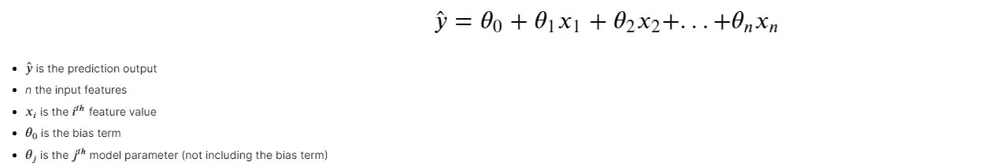
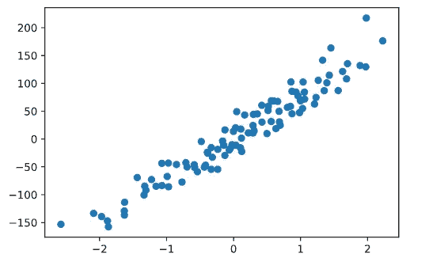
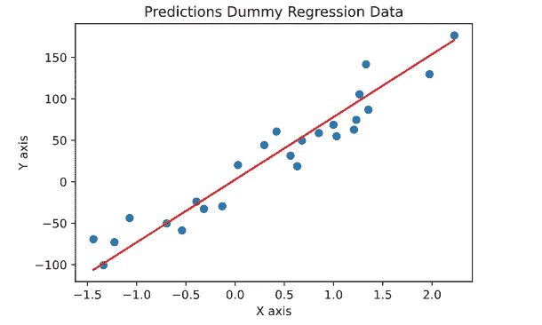

# 从头开始的算法:线性回归

> 原文：<https://towardsdatascience.com/algorithms-from-scratch-linear-regression-c654353d1e7c?source=collection_archive---------27----------------------->

## [从零开始的算法](https://towardsdatascience.com/tagged/algorithms-from-scratch)

## 从头开始详述和构建线性回归模型


由[艾萨克·史密斯](https://unsplash.com/@isaacmsmith?utm_source=medium&utm_medium=referral)在 [Unsplash](https://unsplash.com?utm_source=medium&utm_medium=referral) 上拍摄的照片

[线性回归](https://en.wikipedia.org/wiki/Linear_regression#:~:text=In%20statistics%2C%20linear%20regression%20is,is%20called%20simple%20linear%20regression.)是一种流行的线性机器学习算法，用于基于回归的问题。由于它的简单性以及它如何构建到逻辑回归和神经网络等其他算法中，它通常是第一次学习机器学习时学习的第一批算法之一。在这个故事中，我们将从头开始实现它，这样我们就可以对线性回归模型中发生的事情建立直觉。

链接到 Github Repo…

 [## kurtispykes/ml-从零开始

### permalink dissolve GitHub 是超过 5000 万开发人员的家园，他们一起工作来托管和审查代码，管理…

github.com](https://github.com/kurtispykes/ml-from-scratch/blob/master/linear_regression.ipynb) 

> 注意:许多框架都有高度优化的代码，如 Scikit-Learn、Tensorflow 和 PyTorch，因此通常没有必要从头构建自己的算法。然而，当我们从零开始构建模型时，它为我们对模型中正在发生的事情的直觉提供了一个很好的目的，这有助于我们尝试改进我们的模型性能。

线性模型是一种算法，它通过简单地计算输入要素加上偏差项(也称为截距项)的加权和来进行预测。考虑到这一点，当我们使用线性回归模型时，我们希望解释因变量(即房价)和一个或多个自变量(即位置、卧室、面积等)之间的关系。



图 1:多元线性回归

当我们训练一个模型时，我们试图设置参数以得到一条最适合训练数据的线。因此，当我们训练线性回归模型时，我们试图找到最能最小化[成本函数](https://en.wikipedia.org/wiki/Loss_function)的θ值。回归模型最常见的成本函数是 [RMSE](https://en.wikipedia.org/wiki/Root-mean-square_deviation) ，然而，最小化 [MSE](https://en.wikipedia.org/wiki/Mean_squared_error) 要容易得多，因为它会导致相同的结果。

## 创建模型

如果你从未从头开始编写过机器学习算法，我非常鼓励你这样做。[约翰·苏利文](https://medium.com/u/c831f584bf94?source=post_page-----c654353d1e7c--------------------------------)写了一个非常有用的故事，名为 [*从零开始编写任何机器学习算法的 6 个步骤:感知机案例研究*](/6-steps-to-write-any-machine-learning-algorithm-from-scratch-perceptron-case-study-335f638a70f3) *w* 这是我在互联网上找到的关于从零开始编写算法的最好建议。

**分块算法**

1.  随机初始化假设函数的参数
2.  计算偏导数(点击阅读更多关于这个[的信息)](https://math.stackexchange.com/questions/3152235/partial-derivative-of-mse-cost-function-in-linear-regression)
3.  更新参数
4.  重复 2-3，重复 *n* 次迭代(直到成本函数最小化)
5.  推理

**实施**

对于本节，我将利用 3 个 Python 包。NumPy 用于线性代数，Scikit-Learn 是一个流行的机器学习框架，Matplotlib 用于可视化我们的数据。

```
**import** **numpy** **as** **np** 
**import** **matplotlib.pyplot** **as** **plt** 
**from** **sklearn.datasets** **import** make_regression 
**from** **sklearn.linear_model** **import** LinearRegression 
**from** **sklearn.model_selection** **import** train_test_split 
**from** **sklearn.metrics** **import** mean_squared_error
```

首先，我们需要一个数据集。为此，我将`sklearn.datasets.make_regression`允许您生成一个随机回归问题—参见[文档](https://scikit-learn.org/stable/modules/generated/sklearn.datasets.make_regression.html)。接下来，我将用`sklearn.model_selection.train_test_split` — [文档](https://scikit-learn.org/stable/modules/generated/sklearn.model_selection.train_test_split.html)将我的数据分成训练集和测试集。

```
# creating the data set
X, y = make_regression(n_samples=100, n_features=1, n_targets=1, noise=20, random_state=24)

# splitting training and test
X_train, X_test, y_train, y_test = train_test_split(X, y, train_size=0.75, random_state=24)
```

让我们用`matplotlib.pyplot`来看看我们的数据是什么样子的— [文档](https://matplotlib.org/tutorials/introductory/pyplot.html)。

```
*# visualize* 
plt.scatter(X, y)
plt.show()
```



图 2:我们生成的回归问题

现在我们可以开始实施线性回归了。我们程序块的第一步是为我们的假设函数随机初始化参数。

```
**def** param_init(X): 
    *"""*
 *Initialize parameters for linear regression model*
 *__________________* 
 *Input(s)*
 *X: Training data*
 *__________________*
 *Output(s)*
 *params: Dictionary containing coefficients*
 *"""*
    params = {} *# initialize dictionary* 
    _, n_features = X.shape *# shape of training data*

    *# initializing coefficents to 0* 
    params["W"] = np.zeros(n_features)
    params["b"] = 0
    **return** params
```

非常好。接下来我们要计算偏导数并更新我们的参数。我们使用一种非常重要的叫做[梯度下降](https://en.wikipedia.org/wiki/Gradient_descent)的机器学习算法来做到这一点。因此，我们可以用梯度下降实现步骤 2-4。

```
**def** gradient_descent(X, y, params, alpha, n_iter): 
    *"""*
 *Gradient descent to minimize cost function*
 *__________________* 
 *Input(s)*
 *X: Training data*
 *y: Labels*
 *params: Dictionary contatining random coefficients*
 *alpha: Model learning rate*
 *__________________*
 *Output(s)*
 *params: Dictionary containing optimized coefficients*
 *"""*
    W = params["W"] 
    b = params["b"]
    m = X.shape[0] *# number of training instances* 

    **for** _ **in** range(n_iter): 
        *# prediction with random weights*
        y_pred = np.dot(X, W) + b
        *# taking the partial derivative of coefficients*
        dW = (2/m) * np.dot(X.T, (y_pred - y)) 
        db = (2/m) * np.sum(y_pred -  y)
        *# updates to coefficients*
        W -= alpha * dW
        b -= alpha * db 

    params["W"] = W
    params["b"] = b
    **return** params
```

使用这些函数，我们可以根据训练数据训练我们的线性回归模型，以获得我们进行推理所需的模型参数。

```
**def** train(X, y, alpha=0.01, n_iter=1000):
    *"""*
 *Train Linear Regression model with Gradient decent*
 *__________________* 
 *Input(s)*
 *X: Training data*
 *y: Labels*
 *alpha: Model learning rate*
 *n_iter: Number of iterations* 
 *__________________*
 *Output(s)*
 *params: Dictionary containing optimized coefficients*
 *"""* 
    init_params = param_init(X)
    params = gradient_descent(X, y, init_params, alpha, n_iter)
    **return** params
```

现在，当我们运行这个函数时，我们将从我们的训练数据中获得优化的权重，我们将使用这些权重对我们的测试数据进行推断。接下来，我们需要使用我们存储的权重为我们的推断创建一个预测函数。

```
**def** predict(X_test, params):
    *"""*
 *Train Linear Regression model with Gradient decent*
 *__________________* 
 *Input(s)*
 *X: Unseen data*
 *params: Dictionary contianing optimized weights from training*
 *__________________*
 *Output(s)*
 *y_preds: Predictions of model*
 *"""*  
    y_preds = np.dot(X_test, params["W"]) + params["b"]
    **return** y_preds
```

太好了！让我们运行这些函数并绘制它们，看看会发生什么…

```
params = train(X_train, y_train) *# train model*
y_preds = predict(X_test, params) *# inference*plt.scatter(X_test, y_test)
plt.plot(X_test, y_preds, color="red")
plt.title("Predictions Dummy Regression Data")
plt.xlabel("X axis")
plt.ylabel("Y axis")

plt.show()
```



图 3:来自自定义线性回归模型的预测。

我们的最佳系列似乎相当不错。为了完全确定我们的实现，我们很幸运有许多机器学习库，带有优化的代码，可以用来比较我们的实现。为了进行比较，我将简单地检查我们的实现与 Scikit-learn 的 [RMSE](https://en.wikipedia.org/wiki/Root-mean-square_deviation) 。

> 注意:在同一个图上绘制它们的实现也是值得的，如果它们的最佳拟合线覆盖了你的，那么你就在正确的轨道上。

```
lin_reg = LinearRegression()
lin_reg.fit(X_train, y_train)
sklearn_y_preds = lin_reg.predict(X_test)print(f"My implementation: {np.sqrt(mean_squared_error(y_test, y_preds))}**\n**Sklearn implementation: {np.sqrt(mean_squared_error(y_test, sklearn_y_preds))}")>>>> My implementation: 20.986105292320207
Sklearn implementation: 20.986105292320207
```

匹配了！

对于这种实现，我们使用了过程化编程，这种编程维护起来会变得非常复杂和麻烦，并且没有最大限度地发挥 Python 的潜力，Python 是一种[面向对象编程(OOP)](https://en.wikipedia.org/wiki/Object-oriented_programming) 语言。关于这一点，这里是我们的线性回归模型的 OOP 实现。

```
**class** **LinReg**(): 
    *"""*
 *Custom made Linear Regression class*
 *"""*
    **def** __init__(self, alpha=0.01, n_iter= 1000): 
        self.alpha = alpha
        self.n_iter = n_iter 
        self.params = {}

    **def** param_init(self, X_train): 
        *"""*
 *Initialize parameters for linear regression model*
 *__________________* 
 *Input(s)*
 *X: Training data*
 *"""*
        _, n_features = self.X.shape *# shape of training data*

        *# initializing coefficents to 0* 
        self.params["W"] = np.zeros(n_features)
        self.params["b"] = 0
        **return** self

    **def** gradient_descent(self, X_train, y_train): 
        *"""*
 *Gradient descent to minimize cost function*
 *__________________* 
 *Input(s)*
 *X: Training data*
 *y: Labels*
 *params: Dictionary contatining random coefficients*
 *alpha: Model learning rate*
 *__________________*
 *Output(s)*
 *params: Dictionary containing optimized coefficients*
 *"""*
        W = self.params["W"] 
        b = self.params["b"] 
        m = X_train.shape[0]

        **for** _ **in** range(self.n_iter): 
            *# prediction with random weights*
            y_pred = np.dot(X_train, W) + b
            *# taking the partial derivative of coefficients*
            dW = (2/m) * np.dot(X_train.T, (y_pred - y_train)) 
            db = (2/m) * np.sum(y_pred -  y_train)
            *# updates to coefficients*
            W -= self.alpha * dW
            b -= self.alpha * db 

        self.params["W"] = W
        self.params["b"] = b
        **return** self

    **def** train(self, X_train, y_train):
        *"""*
 *Train Linear Regression model with Gradient decent*
 *__________________* 
 *Input(s)*
 *X: Training data*
 *y: Labels*
 *alpha: Model learning rate*
 *n_iter: Number of iterations* 
 *__________________*
 *Output(s)*
 *params: Dictionary containing optimized coefficients*
 *"""* 
        self.params = param_init(X_train)
        gradient_descent(X_train, y_train, self.params , self.alpha, self.n_iter)
        **return** self 

    **def** predict(self, X_test):
        *"""*
 *Train Linear Regression model with Gradient decent*
 *__________________* 
 *Input(s)*
 *X: Unseen data*
 *params: Dictionary contianing optimized weights from training*
 *__________________*
 *Output(s)*
 *y_preds: Predictions of model*
 *"""*  
        y_preds = np.dot(X_test, self.params["W"]) + self.params["b"]
        **return** y_preds
```

让我们调用这个类，让它对我们的测试数据进行预测…

```
linreg = LinReg()
linreg.train(X_train, y_train)
linreg.predict(X_test)>>>> 
array([   4.73888182,  -90.06369632,   80.39799712,   66.76983607,
        -49.97207144,   93.77905208,   34.30778991,  -38.2209702 ,
         78.03331698,   53.81416352,  102.96993005,  151.71946744,
         95.52801857,  104.82707085,   98.0492089 ,   45.05150211,
         -7.29917923,  -78.41675446,  -27.14118529,  -98.52923336,
        170.75840972, -106.22126739,   24.86194847,  -21.39127805,
         50.24074837])
```

作为健全性检查，我们将测试预测是否与我们的过程实现相同(因为我们知道这已经与 scikit-learn 实现类似)。

```
linreg.predict(X_test) == y_preds>>>> 
array([ True,  True,  True,  True,  True,  True,  True,  True,  True,
        True,  True,  True,  True,  True,  True,  True,  True,  True,
        True,  True,  True,  True,  True,  True,  True])
```

现在你知道了！

> 注意:我们作为例子的问题是简单线性回归问题(一元线性回归)，y = WX + b，其中 W 是权重，b 是偏倚。

## 假设

在决定我们要使用线性回归之前，了解模型对我们的数据所做的假设是很重要的，这样我们就可以执行必要的特征工程来与我们的模型保持一致。

关于特征工程的更多信息，请参阅我以前关于这个主题的文章…

[](/feature-engineering-for-numerical-data-e20167ec18) [## 数字数据的特征工程

### 工程数值的技巧

towardsdatascience.com](/feature-engineering-for-numerical-data-e20167ec18) 

[**线性**](https://en.wikipedia.org/wiki/Linearity) —线性回归假设特征和我们想要预测的目标之间存在线性关系。我们可以通过绘制与目标变量相关的特征散点图来检查这一点的有效性。

[**多重共线性**](https://en.wikipedia.org/wiki/Multicollinearity#:~:text=Multicollinearity%20refers%20to%20a%20situation,equal%20to%201%20or%20%E2%88%921.)——指多元回归模型中两个或两个以上解释变量高度相关的情况(来源:维基百科)。当我们实施线性回归时，我们假设很少或没有多重共线性，因为多重共线性的存在会削弱回归模型的统计能力。要确定数据中是否存在多重共线性，我们可以使用相关矩阵来查看哪些要素高度相关，并移除其中一个高度相关的要素。

[**同方差**](https://en.wikipedia.org/wiki/Homoscedasticity) —在统计学中，一个随机变量序列(或向量)如果其所有随机变量都具有相同的有限方差，则该序列(或向量)是同方差的(来源:维基百科)。线性回归假设所有观测值中的噪声是相同的(也可称为误差项或随机扰动),并且不依赖于独立变量的值。我们可以用残差值与预测值的散点图来检验同方差性。我们应该期望分布中没有模式，因为如果有模式，那么数据就是异方差的。

**误差分布的正态性** —数据点正态分布在回归线周围。换句话说，我们假设残差遵循[正态分布](https://en.wikipedia.org/wiki/Normal_distribution)。我们可以使用直方图或 QQ 图来检查这一点——我们可以使用[广义线性模型(GLM)](https://en.wikipedia.org/wiki/Generalized_linear_model) 来克服这一点。

[**自相关**](https://en.wikipedia.org/wiki/Autocorrelation#:~:text=Autocorrelation%2C%20also%20known%20as%20serial,the%20time%20lag%20between%20them.)——信号与自身延迟副本的相关性，作为延迟的函数——通俗地说，就是观测值之间的相似性，作为它们之间时滞的函数(来源:维基百科)。简而言之，当残差彼此不独立时，就会出现自相关。我们可以使用散点图来直观地检查自相关性，或者使用 Durbin-Watsons 检验来测试残差不是线性自相关的零假设。

## 赞成的意见

*   易于实施
*   易于解释输出系数
*   不太复杂

## 骗局

*   对异常值敏感
*   假设自变量和因变量之间呈线性关系
*   假设特征之间相互独立

关于线性回归的更多信息，你可以阅读维基百科页面。

[](https://en.wikipedia.org/wiki/Linear_regression#:~:text=In%20statistics%2C%20linear%20regression%20is,is%20called%20simple%20linear%20regression.) [## 线性回归

### 在统计学中，线性回归是一种建模标量响应(或变量)之间关系的线性方法

en.wikipedia.org](https://en.wikipedia.org/wiki/Linear_regression#:~:text=In%20statistics%2C%20linear%20regression%20is,is%20called%20simple%20linear%20regression.) 

## 包裹

线性回归是最简单的机器学习模型之一，也最有可能是你将要学习或者应该学习的第一个模型。它是一个非常有用的分析变量之间关系的工具，但是由于模型的假设很多，现实问题的简化，所以在大多数实际应用中不推荐使用。

感谢您花时间阅读这个故事。如果我错过了什么或者你想让我澄清什么，请在评论中回复。另外，如果你想和我联系，我在 LinkedIn 上是最容易联系到的。

[](https://www.linkedin.com/in/kurtispykes/) [## Kurtis Pykes -人工智能作家-走向数据科学| LinkedIn

### 在世界上最大的职业社区 LinkedIn 上查看 Kurtis Pykes 的个人资料。Kurtis 有一个工作列在他们的…

www.linkedin.com](https://www.linkedin.com/in/kurtispykes/)