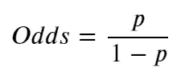
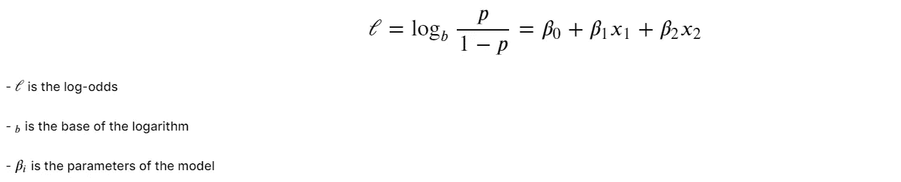
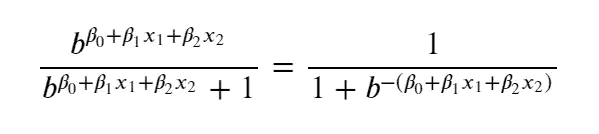
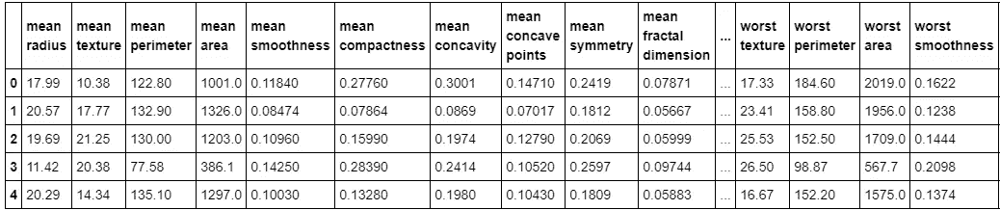

# 从零开始的算法:逻辑回归

> 原文：<https://towardsdatascience.com/algorithms-from-scratch-logistic-regression-7bacdfd9738e?source=collection_archive---------29----------------------->

## [从零开始的算法](https://towardsdatascience.com/tagged/algorithms-from-scratch)

## 从头开始详述和构建逻辑回归模型


由[马尔辛·乔兹维亚克](https://unsplash.com/@marcinjozwiak?utm_source=medium&utm_medium=referral)在 [Unsplash](https://unsplash.com?utm_source=medium&utm_medium=referral) 上拍摄的照片

与普遍的看法相反，我在此声明，逻辑回归是**而不是**一种分类算法(*本身是* ) —事实上，逻辑回归实际上是一种回归模型，所以不要对其命名中出现“*回归*”感到惊讶。回归分析是一套统计过程，用于估计因变量与一个或多个自变量之间的关系(来源:[维基百科](https://en.wikipedia.org/wiki/Regression_analysis))。如上所述，逻辑回归不是一种分类算法，它不执行统计分类，因为它只是估计逻辑模型的参数。

> 逻辑回归是一种统计模型，其最基本的形式是使用逻辑函数来模拟二元因变量，尽管存在许多更复杂的扩展。(来源:[维基百科](https://en.wikipedia.org/wiki/Logistic_regression))

允许将逻辑回归用作分类算法的是使用*阈值*(也可称为截止或决策边界)，这反过来会将概率大于阈值的输入分类为一个类别，而将概率低于阈值的输入分类为另一个类别，正如我们在机器学习中通常所做的那样。

***参见*** [***这一环节***](https://en.wikipedia.org/wiki/Multiclass_classification#:~:text=%2Drest-,One%2Dvs.,all%20other%20samples%20as%20negatives.) ***来看我们如何处理多类分类问题。***

现在，让我们把注意力从零开始回到[算法](https://towardsdatascience.com/tagged/algorithms-from-scratch)系列的目的。

链接到 Github 存储库…

[](https://github.com/kurtispykes/ml-from-scratch/blob/master/logistic_regression.ipynb) [## kurtispykes/ml-从零开始

### permalink dissolve GitHub 是超过 5000 万开发人员的家园，他们一起工作来托管和审查代码，管理…

github.com](https://github.com/kurtispykes/ml-from-scratch/blob/master/logistic_regression.ipynb) 

> ***注*** *:有很多机器学习框架的代码经过高度优化，这使得从头开始编写机器学习算法在实际设置中成为一项多余的任务。然而，当我们从零开始构建算法时，它有助于我们对模型中正在发生的事情获得更深入的直觉，这可能会在尝试改进我们的模型时带来高回报。*

## 二元分类的线性回归

在《从零开始的算法:线性回归》的最后一集里，我说“*它通常是第一次学习机器学习时学习的第一批算法之一，因为它很简单，而且它如何构建到其他算法里，如逻辑回归和神经网络*”——你现在会明白我的意思了。

**我们如何从预测连续变量到伯努利变量(即“成功”或“失败”)？**由于响应数据(我们试图预测的数据)是二元的(取值 0 和 1)，因此仅由 2 个值组成，我们可以假设我们的响应变量的分布现在来自[二项式分布](https://en.wikipedia.org/wiki/Binomial_distribution)——这需要一个完美的时间来引入由约翰·内尔德和罗伯特·威德伯恩制定的广义线性模型(GLM)。

GLM 模型允许响应变量具有不同于正态分布的误差分布。在我们的情况下，我们现在有一个二项分布，通过使用 GLM 模型，我们可以通过链接函数将线性模型与响应变量相关联，并允许每个测量的方差大小是其预测值的函数，从而推广线性回归(来源:[维基百科](https://en.wikipedia.org/wiki/Generalized_linear_model))。

> 长话短说，逻辑回归是具有二项式条件响应和 logit 链接的 GLM 的特例。

**停止…**

在继续之前，我们应该弄清楚一些统计术语(用外行人的术语来说):

*   **几率**——某事发生与某事未发生的比率。例如，切尔西赢得接下来 4 场比赛的赔率是 1 比 3。发生的事情(切尔西赢得比赛)1 与没有发生的事情(切尔西没有赢得比赛)3 的比值可以写成一个分数，1/3。
*   概率——发生的事情与可能发生的事情的比率。使用上面的例子，正在发生的事情(切尔西获胜)1 与所有可能发生的事情(切尔西获胜和失败)4 的比率也可以写成分数 1/4，这是获胜的概率——因此失败的概率是 1–1/4 = 3/4。

概率的范围在 0 和 1 之间，而赔率并不局限于 0 和 1 之间，而是可以取 0 到无穷大之间的任何值。

我们可以通过将获胜概率的比率(用我们的例子来说是 1/4)除以失败概率的比率(3/4)来得到概率的赔率，从而得到 1/3，即赔率。参见*图 1* 了解我们如何用数学方法表达它。



图 1:从概率中得出的赔率。

如果切尔西是一支糟糕的足球队(难以想象，我知道)，他们获胜的几率会在 0 到 1 之间。然而，由于我们都知道切尔西是世界上最伟大的球队之一(毫无疑问是伦敦最好的球队)，因此，切尔西获胜的几率将在 1 到无穷大之间。不对称使得很难比较支持或反对切尔西获胜的几率，所以我们采用几率的对数来使一切对称。

*图 1* 向我们展示了我们可以用概率计算赔率，既然如此，我们也可以使用*图 1* 中的公式计算赔率的对数。概率比的对数被称为 logit 函数，它构成了逻辑回归的基础。让我们通过考虑具有给定参数的逻辑模型来更好地理解这一点，并看看如何从数据中估计系数。

***注:下面这个例子来源于逻辑回归的例子部分*** [***维基百科***](https://en.wikipedia.org/wiki/Logistic_regression#Logistic_model) ***。***

考虑一个有两个独立变量( **X** 1 和 **X** 2)和一个伯努利响应变量 **Y** 的模型，我们用 p = **P** (Y=1)表示。我们假设独立变量和 Y=1 事件的对数概率之间存在线性关系，可以用数学方法表示为:



图 2:独立变量与 Y=1 事件的对数比数之间的线性关系表达式。

通过对对数赔率求幂，我们恢复赔率如下:


图 3:对对数赔率求幂以恢复赔率。

通过简单的代数运算，Y=1 的概率为:



图 4:代数操作

考虑到这一点，*图 4* 向我们展示了，如果我们有线性模型的参数，我们可以很容易地计算给定观察值的对数优势或 Y= 0 的概率。逻辑回归仍然是一个回归模型，没有与使反应的预测概率二分法的阈值结合使用。

## 分块算法

1.  随机初始化假设函数的参数
2.  将逻辑函数应用于线性假设函数
3.  计算偏导数( [Saket Thavanani](https://medium.com/u/102f526f83de?source=post_page-----7bacdfd9738e--------------------------------) 写了一篇很好的文章，题目是 [*逻辑回归成本函数的导数*](https://medium.com/analytics-vidhya/derivative-of-log-loss-function-for-logistic-regression-9b832f025c2d) )
4.  更新参数
5.  重复 2-4，重复 *n* 次迭代(直到成本函数最小化)
6.  推理

**实现**

在本节中，我使用了 3 个 Python 框架:NumPy 用于线性代数，Pandas 用于数据操作，Scikit-Learn 用于机器学习工具。

```
**import** **numpy** **as** **np** 
**import** **pandas** **as** **pd** 
**from** **sklearn.metrics** **import** accuracy_score
**from** **sklearn.datasets** **import** load_breast_cancer
**from** **sklearn.linear_model** **import** LogisticRegression 
**from** **sklearn.model_selection** **import** train_test_split
```

首先，我们需要一个数据集。我使用的是经典的二元分类数据集`sklearn.datasets.load_breast_cancer`——参见[文档](https://scikit-learn.org/stable/modules/generated/sklearn.datasets.load_breast_cancer.html)。

```
*# loading the data set*
dataset = load_breast_cancer(as_frame=**True**)
df= pd.DataFrame(data= dataset.data)
df["target"] = dataset.target

df.head()
```



图 5:上面代码单元的输出。**注意:数据帧有 31 列，太大而无法显示，因此出现省略号(仍有一些列看不到)。**

接下来，我们将预测变量和响应变量分开，然后创建一个训练和测试集。

```
*# Seperating to X and Y* 
X = df.iloc[:, :-1]
y = df.iloc[:, -1]

*# splitting training and test*
X_train, X_test, y_train, y_test = train_test_split(X, y, train_size=0.75, shuffle=**True**, random_state=24)
```

我们从头开始构建线性回归所做的大量工作(见下面的链接)可以借用一些微小的变化来使用逻辑回归调整我们的分类模型。

[](/algorithms-from-scratch-linear-regression-c654353d1e7c) [## 从头开始的算法:线性回归

### 从头开始详述和构建线性回归模型

towardsdatascience.com](/algorithms-from-scratch-linear-regression-c654353d1e7c) 

```
**def** param_init(X): 
    *"""*
 *Initialize parameters*
 *__________________* 
 *Input(s)*
 *X: Training data*
 *__________________*
 *Output(s)*
 *params: Dictionary containing coefficients*
 *"""*
    params = {} *# initialize dictionary* 
    _, n_features = X.shape *# shape of training data*

    *# initializing coefficents to 0* 
    params["W"] = np.zeros(n_features)
    params["b"] = 0
    **return** params**def** get_z(X, W, b): 
    *"""*
 *Calculates Linear Function*
 *__________________*
 *Input(s)*
 *X: Training data*
 *W: Weight coefficients*
 *b: bias coefficients*
 *__________________*
 *Output(s)*
 *z: a Linear function*
 *"""*
    z = np.dot(X, W) + b
    **return** z**def** sigmoid(z):
    *"""*
 *Logit model*
 *_________________*
 *Input(s)*
 *z: Linear model* 
 *_________________*
 *Output(s)*
 *g: Logit function applied to linear model*
 *"""*
    g = 1 / (1 + np.exp(-z))
    **return** g**def** gradient_descent(X, y, params, lr, n_iter): 
    *"""*
 *Gradient descent to minimize cost function*
 *__________________* 
 *Input(s)*
 *X: Training data*
 *y: Labels*
 *params: Dictionary contatining coefficients*
 *lr: learning rate*
 *__________________*
 *Output(s)*
 *params: Dictionary containing optimized coefficients*
 *"""*
    W = params["W"] 
    b = params["b"]
    m = X.shape[0] *# number of training instances* 

    **for** _ **in** range(n_iter): 
        *# prediction with random weights*
        g = sigmoid(get_z(X, W, b))
        *# calculate the loss*
        loss = -1/m * np.sum(y * np.log(g)) + (1 - y) * np.log(1-g)
        *# partial derivative of weights* 
        dW = 1/m * np.dot(X.T, (g - y))
        db = 1/m * np.sum(g - y)
        *# updates to coefficients*
        W -= lr * dW
        b -= lr * db 

    params["W"] = W
    params["b"] = b
    **return** params**def** train(X, y, lr=0.01, n_iter=1000):
    *"""*
 *Train Linear Regression model with Gradient decent*
 *__________________* 
 *Input(s)*
 *X: Training data*
 *y: Labels*
 *lr: learning rate*
 *n_iter: Number of iterations* 
 *__________________*
 *Output(s)*
 *params: Dictionary containing optimized coefficients*
 *"""* 
    init_params = param_init(X)
    params = gradient_descent(X, y, init_params, lr, n_iter)
    **return** params**def** predict(X_test, params):
    *"""*
 *Train Linear Regression model with Gradient decent*
 *__________________* 
 *Input(s)*
 *X: Unseen data*
 *params: Dictionary contianing optimized weights from training*
 *__________________*
 *Output(s)*
 *prediction of model*
 *"""*  
    z = np.dot(X_test, params["W"]) + params["b"]
    y_pred = sigmoid(z) >= 0.5
    **return** y_pred.astype("int")
```

值得注意的区别是，我们现在将 logit 函数应用于我们的线性模型，根据推断，我们将 logit 模型中大于 0.5 的每个输出都分类为第一类(否则为第 0 类)，并且我们使用不同的成本函数来工作于我们的分类模型，因为 MSE 会使我们的损失函数为非凸的-要了解更多关于所使用的成本函数的信息，您一定要阅读 [*逻辑回归的成本函数的导数*](https://medium.com/analytics-vidhya/derivative-of-log-loss-function-for-logistic-regression-9b832f025c2d) *。*

```
params = train(X_train, y_train) *# train model*
y_pred = predict(X_test, params) *# inference*lr = LogisticRegression(C=0.01)
lr.fit(X_train, y_train)
sklearn_y_pred = lr.predict(X_test)print(f"My Implementation: {accuracy_score(y_test, y_pred)}**\n**Sklearn Implementation: {accuracy_score(y_test, sklearn_y_pred)}")>>>> My Implementation: 0.9300699300699301
Sklearn Implementation: 0.9300699300699301
```

很好，我们获得了与 Scikit-Learn 实现相同的精度。

现在，我们将用面向对象编程来重复这一点，面向对象编程被认为更适合协作。

```
**class** **LogReg**(): 
    *"""*
 *Custom made Logistic Regression class*
 *"""*
    **def** __init__(self, lr=0.01, n_iter= 1000): 
        self.lr = lr
        self.n_iter = n_iter 
        self.params = {}

    **def** param_init(self, X_train): 
        *"""*
 *Initialize parameters* 
 *__________________* 
 *Input(s)*
 *X: Training data*
 *"""*
        _, n_features = self.X.shape *# shape of training data*

        *# initializing coefficents to 0* 
        self.params["W"] = np.zeros(n_features)
        self.params["b"] = 0
        **return** self

    **def** get_z(X, W, b): 
        *"""*
 *Calculates Linear Function*
 *__________________*
 *Input(s)*
 *X: Training data*
 *W: Weight coefficients*
 *b: bias coefficients*
 *__________________*
 *Output(s)*
 *z: a Linear function*
 *"""*
        z = np.dot(X, W) + b
        **return** z

    **def** sigmoid(z):
        *"""*
 *Logit model*
 *_________________*
 *Input(s)*
 *z: Linear model* 
 *_________________*
 *Output(s)*
 *g: Logit function applied to linear model*
 *"""*
        g = 1 / (1 + np.exp(-z))
        **return** g 

    **def** gradient_descent(self, X_train, y_train): 
        *"""*
 *Gradient descent to minimize cost function*
 *__________________* 
 *Input(s)*
 *X: Training data*
 *y: Labels*
 *params: Dictionary contatining random coefficients*
 *alpha: Model learning rate*
 *__________________*
 *Output(s)*
 *params: Dictionary containing optimized coefficients*
 *"""*
        W = self.params["W"] 
        b = self.params["b"] 
        m = X_train.shape[0]

        **for** _ **in** range(self.n_iter): 
            *# prediction with random weights*
            g = sigmoid(get_z(X, W, b))
            *# calculate the loss*
            loss = -1/m * np.sum(y * np.log(g)) + (1 - y) * np.log(1 - g)
            *# partial derivative of weights* 
            dW = 1/m * np.dot(X.T, (g - y))
            db = 1/m * np.sum(g - y)
            *# updates to coefficients*
            W -= self.lr * dW
            b -= self.lr * db 

        self.params["W"] = W
        self.params["b"] = b
        **return** self

    **def** train(self, X_train, y_train):
        *"""*
 *Train model with Gradient decent*
 *__________________* 
 *Input(s)*
 *X: Training data*
 *y: Labels*
 *alpha: Model learning rate*
 *n_iter: Number of iterations* 
 *__________________*
 *Output(s)*
 *params: Dictionary containing optimized coefficients*
 *"""* 
        self.params = param_init(X_train)
        gradient_descent(X_train, y_train, self.params , self.lr, self.n_iter)
        **return** self 

    **def** predict(self, X_test):
        *"""*
 *Inference* 
 *__________________* 
 *Input(s)*
 *X: Unseen data*
 *params: Dictionary contianing optimized weights from training*
 *__________________*
 *Output(s)*
 *y_preds: Predictions of model*
 *"""*  
        g = sigmoid(np.dot(X_test, self.params["W"]) + self.params["b"])
        **return** g
```

为了检查我们是否正确地实现了它，我们可以看看预测是否与我们的过程实现相同，因为我们已经知道这大约等于 Scikit-learn 的实现。

```
logreg = LogReg()
logreg.train(X_train, y_train)
oop_y_pred = logreg.predict(X_test)oop_y_pred == y_preds
```

这将返回一个对每个值都为真的数组。

## 假设

*   **二进制或序数** —响应变量在二进制逻辑回归中要求为二进制，在序数逻辑回归中要求为序数
*   **独立性** —要求观测值相互独立
*   **多重共线性**-预测变量之间很少或没有多重共线性。
*   **线性** —自变量和对数优势的线性

## 赞成的意见

*   低方差
*   提供概率
*   易于实施

## 骗局

*   高偏差

## 包裹

在大多数在线课程中，逻辑回归往往是在线性回归之后教授的内容。虽然通常逻辑回归用于不同领域的回归，但通过将其与阈值相结合，我们能够将其用作非常有用、易于实现的分类器，这证明是在处理分类问题时实现的良好的第一模型。

感谢您花时间阅读这个故事。如果有什么我错过了，说错了，或者你想让我澄清的，请在评论中留下你的回复。另外，如果你想和我联系，我在 LinkedIn 上是最容易联系到的。

[](https://www.linkedin.com/in/kurtispykes/) [## Kurtis Pykes -人工智能作家-走向数据科学| LinkedIn

### 在世界上最大的职业社区 LinkedIn 上查看 Kurtis Pykes 的个人资料。Kurtis 有一个工作列在他们的…

www.linkedin.com](https://www.linkedin.com/in/kurtispykes/) 

您可以从这里访问从头开始系列的完整算法:

[](https://towardsdatascience.com/tagged/algorithms-from-scratch) [## 从零开始的算法——走向数据科学

### 阅读《走向数据科学》中关于算法的文章。分享概念、想法和…

towardsdatascience.com](https://towardsdatascience.com/tagged/algorithms-from-scratch)