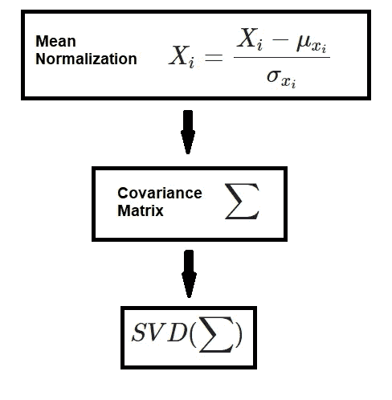
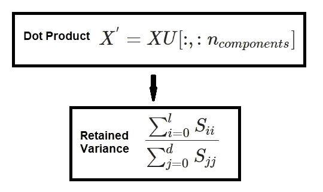

# 从零开始的算法:PCA

> 原文：<https://towardsdatascience.com/algorithms-from-scratch-pca-cde10b835ebc?source=collection_archive---------28----------------------->

## [从零开始的算法](https://towardsdatascience.com/tagged/algorithms-from-scratch)

## 从头开始详述和构建 PCA 算法

**图一** : PCA(来源:[深度学习。AI Twitter](https://twitter.com/DeepLearningAI_/status/1254832685954011139) ) —原创者；劳纳克·乔希

## 介绍

主成分分析(PCA)是卡尔·皮尔逊在 1901 年发明的一种技术，通常用于降低数据的维度，以进行探索性数据分析，也用于构建预测模型时的特征选择——下面将详细介绍特征选择和数据可视化。

 [## 特征选择入门

### 选择有用功能的初学者指南

towardsdatascience.com](/getting-started-with-feature-selection-3ecfb4957fd4)  [## 有效的数据可视化

### 构建有效的数据可视化的技巧可以简化为 3 个简单的步骤

towardsdatascience.com](/effective-data-visualization-ef30ae560961) 

通常，当我们谈到 PCA 时，我们指的是计算主成分，然后使用这些主成分对数据进行基变换的过程。用人类的话来说，我们会说 PCA 允许我们降低数据的维数。

更多从零开始的算法，可以访问“ [*从零开始的算法系列*](https://towardsdatascience.com/tagged/algorithms-from-scratch) ”。

 [## 走向数据科学

### 共享概念、想法和代码的媒体出版物。

towardsdatascience.com](https://towardsdatascience.com) 

## 创建模型

正如我们之前提到的，PCA 通常用于降维。这是通过将每个数据点投影到前几个分量来实现的，这样我们最终得到的是低维数据，但保留了尽可能多的数据方差。

关于这一点，需要知道两件事:

> **注**:以下列表摘自维基百科(**来源** : [维基百科](https://en.wikipedia.org/wiki/Principal_component_analysis))

1.  第一主分量可以等效地定义为使投影数据的方差最大化的方向
2.  `i^th`主分量可以取为与第一个`i - 1`主分量正交的方向，其最大化投影数据的方差。

但是主要成分是什么呢？很棒的问题！主成分是数据协方差矩阵的特征向量。因此，我们不必深入研究数学元素，观看接下来的两个视频可以更好地理解特征向量、特征值和协方差矩阵。

**特征向量** →(线性变换的)是一个非零向量，当对其应用线性变换时，它会改变一个标量因子。

**特征值** →特征向量缩放的因子

**协方差矩阵** →协方差矩阵是一个方阵，给出给定随机向量的每对元素之间的协方差。任何协方差矩阵都是对称正半定的，其主对角线包含方差(即每个元素与其自身的协方差)(**来源** : [维基百科](https://en.wikipedia.org/wiki/Covariance_matrix))。

为了执行 PCA，我们应该从数据的协方差矩阵中获得特征向量和特征值。为了做到这一点，我们的意思是标准化我们的数据，然后获得协方差矩阵，最后执行奇异值分解(SVD)。

**图 2** :获取一组不相关的特征(图片由作者提供)

接下来，我们必须使用从上一步任务中检索到的特征向量和特征值，将我们的数据投影到一组新的特征。为此，我们取我们的特征和我们的特征向量的前 **n** 列的点积。如果我们想把数据的维数减少到 2 维，我们将使用特征向量的前两列。

**图 3** :将特征数据投影到一组新的特征。 **U** 表示特征向量，S 表示特征值(图片由作者提供)

我们现在准备实现 PCA，我们将使用它来可视化虹膜数据集。

**分块算法**

1.  获取一组不相关的特征
2.  将数据投影到新要素

**实施**

让我们从使用`sklearn`框架对 iris 数据集执行 PCA 开始…

**图 4** : Sklearn 实现 PCA

对于我们自己的实施，我们从获取不相关的特征开始，为此我们遵循图 2 中的步骤。

均值归一化数据→获取协方差矩阵→执行奇异值分解

**图 5** :步骤 1——获取不相关的特征。我的实现

下一步是将数据投影到一组新的特征上——参见图 3。

**图 6** :将数据投影到一组新的特征上

现在你知道了！

**总结**

PCA 是降低数据维度的一种很好的方法，这些数据可能出于不同的原因而需要，即在构建预测模型时，2 维数据用于数据可视化，或 **n** 维数据用于特征选择。在这篇文章中，我们还学习了特征向量和特征值，以及它们在将高维数据投射到 **n** 维中的作用。

这可能是我写过的最难的帖子，我非常希望听到反馈，所以请留下回复或在 LinkedIn 上与我联系，让我们继续对话…

 [## Kurtis Pykes -数据科学家-自由职业者，自由职业者| LinkedIn

### 在世界上最大的职业社区 LinkedIn 上查看 Kurtis Pykes 的个人资料。Kurtis 有 3 个工作列在他们的…

www.linkedin.com](https://www.linkedin.com/in/kurtispykes/) 

如果你对写博客感兴趣(尤其是在媒体上),并且想要一些关于开始、扩大你的频道或任何你需要帮助的方面的建议……你会很高兴地知道，我已经创建了一个专门帮助你写博客的 [Youtube 频道](https://www.youtube.com/channel/UCu6zdBQhvEY5_j-ifHWljYw?view_as=subscriber)——订阅并耐心等待本周日的第一个视频！

 [## 库尔蒂斯·派克斯

### 欣赏您喜爱的视频和音乐，上传原创内容，并在上与朋友、家人和全世界分享这些内容…

www.youtube.com](https://www.youtube.com/channel/UCu6zdBQhvEY5_j-ifHWljYw?view_as=subscriber)