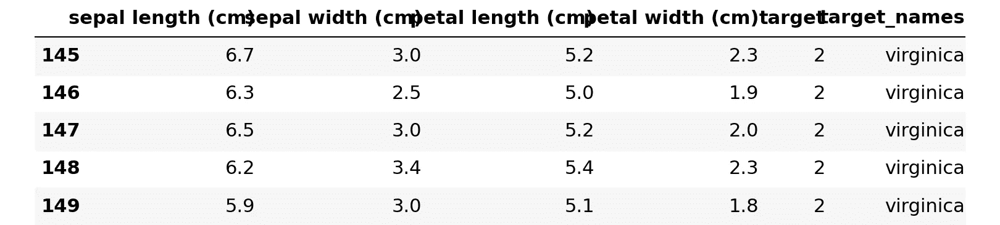
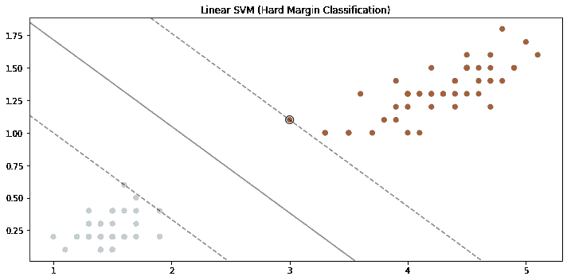
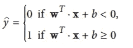
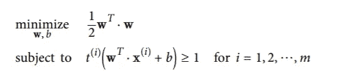
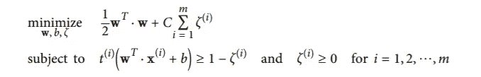
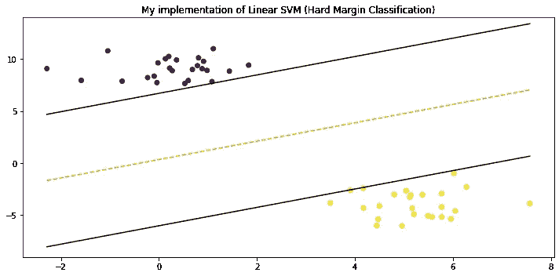
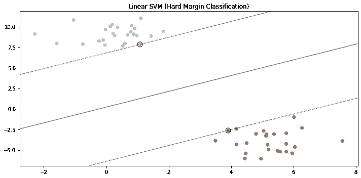

# 从头开始的算法:支持向量机

> 原文：<https://towardsdatascience.com/algorithms-from-scratch-support-vector-machine-6f5eb72fce10?source=collection_archive---------15----------------------->

## [从零开始的算法](https://towardsdatascience.com/tagged/algorithms-from-scratch)

## 从头开始详述和构建支持向量机


[拍摄的照片将在](https://unsplash.com/@willsudds?utm_source=medium&utm_medium=referral)[的](https://unsplash.com?utm_source=medium&utm_medium=referral)上突然出现

支持向量机是一种流行的算法，能够执行线性或非线性分类和回归，在深度学习兴起之前，由于令人兴奋的内核技巧，支持向量机是一个热门话题——如果这个术语现在对你没有意义，不要担心。在这篇文章结束时，你会对支持向量机的直觉有很好的理解，在线性支持向量机下发生了什么，以及如何用 Python 实现一个支持向量机。

要从头开始查看完整的 ***算法*** 系列，请点击下面的链接。

[](https://towardsdatascience.com/tagged/algorithms-from-scratch) [## 从零开始的算法——走向数据科学

### 阅读《走向数据科学》中关于算法的文章。分享概念、想法和…

towardsdatascience.com](https://towardsdatascience.com/tagged/algorithms-from-scratch) 

## 直觉

在分类问题中，SVM 的目标是拟合两个类别之间的最大可能差值。相反，回归任务改变了分类任务的目标，并试图在裕度内适应尽可能多的实例——我们将首先关注分类。

如果我们只关注数据的极端值(位于聚类边缘的观察值),并且我们将阈值定义为两个极端值之间的中点，那么我们就剩下了一个用于分隔两个类的裕度，这通常被称为超平面。当我们应用一个给我们最大余量的阈值(意味着我们严格确保没有实例落在余量内)来进行分类时，这被称为**硬余量分类**(一些文本称之为*最大余量分类*)。

当详细说明硬利润分类时，直观地看到发生了什么总是有帮助的，因此*图 2* 是硬利润分类的一个例子。为此，我们将使用来自 scikit 的[虹膜数据集](https://scikit-learn.org/stable/auto_examples/datasets/plot_iris_dataset.html)-学习和实用函数`plot_svm()`,您可以在下面的 github 链接上获得完整代码。

[](https://github.com/kurtispykes/ml-from-scratch/blob/master/support_vector_machine.ipynb) [## kurtispykes/ml-从零开始

### permalink dissolve GitHub 是超过 5000 万开发人员的家园，他们一起工作来托管和审查代码，管理…

github.com](https://github.com/kurtispykes/ml-from-scratch/blob/master/support_vector_machine.ipynb) 

> **注意**:这个故事是使用 python 包`*jupyter_to_medium*`直接从 jupyter 笔记本上写的——要了解关于这个包 [**的更多信息，请点击这里**](/publishing-to-medium-from-jupyter-notebooks-53978dd21fac?source=activity---post_recommended)——github 上提交的版本是初稿，因此你可能会注意到这篇文章的一些改动。

```
import pandas as pd 
import numpy as np 
from sklearn.svm import LinearSVC
from sklearn.preprocessing import StandardScaler
from sklearn.datasets import load_iris
import matplotlib.pyplot as plt 
%matplotlib inline# store the data 
iris = load_iris()

# convert to DataFrame
df = pd.DataFrame(data=iris.data,
                  columns= iris.feature_names)

# store mapping of targets and target names
target_dict = dict(zip(set(iris.target), iris.target_names))

# add the target labels and the feature names
df["target"] = iris.target
df["target_names"] = df.target.map(target_dict)

# view the data
df.tail()
```



图 1:原始数据集

```
# setting X and y  
X = df.query("target_names == 'setosa' or target_names == 'versicolor'").loc[:, "petal length (cm)":"petal width (cm)"] 
y = df.query("target_names == 'setosa' or target_names == 'versicolor'").loc[:, "target"] 

# fit the model with hard margin (Large C parameter)
svc = LinearSVC(loss="hinge", C=1000)
svc.fit(X, y)

plot_svm()
```



图 2:SVM 的可视化决策边界

*图 2* 显示了线性 SVM 如何使用硬边界分类来确保没有实例落入边界内。尽管这对于我们当前的场景来说看起来不错，但我们必须小心考虑执行硬利润分类带来的陷阱:

1.  对异常值非常敏感
2.  只有当类是线性可分的时候它才起作用

## 处理异常值和非线性数据

硬边界分类的一种更灵活的替代方法是软边界分类，这是一种很好的解决方案，可以克服上面列出的硬边界分类中的缺陷，主要是解决对异常值的敏感性问题。当我们允许存在一些错误分类时(意味着一些负面观察可能被分类为正面，反之亦然)，从阈值到观察的距离被称为 ***软余量*** 。在软裕度分类中，我们的目标是在最大化裕度大小和限制裕度中的违规数量(落在裕度中的观察数量)之间实现良好的平衡。

是的，线性 SVM 分类器(硬边界和软边界)非常有效，并且在许多情况下工作得非常好，但是当数据集不是线性可分的时候，就像许多数据集经常出现的情况一样，更好的解决方案是利用支持向量机内核技巧(一旦你理解了内核技巧，你可能会注意到它不是支持向量机独有的)。内核技巧将非线性可分离数据映射到更高维度，然后使用超平面来分离类别。让这个技巧如此令人兴奋的是，将数据映射到更高的维度实际上并没有增加新的功能，但我们仍然得到了相同的结果，就好像我们做了一样。因为我们不需要在数据中加入新的特征，我们的模型计算效率更高，效果也一样好。

你会在下面看到这种现象的一个例子。

## 术语

*   **决策边界**:将数据集分成两类的超平面
*   **支持向量**:观察值位于聚类的边缘(离分离超平面最近)。
*   **硬边界**:当我们严格规定所有观察值都不在边界内时
*   **软边界**:当我们允许一些错误分类时。我们试图找到一个平衡点，既保持尽可能大的差值，又限制违规次数([偏差/方差权衡](https://en.wikipedia.org/wiki/Bias%E2%80%93variance_tradeoff))

```
from sklearn.datasets import make_moons
from mlxtend.plotting import plot_decision_regions
from sklearn.preprocessing import StandardScaler
from sklearn.svm import SVC# loading the data
X, y = make_moons(noise=0.3, random_state=0)

# scale features
scaler = StandardScaler()
X_scaled = scaler.fit_transform(X)

# fit the model with polynomial kernel
svc_clf = SVC(kernel="poly", degree=3, C=5, coef0=1)
svc_clf.fit(X_scaled, y)

# plotting the decision regions
plt.figure(figsize=(10, 5))
plot_decision_regions(X_scaled, y, clf=svc_clf)

plt.show()
```


图 3:应用于非线性数据的内核技巧

> 注意:我们对这个数据集应用了一个多项式核，但是 RBF 也是一个非常受欢迎的核，应用于许多机器学习问题，并且经常在数据不是线性可分时用作默认核。

## 创建模型

既然我们已经对 SVM 正在做的事情建立了概念上的理解，让我们来理解在这个模型的引擎盖下正在发生什么。线性 SVM 分类器计算决策函数`w.T * x + b`并预测结果为肯定的肯定类别，否则为否定类别。训练线性 SVM 分类器意味着找到使边缘尽可能宽的值`w`和`b`，同时避免边缘违规(硬边缘分类)或限制它们(软边缘分类)



图 4:线性 SVM 分类器预测

决策函数的斜率等于权重向量的范数，因此为了实现最大可能的裕度，我们希望最小化权重向量的范数。但是，我们有办法实现硬利润分类和软利润分类。

硬边界优化问题如下:



图 5:线性 SVM(硬边界分类器)目标

和软利润:



图 6:线性 SVM(软间隔分类器)目标；请注意，为了实现软余量，我们为每个实例添加了一个松弛变量(zeta ≥ 0)，该变量测量每个实例允许违反余量的程度。

## 履行

> **注意**:对于这个实现，我将进行硬边界分类，但是进一步的工作将包括软边界的 Python 实现和对不同数据集执行的内核技巧，包括基于回归的任务——要获得这些帖子的通知，您可以在 [Github](https://github.com/kurtispykes) 上关注我。

```
from sklearn.datasets.samples_generator import make_blobs 

# generating a dataset
X, y = make_blobs(n_samples=50, n_features=2, centers=2, cluster_std=1.05, random_state=23)def initialize_param(X): 
    """
    Initializing the weight vector and bias
    """
    _, n_features = X.shape
    w = np.zeros(n_features)
    b = 0 
    return w, bdef optimization(X, y, learning_rate=0.001, lambd=0.01, n_iters=1000): 
    """
    finding value of w and b that make the margin as large as possible while
    avoiding violations (Hard margin classification)
    """
    t = np.where(y <= 0, -1, 1)
    w, b = initialize_param(X)

    for _ in range(n_iters): 
        for idx, x_i in enumerate(X): 
            condition = t[idx] * (np.dot(x_i, w) + b) >= 1
            if condition: 
                w -= learning_rate * (2 * lambd * w)
            else: 
                w -= learning_rate * (2 * lambd *  w - np.dot(x_i, t[idx]))
                b -= learning_rate * t[idx]
    return w, bw, b = gradient_descent(X, y)def predict(X, w, b):
    """
    classify examples
    """
    decision = np.dot(X, w) + b
    return np.sign(decision)# my implementation visualization
visualize_svm()

# convert X to DataFrame to easily copy code
X = pd.DataFrame(data=X,
                 columns= ["x1", "x2"])

# fit the model with hard margin (Large C parameter)
svc = LinearSVC(loss="hinge", C=1000)
svc.fit(X, y)

# sklearn implementation visualization
plot_svm()
```



## 赞成的意见

*   非常好的线性分类器，因为它找到了最佳决策边界(在硬边界分类意义上)
*   易于转换成非线性模型

## 骗局

*   不适合大型数据集

## 包裹

SVM 是一种很难编码的算法，它很好地提醒了我们为什么应该感谢机器学习库，让我们可以用几行代码实现它们。在这篇文章中，我没有深入到支持向量机的全部细节，仍然有相当多的空白，你可能想要阅读，例如[计算支持向量机](https://en.wikipedia.org/wiki/Support_vector_machine#Computing_the_SVM_classifier)和[经验风险最小化](https://en.wikipedia.org/wiki/Support_vector_machine#Empirical_risk_minimization)。

> 此外，可能值得观看吴恩达关于支持向量机的讲座— [**点击此处**](https://www.youtube.com/playlist?list=PLNeKWBMsAzboNdqcm4YY9x7Z2s9n9q_Tb)

感谢您花时间通读这个故事(因为它被称为媒体)。现在，您对支持向量机、SVM 下发生的事情以及如何用 Python 编写硬边界分类器有了很好的概念性理解。如果你想和我联系，我在 LinkedIn 上很容易找到。

[](https://www.linkedin.com/in/kurtispykes/) [## Kurtis Pykes -人工智能作家-走向数据科学| LinkedIn

### 在世界上最大的职业社区 LinkedIn 上查看 Kurtis Pykes 的个人资料。Kurtis 有一个工作列在他们的…

www.linkedin.com](https://www.linkedin.com/in/kurtispykes/)