# 算法、迭代和洗衣:我们能把它们联系起来吗？

> 原文：<https://towardsdatascience.com/algorithms-iteration-and-laundry-can-we-link-them-together-c9c1ce8c7212?source=collection_archive---------51----------------------->

## 帮助您更好地理解代码的简单解释

简·安东宁·科拉尔在 [Unsplash](https://unsplash.com?utm_source=medium&utm_medium=referral) 上拍摄的照片

**我坚信，如果你能理解洗衣，你就能理解算法和多级迭代。**

现在，我必须指出，洗衣服是我每天都要做的事情之一。我和它邪恶的表亲，熨衣服，过得特别艰难。对我来说，这几乎是不可能的，这就是为什么我很高兴我们正在进入北半球的毛衣天气(当你穿着一件不那么皱的毛衣时，没有人会注意到一件皱的衬衫)。

在寻找洗衣艺术和科学的动机时，我开始意识到它的工作有点像算法和迭代，更好的是，如果我们能让自己像对待那些数据科学概念一样看待洗衣，也许我们可以做得更好。因此，我尝试用一些常识来解决一个非常常见的数据科学问题。

**披露**:在我们开始之前，请记住，我在这里的目标不是给出算法和迭代的完整技术解释。如果那是你要找的，这里不适合你。有大量的文章/书籍/视频可以提供这方面的信息，所以我恳请你不要在这里浪费时间。然而，如果你对数据科学和日常生活之间意想不到的联系感兴趣，请继续阅读。

好了，现在我们已经解决了法律上的问题，算法就是“用来解决问题的一组指令”。另一方面，迭代是“一次又一次做某事的过程”。好的，这很好，但问题是这些只是教科书上的定义,(根据定义)这些在现实生活中几乎没有用处。它们往往只是抽象的概念，大学课程喜欢把它们扔给你，这样他们就可以收取一大笔钱。所以让我们转而去洗衣服吧。

我想让你想象你已经很久没有洗衣服了，拖延症已经到了极限。你必须面对严酷的现实，你不能再用同一件衬衫出门，你必须照顾自己的肮脏，所以你把所有的衬衫扔在一个巨大的篮子里。我还想让你想象一下，你有一台神奇的电脑为你洗衣服(我愿意为此花大价钱)，你用它来处理你危险堆积的脏衬衫。

## 第一个例子

让我们首先清楚地定义我们在这里有什么。假设你只有绿色、蓝色和黄色的衬衫:

作者图片

而且你想洗、干、烫它们，所以你的神奇洗衣电脑的基本指令是:

作者图片

很直接，是吧？但问题是，你想让你的洗衣过程井井有条，所以你想按颜色洗、干、熨衬衫。从概念上讲，这是你会指示你的神奇计算机做的事情:

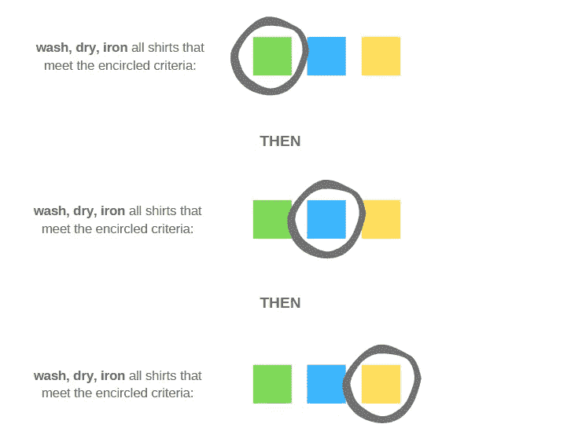

作者图片

你就完了。你已经成功地按颜色洗完了所有的衬衫。你所做的就是在三个独立的*迭代中执行指令，每种颜色一次。*

## *第二个例子*

*好的，现在我想让你认为你也有有袖和无袖的衬衫:*

*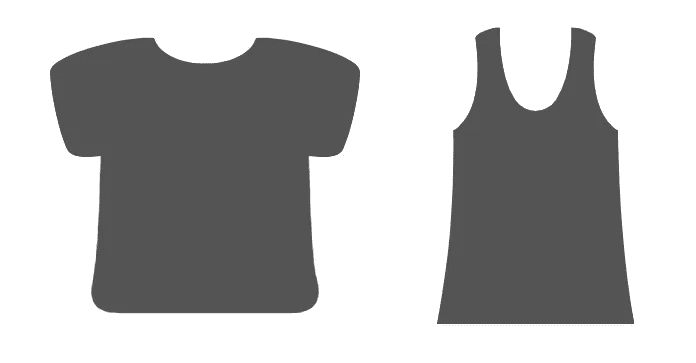*

*作者图片*

*坚持我们在前面的例子中所说的，这些衬衫可以是绿色，蓝色或黄色。还是那句话，作为一个非常有条理的洗衣人，你想按颜色洗你的衬衫，但你也想先洗袖子再洗无袖的。这些是你的神奇电脑的说明:*

*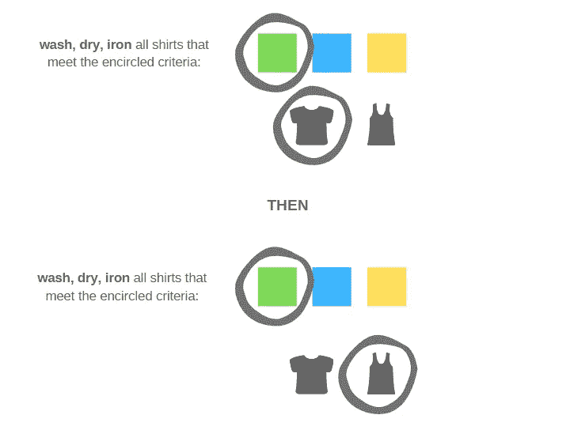*

*作者图片*

*现在，请注意，我们只洗了我们的绿色衬衫(有袖和无袖)，但我们还没有接触其他颜色。换句话说，**当我们迭代套筒变量**时，我们保持圆“固定”在绿色正方形上。为了完成这项工作，我们对蓝衫重复这个过程:*

*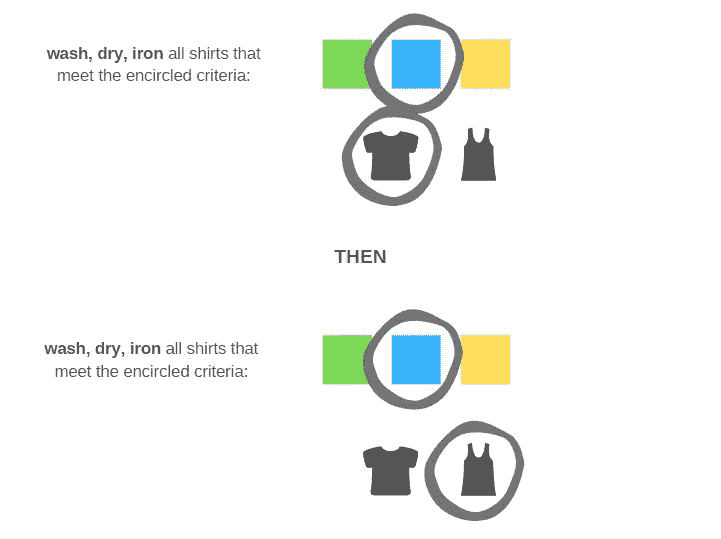*

*作者图片*

*再次注意，当我们迭代 sleeve 变量时，圆圈是如何“固定”在蓝色方块上的。最后，我们以完全相同的方式处理黄色衬衫:*

*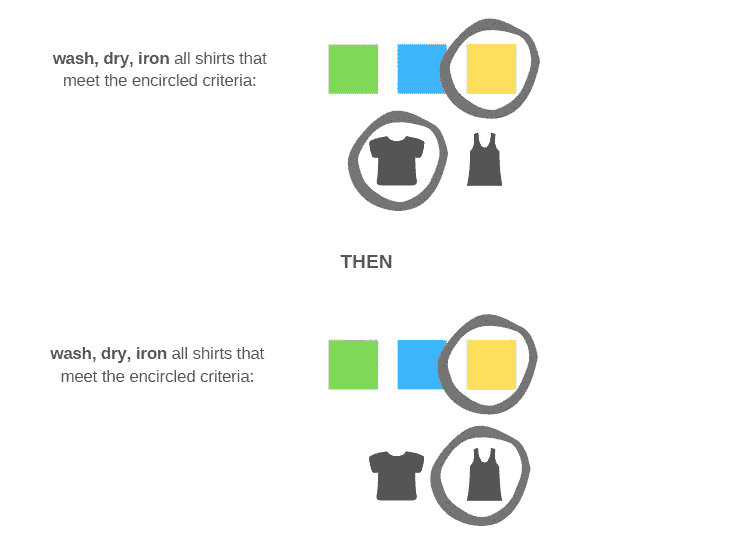*

*作者图片*

*仅此而已。基本上，您以下面的方式进行了两个不同“级别”的迭代:*

*   *您在遍历底部 iterable 的对象时，在顶部 iterable 的第一个对象(绿色)上固定了圆圈，并在每个对象上执行指令。*
*   *然后，您只需切换到顶部 iterable 的第二个元素(蓝色)，并遍历底部元素中的对象，再次执行指令。*
*   *最后，重复相同的过程，但是这次将圆固定在顶部 iterable 的第三个对象(黄色)上。*

*就这样，你洗完了衣服。*

## *第三个例子*

*正因为迭代和算法如此有趣，让我们假设你也有带纽扣和不带纽扣的衬衫，这可以是三种颜色中的任何一种，可以有袖子也可以没有袖子(就我个人而言，我从未见过带纽扣的无袖衬衫，但嘿，这里没有判断)。*

*那么，让我们看看这次的指令是什么样的:*

*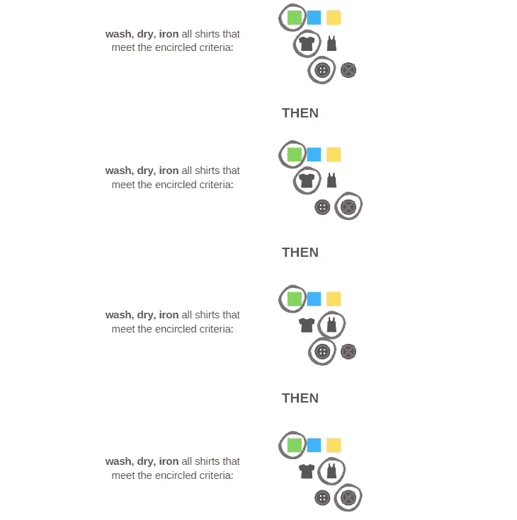*

*作者图片*

*如果你一直跟着这里，你会意识到我们只关心我们的绿衬衫。所以我们对蓝色的重复这个过程:*

*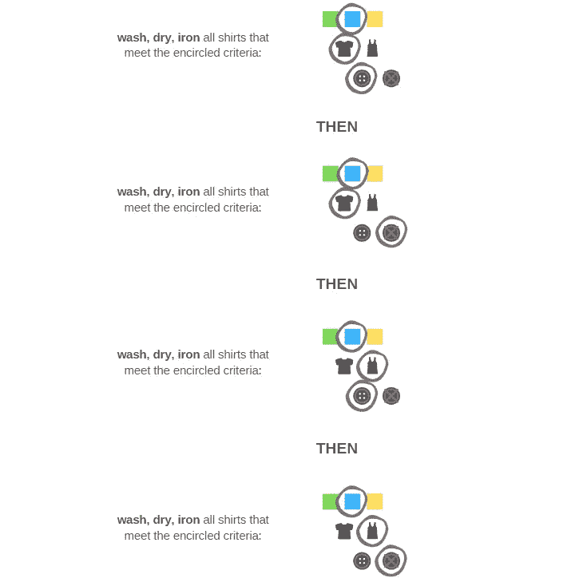*

*作者图片*

*最后是黄色的:*

*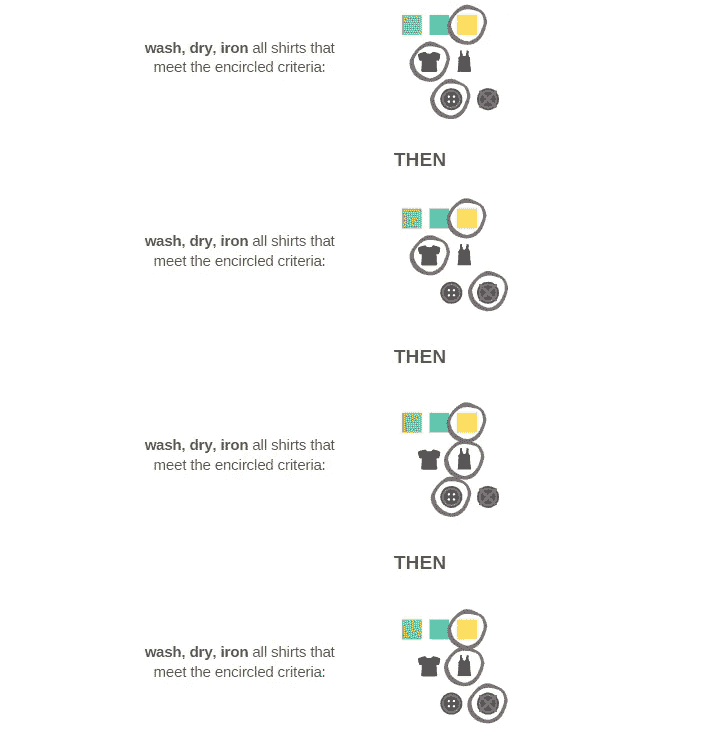*

*作者图片*

*修复圆圈的逻辑同样适用于此，只是我们现在讨论的是三个级别，而不是两个。实际上，这是这篇文章的要点，所以让我们扩展一下，称之为**迭代和算法的‘洗衣原则’**。*

## *迭代和算法的“洗衣原则”*

**

*里卡多·戈麦斯·安吉尔在 [Unsplash](https://unsplash.com?utm_source=medium&utm_medium=referral) 上的照片*

***那么，为什么你在过去的几分钟里一直在看一篇关于洗衣的文章呢？***

*事实证明，上面的例子有助于使迭代和算法更容易理解，因为它们揭示了一个简单但非常有用的想法，我们从现在开始称之为洗衣原理。*

*正如我们在一开始所看到的，算法只是一组指令，它们被传递给计算机来解决一个特定的问题。但是**这些指令的执行顺序使得算法如此有用**。正如我们在上面看到的，指令是按照特定的顺序执行的，这允许以一种结构化的有效方式处理问题，这就是迭代思维发挥作用的地方。*

> *洗衣原则:“自下而上”每天都胜过“自上而下”。*

*这里的主要思想是，你必须总是自下而上地考虑多级迭代**。让我们从三个层次来看这个问题，就像我们的洗衣例子一样。除了最后一层，所有的层都固定在它们的第一个对象上，最后一层是你将按照你的指令移动的那一层。让我们称这个过程为:***

*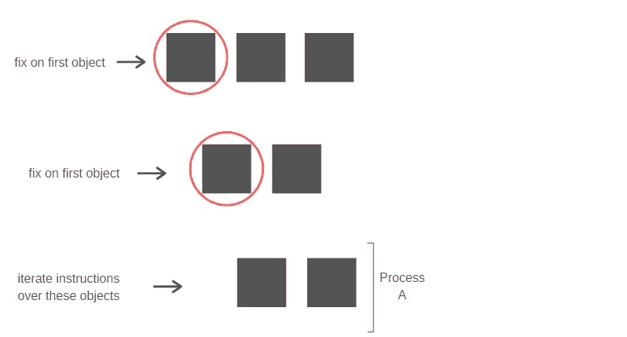*

*作者图片*

*一旦最后一层上的所有对象都用完了，您就可以激活中间层上的迭代，并对那里的每个对象重复过程 A。我们将用字母 B 来命名这个过程，并且记住这是一个复合过程。换句话说，流程 B 包括:*

*   *对最后一级(进程 A)中的所有对象执行指令，中间一级有一个固定对象。*
*   *移动到中间层的下一个对象并重复过程 a。*
*   *这样做，直到中间级别的所有对象都用完为止。*

*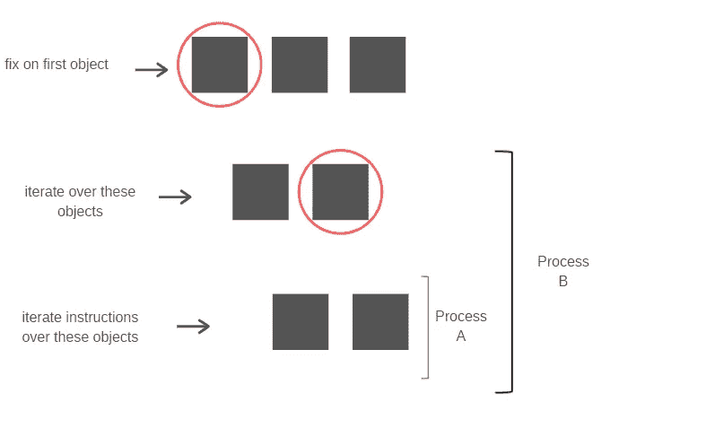*

*作者图片*

*一旦中间层的所有对象都用完了，就激活顶层的迭代，并对那里的每个对象重复复合过程 B:*

*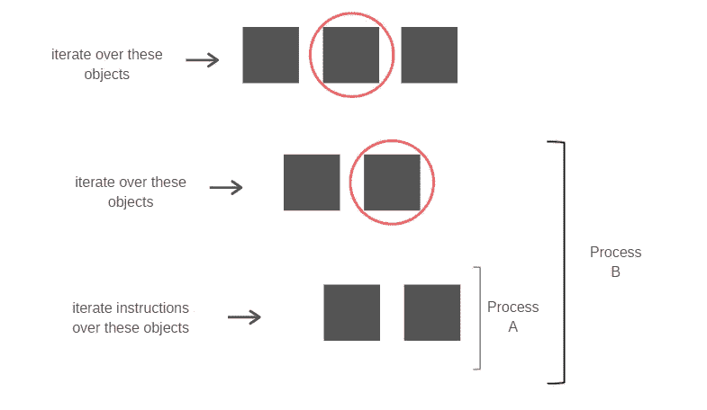*

*作者图片*

*如果你有更多的层次，那么，你将永远继续下去(或者直到你的迭代层次用完)。*

*值得注意的是，这些例子非常简单，目的是清楚地传达想法。和往常一样，现实生活没有那么温和，所以当你试图理解别人的代码时，你肯定仍然会时不时地抓狂。例如，一些代码片段将只在特定的迭代级别上执行指令(与我们的示例相反，在我们的示例中，指令总是在底层执行)，并且一些迭代可能相当长。然而，原则是相同的。*

## *衣物包装*

*我们在这里学到了什么？嗯，几件事:*

*   *洗衣服很烂，但最终还是要洗(冬天熨烫更容易躲闪)。*
*   *多级迭代从下往上看更容易理解(洗衣原理)。*
*   *现实生活中的代码比我们有时希望的要复杂得多，但是对迭代如何工作有一个清晰的想法会让你脚踏实地。*

*所以下次当你试图理解 Kaggle 上的一些密集代码时，你应该庆幸至少你没有在洗衣服。*