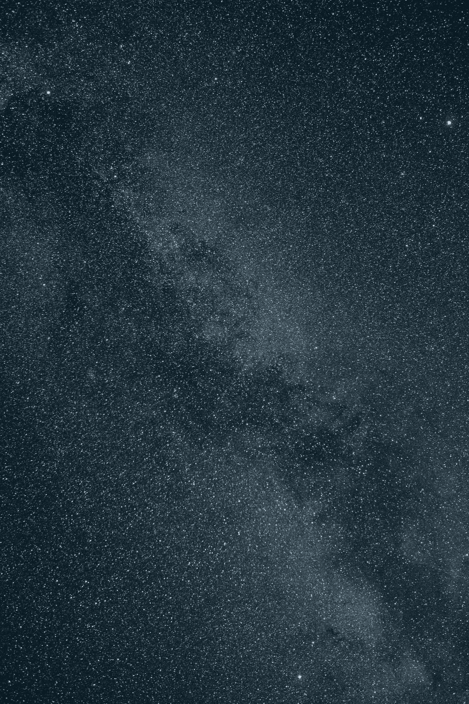
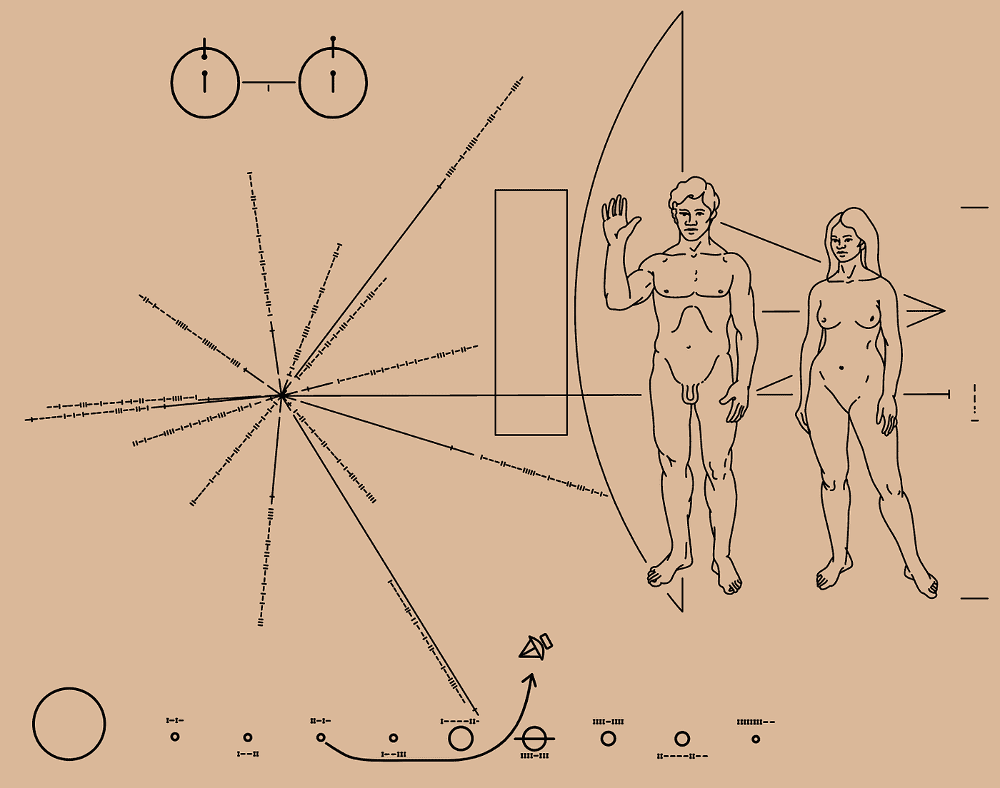
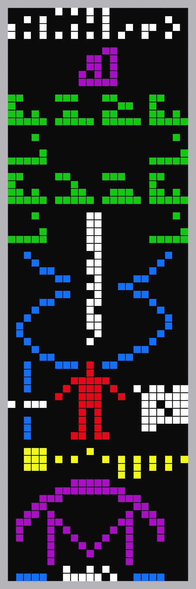
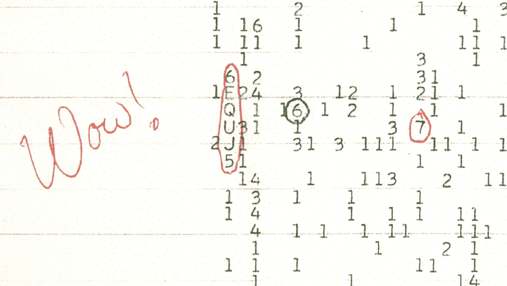
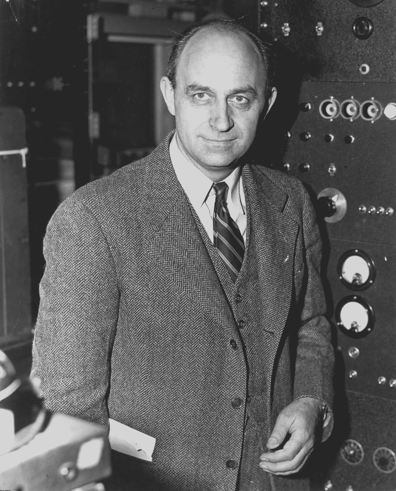
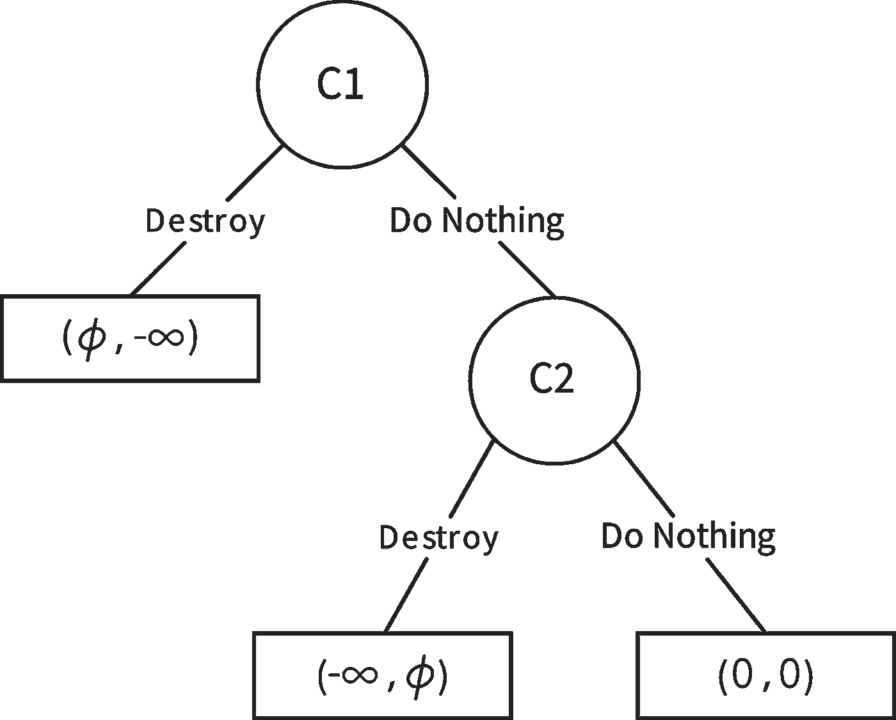
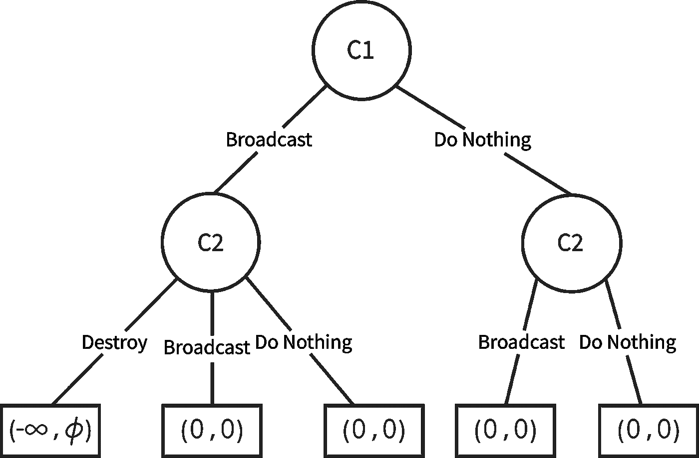

# 外星人、费米悖论和黑暗森林理论:博弈论观点

> 原文：<https://towardsdatascience.com/aliens-the-fermi-paradox-and-the-dark-forest-theory-e288718a808?source=collection_archive---------3----------------------->

银河系。来源:[亚历克·法瓦利](https://unsplash.com/@alecfavale)，转自 [Unsplash](https://unsplash.com/photos/KaXMBK6l9HE) (CC0)。

# 德雷克方程

20 世纪 60 年代，时任康奈尔大学天文学教授的弗兰克·德雷克提出了 T4·德雷克方程。这是对银河系中智慧文明数量的概率估计。正如他所定义的，智慧文明是一种先进到足以与其他地外文明交流的文明。

德雷克的方程式不是试图精确量化智慧文明，而是唤起人类对外星人存在的好奇心。如果 60 年后你还在读这篇文章，那么德雷克已经成功了。

在这篇文章中，我们讨论了人类寻找外星人的尝试。我们评论费米悖论，这是宇宙的浩瀚和缺乏任何外星生命证据之间的明显矛盾。然后，我们解释了取自我与人合著的调和这一悖论的一篇课堂论文的博弈论模型，以及我们是否应该尝试接触外星生命。所以，系好安全带，准备在社会宇宙的海洋中漫游吧。

我们生活在一个巨大的宇宙中，那里的星星比地球上的沙粒还要多。许多恒星都有行星围绕它们旋转。甚至还有一份由阿雷西博的波多黎各大学保存的潜在宜居系外行星清单。德雷克方程表明，这种外星人存在的可能性很高，不容忽视。排除它们已经在这里的可能，我们必须问自己为什么在地球上没有发现它们。我们当然尽力了。

在 20 世纪 70 年代，我们试图越来越多地了解这些文明。1972 年，我们向木星发射了一艘宇宙飞船——先驱者 10 号。当你阅读这篇文章时，这艘宇宙飞船正朝着金牛座前进，在最终离开我们的太阳系之前，终于给了外星人一个捕捉它的机会！如果它们存在，并且它们确实感染了，我们已经发送了一个铭牌(如下),描述我们的长相和我们生活的世界的象征。

该牌匾在左上角有一个中性氢的超精细跃迁，一个男人和一个女人的形象，太阳和银河系的地标，底部是太阳系，以及人类身后的飞船剪影。来源:[维基媒体常用](https://en.wikipedia.org/wiki/Pioneer_plaque#/media/File:Pioneer_plaque.svg)。

1974 年，我们发送了[阿雷西博信息](https://en.wikipedia.org/wiki/Arecibo_message)，这是由著名的科学传播者[卡尔·萨根](https://en.wikipedia.org/wiki/Carl_Sagan)和弗兰克·德雷克创造的星际调频无线电信息。这是技术成就的展示，而不是接触外星人，但这并没有给我们，阴谋论者，足够的数据来工作。

阿雷西博信息描述了当时的科学技术:白色的是数字 1 到 10。紫色表示组成 DNA 的元素的原子序数:氢、碳、氮、氧和磷。绿色、白色和蓝色的 DNA 结构和分子式。红色的是人类的图形，白色的是人类的数量。黄色是太阳系的图形，表示信息来自哪个行星。紫色的是阿雷西博射电望远镜和发射天线盘的照片。来源:[维基媒体常用](https://en.wikipedia.org/wiki/Arecibo_message#/media/File:Arecibo_message.svg)。

这种星际调频无线电信息包含了许多假设。FM 代表频率调制，对于外星人来说，这种技术可能太先进(或者不够先进)。谁知道呢？无线电信号也随着进入宇宙而衰减，但是我们不能排除外星人拥有敏感的技术来发现每一个微弱的信号，对吗？

卡尔·萨根是天文学家、宇宙学家和科学传播者。来源:[维基媒体常用](https://en.wikipedia.org/wiki/Carl_Sagan#/media/File:Carl_Sagan,_1994.jpg)。

那绝不是我们最后一次试图联系外星人并泄露我们所有的秘密！1977 年，卡尔·萨根编辑了自然的声音和图像，以描绘地球上生命和文化的多样性，并将其载入旅行者号宇宙飞船的黄金唱片。截至 2004 年，旅行者 1 号已经离开了我们的太阳系，进入了星际空间，即恒星之间的空间，终于给了外星人一个了解我们的机会。美国宇航局于 2015 年 7 月将该唱片的音频内容上传至 SoundCloud。是时候了！

这些图像包括植物、昆虫、动物、人类和风景。他们展示了文化的各个部分，如博物馆、机场、比赛和交通。其他图像显示了像太阳系和 DNA 这样的科学发现。这些声音包括用 55 种语言表达的问候和从巴赫、莫扎特到贝多芬和斯特拉文斯基的精选音乐。[自然声音](https://soundcloud.com/nasa/sets/golden-record-sounds-of)包括海浪声、风声、雷声和黑猩猩的声音。这张唱片还包含了莫尔斯电码的励志信息[。来源:](https://en.wikipedia.org/wiki/Per_aspera_ad_astra)[维基媒体常用](https://en.wikipedia.org/wiki/Voyager_Golden_Record#/media/File:The_Sounds_of_Earth_-_GPN-2000-001976.jpg)。

在这一点上，你可能认为这是一种单方面的关系；我们一直在联系，但是没有任何回复。但是在 1977 年夏天，这一切都要改变了。俄亥俄州立大学[大耳](https://en.wikipedia.org/wiki/Ohio_State_University_Radio_Observatory)射电望远镜的科学家们收到了“哇！来自人马座方向的信号。这个信号的特别之处在于它是一个强有力的信号。好像我们注定要得到这个。也许外星人用他们的语言打招呼？

哇！信号由[俄亥俄州历史连线](https://en.wikipedia.org/wiki/Ohio_History_Connection) ‌‌.保存来源:[维基媒体常用](https://en.wikipedia.org/wiki/Wow!_signal#/media/File:Wow_signal.jpg)。

# 费米悖论

恩利克·费密，核时代的建筑师，1938 年诺贝尔物理学奖得主，涉足宇宙学。在一篇关于宇宙辐射起源的论文中，费米引入了假设的外星生命概率和我们没有收到任何联系的事实之间的矛盾。这个矛盾后来被称为费米悖论。

恩利克·费密是一位天才物理学家，在统计力学、量子理论、核物理学和粒子物理学方面都有重大贡献。来源:[维基媒体常用](https://en.wikipedia.org/wiki/Enrico_Fermi#/media/File:Enrico_Fermi_1943-49.jpg)。

既然我们已经介绍了德雷克方程、费米悖论和我们与外星人交流的尝试，让我们探索一下为什么同样聪明的文明避免了交流。

# 慈欣的前提

尽管对费米悖论有大量的假设解释，我们还是讨论了黑暗森林理论，并将其建模为一个具有[不完全信息](https://en.wikipedia.org/wiki/Complete_information)的[序列博弈](https://en.wikipedia.org/wiki/Sequential_game)。黑暗森林理论是由中国科幻作家刘在他的三部曲《地球往事追忆》中描述的

> “宇宙是一片黑暗的森林。每个文明都是一个武装的猎人，像幽灵一样在树林中潜行，轻轻地推开阻挡道路的树枝，试图无声无息地行走。连呼吸都是用心做的。猎人必须小心，因为森林里到处都是像他一样的隐形猎人。如果他找到了另一种生活——另一个猎人、天使或恶魔，一个蹒跚老人的娇弱婴儿，一个仙女或半神——他只能做一件事:开火并消灭他们。”

黑暗森林理论指出，我们的星系**确实**包含德雷克方程中描述的丰富的文明。这些文明仍然有意放弃与其他文明的交流，因为害怕其他文明会摧毁它们。该理论还指出，没有实践这种谨慎的文明已经在这种情况下被摧毁了。

位于加州山景城的[搜寻地外文明研究所(SETI)](https://en.wikipedia.org/wiki/SETI_Institute) ，以前是一个政府机构，现在是一个非营利组织，认为这个理论并非不可信。SETI 社区的官方政策是只收集信息，不回应任何信号或外星智慧的证据，因为担心这可能是地球生命的终结。

在这里，我们用基于非正式激励的推理来验证慈欣的结论，从两个公理开始:

*   任何特定文明的目标都是生存。
*   文明不断发展壮大，但宇宙中的资源是有限的。

鉴于这些公理，以及宇宙的物理性质，即恒星之间的距离非常遥远，文明之间的交流最初会以几十年到几百年的极慢速度进行，因为光速限制了我们。慈欣描述了任何两种文明之间产生的“怀疑链”,因为它们无法自信地评估对方的真实意图或潜在威胁。当一个文明已经收集了足够的信息来考虑另一个不可协商的时候，另一个文明可能已经开始摧毁他们了。

此外，由于一个文明可能会经历指数级和不可预测的技术进步速度，让技术不太先进的文明——因此威胁较小的文明独自存在不一定是安全的选择。即使一个文明的技术进步从未超过另一个文明，它也可以向其他文明传播关于该文明的信息，而这些文明本身可能在技术上更先进，并决定摧毁它。

# 黑暗森林理论的博弈论解释

我们用两个场景来解释黑暗森林理论，然后我们进一步推广它们，得到一个忠实于黑暗森林理论的博弈论模型。

**第一个场景**
两个不同星球上的两个文明已经知道彼此的存在。他们都有足够的技术来摧毁对方，这样做可以让他们获得额外的资源。

从数学上讲，被摧毁的收益是-inf，什么都不做的收益是零。然而，摧毁另一个文明的回报是某个数字θ，其中θ> 0，因为宇宙中的一些有限资源现在已经变得可用。这些新释放的资源允许毁灭者使用它们来扩张，服务于慈欣的第二公理。

因此，第一个场景是一个[扩展形式的](https://en.wikipedia.org/wiki/Extensive-form_game)游戏，有两个回合和以下属性:

*   有两种文明(C1 和 C2)相互了解。
*   首先轮到 C1，然后轮到 C2。
*   每个文明都有同样的两种可能的行动:毁灭(对方文明)或者什么都不做。

很明显，C1 的[优势策略](https://en.wikipedia.org/wiki/Strategic_dominance)和[子博弈完美](https://en.wikipedia.org/wiki/Subgame_perfect_equilibrium)是摧毁 C2。通过选择破坏行动，C1 确保了收益θ>0。如果 C1 选择“什么都不做”，C1 将任由 C2 摆布。使用逆向归纳法，“毁灭”是 C1 唯一安全的选择。

推论:如果一个文明能够毁灭另一个文明，它就会。

**第二种场景**
一个文明可以向其他文明广播自己的存在。第二个场景是一个扩展形式的游戏，有两个回合，具有以下属性:

*   有两种文明(C1 和 C2)彼此并不了解。
*   首先轮到 C1，然后轮到 C2。
*   每个文明都有同样的三种可能的行动:
*   摧毁一个文明:这个行动只能针对那些知道他们存在的文明。
*   广播:让其他文明知道它的存在。
*   什么都不做。

请注意，C2 不能摧毁一个它没有听说过的文明。

C1 什么都不做是最优策略和子博弈。广播再次将 C1 置于 C2 的控制之下。通过逆向归纳，什么都不做是 C1 唯一安全的选择。

**推论:一个文明永远不会与一个能毁灭它的文明分享关于它存在的信息。**

# 黑暗森林理论

黑暗森林理论建立在前面的场景之上，并有更多的概括:

*   这些游戏会随着时间无限重复。
*   文明很多(两个以上)。
*   随着时间的推移，技术在某种程度上是随机增长的。

在重复的游戏中，文明 A 不能让文明 B 活下来，仅仅是因为文明 B 在未来的一个回合中，如果它的科技水平提高了，就可以消灭文明 A。这与第一种情况密切相关。

文明也可以向更强大的文明广播其他文明的存在信息，威胁它们被启示的任何其他文明摧毁启示的文明。这使得任何文明都没有动力与任何其他文明分享其存在的知识，无论它在技术进步方面更弱还是更强。这与第二种情况密切相关。

很明显，摧毁任何已知的文明，并且因为害怕被更强大的文明甚至是更弱小的文明摧毁而不分享存在信息，是帕累托最优的，甚至是纳什均衡的。我们也可以更进一步说，共享它们存在的文明被毁灭了。

在广阔的宇宙中不交朋友听起来可能有点沮丧，有点反社会。然而，我们对其他星球和系统知之甚少，在缺乏共同语言和理解的情况下，在怀疑链的存在下，保持沉默或面临毁灭是有道理的！

这篇文章最初发表在 [ProjectNash](https://www.projectnash.com/aliens-the-fermi-paradox-and-the-dark-forest-theory/) 上。