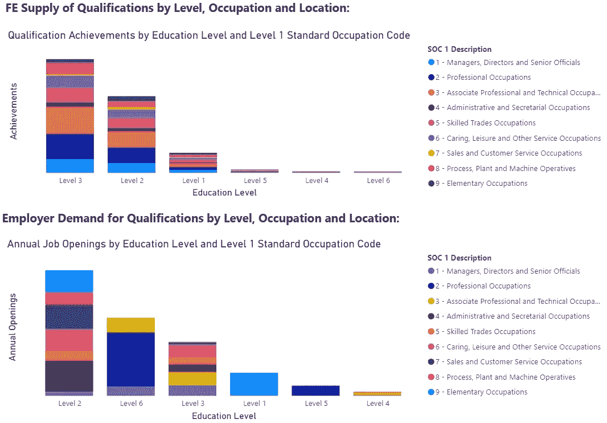
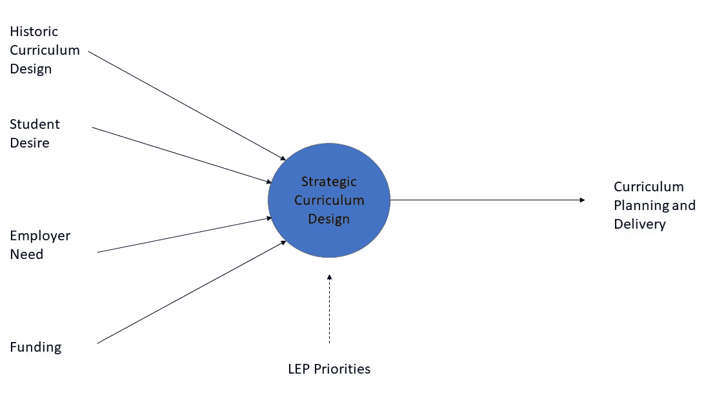

# 在继续教育中使用数据分析协调供需关系

> 原文：<https://towardsdatascience.com/aligning-supply-and-demand-using-data-analytics-in-further-education-1afaf8e63b2f?source=collection_archive---------46----------------------->

照片由[上的](https://unsplash.com/s/photos/computer?utm_source=unsplash&utm_medium=referral&utm_content=creditCopyText)[面](https://unsplash.com/@surface?utm_source=unsplash&utm_medium=referral&utm_content=creditCopyText)拍下

# 背景

继续教育提供者越来越关注教育供应与当地雇主对技能和资格的需求以及当地经济需求之间的一致性，原因有很多。

新的 Ofsted 教育检查框架(EIF)将重点放在教育的目的、实施和影响上，根据 FE News 课程目的，可以向[教育]计划和雇主定制。

政府的继续教育劳动力战略给出了一套战略优先事项，其中“教师和培训者的数量和质量”是第一优先事项，“对雇主需求的反应”是第二优先事项。

最后，商业公司通常会考虑商品和服务的供给与需求，以便为定价和生产水平的决策提供信息，在这方面，继续教育提供商与商业公司有许多相似之处。

# 挑战

## 获取劳动力市场情报(LMI)数据

提供商可以通过多种方式加快获取经济数据，例如使用来自 https://www.economicmodeling.com/ EMSI()的优秀分析师工具。

作者图片(www.emsieconomicmodeling.com 截图)

这种订阅服务以可理解的格式提供了对相关数据综合的快速访问，但这仅仅是获取与供需匹配相关的情报和知识的第一步。

## 供应和需求用不同的单位表示

教育供给用“SSA”或“学科领域”代码表示(例如 SSA2 42 是“制造技术”)，而雇主需求用“SOC”或“标准职业代码”表示(例如 SOC1 是“经理、董事和高级官员”)。

为了在供给和需求之间进行任何比较，它们都必须用一个共同的单位来表示，这是复杂的，因为没有清晰的映射。例如，SSA2 代码“11”有 7 个子分类。其中 6 个映射到 SOC1 代码“2”，一个映射到 SOC1 代码“3”。

涉及权重的复杂转换需要具备有效转换所需的数据分析和数据科学能力。

一旦完成这一步，供需之间的比较就可以可视化，如下例所示

作者图片

## 供求模型有几个相互冲突的输入

我最近开发了下面的模型，以帮助可视化供求之间的复杂相互作用，并解释在考虑战略和战术课程设计时，什么因素影响继续教育学院面临的设计选择，该模型强调了几个挑战

作者图片

学生是这项服务的顾客，但他们并不为此付费(在 16-18 岁的情况下)，而是由政府付费。这就是 EMSI 高级经济学家 Duncan Brown 向我描述的第三方支付问题，它在供求动态中制造了复杂性。

最终有需求的雇主也不为产品/服务支付任何费用(在 16-18 岁的情况下也是如此),也许更能说明问题的是，是其他利益相关者，如奖励组织，广泛决定课程内容和标准，而不是雇主增加了供求关系的复杂性。

16-18 岁离开教育进入劳动力市场通常是在职业阶梯的第一级。直到员工在职业生涯中取得进步，他们所受教育的全部影响才会被意识到，因此在商品的生产(受过教育的学生)和服务的消费(高技能和多产的员工)之间可能会有很长的延迟。

这种模式的另一个复杂性是，学生渴望的教育和技能可能与雇主和经济需要的不一致，这进一步增加了复杂性。

这是一个延迟影响的例子，同样重要的是要认识到，教育提供者只是一个经济体新增劳动力的来源之一。其他人是流动的现有工人、在职雇员的技能提高和进入经济的工人(例如季节性农场工人)。

该模型将“历史课程设计”作为第一个输入，这表明大学将有一个强大的拉力来推动现有课程向前发展，而不是做出根本的改变来反映需求的变化。大学将在员工和资本资源方面进行大量投资，而供应转移是耗时、复杂和昂贵的，因此与需求的匹配可能会逐步进行。

EMSI 大学高级经济学家 Duncan Brown 向我描述了最后一种复杂性，即教育是一种“信用商品”。不像一罐可以品尝的豆子或者一辆可以试驾的汽车，教育的影响无法被消费者直接、即时地评价。这有助于教育机构品牌的重大影响，特别是在高等教育领域，这在许多继续教育提供者的交付中占很大比例。

# 结论

扎克·卢塞罗在 [Unsplash](https://unsplash.com/s/photos/question?utm_source=unsplash&utm_medium=referral&utm_content=creditCopyText) 上的照片

## 要点

继续教育的供需协调是复杂的、多方面的，但是有许多原因可以解释为什么 FE 学院越来越需要根据当地雇主和经济需求来调整他们的教学，并且有一些方法可以让提供者开始分解这个复杂的任务

数据分析和数据科学是关键推动因素。有大量的数据，包括私有、公共和订阅数据集，可以开发成信息、情报和知识。

与其他区域提供者的合作也很重要。继续教育学院不倾向于彼此直接竞争，因此，如果通过合作而不是孤立地完成，获取、处理和解释数据将会更快、更准确。

劳动力市场情报(LMI)数据只是一个方面。其他数据，如历史学习者行为、进度数据、人口统计数据、旅行距离等。所有人都扮演着重要的角色，需要许多不同的“镜头”来构建整体画面。

外部利益相关者关系也很关键。与当地企业合作伙伴、理事会和其他机构的关系是建立战略情报的必要条件。例如，世界上最好的数据模型也无法知道，像亚马逊(Amazon)这样的大型企业是否将建立一个新的本地履行中心，从而扰乱本地劳动力市场，但强大的外部利益相关者关系却能做到。

提供者应努力不断提高他们对供求的理解，并确保可以收集情报，然后嵌入到战略课程设计和规划流程的各个方面。

## 一锤定音

关于数据分析和数据科学，我最喜欢的两句名言是

"*只有当我们收集的数据能够告知并激励那些有能力做出改变的人，事情才能得以完成*"(迈克·施默克博士)

还有…

如果你折磨数据足够长的时间，它会承认任何事情

在这两个极端之间，有必要支持教育领导者理解和采纳数据模型提供的有见地但往往复杂的信息，并根据结论采取行动，同时避免过度检查这些模型或过度依赖直觉可能带来的任何过度自信的偏见。

## 感谢您的阅读！

如果你喜欢读这篇文章，为什么不看看我在 https://grahamharrison-86487.medium.com/的其他文章呢？

此外，我很乐意听到您对这篇文章、我的任何其他文章或任何与数据科学和数据分析相关的内容的看法。

如果你想联系我讨论这些话题，请在 LinkedIn 上找我—[https://www.linkedin.com/in/grahamharrison1](https://www.linkedin.com/in/grahamharrison1)或者发电子邮件到[ghar rison @ Lincoln college . AC . uk](mailto:GHarrison@lincolncollege.ac.uk)。