# 所有关于决策树算法！

> 原文：<https://towardsdatascience.com/all-about-decision-tree-algorithm-443731371170?source=collection_archive---------25----------------------->

# 介绍

[来源](https://stocksnap.io/photo/apple-nature-FFT0EGFTFT)

理解这种算法最简单的方法是把它看作一系列 if-else 语句，在树的顶部有最高优先级的决策节点。

> 这是一个**监督的机器学习**算法，这意味着对应于每一个数据，我们都有一个标签或类别或决定。
> 
> 决策树有回归和分类两种类型。

***一棵决策树包含 4 样东西:***

1.  根节点
2.  子节点
3.  树枝
4.  叶节点

给定一个数据集，我们首先找到一个在结果决策中最占优势的属性，该属性成为决策树的根节点，然后考虑根属性中存在的属性，找到最占优势的属性，然后将其表示为根节点的子节点，然后根据已经形成的树节点计算每个剩余属性的熵。重复这个过程，直到构建了整个树。

# 确定主导节点

在 **ID3(迭代二分法 3)算法**的帮助下，确定在每个步骤中寻找主导节点的方法，这将在下面解释。

*ID3 算法有 3 个公式，在这些公式的帮助下，我们可以计算主导节点:-*

*   **信息增益:**表示该节点相对于其他节点对最终节点的影响有多大。
*   **熵:**表示随机性，即节点中值的随机性。
*   **增益:**它是节点的整体增益，基于这个值我们决定主导节点，具有最大增益值的属性被选为主导节点。

> 按照惯例，我们把“p”和“n”分别作为正决策和负决策。它们是由我们必须应用决策树的数据计算出来的。

## 信息增益:

它通过以下公式计算:

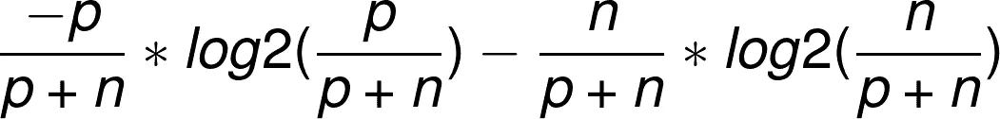

**作者图片**

> 它是针对整个表或子表计算的。

## 熵:

它通过以下公式计算:

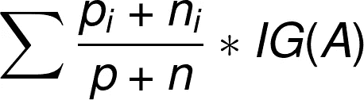

**IG =信息增益【图片由作者提供】**

它是为属性计算的。

## 增益:

它通过以下公式计算:

> **信息 _ 增益(母体)-熵(属性)**

# 决策树算法的求解示例:

以下是我使用过的数据:

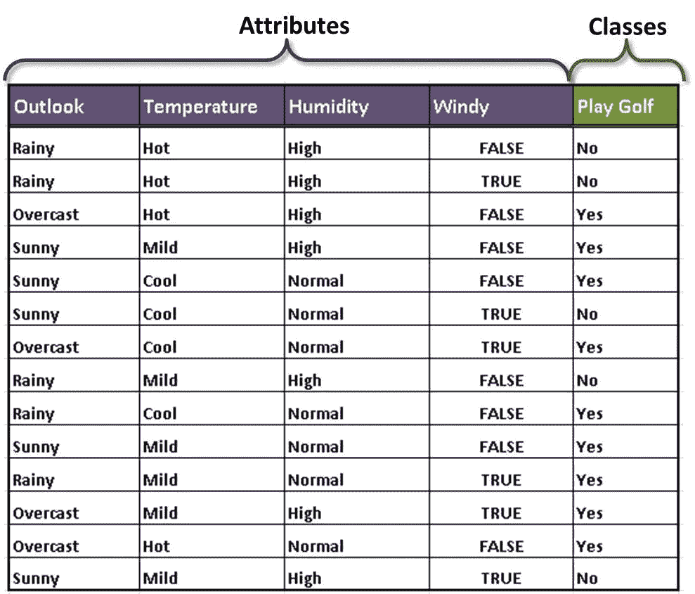

图片来源:[https://rb.gy/urgqbp](https://rb.gy/urgqbp)

首先，我们找到整个表的信息增益，以便找到树的根节点，这里 p(正)和 n(负)决策分别是 9 和 5。[查看“打高尔夫”一栏中的“是”和“否”]

根据公式，我们得到 **IG(整体 _ 表格)= 0.940**

现在，我们将通过计算信息增益和熵来计算表中每个列/属性的增益。

## 计算 Outlook 的收益:

Outlook 有三个类别，分别是晴天、阴天和雨天。

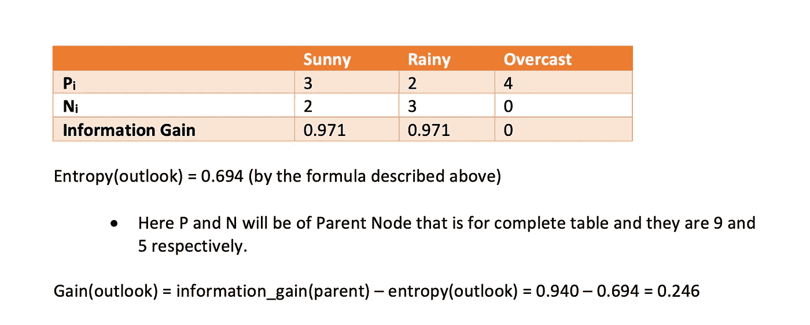

**展望熵与增益*(图片作者)***

## 计算温度增益:

温度有三个类别，热，温和，凉爽。

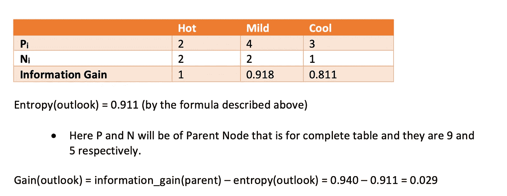

**温度的熵和增益*(图片由作者提供)***

## 计算湿度增益:

湿度有两类:高湿度和凉爽湿度。

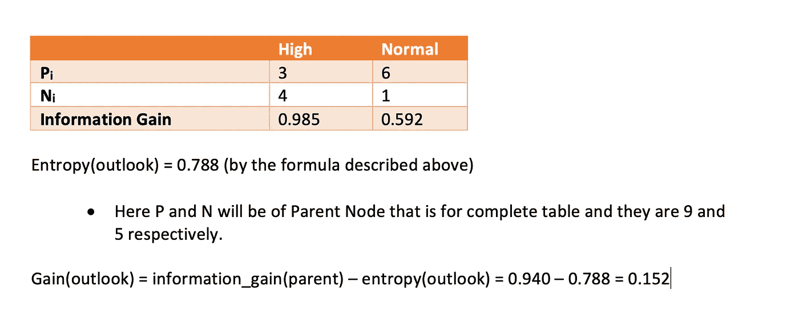

**湿度的熵和增益*(图片由作者提供)***

## 计算风的增益:

湿度有两类，一类是假的，一类是真的。

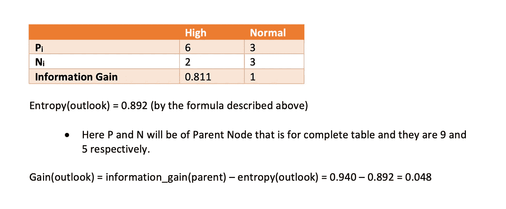

**风的熵和增益*(图片由作者提供)***

> 从上面的结果我们可以看出，outlook 的增益是最大的，所以它将是树的根节点。

## 到目前为止的树:

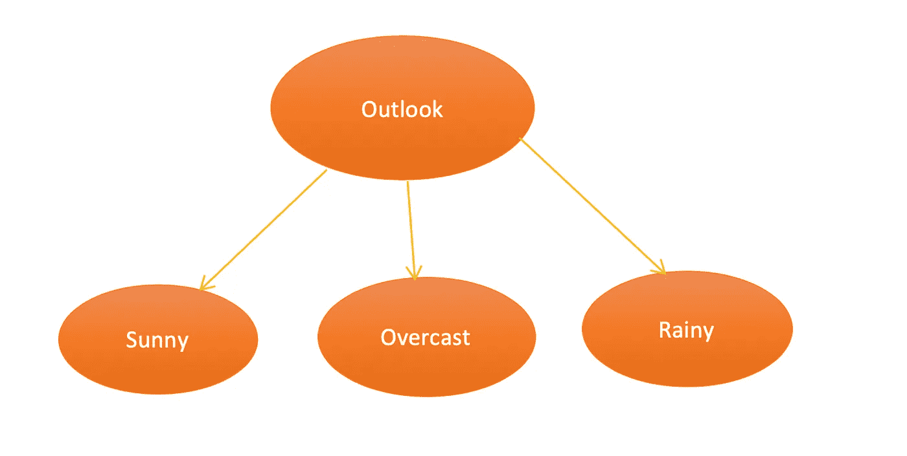

***(图片作者)***

> 现在，我们将计算其余属性的增益，即风、温度和湿度与晴天、阴天和雨天的关系，因为我们已经获得了 outlook 作为根节点。
> 
> 请记住，从现在开始，在计算增益时，全局 p 和 n 将取自晴天、阴天和雨天，因为它们将作为它们的子属性的父属性。

## 计算晴天时的温度增益:

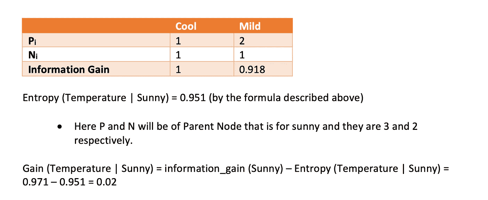

***(图片作者)***

## 计算晴天时的湿度增益

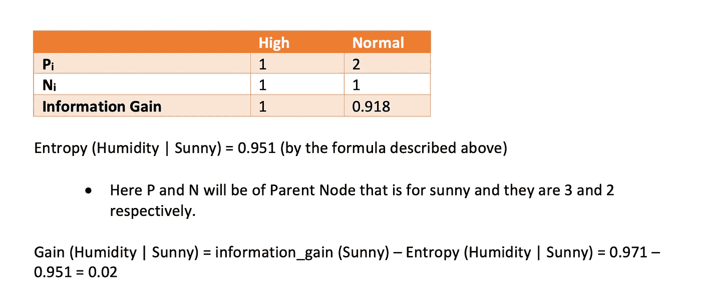

***(图片作者)***

## 计算多风天气的增益:

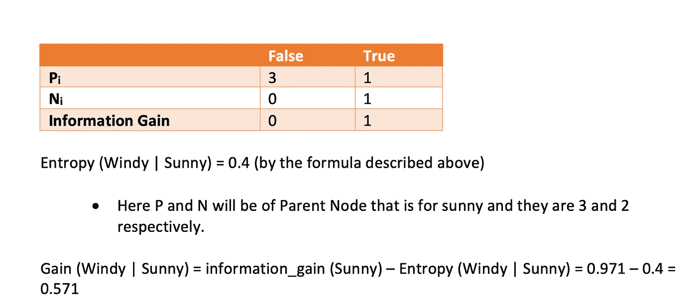

***(图片作者)***

> 从上面的结果我们可以看到 windy 的增益是最大的，所以它将是 sunny 之后的下一个树的根节点。
> 
> 在 windy 中，我们有两个类别“假”和“真”，它们直接引导我们找到解决方案。

## 到目前为止的树:

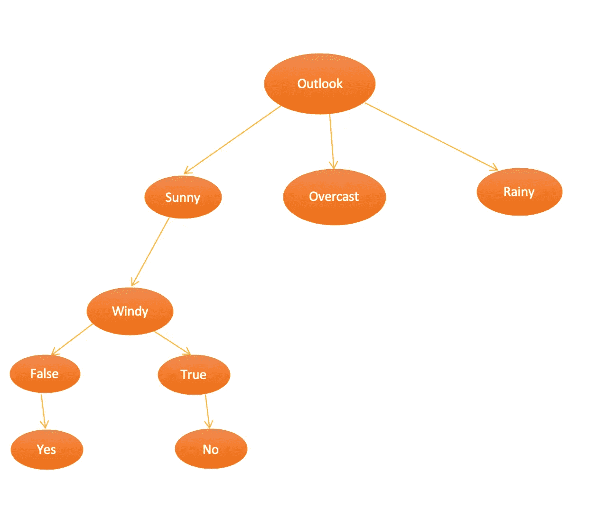

***(图片作者)***

> 在这里阴天的情况下，从上面看，information_gain 是 0，这意味着我们将从阴天场直接做出决策，这是确切的情况，在数据中，我们在任何阴天的情况下都将导致 yes。

## 到目前为止的树:

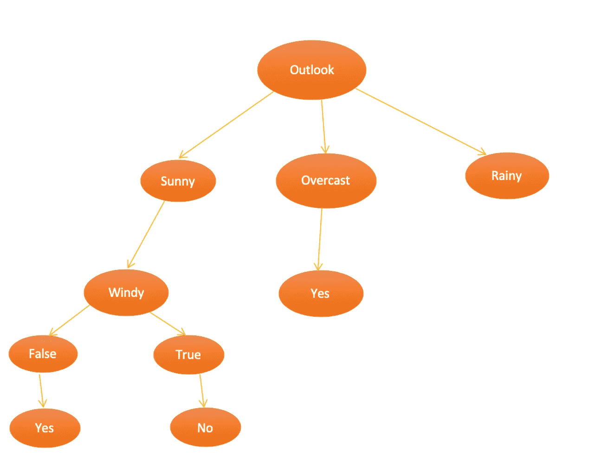

***(图片作者)***

## 计算相对于雨天的温度增益:

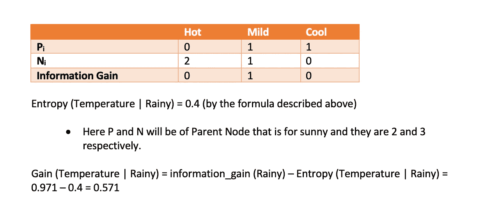

***(图片由作者提供)***

## 计算相对于雨天的湿度增益:

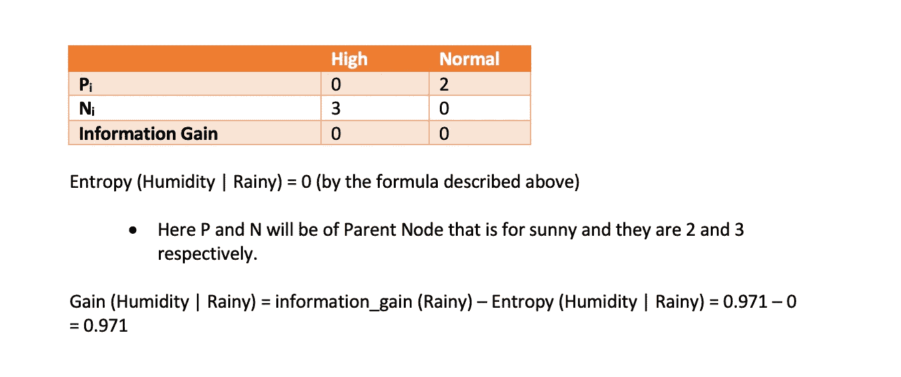

***(图片作者)***

## 计算多风多雨的增益:

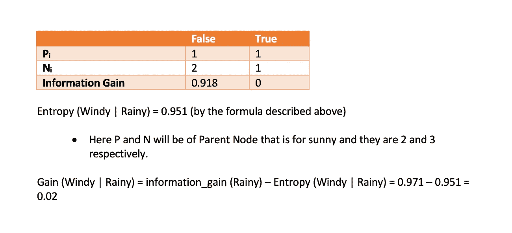

***(图片作者)***

> 从上面的结果我们可以看到，湿度的增益是最大的，所以它将是下雨后树的下一个根节点。
> 
> 在 windy 中，我们有两个类别“高”和“正常”,它们直接引导我们找到解决方案。

## 最终决策树现在:

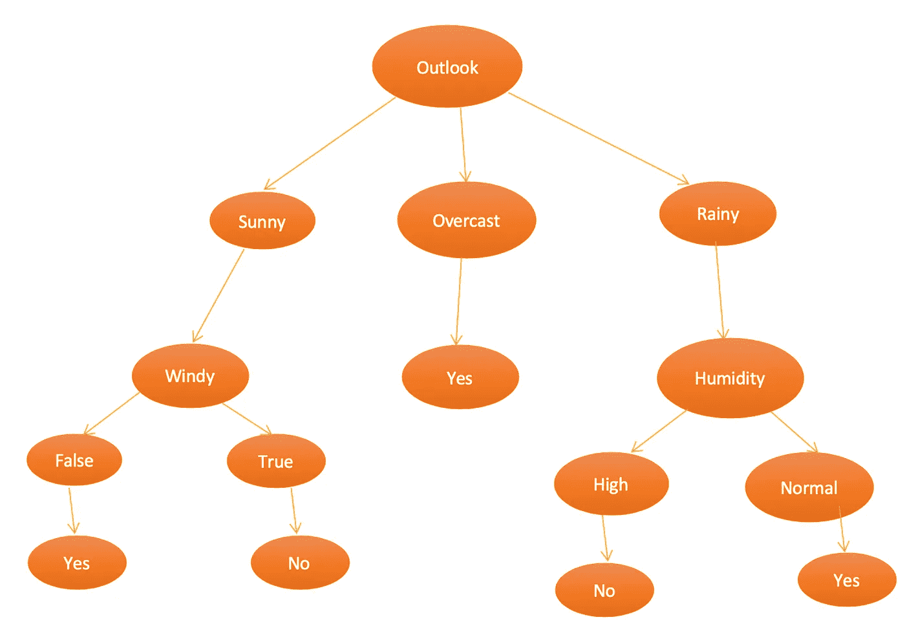

***(图片作者)***

***我已经尽了最大努力自己解释和绘制了所有的图形和函数，希望你们能理解。***