# 关于特征缩放的所有内容

> 原文：<https://towardsdatascience.com/all-about-feature-scaling-bcc0ad75cb35?source=collection_archive---------0----------------------->

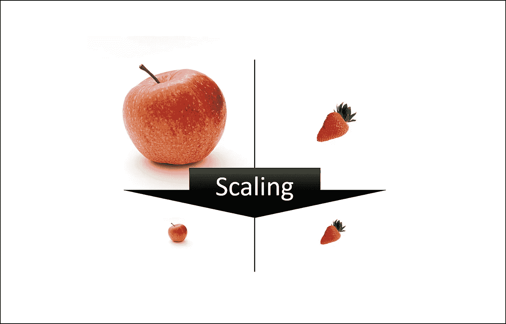

苹果和草莓图片来源:Pixabay

## 深入分析

## 扩展数据以提高机器学习模型的性能

机器学习就像制作一种混合果汁。如果我们想得到最好的混合果汁，我们需要混合所有的水果，不是根据它们的大小，而是根据它们正确的比例。我们只需要记住苹果和草莓是不一样的，除非我们在某些情况下让它们相似来比较它们的属性。类似地，在许多机器学习算法中，为了使所有特征处于相同的地位，我们需要进行缩放，以便一个重要的数字不会仅仅因为其巨大而影响模型。

机器学习中的特征缩放是在创建机器学习模型之前的数据预处理期间最关键的步骤之一。缩放可以在弱机器学习模型和更好的机器学习模型之间产生差异。

最常见的特征缩放技术是规范化和标准化。

当我们想要将我们的值限制在两个数字之间时，通常是在[0，1]或[-1，1]之间，就使用规范化。虽然标准化将数据转换为具有零均值和方差 1，但它们使我们的数据**没有单位**。参考下图，该图显示了数据在 X-Y 平面缩放后的样子。

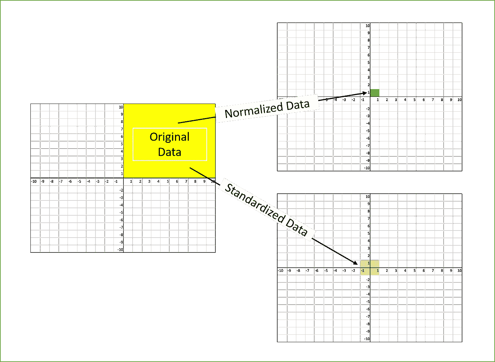

# 为什么我们需要缩放？

机器学习算法只看到数字——如果范围有很大差异，比如几千范围内的差异和几十范围内的差异，它会做出基本假设，即更高的范围数具有某种优势。所以这些更重要的数字在训练模型时开始起更决定性的作用。

机器学习算法处理数字，但不知道这个数字代表什么。10 克的重量和 10 美元的价格代表了完全不同的两件事——这对人类来说是显而易见的，但对于作为特征的模型来说，它将两者视为相同。

假设我们有重量和价格两个特征，如下表所示。“重量”无法与“价格”进行有意义的比较。因此，假设算法认为，既然“重量”>“价格”，因此“重量”比“价格”更重要

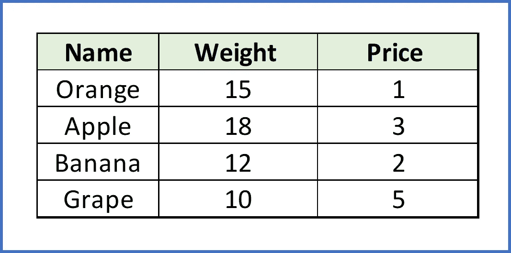

所以这些更重要的数字在训练模型时开始起更决定性的作用。因此，需要进行功能扩展，以便将每个功能放在相同的位置，而没有任何前期重要性。有趣的是，如果我们将重量转换为“千克”，那么“价格”就成了主导。

应用特征缩放的另一个原因是，很少有像神经网络梯度下降**这样的算法在使用特征缩放时比不使用特征缩放时收敛得更快**。

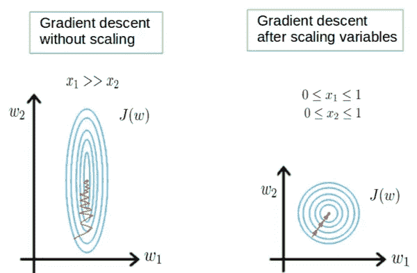

[图片来源](https://stackoverflow.com/questions/46686924/why-scaling-data-is-very-important-in-neural-networklstm/46688787#46688787)

另一个原因是**饱和**，就像神经网络中的 sigmoid 激活一样，缩放将有助于不要太快饱和。

# 什么时候做缩放？

特征缩放对于计算数据之间的**距离**的机器学习算法来说是必不可少的。如果不是比例，具有较高值范围的要素在计算距离时开始占主导地位，这在“为什么？”中有直观的解释部分。

ML 算法对特征的**相对尺度**敏感，这通常发生在它使用特征的数值而不是说出它们的等级时。

在许多算法中，当我们希望**更快收敛**时，缩放是必须的，就像在神经网络中一样。

由于原始数据的值的范围变化很大，在一些机器学习算法中，目标函数在没有归一化的情况下不能正确工作。例如，大多数分类器通过距离来计算两点之间的距离。如果其中一个要素的值范围很大，则距离决定了该特定要素。因此，应该对所有要素的范围进行归一化，以便每个要素对最终距离的贡献大致成比例。

即使在不满足上述条件的情况下，如果 ML 算法预计会出现某种缩放或饱和现象，您可能仍需要重新缩放要素。同样，具有饱和激活函数(例如，sigmoid)的神经网络是一个很好的例子。

我们可以遵循的经验法则是计算距离或假设正态性的算法，**缩放您的特征。**

特征缩放很重要的算法的一些例子是:

*   **具有欧几里德距离测量的 K-最近邻** (KNN)对量值敏感，因此应针对所有要素进行缩放，以使权重相等。
*   **K-Means** 在这里使用欧几里德距离度量特征缩放关系重大。
*   在执行**主成分分析(PCA)** 时，缩放至关重要。PCA 试图获得具有最大方差的特征，对于高量值特征，方差是高的，并且使 PCA 向高量值特征倾斜。
*   我们可以通过缩放来加快**梯度下降**的速度，因为θ在小范围内下降很快，在大范围内下降很慢，并且当变量非常不均匀时会低效地振荡到最优值。

不需要标准化/缩放的算法是那些**依赖规则**的算法。它们不会受到变量的任何单调变换的影响。缩放是一种单调的变换。这类算法的例子是所有基于树的算法— **CART、随机森林、梯度推进决策树**。这些算法利用规则(一系列不等式)并且**不需要标准化**。

像**线性判别分析(LDA)和朴素贝叶斯这样的算法是**设计来处理这种情况并相应地给特征赋予权重的。在这些算法中执行特征缩放可能没有太大效果。

需要注意的几个要点:

*   均值居中不影响协方差矩阵
*   变量的缩放确实会影响协方差矩阵
*   标准化会影响协方差

# 如何进行特征缩放？

下面是我们可以进行特征缩放的几种方法。

> 1)最小最大定标器
> 2)标准定标器
> 3)最大 Abs 定标器
> 4)鲁棒定标器
> 5)分位数变压器定标器
> 6)电力变压器定标器
> 7)单位矢量定标器

为了便于说明，我们将使用顶部所示的表格并形成数据框来显示不同的缩放方法。

```
import pandas as pd
import numpy as np
import matplotlib.pyplot as plt
%matplotlib inline
df = pd.DataFrame({'WEIGHT': [15, 18, 12,10],
                   'PRICE': [1,3,2,5]},
                   index = ['Orange','Apple','Banana','Grape'])
print(df)WEIGHT  PRICE
Orange      15      1
Apple       18      3
Banana      12      2
Grape       10      5
```

## 1)最小-最大缩放器

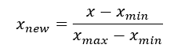

通过将每个要素缩放到给定范围来变换要素。该估计器单独缩放和翻译每个特征，使得它在训练集的给定范围内，例如在 0 和 1 之间。如果有负值，此缩放器会将数据缩小到-1 到 1 的范围内。我们可以设置范围，如[0，1]或[0，5]或[-1，1]。

如果标准偏差很小，并且分布不是高斯分布**时，该定标器响应良好。该定标器**对异常值**敏感。**

```
from sklearn.preprocessing import MinMaxScaler
scaler = MinMaxScaler()df1 = pd.DataFrame(scaler.fit_transform(df),
                   columns=['WEIGHT','PRICE'],
                   index = ['Orange','Apple','Banana','Grape'])ax = df.plot.scatter(x='WEIGHT', y='PRICE',color=['red','green','blue','yellow'], 
                     marker = '*',s=80, label='BREFORE SCALING');df1.plot.scatter(x='WEIGHT', y='PRICE', color=['red','green','blue','yellow'],
                 marker = 'o',s=60,label='AFTER SCALING', ax = ax);plt.axhline(0, color='red',alpha=0.2)
plt.axvline(0, color='red',alpha=0.2);
```

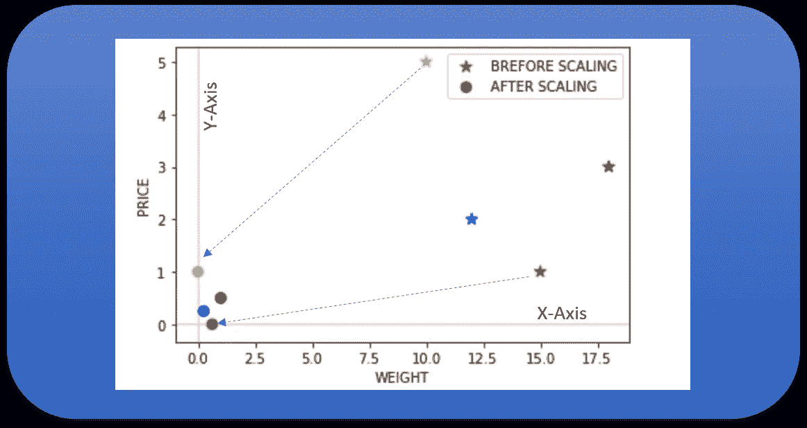

## 2)标准定标器

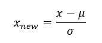

标准缩放器假设数据在每个要素内呈正态分布，并对其进行缩放，使分布以 0 为中心，标准差为 1。

通过计算训练集中样本的相关统计数据，对每个特征独立进行居中和缩放。如果数据不是正态分布的，这不是最好的缩放器。

```
from sklearn.preprocessing import StandardScaler
scaler = StandardScaler()
df2 = pd.DataFrame(scaler.fit_transform(df),
                   columns=['WEIGHT','PRICE'],
                   index = ['Orange','Apple','Banana','Grape'])
ax = df.plot.scatter(x='WEIGHT', y='PRICE',color=['red','green','blue','yellow'], 
                     marker = '*',s=80, label='BREFORE SCALING');
df2.plot.scatter(x='WEIGHT', y='PRICE', color=['red','green','blue','yellow'],
                 marker = 'o',s=60,label='AFTER SCALING', ax = ax)
plt.axhline(0, color='red',alpha=0.2)
plt.axvline(0, color='red',alpha=0.2);
```

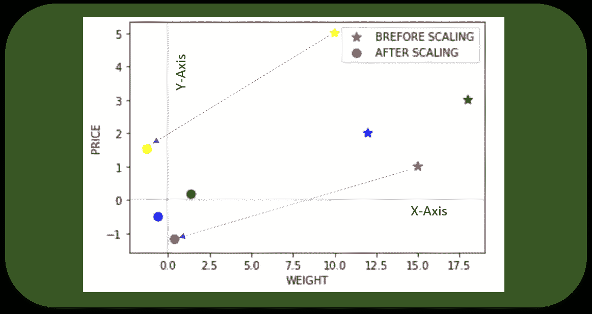

## 3)最大 Abs 定标器

按最大绝对值缩放每个要素。该估计器单独缩放和转换每个特征，使得训练集中每个特征的最大绝对值为 1.0。它不会移动/居中数据，因此不会破坏任何**稀疏度**。

在只有正的数据上，该定标器的行为类似于最小最大定标器，因此，也存在显著的**异常值**。

```
from sklearn.preprocessing import MaxAbsScaler
scaler = MaxAbsScaler()
df4 = pd.DataFrame(scaler.fit_transform(df),
                   columns=['WEIGHT','PRICE'],
                   index = ['Orange','Apple','Banana','Grape'])
ax = df.plot.scatter(x='WEIGHT', y='PRICE',color=['red','green','blue','yellow'], 
                     marker = '*',s=80, label='BREFORE SCALING');
df4.plot.scatter(x='WEIGHT', y='PRICE', color=['red','green','blue','yellow'],
                 marker = 'o',s=60,label='AFTER SCALING', ax = ax)
plt.axhline(0, color='red',alpha=0.2)
plt.axvline(0, color='red',alpha=0.2);
```

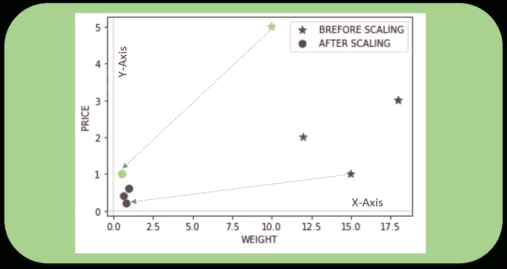

## 4)稳定的定标器

顾名思义，这个定标器对异常值是**健壮的**。如果我们的数据包含许多**异常值**，使用数据的平均值和标准差进行缩放将不会很好。

此缩放器移除中值，并根据分位数范围(默认为 IQR:四分位数范围)缩放数据。IQR 是第一个四分位数(第 25 个四分位数)和第三个四分位数(第 75 个四分位数)之间的范围。这个定标器的定中心和定标统计是基于百分位数的，因此不受少数巨大的边缘异常值的影响。请注意，异常值本身仍然存在于转换后的数据中。如果需要单独的异常值削波，则需要非线性变换。

```
from sklearn.preprocessing import RobustScaler
scaler = RobustScaler()
df3 = pd.DataFrame(scaler.fit_transform(df),
                   columns=['WEIGHT','PRICE'],
                   index = ['Orange','Apple','Banana','Grape'])
ax = df.plot.scatter(x='WEIGHT', y='PRICE',color=['red','green','blue','yellow'], 
                     marker = '*',s=80, label='BREFORE SCALING');
df3.plot.scatter(x='WEIGHT', y='PRICE', color=['red','green','blue','yellow'],
                 marker = 'o',s=60,label='AFTER SCALING', ax = ax)
plt.axhline(0, color='red',alpha=0.2)
plt.axvline(0, color='red',alpha=0.2);
```

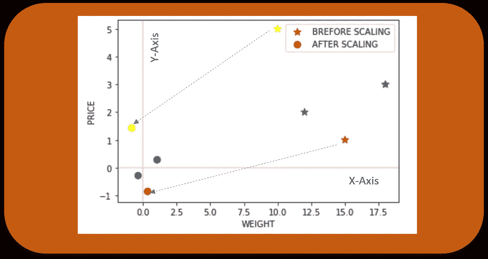

现在让我们看看如果引入异常值会发生什么，并看看使用标准缩放器和鲁棒缩放器的缩放效果(圆圈表示异常值)。

```
dfr = pd.DataFrame({'WEIGHT': [15, 18, 12,10,50],
                   'PRICE': [1,3,2,5,20]},
                   index = ['Orange','Apple','Banana','Grape','Jackfruit'])
print(dfr)
from sklearn.preprocessing import StandardScaler
scaler = StandardScaler()
df21 = pd.DataFrame(scaler.fit_transform(dfr),
                   columns=['WEIGHT','PRICE'],
                   index = ['Orange','Apple','Banana','Grape','Jackfruit'])
ax = dfr.plot.scatter(x='WEIGHT', y='PRICE',color=['red','green','blue','yellow','black'], 
                     marker = '*',s=80, label='BREFORE SCALING');
df21.plot.scatter(x='WEIGHT', y='PRICE', color=['red','green','blue','yellow','black'],
                 marker = 'o',s=60,label='STANDARD', ax = ax,figsize=(12,6))
from sklearn.preprocessing import RobustScaler
scaler = RobustScaler()
df31 = pd.DataFrame(scaler.fit_transform(dfr),
                   columns=['WEIGHT','PRICE'],
                   index = ['Orange','Apple','Banana','Grape','Jackfruit'])df31.plot.scatter(x='WEIGHT', y='PRICE', color=['red','green','blue','yellow','black'],
                 marker = 'v',s=60,label='ROBUST', ax = ax,figsize=(12,6))
plt.axhline(0, color='red',alpha=0.2)
plt.axvline(0, color='red',alpha=0.2);WEIGHT  PRICE
Orange         15      1
Apple          18      3
Banana         12      2
Grape          10      5
Jackfruit      50     20
```

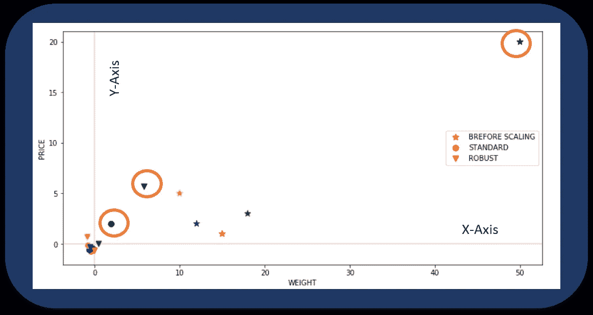

## 5)分位数变压器定标器

使用分位数信息变换要素。

该方法将特征转换为符合**均匀或正态**分布。因此，对于给定的特性，这种变换往往会将最频繁出现的值分散开来。它还减少了(边缘)异常值的影响:因此，这是一个**健壮的预处理**方案。

要素的累积分布函数用于投影原始值。请注意，这种转换是非线性的，可能会扭曲在相同尺度下测量的变量之间的线性相关性，但会使在不同尺度下测量的变量更具直接可比性。这有时也被称为**等级缩放器。**

```
from sklearn.preprocessing import QuantileTransformer
scaler = QuantileTransformer()
df6 = pd.DataFrame(scaler.fit_transform(df),
                   columns=['WEIGHT','PRICE'],
                   index = ['Orange','Apple','Banana','Grape'])
ax = df.plot.scatter(x='WEIGHT', y='PRICE',color=['red','green','blue','yellow'], 
                     marker = '*',s=80, label='BREFORE SCALING');
df6.plot.scatter(x='WEIGHT', y='PRICE', color=['red','green','blue','yellow'],
                 marker = 'o',s=60,label='AFTER SCALING', ax = ax,figsize=(6,4))
plt.axhline(0, color='red',alpha=0.2)
plt.axvline(0, color='red',alpha=0.2);
```

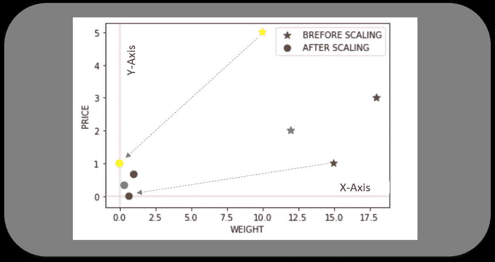

上面的例子只是为了说明，因为当我们有一个包含许多数据点(通常超过 1000 个)的大型数据集时，分位数转换器非常有用。

## 6)电力变压器定标器

power transformer 是一系列参数化的单调变换，应用于**使数据更加高斯化**。这对于建模与变量的可变性相关的问题非常有用，变量的可变性在整个范围内是不相等的(异方差)或者需要正态性的情况。

幂变换通过最大似然估计找到稳定方差和最小化偏斜的最佳比例因子。目前，PowerTransformer 的 Sklearn 实现支持 Box-Cox 变换和 Yeo-Johnson 变换。通过最大似然估计稳定方差和最小偏度的最优参数。Box-Cox 要求输入数据严格为正，而 Yeo-Johnson 既支持正数据也支持负数据。

```
from sklearn.preprocessing import PowerTransformer
scaler = PowerTransformer(method='yeo-johnson')
df5 = pd.DataFrame(scaler.fit_transform(df),
                   columns=['WEIGHT','PRICE'],
                   index = ['Orange','Apple','Banana','Grape'])
ax = df.plot.scatter(x='WEIGHT', y='PRICE',color=['red','green','blue','yellow'], 
                     marker = '*',s=80, label='BREFORE SCALING');
df5.plot.scatter(x='WEIGHT', y='PRICE', color=['red','green','blue','yellow'],
                 marker = 'o',s=60,label='AFTER SCALING', ax = ax)
plt.axhline(0, color='red',alpha=0.2)
plt.axvline(0, color='red',alpha=0.2);
```

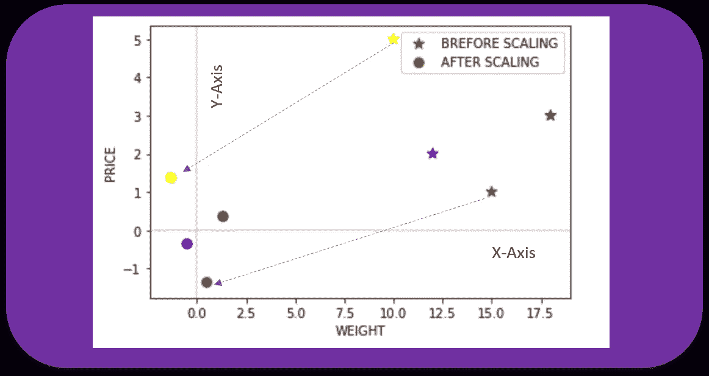

## 7)单位向量定标器

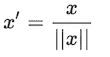

缩放是在将整个特征向量视为单位长度的情况下进行的。这通常意味着将每个分量除以向量的欧几里得长度(L2 范数)。在一些应用中(例如，直方图特征)，使用特征向量的 L1 范数可能更实际。

像最小-最大缩放一样，单位矢量技术产生范围[0，1]的值。当处理具有硬边界的特征时，这非常有用。例如，在处理图像数据时，颜色的范围可以从 0 到 255。

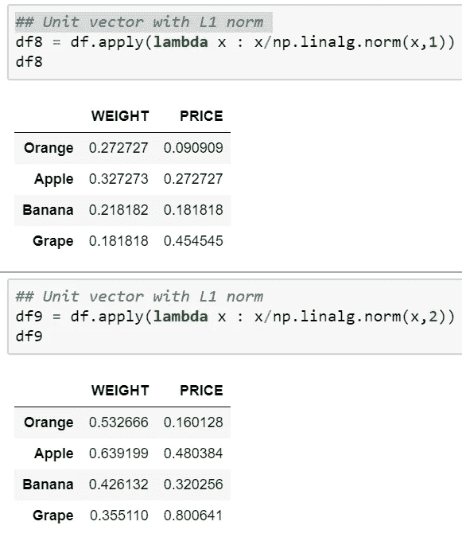

如果我们绘图，那么它会看起来如下分别为 L1 和 L2 规范。

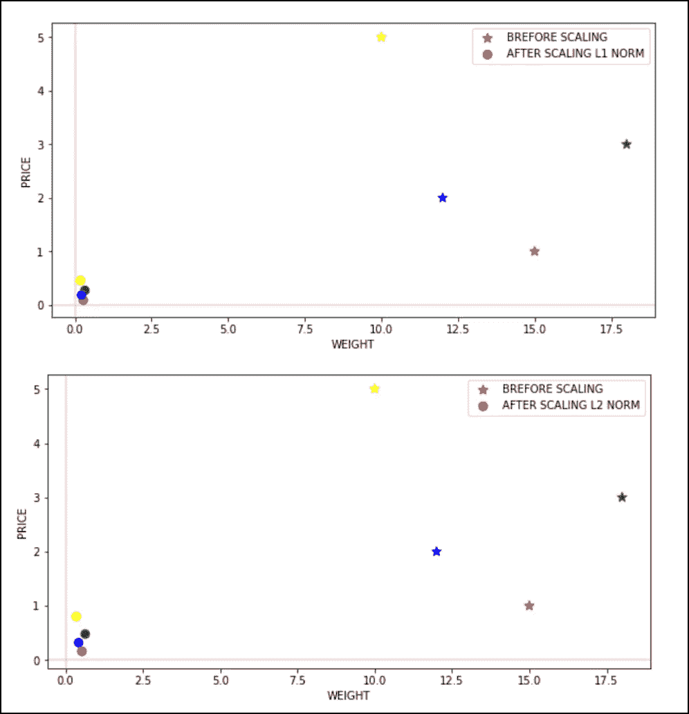

下图显示了所有不同缩放技术的数据分布情况，正如我们所见，有几个点是重叠的，因此无法单独看到。

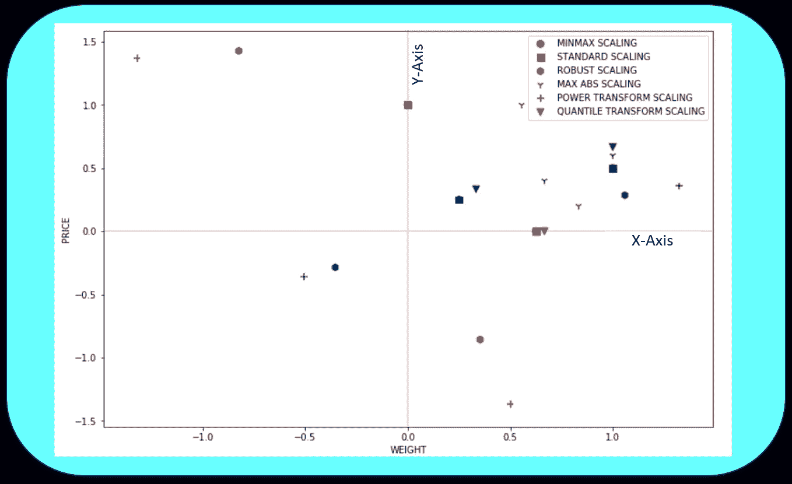

# 最后注意:

特征缩放是机器学习预处理中的一个重要步骤。深度学习需要特征缩放以实现更快的收敛，因此决定使用哪种特征缩放至关重要。有许多针对各种算法的缩放方法的比较调查。然而，像大多数其他机器学习步骤一样，特征缩放也是一个试错过程，而不是单一的银弹。

如果您有任何与功能缩放相关的独特经验，我期待您的评论和分享。感谢阅读。可以联系我@ [LinkedIn](http://www.linkedin.com/in/baijayantaroy) 。

> *每月只需 5 美元，就可以无限制地获取最鼓舞人心的内容……点击下面的链接，成为一名媒体会员，支持我的写作。谢谢大家！* [](https://baijayanta.medium.com/membership)

***参考:***

*[http://sebastianraschka . com/Articles/2014 _ about _ feature _ scaling . html](http://sebastianraschka.com/Articles/2014_about_feature_scaling.html)*

*[https://www . kdnugges . com/2019/04/normalization-vs-standardization-quantitative-analysis . html](https://www.kdnuggets.com/2019/04/normalization-vs-standardization-quantitative-analysis.html)*

*[https://scikit-learn.org/stable/modules/preprocessing.html](https://scikit-learn.org/stable/modules/preprocessing.html)*