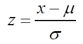
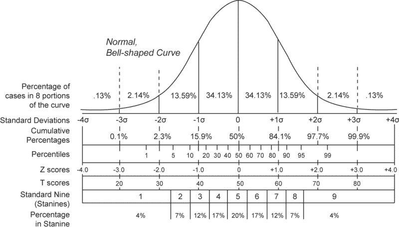

# 关于假设检验，从 p 值到 Z 检验，一应俱全

> 原文：<https://towardsdatascience.com/all-about-hypothesis-testing-from-p-values-to-z-test-all-in-one-efef8a226660?source=collection_archive---------16----------------------->

## 假设检验的一个超级简单的定义，只适用于初学者。

p 值、假设检验、统计显著性或统计检验是您最常听到的词，尤其是当您是数据科学家时。你可以在多种媒体的帖子和 YouTube 视频中找到所有这些定义，这些帖子和视频只涵盖了这些概念的一部分，而将其他的放在一边阅读。因此，随着符号的变化，读者可能会对主要思想感到困惑。所以我决定写一篇帖子，用简单明了的方式涵盖所有与统计测试相关的概念。

Peter Bravo de los Rios 在 [Unsplash](https://unsplash.com?utm_source=medium&utm_medium=referral) 上拍摄的照片

让我们从一个例子开始我们的旅程。披萨时间！

🍕 🍕 [**举例**](https://www.dummies.com/education/math/statistics/what-a-p-value-tells-you-about-statistical-data/) **:假设一家快餐声称其送货服务平均为 30 分钟或更少。这是我们所期待的，也是所有人所想的。但是因为你是一个好奇的人，你想测试这个想法。**

1.  有一种说法(送货服务平均 30 分钟或更少)说我们想测试一下。我们称之为**假设。**
2.  有一个公认的说法是，送货服务平均 30 分钟或更少。我们称之为**零假设**。零假设目前是可以接受的。
3.  你有一个想法，即送货服务可能平均超过 30 分钟。所以你应该做个测试。因此，你可以接受这个主张(零假设)或者拒绝它。你的主张叫做**替代假设**。请注意，你测试快餐的说法，你决定是否接受或拒绝。

现在你应该选择一个阈值来显示你的测试的可信度。你想有 99%的把握，那么置信度应该是 0.99。你应该在开始实验前决定。

从送货服务开始取样。您的样本是独立的，并且您收集了足够的(超过 30 个)样本。您的样本是随机选择的，具有正态分布。

到现在为止，你已经定义了你的问题。你有一个零假设，一个替代假设和足够多的随机样本。假设我们想要 95%的置信度，这意味着与正常状态的 0.05 偏差对您来说是很重要的。我们称之为显著水平(alpha)。这意味着如果参数超过阈值(α),则该参数异常。

我们首先转换样本。为什么？因为我们希望有一个简单、独特和易懂的度量标准来理解。由于样本来自正态分布，我们选择**标准正态分布**(均值=0，标准差=1)。我们可以简单地将数据从任何正态分布转换成标准正态分布。现在出现了 [z-score](https://mathbitsnotebook.com/Algebra2/Statistics/STzScores.html) (这部分是借用了【mathbitsnotebook.com】的)。A *z* -score(或*标准分数*)代表给定值 *x* 偏离平均值 *μ* 的标准偏差数。

> [**“def。**](https://mathbitsnotebook.com/Algebra2/Statistics/STzScores.html)***-得分****是位置的度量，表示数据值偏离平均值的标准偏差数。是一个**标准正态分布的水平刻度。”***

**

*[链接](https://www.google.com/search?q=normal%20distribution%20with%20z-score&tbm=isch&tbs=sur%3Afc&rlz=1C1SQJL_enIR855IR855&hl=en&ved=0CAIQpwVqFwoTCLi2y62w3OoCFQAAAAAdAAAAABAC&biw=1381&bih=612#imgrc=Pdux2RHcgO0cMM)*

*所有正常曲线下的面积都是相关的。例如，平均值以上 1.5 个标准偏差右侧的面积百分比对于**所有的**正常曲线都是相同的。使用 Z 得分计算的面积百分比(比例、概率)将是一个介于 0 和 1 之间的小数值，并将出现在 Z 得分表中。任何正常曲线下的总面积是 1(或 100%)。由于正态曲线关于平均值对称，因此平均值两侧的面积为 0.5(或 50%)。*

> *变量的 z 值小于 0.36 的概率。*

*假设我们有一个样本，我们计算它的 z 分数，称为**z。**另一方面，找出阿尔法参数的 z 分数，称为 **zc** 。如果 **z** 与 **zc，**交叉，则意味着我们与平均值(0)有显著的距离，这是一种异常事件。**Z 值越高或越低，结果越不可能是偶然发生的，结果越有可能是有意义的。**注意阿尔法是从 **zc** 向右的曲线下的面积。(我们在右边的尾巴上测试。)*

> ***p 值**是获得样本的概率**比我们接受零假设时在样本中观察到的更极端**。这里有一个 **p%的机会**我们会看到由于随机噪声平均交付时间会**更长。***

*因此，如果我们有更低的 p，我们可以说，由于噪声，这个事件不发生的几率更大。如果 p 足够小(从我们之前设置的阈值α开始)，我们可以拒绝我们的零假设，因为它被嘲笑我们有一个异常事件(我们接受零假设是真的),随机噪声发生的几率很低。它不受噪音的影响，但它确实发生了，并不像我们第一次声称的那样。*

*因此，我们的样本 z 值穿过 **zc(其中曲线右下方的面积是标准正态分布中的α)**，从 z 值到标准正态分布右侧的曲线面积就是我们的 p 值。因此，如果 p 值低于α(显著水平),那么我们称事件为异常。然后我们可以拒绝我们的无效假设。*

*你可以在这个视频中找到一个简单的例子:*

***但是最后一件事**。你在大部分教程的 z-score 的公式里看到的都是 sqrt(n)。这个 sqrt(n)是干什么的？*

**

*请注意，当我们有多个样本时，我们会找到样本平均值的 z 得分。我用这个数学堆栈交换来回答:*

* [## 为什么归一化的 z 值会引入平方根？(还有更多困惑)

### begingroup$如果$X$是一个正态随机变量，你可以记录它的一个观察值，$x$并将其与均值相比较…

math.stackexchange.com](https://math.stackexchange.com/questions/845769/why-does-the-normalized-z-score-introduce-a-square-root-and-some-more-confusio) 

如果 X 是一个正态随机变量，你可以记录下对它的观察，并将其与平均值进行比较。通常的做法是将变量标准化，即，

假设 X1，X2，…Xn 是随机变量，来自与上面 XX 相同的分布。如果我们记录每个的观察值并计算平均值，那也是一个随机变量。然而，我们不能期望均值，我们的新随机变量，和我们的原始分布有相同的分布。它*会*有相同的均值，但不会有相同的方差。有一个直觉，如果你增长了足够多的 n，然后把你的样本分成不同的组，每组中的平均值是一个随机变量，具有相同的均值分布，但平均值彼此越来越接近，因为它们模糊了异常值数据。(只是再想一想得到一个直觉)。实际上是方差除以 n，所以公式这样变。

现在你明白了在统计测试中你需要的所有单词的定义。

快乐的数据科学时间。*