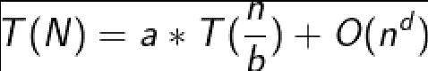
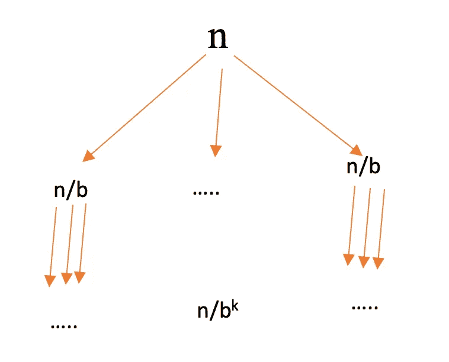
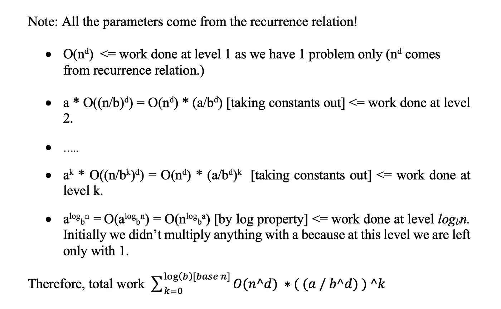
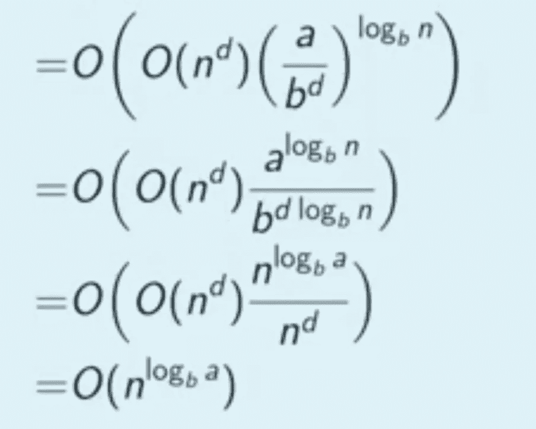
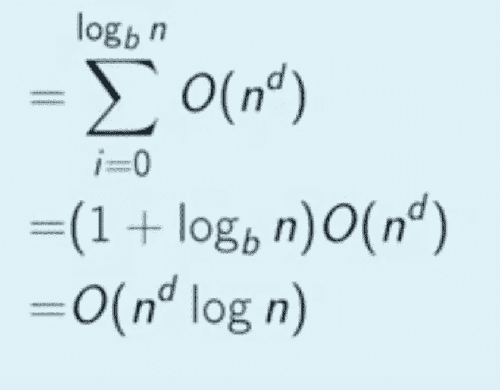

# 关于主定理及其证明！

> 原文：<https://towardsdatascience.com/all-about-mater-theorem-with-its-proof-93455cdb6a4e?source=collection_archive---------5----------------------->

## 简介:这是通过递归关系求任何算法时间复杂度的最佳方法(捷径)/技巧。

来源:[雅各布·欧文斯](http://@jakobowens1)通过 [Unsplash](https://www.unsplash.com)

# 主定理

*主定理的版本仅适用于递推关系的形式:*

**作者图片**

*   其中 a ≥ 1，b≥1，d≥ 0

主定理有三种情况:

> **情况 1:d<log(a)【base b】**=>时间复杂度=**o(n ^ log(a)【base b】)**
> 
> **案例二:****d = log(a)【base b】**=>时间复杂度= **O((n ^ d) * log(n) )**
> 
> **案例三:****d>log(a)【base b】**=>时间复杂度= **O((n ^ d))**

# 主定理的证明

主定理的上述形式表示问题是树的形式，并且树的形成如下所示:

**各层次的问题划分(图片由作者提供)**

> *还有，我们都知道，如果一个问题可以用如上的树的形式来表示，那么它最多到层次****log(n)【base b】****。*

## ***每一级所做的功表示为:***

**各级完成的工作！**

> **注意:上图最后一行有一处修正，应该是“log(n)[base b]”，而不是“log(b)[base n]”。**

在我提供对主定理的每种情况的证明之前，有一些概念我需要弄清楚，它们解释如下:

*   *在一个几何级数中，由于级数中的每一个下一个元素相差一个公倍数的整数，习惯上我们把它取为“r”。*
*   几何级数的和公式是 a *(1-r^n)/(1–r)，其中 a 是第一项。

## 案例 1 的证明； **d < log(b)【基数 a】**:

*   上述情况也可以理解为在树的每个后续级别中所做的工作都在增加。
*   同样，当 r < 1 in a Geometric series, so, in this case, the major term will be the last term of the geometric series which will be having the maximum effect.
*   So, in the total work done formula we take to take only the last term, i.e. substitute k = log(n) [base b] in the time complexity expression.

**求解表达式**时也是如此

这个表达式需要对数属性来求解，所以请研究一下。

我们得到了我们以前说过的结果。因此证明。

## 案例 2 的证明；d = log(b)[基数 a]:

这意味着在每一级中所做的功是相等的，所以我们可以很容易地通过将*乘以级数*和*在每一级上所做的功得到最终的功。*

因此证明。

## **案例 3 的证明；****d>log(a)【base b】:**

这意味着所需的功在随后的各级中不断减少= >在第一级中所做的功是最大的= >我们只需要考虑第一项。

**这显然为 O(n^d).提供了**

因此证明。

我希望你们喜欢这篇文章，并且容易理解总是令人困惑的主定理的证明。