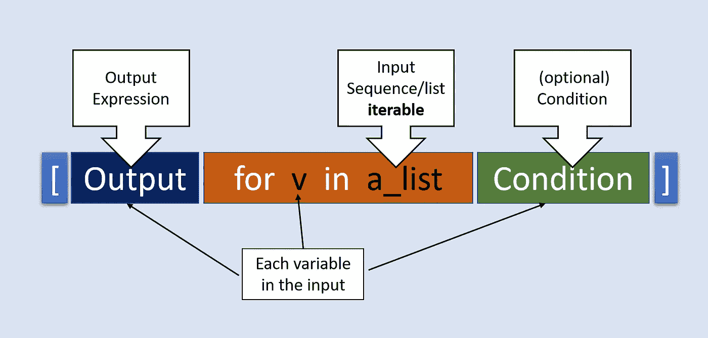
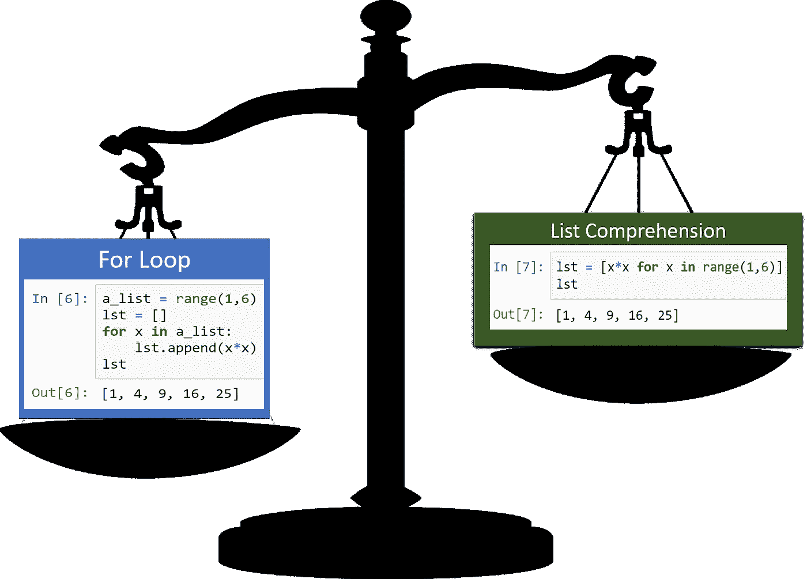
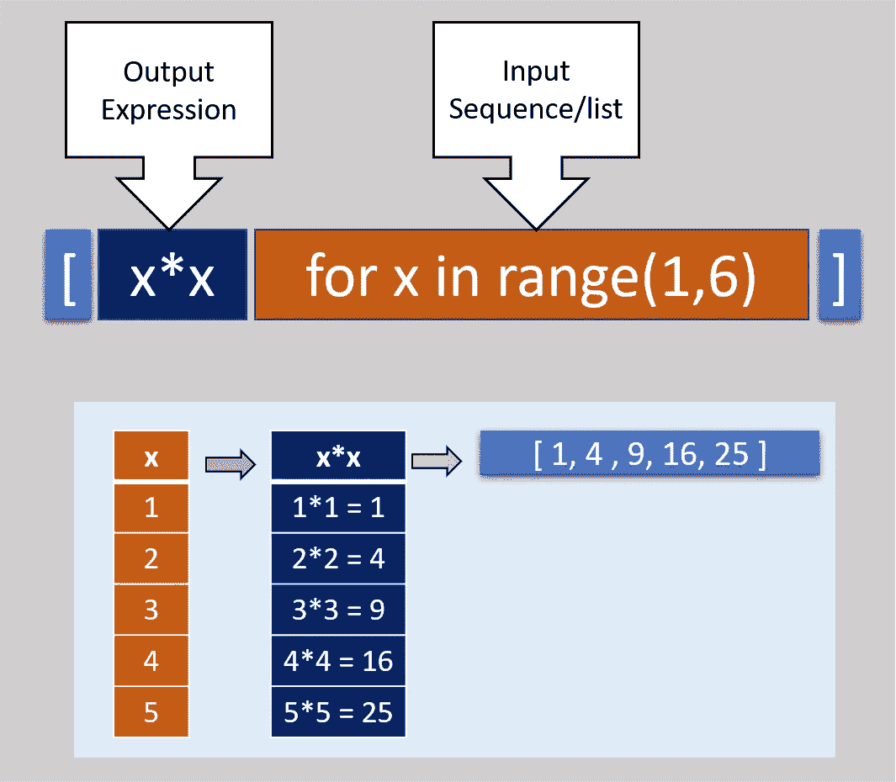
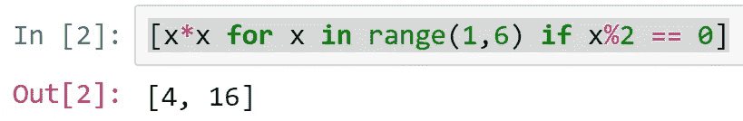
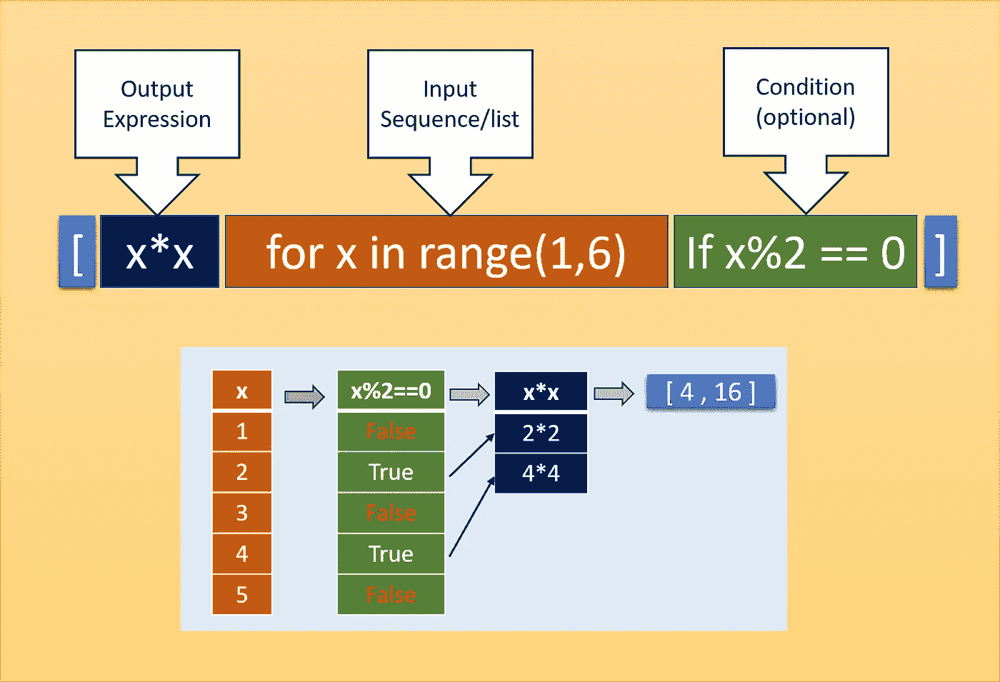
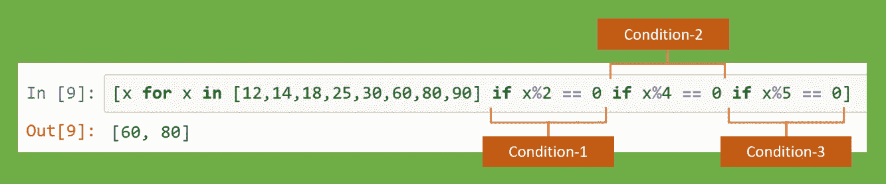
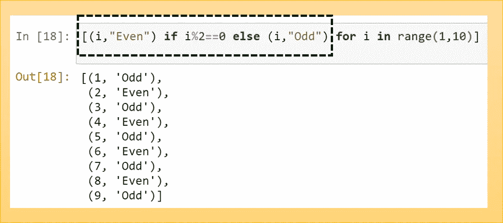
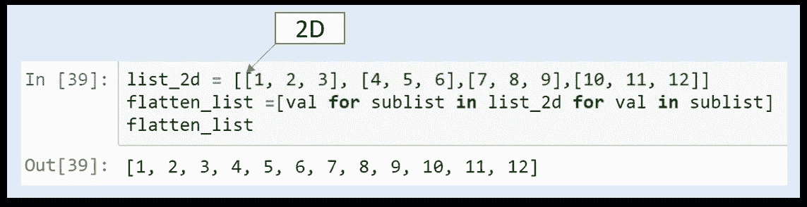
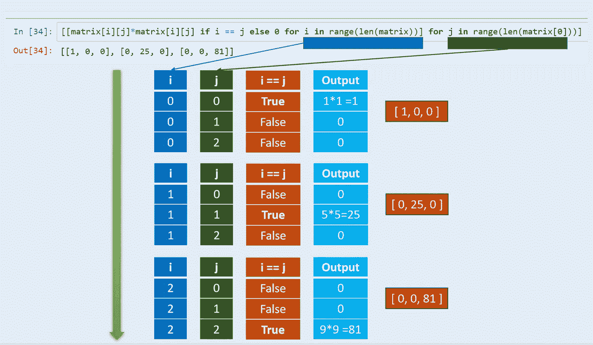

# 关于 Python 列表理解的所有内容

> 原文：<https://towardsdatascience.com/all-about-python-list-comprehension-14dd979ec0d1?source=collection_archive---------30----------------------->


图片提供:Pixabay

## 优雅、舒适、简洁、快速的列表创建方式

Python 是一种用简洁的代码表达的语言，非常优雅，易于理解。列表理解提供了一种创建列表的简洁方法。列表理解是构建一个可访问的、简洁的、快速的列表的合适的“pythonic 式”方法。它允许使用一行代码对列表执行复杂的操作。

# 什么是列表理解？

列表理解为我们提供了一种简单的方法来创建一个基于某种序列的列表或者另一个我们可以循环的列表。在 python 术语中，任何可以循环的东西都称为 iterable。在最基本的层面上，列表理解是一种从现有列表创建列表的语法结构。列表理解的核心，就是循环(“for”循环)。我们可以将任何列表理解表示为 for 循环，但是当我们在一行中用等价的列表理解来表示它时，它看起来确实是独一无二的。

列表理解有以下几个重要部分:

1.  一个可迭代的输入序列(可以是一个列表、一个范围或者任何序列)，我们使用一个变量名来迭代它。
2.  输出表达式
3.  变量过滤或映射或执行某些逻辑操作的可选条件



例如，如果我们想从 1 到 5 的变量列表中创建一个正方形列表，我们可以像下面这样使用标准的 For 循环，但是当我们使用列表理解时，它变得简洁和轻量级。



图片:Pixabay 的称重机

如果我们分解列表理解部分，它看起来如下。



解释一个简单列表，包括每个输入变量的输出平方

因此，这里 iterable 是 range(1，6)，x 是表示该范围内每个值的变量。对于每个 x (1，2，3，4，5)，输出表达式 x*x 计算相应的输出(1，4，9，16，25)，最终成为最终的输出列表(参考上图)。

基本构造之外的几种用法:

# 1)基于条件的过滤

列表理解提供了一种方法来检查条件，并从输出的输入列表中过滤掉我们不需要的元素。这种过滤发生在输出表达式发生之前。参考下面的例子，我们只计算那些能被 2 整除的变量的平方。



带有过滤条件的列表理解

# 2)嵌套条件

列表理解可以用来检查嵌套条件。参考下面的代码，我们想找到输入列表中所有的变量都可以被 2，4 & 5 整除。



# 3)如果..列表理解中的 else

我们可以在 Python 的列表理解中使用“if-else”。参考下面的代码块，它查找奇数和偶数的数字列表。我们需要首先指定输出是什么，接着是“if”条件，然后是“else”，接着是“else”下的输出是什么



注意，如果不使用逗号和括号，我们不能直接打印输入值。

# 4)扁平化多维列表

假设我们必须展平一个 2D 列表。我们可以很容易地通过使用子列表来理解列表。



我们怎样才能使 3D 列表变平？这变得有点复杂，我们首先将 3D 平铺到 2D，然后将 2D 平铺到 1D。在下面的例子中，蓝色下划线部分是使 2D 从 3D 列表变平的步骤，然后外部部分对 1D 进行变平。


# 5)嵌套的“for”列表理解

我们可以对多个嵌套的“for”循环使用列表理解。当我们使用嵌套列表理解时，我们必须注意执行的顺序。假设我们有一个 3x3 的正方形矩阵，我们想使用这个矩阵创建一个矩阵，其中所有对角线值都必须是正方形，而其他值必须为零。这里的输出是一维的，我们需要额外的逻辑来转换成 2D 矩阵形式。这里我使用了“列”和“行”来解释，但是也可以直接用在“for 循环”中，不需要中间变量(如下面列表理解中所使用的)。

```
matrix = [[ 1, 2, 3],
          [ 4, 5, 6],
          [ 7, 8, 9]]row = len(matrix)
column = len(matrix[0])
output = []
for i in range(row):
    for j in range(column):
        if i == j:
            output.append(matrix[i][j] * matrix[i][j])
        else:
            output.append(0)

output
[1, 0, 0, 0, 25, 0, 0, 0, 81]
```

现在我们看到等价的嵌套列表理解(只有一行，但是为了容易理解，我用了 3 行)。

```
[[matrix[i][j]*matrix[i][j] if i == j else 0 
              for i in range(len(matrix))] 
                  for j in range(len(matrix[0]))]
```

现在，让我们通过每个循环是如何工作的图片来理解这一点。循环执行顺序是从上到下(绿色粗体箭头)。我们首先完成内部循环(深绿色)，然后控制回到外部循环(蓝色)。这里的列表理解是一行，而普通的“for 循环”是五行，如上面的代码所示。我们也可以通过在第一个 for 循环后加括号直接得到输出的矩阵形式。



# 列表理解的优势

1.  列表理解的一个显著优点是开发人员需要编写更少的代码
2.  列表理解通常变得更容易理解
3.  当向列表追加项目时，列表理解的速度明显优于 for 循环
4.  列表理解是内置的**映射**和**过滤器**函数的一个很好的替代品

# 其他理解

在 Python 中，我们也有“字典理解”和“集合理解”,它们在操作上是相似的，但只适用于字典和集合。Python 也有“生成器表达式”，它使用了“圆形”括号。

# 最后一个音符

当我开始我的 Python 之旅时，我曾经发现理解列表理解是如何工作的很有挑战性。一旦我明白了它的优雅和力量，我就再也没有回头。尽管一开始感觉有点吓人，但是经过一点练习，每个 python 爱好者都可以爱上列表理解。

我期待着你的评论和分享，如果你有任何独特的列表理解的经验。感谢阅读。可以联系我@ [LinkedIn](http://www.linkedin.com/in/baijayantaroy) 。

只需每月 5 美元，就可以无限制地获取最鼓舞人心的内容……点击下面的链接，成为媒体会员，支持我的写作。谢谢大家！
[***【https://baijayanta.medium.com/membership】***](https://baijayanta.medium.com/membership)