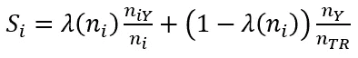
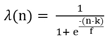
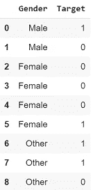

# 分类任务的目标编码

> 原文：<https://towardsdatascience.com/all-about-target-encoding-d356c4e9e82?source=collection_archive---------35----------------------->

## 设置上下文以实现多类分类的目标编码


在 [Unsplash](https://unsplash.com?utm_source=medium&utm_medium=referral) 上由 [Silvan Arnet](https://unsplash.com/@silvanarnet?utm_source=medium&utm_medium=referral) 拍摄的照片

## 背景

最近我做了一个项目，其中的目标是多类。这是一项简单的预测任务，数据集既包括分类特征，也包括数字特征。

对于那些想知道什么是多类分类的人:如果你想用‘0 对 1’、‘点击过的对没点击的’或者‘猫对狗’来回答，你的分类问题是二进制的；如果要用‘红色 vs 绿色 vs 蓝色 vs 黄色’或者‘轿车 vs 舱口 vs SUV’来回答，那么问题就是多级的。

因此，我正在研究合适的方法来编码分类特征。不用猜，我被带到了 medium 文章中，列举了 mean target 编码的好处，它如何优于其他方法，以及如何使用 [category_encoders](http://contrib.scikit-learn.org/category_encoders/index.html) 库只用两行代码就完成了任务。然而，令我惊讶的是，我发现没有文章在多类目标上演示这一点。我查阅了 category_encoders 的文档，发现它没有提到支持多类目标。我深入研究了一下[源代码](http://contrib.scikit-learn.org/category_encoders/_modules/category_encoders/target_encoder.html#TargetEncoder)，发现这个库只适用于二进制或连续目标。

> 所以我想:“每一个问题背后都蕴藏着一个机会。”—罗伯特·基波萨基

继续深入，我直奔丹尼尔·米西-巴雷卡的[原始论文](https://dl.acm.org/doi/10.1145/507533.507538)，该论文介绍了平均目标编码。不仅对于回归问题，本文还给出了二元分类和多类分类的解决方法。这也是 category_encoders 引用的关于目标编码的论文。

虽然有几篇文章解释了回归和二进制分类问题的目标编码，但我的目标是实现多类变量的目标编码。然而，在此之前，我们需要了解它是如何对二进制目标完成的。在本文中，我将概述介绍目标编码的文章，并通过示例展示目标编码如何解决二进制问题。

## 该理论

简而言之，这篇论文对分类目标是这样说的:

(如果您希望通过示例来理解，请跳过本节)

人们可以将一个类别的每一次出现映射到目标属性的概率估计。在分类场景中，数字表示对应于目标的后验概率，由分类属性的值决定。给定分类属性的值，这实际上是目标期望值的数字表示。为了避免由于一个类别中的少量观察值而导致的过度拟合，还应用了均值平滑。

让我们实际地看待这个问题。在二元问题中，目标不是 0 就是 1。然后，分类变量中的类别的概率估计可以由经验贝叶斯概率 P(Y=1|X=Xi)给出，即



其中，n(TR)是总行数，n(Y)是目标值为 1 的总行数，n(i)是第 I 个类别的行数，n(iY)是第 I 个类别中目标值为 1 的行数。因此，第一项中的分数表示第 I 类中概率为 1，而第二项中的分数表示整体数据中概率为 1。λ是一个给出单调权重的函数，当我们有少量的几个类别时，这很有帮助，随着 n(i)计数从 0 到 1 增加。



如果您使用了 category_encoders 库中的 TargetEncoder，k 是“min_sample_leaf”参数，f 是“smoothing”参数。

引入加权因子是有意义的，因为当样本量很大时，我们应该对上面第一项提供的后验概率估计值给予更多的信任。然而，如果样本量很小，那么我们用从属属性的先验概率(即所有 y 的平均值)给出的零假设来代替概率估计。通过这种转换，丢失的值被当作另一个变量来处理。

本文也将同样的概念推广到多类目标。我们对每一类目标都有一个新的特性。在给定分类属性的值的情况下，每个特征实际上是一类目标的期望值的数字表示。当然，如果目标有非常多的类，输入的数量会显著增加。然而，实际上班级的数量通常很少。请在我的下一篇文章中阅读更多相关内容。

在下一节中，我们用一个例子来看看二进制分类的情况。

## 一个例子

让我们看一个二进制目标例子。



如果特征性别的类别是‘男性’，目标为 1 的概率是多少？

是 1/2=0.5。

同样，如果特征性别的类别是‘女性’，目标为 1 的概率是多少？

是 1/4=0.25。

够简单吗？

等等，现在如果你用 0.25 代替所有出现的“女性”，你就冒了所谓的过度拟合的风险。这是因为你没有考虑到 1 的总概率不是 0.5。是 4/9=0.4。

为了说明这一事实，我们使用上一节中显示的公式，给这个“先验”信息添加一个权重。

设置 min_sample_leaf，k=1 和平滑，f=1，

对于‘男性’，我们有两行，所以 n = 2；

```
λ(‘Male’)=1/(1+exp(-(2–1)/1))=0.73    # Weight Factor for 'Male' Target Statistic=(Weight Factor * Probability of 1 for Males)
                  + ((1-Weight Factor) * Probability of 1 Overall)S(‘Male’)=(0.73 * 0.5) + ((1–0.73) * 0.4) = 0.485
```

同样，对于‘女性’，我们有四行，所以 n = 4；

```
λ(‘Female’)=1/(1+exp(-(4–1)/1))=0.95    # Weight Factor for 'Female'Target Statistic=(Weight Factor * Probability of 1 for Females)
                  + ((1-Weight Factor) * Probability of 1 Overall)S(‘Female’)=(0.95 * 0.25) + ((1–0.95) * 0.4) = 0.259
```

如果您仔细观察，您可能会注意到λ有助于突出那些行数较多的类别。在我们的例子中，有 4 行性别“女性”，而只有 2 行性别“男性”。相应的权重因子分别为 0.95 和 0.73。

因此，用 0.485 替换所有出现的“男性”，用 0.259 替换所有出现的“女性”。“其他”的值可以以类似的方式计算。

恭喜你！您刚刚实现了目标编码。

不信任我？

通过运行下面的代码自己检查一下，它使用您最喜欢的 category_encoders 库做同样的事情:

```
!pip install category_encodersimport category_encoders as cex=['Male','Male','Female','Female','Female','Female','Other','Other','Other']y=[1,0,0,0,0,1,1,1,0]print(ce.TargetEncoder().fit_transform(x,y))
```

## 结论

在本文中，我介绍了 category_encoders 库的 TargetEncoder 类的一个缺点。我解释并总结了介绍目标编码的文章。我通过一个例子解释了如何用数值代替类别。

我的下一篇文章将完全集中在我们如何对多类目标做同样的事情。敬请期待！

**编辑:**发表下一个，演示实现多类目标编码[这里](https://medium.com/@mohannishant6/target-encoding-for-multi-class-classification-c9a7bcb1a53)。

在 [LinkedIn](https://www.linkedin.com/in/mohannishant/) 上与我联系

在 [GitHub](https://github.com/mohannishant6) 上查看一些我感兴趣的项目