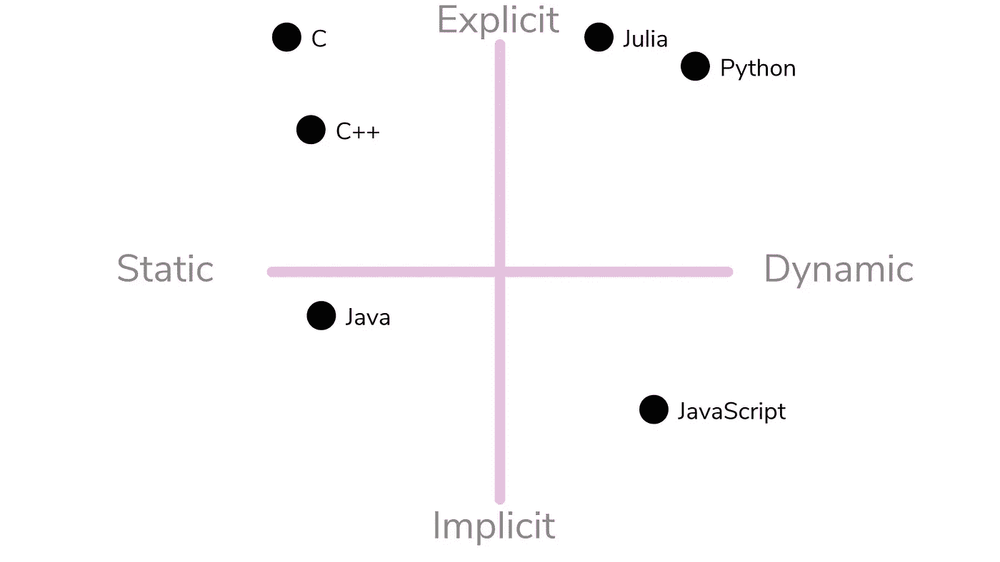
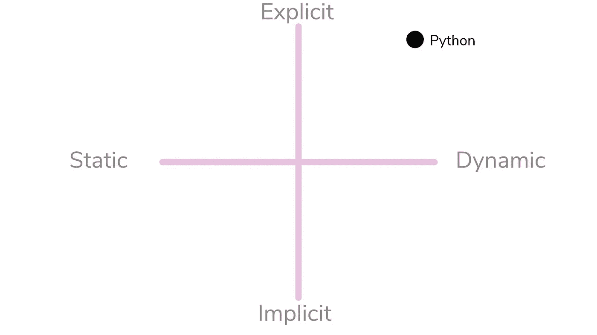
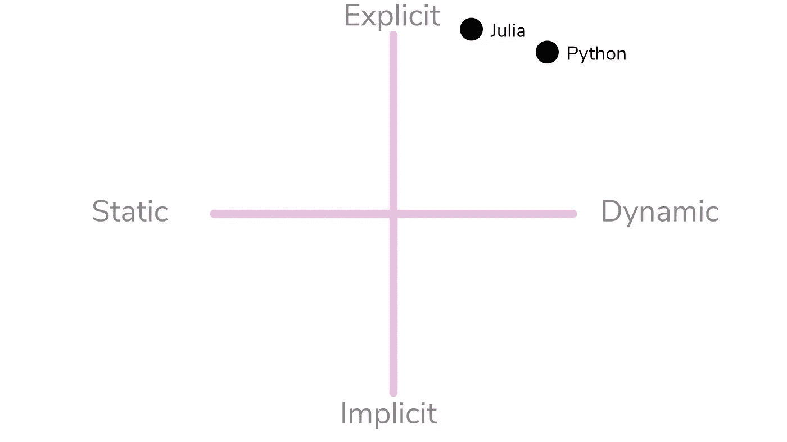
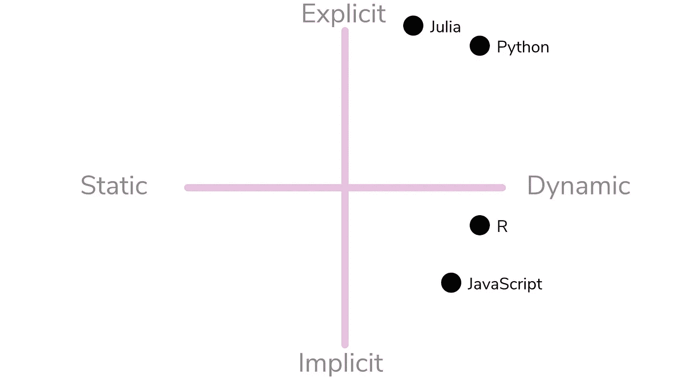
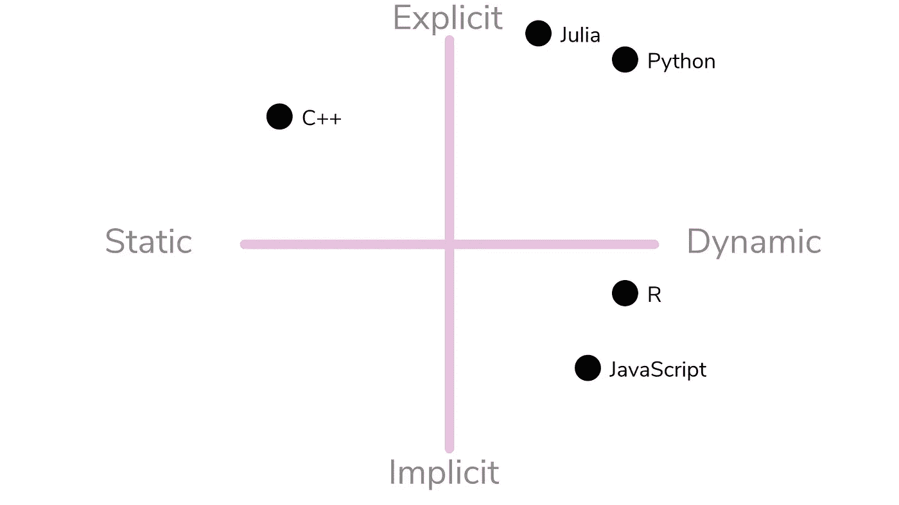

# 关于类型:显式与隐式，静态与动态

> 原文：<https://towardsdatascience.com/all-about-typing-explicit-vs-implicit-and-static-vs-dynamic-980da4387c2f?source=collection_archive---------19----------------------->

## 快速浏览类型以及它们如何与语言交互。

(图片由作者提供)

虽然编程通常被认为是非常复杂的活动，但从最简单的定义来看，它相对容易理解。所有的编程都以移动数据和处理数据为中心，没有例外。即使在编程的最底层，编写机器码，目标也是在注册表和内存地址之间来回移动数据。我个人喜欢将这些编程目标分成四个不同的类别。

1.  获取数据
2.  使用数据
3.  修改数据
4.  发送数据

编程的时候大部分时间都在使用这四个操作中的一个。虽然循环和条件是允许我们操作和处理这些数据的工具，但首先是类型允许我们存储和创建数据。虽然类型是一个很容易理解的概念，但是在编程语言的幕后有很多事情会影响到在特定语言中如何创建、处理和使用类型。在很大程度上，这些观察包括语言处理关于类型的错误(类型错误)的方式，以及在语言的执行中如何处理类型。

# 静态与动态类型

许多编程语言的一个显著区别是它们的编译器处理类型的方式。很可能大多数程序员都熟悉“静态”和“动态”这两个术语，但是这两个术语暗示了什么类型呢？

静态类型是指在执行时创建的类型。这意味着，在这种语言运行它的代码之前，它就已经知道它将使用什么类型，以及它们将如何彼此交互。静态类型具有使类型不可变的优势，这意味着您的数据可以安全地驻留在所述类型中，并且通常需要完成从所述类型中检索数据的工作。这对于需要这种类型应用的代码来说非常好。然而，每当您需要在不同场景中不断改变和使用的类型时，寻找动态类型语言作为解决方案可能是明智的。

动态类型化指的是编译器在运行时处理更多的类型，而不是在编译程序时。像静态类型一样，这当然有应用，但也会产生问题——特别是如果程序员不知道类型在语言中是如何使用的。说静态类型语言或动态类型语言更好可能有点愚蠢，但是对于数据科学中的大多数应用程序来说，动态类型可能是最好的选择。也就是说，在数据科学中使用静态类型语言当然也有好处。

# 隐式与显式类型

程序员应该熟悉的另一个非常重要的概念是隐式和显式类型声明。在使用一门新语言时，这一点可能比它是静态类型还是动态类型更重要。当然，这是主观的，但是我记得我很早就开始使用 JavaScript，因为它会不断地假设我想要使用什么类型——看起来是随机的。隐式和显式类型，也称为强类型或弱类型，是一种编程语言将应用于类型断言的假设量。

隐式类型可以让你摆脱困境，并且在很多情况下让编程变得更加流畅。然而，这样做的缺点是，有一种编程语言会猜测您在幕后试图做什么，这是一个非常严重的缺点。当您对错误的反应是

> “它连一根弦也没有！为什么突然变成一串了？!"

另一方面，显式类型可能会使转换类型和使用类型变得更加困难，但是会产生更可预测的结果。显式是这里的关键词，因为没有假设类型声明，没有显式的指令，类型不会神奇地转换。

# 对一些语言进行分类

最后，为了给出这些概念的含义以及它们在类型中的位置，看看你的语言在更大的画面中的位置可能是个好主意。从许多数据科学家选择的武器开始，Python 是一种非常动态类型化的语言。这一点尤其有效，因为 Python 是一种由 c 语言运行的解释型语言。尽管如此，Python 并不假定你想对你的类型做什么，而且在很大程度上是非常严格和明确的。虽然这不是一门精确的科学，但我认为 Python 会在这两个因素之间找到平衡点:

(图片由作者提供)

如果我没有把我生命中的爱人朱莉娅纳入讨论，这就不是我写的文章。虽然 Julia 肯定是动态类型的，但它利用方法来创建类型之间的不变性和不兼容性，这在某些情况下是不可能的。也就是说，尽管在静态类型化的传统定义范围内，Julia 不是，但考虑到它的即时编译器在执行时编译代码，Julia 也可以被认为比 Python 之类的东西更静态一些。就含蓄或明确而言，Julia 对类型非常认真，不会随便乱搞。这是我真正欣赏朱莉娅的地方，也是我个人更喜欢的地方。

(图片由作者提供)

当我们浏览科学计算的语言时，R 当然是一种值得归类的语言。就动态性而言，r 与 Python 相似，但是在处理类型断言的方式上却有很大的不同。更具体地说，R 可能是一种难以置信的隐性语言。

另一种许多人可能都有过经验，并且可能都很熟悉的语言是一种叫做 JavaScript 的小语言。JavaScript 是一种语言，实际上我很难适应它，因为它在早期具有隐含的本质。虽然肯定有一些更含蓄的语言的例子可以指出，但我要说的是，在我使用过的语言中，它可能是最含蓄的语言之一。

(图片由作者提供)

最后，让我们看看一种可能用于数据科学的静态类型语言。在这个领域中最流行的是 C++。由于 C++的速度、历史以及在科学和其他计算领域的影响力，对于那些寻求在这种范式中工作的人来说，c++是一个很好的面向对象的选择。C++是一种静态类型的、显式的语言——正如您所料。

(图片由作者提供)

# 结论

打字的想法对于一个编程语言角色来说是至关重要的。虽然可以说某些活动用其中一种可能会更好，但这通常是主观的，大多数语言，不管它们在我上面举例说明的指南针上处于什么位置，通常都可以执行相同的任务——也就是说，不考虑性能或级别。

也就是说，虽然这些因素不一定会限制编程语言做某些事情的能力，但是如果使用这种语言的人不知道他们的编程语言的本质，它会对生产率产生很大的影响。知道如何正确地使用和操作你的编程语言是很重要的，当你的语言想承担一些事情，或者你想随时编辑类型的时候，这一点更是如此。此外，在选择编程语言时，这些因素也可以应用到您的选择中，并且是决策过程中的一个重要部分。也许你想从事数据科学，并且非常不喜欢弱类型语言，了解 R 和 Python 之间的这种差异可能是促使你做出结论的一个巨大因素。

另一件要记住的重要事情是——特别是对于显式和隐式类型，这些决定是有尺度的。虽然在静态和动态类型上采取非常规的观点也是如此，但通常这些只是一个布尔值 yes 或 no。有这么多有创意的语言编译器，有些可能两者兼而有之，或者您可能会遇到像 Julia 这样的东西，它能够在任何需要的时候利用两者的优点。