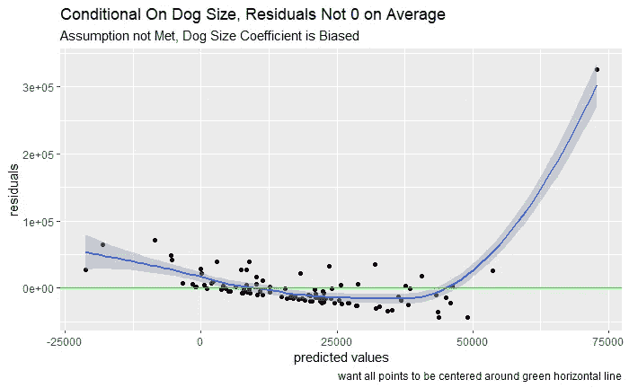

# 一张图中线性回归的所有假设和含义

> 原文：<https://towardsdatascience.com/all-assumptions-and-implications-of-linear-regression-in-one-chart-5674c060025f?source=collection_archive---------34----------------------->

## 你唯一需要的图表+视频讲解

丹·万鲁宁的帖子

为了恰当地解释线性回归，您需要理解满足哪些假设以及它们意味着什么。

下面的图表总结了关键假设及其含义(首先是有限样本 OLS，然后是渐近 OLS)。然后我分享了一个视频，在视频中我讨论了实验的假设，以及它们如何符合回归的假设。最后，我总结了一些关于线性回归假设的要点。

# 关键假设

# 假设的视频讨论

# 线性回归假设:要点

## **无偏性/一致性**

我们希望我们的系数平均来说是正确的(无偏的)，或者至少在我们有大量数据的情况下是正确的(一致的)。

如果你想要无偏的系数，关键的假设是严格的外生性。这意味着给定回归中使用的协变量，回归中误差项的平均值为 0。

对于一致的系数，关键的假设是“预定的回归变量”，这是一个花哨的说法:误差项和回归的任何协变量之间没有相关性。

严格地说，如果不随机分配您希望得到正确系数的协变量，就无法确认这些假设是正确的。没有随机分配，你必须做出一个定性的论证，假设是满足的。然而，如果您在 y 轴上绘制残差散点图，在 x 轴上绘制预测结果值，并且存在远离 0 的系统趋势，则表明该假设不成立。

例如，让我们假设我们正在模拟一个人花在狗美容上的钱的数量作为狗的大小的函数。我们还假设喜欢大狗的人倾向于在狗狗美容上花更多的钱(这是一个我们无法控制的混杂因素)。下面的代码为这个示例和上面建议的图创建了一个示例数据集，这表明假设不成立。这解释了为什么我们估计的大小系数与我们设定的真实值相差甚远。

系数远离+2 的真实效果

假设对于理解系数估计的精度也很重要。

## **了解系数的精度**

无偏/一致系数不需要同伦方差和正态性。如果您想了解使用快捷方法(如 f 检验)测量系数的精确度，只需要这些额外的假设。然而，你总是可以使用异方差稳健标准误差、[自举或随机化推断](/practical-experiment-fundamentals-all-data-scientists-should-know-f11c77fea1b2)来理解精度。

如果你喜欢这篇文章，请在 stat exchange 上投票支持[我的回答，这样更多的人可以从中学习。](https://stats.stackexchange.com/questions/16381/what-is-a-complete-list-of-the-usual-assumptions-for-linear-regression/400600?fbclid=IwAR10LYIhI0DCGCLPidZgqRsw0j_A62Uu6BgOclu5clsfHrPLVh-Edf_dyCA#400600)