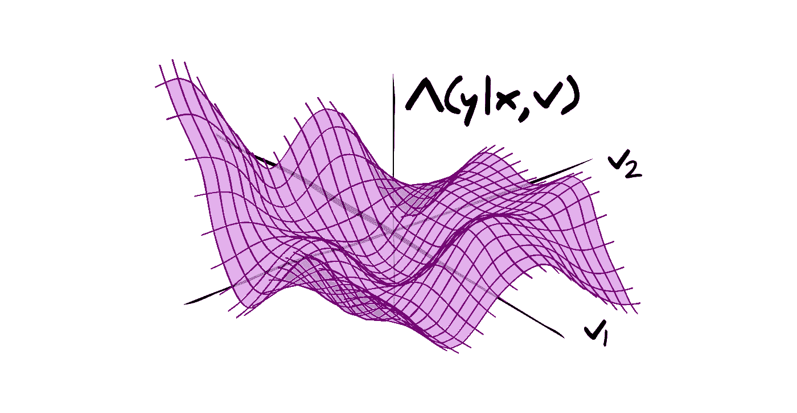
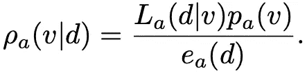
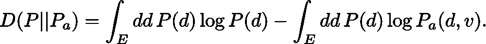
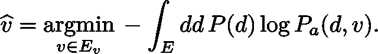
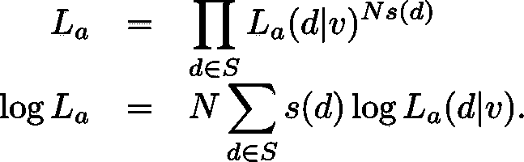
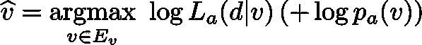
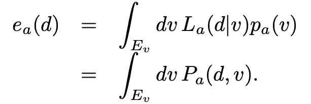

# 所有的深度学习都是建立统计模型

> 原文：<https://towardsdatascience.com/all-deep-learning-is-statistical-model-building-fc310328f07?source=collection_archive---------19----------------------->

作者图片

深度学习通常用于为数据驱动的分析进行预测。但是这些预测的意义是什么呢？

这篇文章解释了深度学习中使用的神经网络如何提供描述事件发生概率的统计模型的参数。

# 事件的发生和任意的不确定性

数据、可观察的事物、事件或任何其他描述我们可以看到和/或收集的事物的方式都是绝对的:我们在一对六面骰子上掷出两个六，或者我们得到一些其他结果的组合；我们掷硬币 10 次，每次都是正面，或者是正面和反面的混合。我们的宇宙以某种方式进化，我们观察它，或者它没有——我们没有。我们不知道，*，*我们是否会在每次投掷硬币时掷骰子或掷人头得到两个六，或者有什么可能的宇宙存在，让我们能够形成并观察它。我们把这种由于缺乏知识而产生的不确定性描述为*任意性。*这是由于关于这种*数据生成的基本信息缺失——*我们永远无法确切知道我们将获得什么结果。我们可以认为随机不确定性是无法知道某个随机数生成过程的随机种子。

我们用函数描述事件发生的概率，*p*‏‏‎‖*:*‏‏‎‖*d*‏‏‎‎∈‏‏‎‖*e*‏‏‎‖*↦*‏‏‎‖*p(d)*‏‏‎‎∈‏‏‎‖【0，1】*，即*概率分布函数，*p **E.* 如果一个事件不可能发生，那么*p(d)*‏‏‎;*=*‏‏‎0，而某个结果有概率*p(d)*‏‏‎;*=*‏‏‎1。 这个概率是可加的，使得所有可能事件的联合*d*‏‏‎‎∈‏‏‎*e*是确定的，*即 p(e)*‏‏‎*=*‏‏‎1。**

稍微滥用一下符号，我们可以写成*d*‏‏‎‖*~*‏‏‎‖*p*，这意味着某个事件 *d* 是从所有可能事件 *E* 的空间中抽取出来的，概率为 *P(d)* 。这意味着观察到事件 *d* 的概率为 100× *P(d)* %。 *d* 可以是一个过程的任何观察、事件或结果，例如，当掷出 *n =* 2 个六面骰子，两个都得到一个六时， *d = (d* *= 0，d* *= 0，d* *= 0，d* ⁴ *= 0，d* ⁵ *= 0，d* ⁶ *= 2 我们事先并不知道通过掷骰子会得到什么结果，但是我们知道有一定的可能性会得到任何特定的结果。在多次重复掷骰子实验(骰子完全平衡且条件相同)后，我们应该看到 *d* 发生的概率是*p(d)*‏‏‎‎≈‏‏‎/₃₆.即使不重复多次掷骰子，我们也可以提供我们*相信的*对我们看到特定结果的可能性分布的估计。*

# 统计模型

为了进行统计预测，我们使用参数化分布 *Pₐ* 对数据分布进行建模。我们可以认为 *a* 定义了一个统计模型，它包含了数据分布的描述*和*模型的任何可能的不可观察参数 *v* ∈ *Eᵥ* 。然后，分布函数将概率值归因于可观察/不可观察事件的发生 *Pₐ : (d，v)* ∈ *(E，Eᵥ* ) ↦ *Pₐ(d，v)*∈【0，1】。需要注意的是，我们可以把这个联合概率分布写成一个条件语句，*pₐ=lₐ**pₐ=ρₐ**eₐ*。这些概率分布函数是:

*   *可能性——lₐ:(d，v)* ∈ *(E，eᵥ*)↦*lₐ(d|v)*∈【0，1】
*   *先验——pₐ:v*∈*eᵥ*↦*pₐ(v*∈【0，1】
*   *后方——ρₐ:(d，v)* ∈ *(E，eᵥ*)↦*ρₐ(v|d)*∈【0，1】
*   *证据——eₐ:d*∈*e*↦*eₐ(d)*∈【0，1】

这些函数的引入允许我们将观察到 *d* 和 *v* 的概率解释为，在给定模型参数值 *v、*的情况下，观察到 *d* 的概率乘以这些模型参数值的可能性——同样，它也等于给定观察到 *d* 的情况下，模型参数值 *v、*的概率乘以在中观察到 *d* 的可能性

对于掷骰子实验，我们可以(也确实)使用多项式分布来模拟数据的分布， *Pₐ = ∏ᵢ n！/d* ⁱ！ *pᵢ* ᵈⁱ其中多项式模型的固定参数为 *v* = *{p₁、p₂、p₃、p₄、p₅、p₆、n } = { p \，n | I*∈【1，6】*}*其中*p \*为从骰子中获得数值*I*∈【1，6】的概率如果我们考虑完全无偏的骰子，那么*p₁=p₂=p₃=p₄=p₅=p₆=*/*₆.*观察到两个六的概率， *d = (d* *= 0，d* *= 0，d* *= 0，d* ⁴ *= 0，d* ⁵ *= 0，d* ⁶ *= 2)，我们用 *n =* 2 掷骰子的多项式模型中的*因此可以估计为 *Pₐ(d)由于模型参数 *v* 是固定的，这相当于为*I*∈【1，6】设置了*pₐ=δ(pᵢ*/*₆，n*2)的先验值，使得*lₐ=∏ᵢ*2(/*₆*)ᵈⁱ*/d*ⁱ！或者 0。*

当然，我们可以建立一个更复杂的模型，其中 *pᵢ* 的值取决于其他因素，例如骰子可以弹开的表面数量，或者投掷的力度，或者在骰子离开我们手的那一刻击中骰子的每个空气分子的速度，或者无数种不同的效果。在这种情况下，分布 *Pₐ* 将根据描述这种物理效应的不可观察参数 *v* 、*即*之间的相互作用，为数据 *d ~ P* 的出现分配概率，在多项式模型中，模型参数的值 *v、*将改变描述 *d* 有多可能*的 *pᵢ* 的值然而，我们可能不知道这些不可观测参数的确切值。因此 *Pₐ* 不仅描述了对数据真实分布的估计，还描述了其对不可观测模型参数的依赖。我们把描述来自不可观测参数的观测数据的概率的条件分布函数称为*似然、* *Lₐ* 。由于模型 *a* 描述了整个统计模型，模型参数 *v* 的先验概率分布 *pₐ* 是模型的固有属性。*

我们不知道模型 *a* 中参数的值 *v* (甚至缺乏关于模型本身选择的知识)这一事实引入了不确定性的来源，我们称之为*认知*——这种不确定性是由于我们*可以通过观察事件的支持*了解到的事情。因此，尽管由于来自数据分布 *P* 的事件 *d* 发生的真实随机性质而存在随机不确定性，但也存在认知不确定性，这种认知不确定性来自使用 *Pₐ* 对该分布进行建模。然而，先验分布 *pₐ* 不应该与认知不确定性混淆，因为先验是对特定模型*和*的选择。可能使用不明智的先验分布选择(由于统计模型的定义),这不允许模型得到数据的支持。

例如，对于掷骰子问题，当我们建立一个模型时，我们可以决定我们的模型是确定的，并且模型参数的可能值的先验分布是*pₐ=δ(pᵢ*/*₆，n*-2)对于*I*∈【1，6】。在这种情况下，认知的不确定性将不被考虑在内，因为假设没有什么我们可以了解的。然而，如果骰子被加权，使得 *p₁ = 1，p₂ = p₃ = p₄ = p₅ = p₆ = 0* ，那么我们将永远得不到两个 6，我们的模型也不会得到数据的支持。相反，如果我们选择一个不同的模型*a*’，它是一个多项分布，但是其中关于 *pᵢ* 的可能值的先验分布是这样的，在∑ *ᵢ pᵢ =* 1 的条件下，它们可以取从 0 到 1 的任何值，那么没有假定的知识(在这个特定的模型内)。因此，由于我们缺乏知识，存在着很大的认知不确定性，但这种不确定性可以通过在观察可用数据时推断可能的参数值来减少。

## 主观推断

我们可以使用主观推断(通常称为贝叶斯推断)了解观察到的数据支持哪些模型参数值，从而减少我们选择模型时的认知不确定性。使用联合分布的条件展开的两个等式， *Pₐ，*我们可以计算后验概率，在模型 *a* 中，当某个 *d ~ P* 被观察到时，参数具有值 *v*

这个后验分布现在可以用作新模型的基础，*a′*，具有联合概率分布*pₐ*′，其中*pₐ*′=*ρₐ，即 pₐ*′=*lₐ**pₐ*′。请注意，模型的形式没有改变，只是由于数据的支持，我们对模型参数的确定性有所改变——我们可以使用这个新模型对数据的分布做出更明智的预测。

在众多方法中，我们可以使用 MCMC 技术来描述后验分布的特征，从而减少这一假设模型中的认知不确定性。然而，无论对错，人们通常只对数据的最佳拟合分布感兴趣，*即*找到 *v* 的集合，其中 *Pₐ* 与*p*最相似

## 最大似然和最大后验估计

为了使模型符合数据的真实分布，我们需要测量两个分布之间的距离。最常用的度量是相对熵(也称为 Kullback-Leibler (KL)散度)

相对熵描述了由于用 *Pₐ(d，v)* 逼近 *P(d)* 而丢失的信息。相对熵有一些有趣的性质，这使得它不能作为理想的距离度量。首先，它不是对称的，*d(p*∩*pₐ)*≦*d(pₐ*∩*p)*，因此它不能被用作度量。我们可以采用*d(pₐ*∩*p)*和*d(p*∩*pₐ)*的对称组合，但问题仍然存在，例如 *P* 和 *Pₐ* 必须定义在同一个域上， *E* 。其他测量，例如推土机距离，在这里可能具有优势，因为它是对称的，并且可以在不同的坐标系上定义(并且当用作任意函数而不是用于预测模型参数时，现在可以使用神经网络很好地近似)。然而，我们仍然经常考虑相对熵。重写相对熵我们看到，我们可以用两个术语来表示相似性的度量

第一项是数据分布的负熵，*即*通过观察一个结果可以获得的预期信息量，直接类比于统计热力学中的熵。第二项是交叉熵， *H(P，pₐ)*，它量化了将一个分布 *P* 与另一个分布 *P* ₐ *区分开所需的信息量，即*需要多少次 *d ~ P* 的抽取才能判断出 *d* 是从 *P* 中抽取的，而不是从 *P* 中抽取的注意，在这种相对熵的形式中，只有一组自由参数 *v* ，然后我们可以尝试通过最小化相对于这些参数的相对熵，使 *Pₐ* 尽可能接近 *P*

但是我们实际上是如何做到的呢？我们可能无法访问所有可能的数据分布来进行积分。相反，考虑一个采样分布，*s:d*∈*s*↦*s(d)*∈【0，1】，其中 *s(d)* 是来自采样空间的事件的归一化频率，其中 *N* 的条件独立值为 *d* ， *S* ⊆ *E* 。在这种情况下，积分变成一个和 *H(P，pₐ)*≊∑s*(d)*log*pₐ(d，v)。*使用条件关系，我们然后如前写下 *Pₐ = Lₐ* *pₐ* ，这样交叉熵是 *H(P，pₐ)*≊∑s*(d)*log*lₐ(d| v)*∑s*(d)*log*pₐ(v).*由于先验独立于数据，它只是向交叉熵添加了一个附加常数。

换句话说，我们可以把可能性写成概率的乘积，给出抽样分布中数据出现的频率

所以，除了由于先验的加性常数，交叉熵与模型中数据的似然负对数成正比。这意味着最大化数据相对于模型参数的可能性的对数，假设所有 *v* 的均匀先验(或忽略先验)等同于最小化交叉熵，这可以解释为最小化相对熵，从而使 *Pₐ* 尽可能接近 *P* 。忽略交叉熵中的第二项提供了参数值的非主观最大似然估计(非主观意味着我们忽略了参数值的任何先验知识)。然而，如果我们考虑先验，我们恢复最简单形式的主观推断，*最大后验概率(MAP)* 估计

其描述了一组参数值 *v* ，其提供尽可能接近 *P* 的 *Pₐ* 。这里必须强调一点，因为我们使用抽样分布， *s，*最大化可能性(或后验概率)实际上为我们提供了最接近抽样分布的分布 *Pₐ* ， *s* 。如果 *s* 不代表 *P，*则该模型不一定是 *P* 的合适模型。第二点需要注意的是，尽管 *Pₐ* 可能尽可能接近 *P* (或实际上 *s* ) 与这组 *v* ，但可能性(或后验概率)的模式实际上可能远离分布的高密度区域，因此根本不能代表更可能的模型参数值。当使用 MCMC 技术或类似技术考虑整个后验分布时，这是可以避免的。本质上，使用最大似然或最大后验估计，认知误差将被大大低估，而没有考虑大部分先验(或后验)概率密度。

## 模型比较

请注意，到目前为止还没有声明说一个型号*一个*实际上有任何好处。我们可以通过计算证据来测量模型与数据 *d* 的拟合程度，这相当于对模型参数*即*的所有可能值进行积分

通过选择一个不同的模型*a*’和它自己的一组参数 *u* ∈ *Eᵤ* ，我们可以得出一个标准来描述是模型 *a* 还是*a’*更符合数据 *d* 。请注意，该标准不一定定义明确**。**我们是更喜欢与数据完全吻合但具有半无限数量参数的模型，还是更喜欢参数很少但拟合度不太好的优雅模型？在神经网络出现之前，我们通常选择参数最少的模型，这些模型能够很好地拟合数据，并进行归纳，以对未来事件做出一致的预测——但这仍有待讨论。

到目前为止所描述的一切都是科学方法。我们观察一些数据，并希望对未来观察的可能性进行建模。因此，我们建立一个参数化的模型来描述观察结果和它发生的可能性，了解该模型参数的可能值，然后根据某些标准(如奥卡姆剃刀或其他标准)来改进该模型。

# 神经网络作为统计模型

## 深度学习是一种建立数据分布模型的方法

不管目标是什么——监督学习、分类、回归、生成等等——深度学习只是为数据的分布建立模型。对于监督学习和其他预测方法，我们认为我们的数据， *d，*是一对输入和目标， *d = (x，y)* 。例如，我们的输入可以是猫和狗的图片， *x* ，附带标签， *y* 。然后，我们可能想要对先前未看到的图像*x*’进行标签*y*’*’*的预测——这相当于对一对相应的输入和目标 *d、*进行预测，假定部分 *d* 是已知的。

因此，我们希望使用神经网络对分布 *P* 进行建模， *f: (x，v)* ∈ ( *E，Eᵥ)* ↦ *g= f(x，v)* ∈ *G* ，其中 *f* 是一个由权重、 *v、*参数化的函数，它接受输入 *x* 函数的形式 *f* 由超参数化*a*描述，包括架构、初始化、优化例程，以及最重要的损失或成本函数*λₐ:(d，v)* ∈ *(E，eᵥ)*↦*λₐ(y|x，v)* ∈ K [0，1】。损失函数描述了数据出现概率的非标准化度量， *d = (x，y)，*带有不可观察参数， *v* 。也就是说，当给定 *x* 时，使用神经网络对 *y* 进行预测等同于对数据 *d* 出现的概率 *P* 进行建模，其中分布的形状由网络 *a* 的形式和属性以及 it 参数 *v* 的值来定义。我们通常将经典神经网络(预测目标)与神经密度估计器(估计输入的概率，*即*空间 *G =* [0，1】)区分开来——然而，它们执行相同的工作，但是来自经典神经网络的分布只能使用损失函数来评估(并且通常不像真实概率那样归一化为 1)。这阐明了经典神经网络的输出或预测的意义-它们是控制我们模型中数据概率分布形状的参数值(由超参数的选择定义)。

例如，当使用均方误差作为损失函数来执行回归时，神经网络的输出 *g = f(x，v)* 相当于具有单位方差的广义正态分布的平均值。这意味着，当馈入一些输入 *x* 时，网络通过参数的值 *v、*提供对 *y* 的可能值的平均值的估计，其中 *y* 的可能值是从具有单位方差*即 y ~ N(g，****I****)*的广义正态中提取的。请注意，无论如何，这种针对 *y* 值的模型可能都不是一个好的选择。另一个例子是当使用 softmax 输出执行分类时，我们可以将输出直接解释为多项式分布的 *pᵢ* ，其中模型的不可观察参数 *v* 以类似于物理模型中的参数影响不同数据出现概率的方式影响这些输出的值。

有了这些知识，我们就可以将网络参数的优化(称为训练)理解为模拟数据的分布， *P* 。通常，在经典训练一个网络时，我们选择的模型允许 *v ~ pₐ =* 均匀[-∞，∞](虽然我们倾向于从某种正态分布中得出它们的初始值)的任意值。本质上，我们忽略了关于权重值的任何先验信息，因为我们没有任何先验知识。在这种情况下，所有关于数据分布的信息都来自于可能性， *Lₐ* 。因此，为了训练，我们执行网络参数的最大似然估计，这最小化了数据分布和来自神经网络的估计分布之间的交叉熵，因此最小化了相对熵。为了实际评估具有参数值 *v* 的经典神经网络的似然对数，我们可以将一些观察数据 *d* 的似然展开为*lₐ(d| v)*≊*λₐ(y| x，v)s(x)*其中 *s(x)* 是 *x* 的采样分布，相当于指定 *x* 在*中出现的次数的归一化频率当给定相应的 *x，*时，在抽样分布中的每个 *y* 处评估*λₐ(y| x，v)* ，取该概率的对数并对结果求和，从而给出抽样分布的可能性的对数。相对于网络参数最大化这一点， *v* ，因此给出了分布， *Pₐ* ，其最接近 *s* (其应该有希望接近 *P* )。*

仅此而已。一旦经过训练，神经网络提供了统计模型的参数，可以对这些参数进行评估以找到最可能的预测值。如果损失函数给出一个非标准化的似然性，像 MCMC 这样的方法可以用来获得表征数据分布的样本。

必须考虑一些注意事项。首先，损失函数的选择定义了统计模型—如果损失函数无法描述数据的分布，那么数据分布的统计模型将是错误的。避免分布假设的一种方法是考虑均方差、分类交叉熵或绝对误差之外的损失函数——一个理想的选择是推土机距离，它可以通过特定类型的神经网络很好地近似，并提供一个目标，模拟数据分布到统计模型之间的最佳运输计划，从而为 *Pₐ* 提供一个未假设的形式。另一件需要注意的事情是，使用神经网络*的统计模型*被过度参数化了。宇宙演化的模型只需要 6 个参数(在天气好的时候)——而神经网络会使用数百万个无法识别的参数来完成更简单的任务。在追求模型优雅的情况下进行模型选择时，神经网络几乎总是会失败。最后，基于数据，使网络适合数据——如果数据中存在任何偏差， *d* ∈ *S* ，即 *s* 与 *P、*不相似，则偏差会很明显。物理模型可以通过建立直觉来避免这些偏见。事实上，神经网络也可以做到这一点，但代价是要比盲目挑选东西花费更多的脑力和更多的时间来编写代码。

## 所以深度学习使用神经网络和损失函数，相当于建立一个描述数据分布的参数化统计模型。

汤姆·查诺克是统计学和机器学习方面的专家。他目前在巴黎工作，致力于解决机器学习和人工智能模型的统计可解释性方面的突出问题。作为一名国际自由职业顾问，他为与复杂数据分析、数据建模和计算机科学的下一代方法相关的问题提供实用的解决方案。他的职责包括一对一的支持、全球协作以及通过讲座、研讨会、教程和文章进行推广。