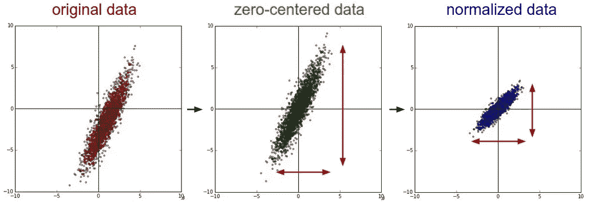
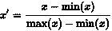
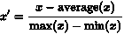
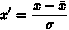
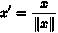

# 各种很酷的功能定标器

> 原文：<https://towardsdatascience.com/all-kinds-of-cool-feature-scalers-537e54bc22ab?source=collection_archive---------36----------------------->

## 通过选择合适的工具优化连续特征。



# 什么是定标器？

要素缩放器是一种训练工具，可让您通过使用线性代数获得更好的训练数据。一些目标函数严重依赖于，事实上，如果没有适当的缩放，就无法正常工作。在数据处理中，特征缩放也称为“数据标准化”，这种标准化通常在处理和清理步骤中进行。

缩放器专门用于连续要素，因为缩放器的目的是降低数据的方差，以使大多数预测位于数据最多的区域。除此之外，使用定标器绝对可以提高你的准确性。

很多人没有意识到实际上有多少个定标器。这是因为通常情况下，z 分数归一化定标器是最有效的。在过去，我曾用一个重定标器来降低精确度，用一个单位长度定标器来提高精确度。这进一步说明了有时在数据科学中，

> 这要看数据。

## 重新标度



重新缩放或最小-最大规范化使用最小值和最大值来缩放数组。虽然这很酷，但我真的没有发现它对机器学习有用。我会说，检查它只是为了信息和学习，因为在我的经验中，这个标量通常会扰乱估计并破坏准确性。在一种情况下，我能够使用一个重定标器作为一个端点上坏数据输出的最小-最大过滤器。虽然这肯定不能弥补损失，但我认为这绝对是一个很酷的用法。如果你想试试这个定标器，它在车床里！

```
using Lathe.preprocess: Rescalar
?(Rescalar)

  Rescalar scales a feature based on the minimum and maximum of the array.────────────────────────────────────────────────────────────────────────────array = [5,10,15]scaled_feature = Lathe.preprocess.Rescalar(array)
```

为了缩放您的要素，您需要首先获得 x 的最小值和最大值，然后 x 将被分子上的最小值减去，最大值减去分母上的最小值。对于那些希望在代码中看到它的人来说，

```
function Rescalar(array)
    min = minimum(array)
    max = maximum(array)
    v = [i = (i-min) / (max - min) for i in array]
    return(v)
end
```

## 均值归一化



均值归一化顾名思义就是基于均值对数据进行归一化。这一个当然可能是有用的，唯一的问题是，通常 z 分数标量在归一化数据方面比均值归一化器好得多。还好车床也有这个！公式很简单，分子上 x 减去均值，分母上 max 减去 min。我没怎么用过这个，因为它通常比标准的定标器返回更低的精度分数。不管这个特定的是否有用，

> 这是代码

```
function MeanNormalization(array)
    avg = Lathe.stats.mean(array)
    a = minimum(array)
    b = maximum(array)
    v = [i = (i-avg) / (b-a) for i in array]
    return(v)
end
```

## 任意重新标度

因此，也许你知道所有的重标度、均值归一化和标准标度，但你可能没有听说过任意重标度。与之前的版本相反，我发现这非常有用。当您有一个小的四分位数差距时，任意重新调整特别有用，这意味着中位数离最小值或最大值不远。你猜怎么着？这也是这个的代码！

```
function ArbitraryRescale(array)
    a = minimum(array)
    b = maximum(array)
    v = [x = a + ((i-a*i)*(b-a)) / (b-a) for x in array]
    return(v)
end
```

## 标准缩放器



啊，是的——好的标准定标器。标准缩放器，也称为 z 分数规格化器，可能是缩放连续要素的最佳选择。如果你需要提高精确度，这就是方法。我经常使用标准的定标器，可能每天我都会在某个时候使用。对我来说，标准缩放是所有标量中最有用的，对大多数人来说也是如此。

标准定标器的线性公式也非常非常简单。就像从 x 的迭代中减去平均值，然后将余数除以标准差一样简单。至于这样做的代码，也非常简单！：

```
function StandardScalar(array)
    q = Lathe.stats.std(array)
    avg = Lathe.stats.mean(array)
    v = [i = (i-avg) / q for i in array]
    return(v)
end
```

## 单位长度标量



我们在机器学习方面的另一个选择是缩放到单位长度。缩放到单位长度可以提供与 z 分数归一化类似的结果，我确实发现它非常有用。这个公式相当简单，尽管现在在车床上还没有支持它的代码库…这是因为单位长度标量在 x 迭代的分母上使用欧几里德距离。整体单位长度缩放对于提高模型的准确性非常有用。

# 结论

标量太棒了。当您只是运行一个函数来修改您的特征时，获得百分之五到百分之十的精度提升是非常有益的。另一个很大的好处是，大多数定标器背后的数学非常简单，这使得它们更加通用，你甚至可以用计算器来计算。