# 我们身边所有的作者

> 原文：<https://towardsdatascience.com/all-the-authors-around-us-an-analytical-look-into-goodreads-authors-dataset-part-one-61697721e58e?source=collection_archive---------40----------------------->

## 对 GoodReads 作者+数据集的分析研究|第一部分

在过去的几个世纪里，作者们一直在塑造我们的思维模式。创作圣书、诗歌、小说、哲学见解、历史事实、漫画、小说人物和数以千计的其他体裁的人们，对我们现在的身份发挥了重要作用。

我们坚持将资格的每个方面都转换成可描述的数字，这诱使我们去看一看作者和他们的书的世界。在这篇博文的第一部分，我们将大致了解一下来自世界各地的超过 20 万名作者**的数据集。**

# 数据采集

我不会深入讨论这一部分的技术细节，但是理解数据收集的方法对于确认分析的准确性是必不可少的。

关于书籍和作者的最好和最大的数据来源之一是 [GoodReads](http://goodreads.com/) 。Goodreads 为我们提供了一个 [API](https://www.goodreads.com/api) ，使得它的大范围数据集可以自由访问；同时，我们可以使用 BS4 来废弃其他部分。在我的 [GitHub 页面](https://github.com/schoobani/goodreads-analysis)上可以找到用于数据收集的完整 python 脚本。

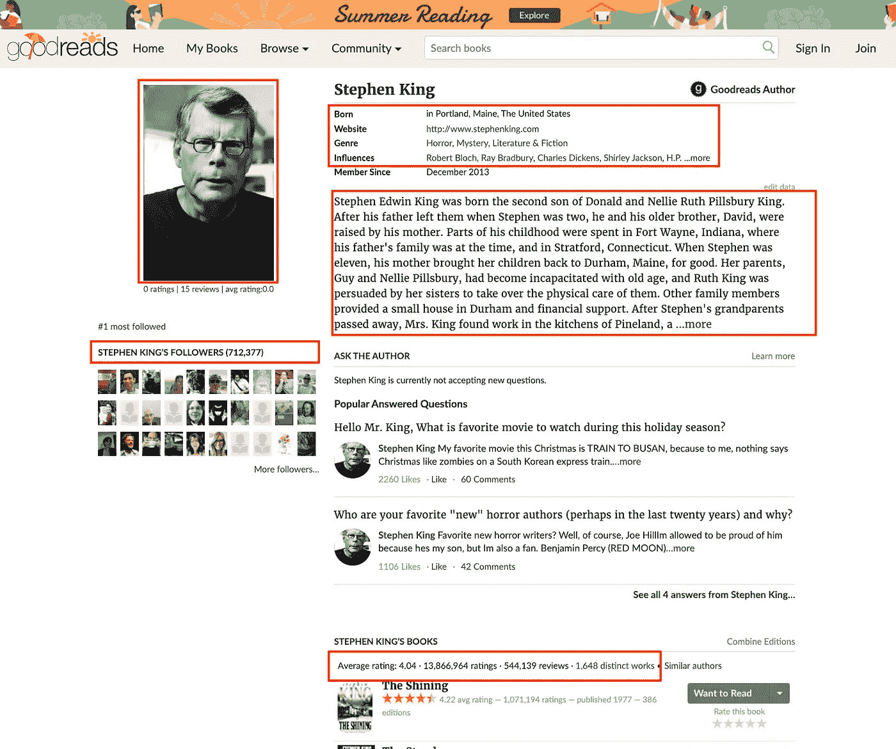

标记部分显示了收集的部分数据。

最终数据集类似于下表。为了收集这么多的数据，我们需要大约 800 个小时，花了将近三天的时间在 15 滴水滴上。如你所见，已经收集了 209517 个作者的数据。

数据集中有一些空值是很自然的。例如，我们只知道 88587 位作者的性别，我们不知道其余的，或者只有 7882 位作者提到他们受到了谁的影响。

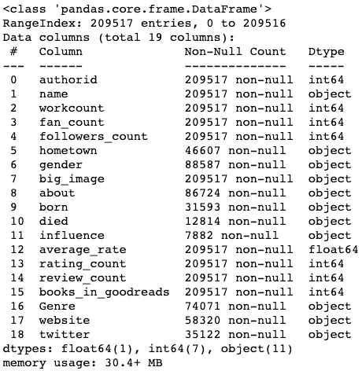

作者的数据集:列表，包含每列中值的计数和类型。

# 1.哪些作者的评分和评论数最高？

评分、评论和关注者的数量遵循类似于[幂律](https://en.wikipedia.org/wiki/Power_law)的分布。例如，看看下面的评论直方图。你可以看到很多作者(超过 100，000 名作者)的书得到的评论不到 100 条。另一方面，在图表的尾部，我们很少有作者的书籍评论超过 100，000 条。

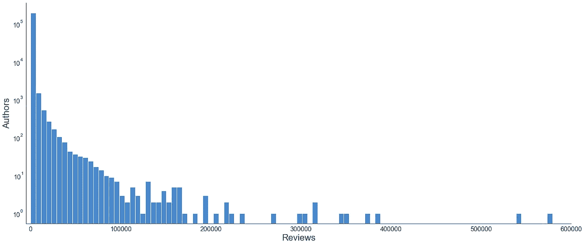

如果我们按照评论和评分的数量来排列作者，我们会得到下面的柱状图。

> 收视率超过 2400 万的 J.K .罗琳高居榜首。斯蒂芬·金、苏珊·科林斯、斯蒂芬妮·梅耶和 J.R.R .托尔金将紧随其后。我想我们都看过一些根据这些作者的小说改编的电影。

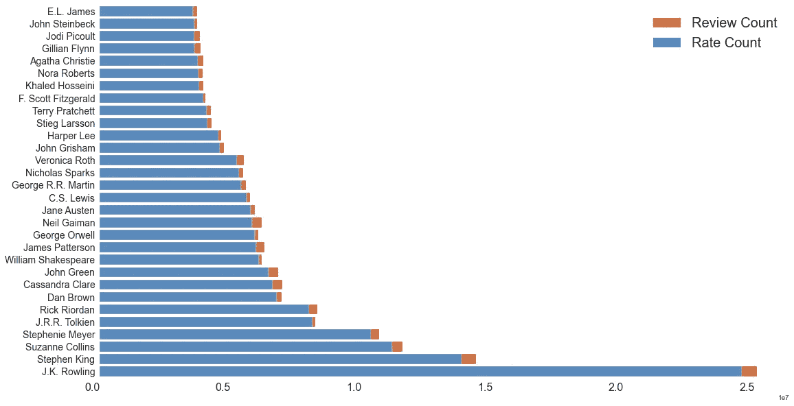

用户可以在 GoodReads 中给书籍打分，从 1 到 5。评级分布遵循正态分布。作者的平均评分是 3.87。

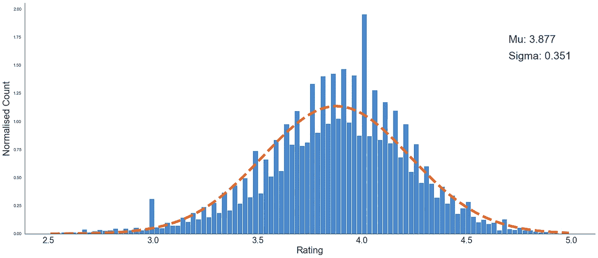

评级遵循正态分布

现在，让我们根据作者的评分来排列他们。

> 虽然 J.K .罗琳仍然位居榜首，但许多职位面临着变化。例如，乔治·r·r·马丁和卡勒德·胡赛尼获得了更好的位置。

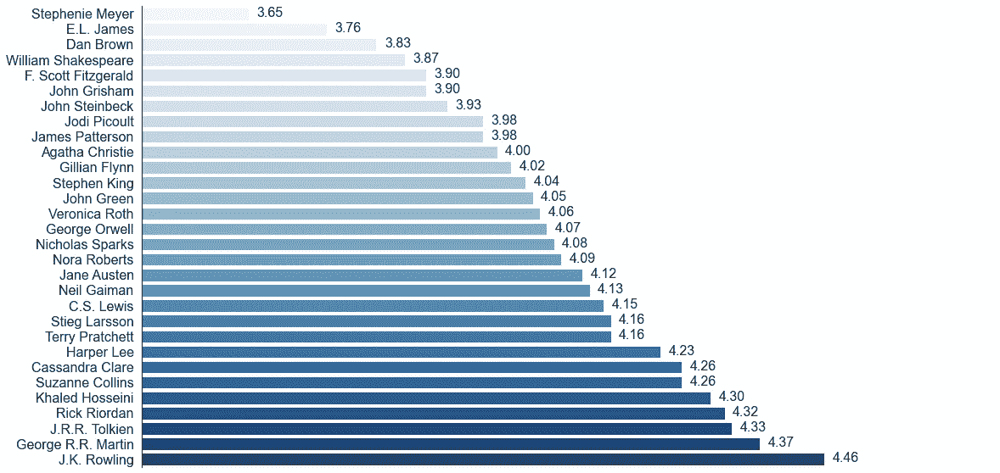

# 2.是不是写的书多的人就有更多的受众？

GoodReads 中的图书数量等于该作者在不同出版物和不同语言中的图书数量。例如，为 J.K .罗琳提交了 246 本书，而她原本写的书更少。

下面的相关矩阵可以帮助我们得到这个问题的答案。书的数量和吸引更多观众的相关性很低。

> 写更多的书并不意味着成为成功的作家。

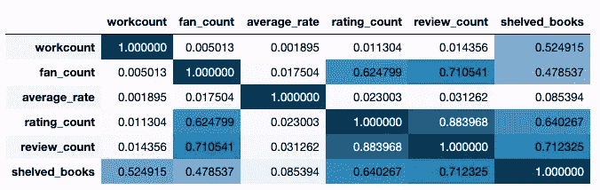

如你所见，这里我们有一个额外的专栏，Shelved _ books。这一栏显示了用户搁置作者书籍的次数。不幸的是，获取所有 209k 作者的数据非常耗时。对 200 名作者的观察显示，搁置的书籍和评论数之间有很高的相关性。

# 3.几个世纪以来，书籍和读者的数量是如何变化的？

随着时间的推移，作者越来越少。(或者至少 Goodreads 上提交的作者更少了。)而且随着作者数量的增加，评论和评分的数量也在增加。

> 就评论和评级而言，出生于 1860 年至 1960 年之间的作家获得了最多的关注。年轻作家需要更多的时间来获得认可。

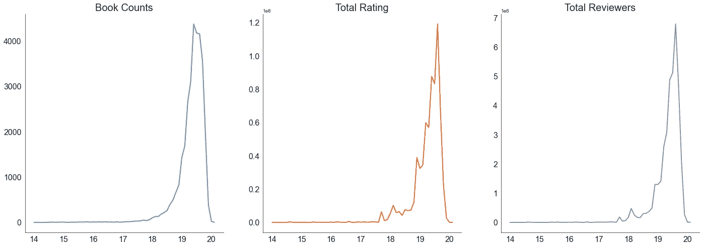

# 4.哪些作者对他人的影响更大？

近 8000 名作者指明了谁是他们的文学灵感来源。虽然与庞大的作者数据集相比，这是一个小数目，但我们仍然可以通过查看结果获得一些见解。

> 举个例子，弗朗兹·卡夫卡是最具影响力的前 20 名之一，而我们却看不到他有任何迹象进入评论数最高的前 50 名。

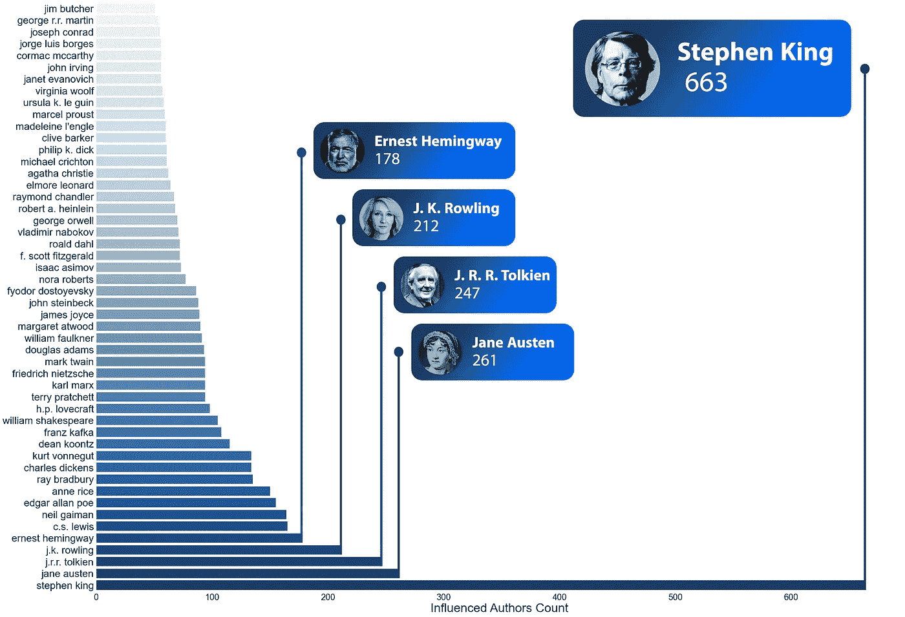

# 5.作者性别分布如何？

男性和女性作者的总数几乎相同，都在 4 万人左右。(男性略高)非二进制作者也有限。

> 一般来说，女性作者比男性作者拥有更多的关注者。她们也比男性参与更多。

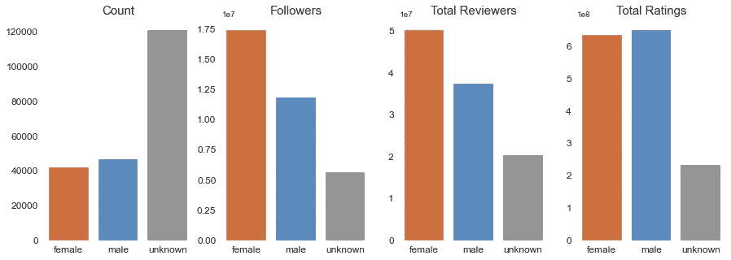

# 6.哪些是最受认可的流派？

超过 74000 个作者可以使用这些类型。下面的柱状图显示了不同类型的书籍数量，以作者的性别区分。

> 近三分之一的作者写小说。言情、当代和成人书籍类型以女性为主，男性更热衷于政治、商业、哲学和科学，而他们写作较少。

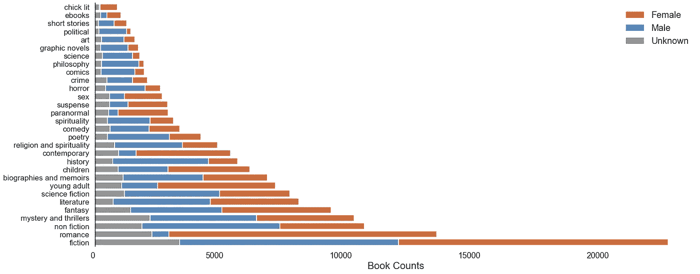

如果我们把评论的数量作为受欢迎程度的衡量标准，排名前 30 的流派如下。

> 小说和言情类书籍排在最上面，读者更少的商业、政治、科学和哲学书籍排在最下面。

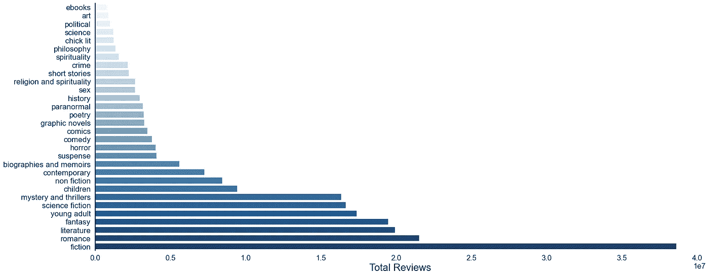

# 7.随着时间的推移，这些书的类型是如何变化的？

在这里，我们可以看看不同世纪的不同流派。在我们的数据集中，20 世纪的作者数量最多。那么，我们来看看本世纪的流派分布。

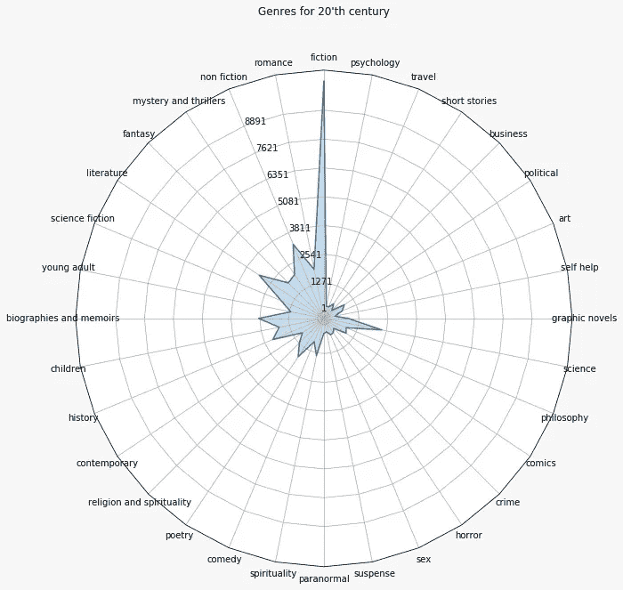

要比较时间内的不同流派，可以看一下几十年间不同流派的痕迹条。

> 久而久之，宗教和精神作者变得越来越少，而虚构和科学书籍上升。同时，我们看到更多的历史和传记。

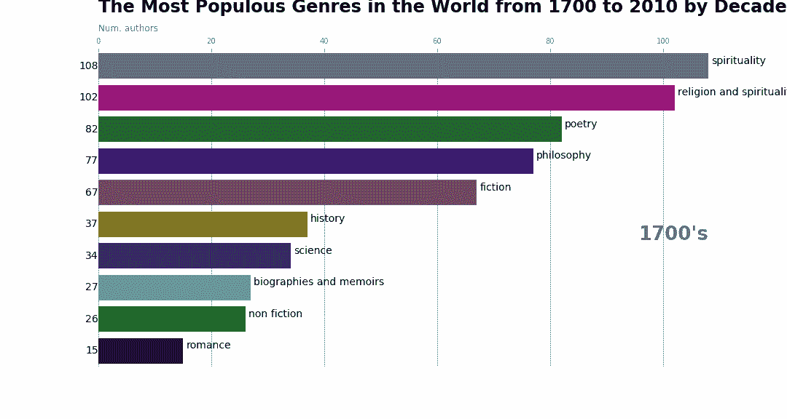

# 8.哪些国家的作者比较多？

虽然有大约 46000 个作者的出生地是可用的，但数据集非常脏，因为不同的城市和国家有不同的名字。

我们使用一个名为 [Geonames](https://www.geonames.org/) 的开源数据库来识别出生地点的国家和地理信息。世界范围内的作者分布如下图所示。如你所见，北美和欧洲的作者非常密集。

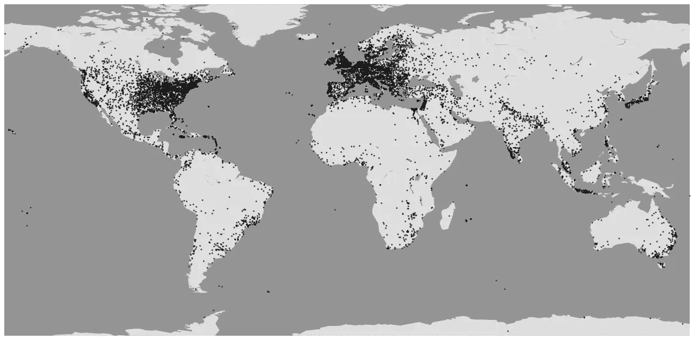

> 细看一下，就作者数量而言，美国位居榜首，英国、加拿大、法国和德国紧随其后。

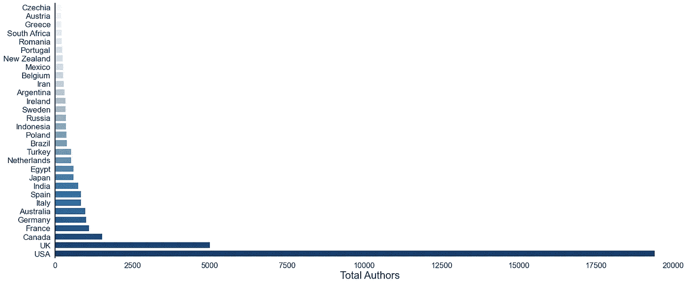

如果把出生地和作者性别结合起来，就可以观察到每个国家的男性、女性和未知作者的数量。

> 在大多数国家，男性作家多于女性作家。而在一些国家，如美国、加拿大、澳大利亚、瑞典、新西兰和日本，女性作家多于男性。有趣的是，牙买加也有很多女作家。

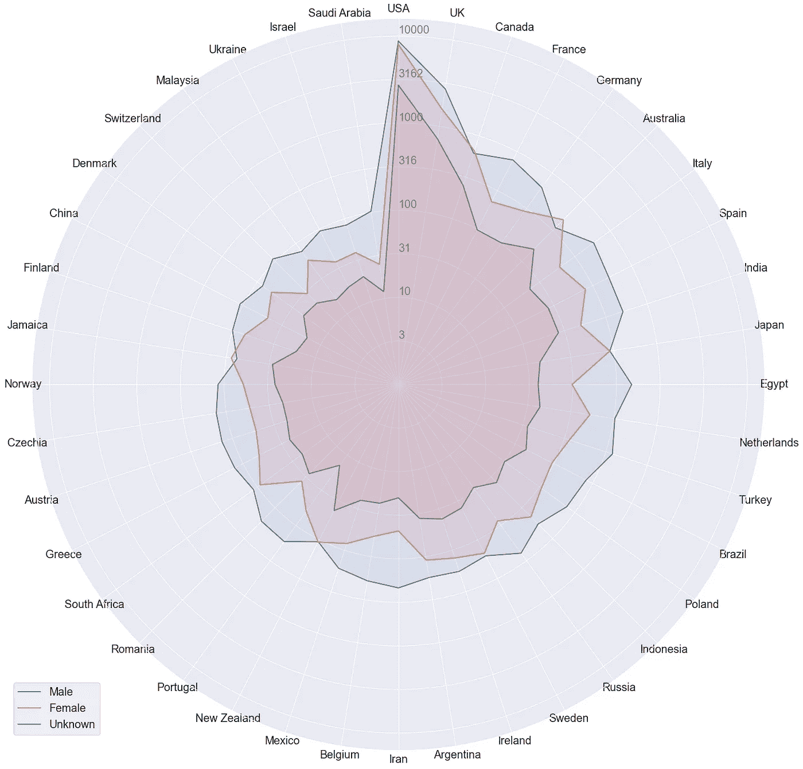

结合出生日期和出生地，我们得到一个更有限的数据集。但是如果我们[将结果](/bar-chart-race-in-python-with-matplotlib-8e687a5c8a41)制作成动画，我们会看到时间是如何影响每个国家的作者数量的。

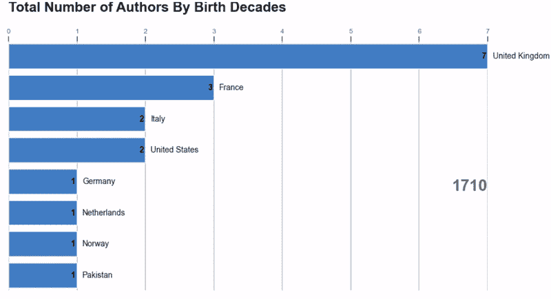

# 9.不同国家之间的流派分布如何？

不同国家的流派分布取决于许多不同的参数，如社会、经济和文化因素。这些雷达图显示了不同国家的主要流派。

> 看看日本和沙特阿拉伯的区别。在日本，漫画和漫画非常普遍，而在沙特阿拉伯，小说和宗教书籍占主导地位。

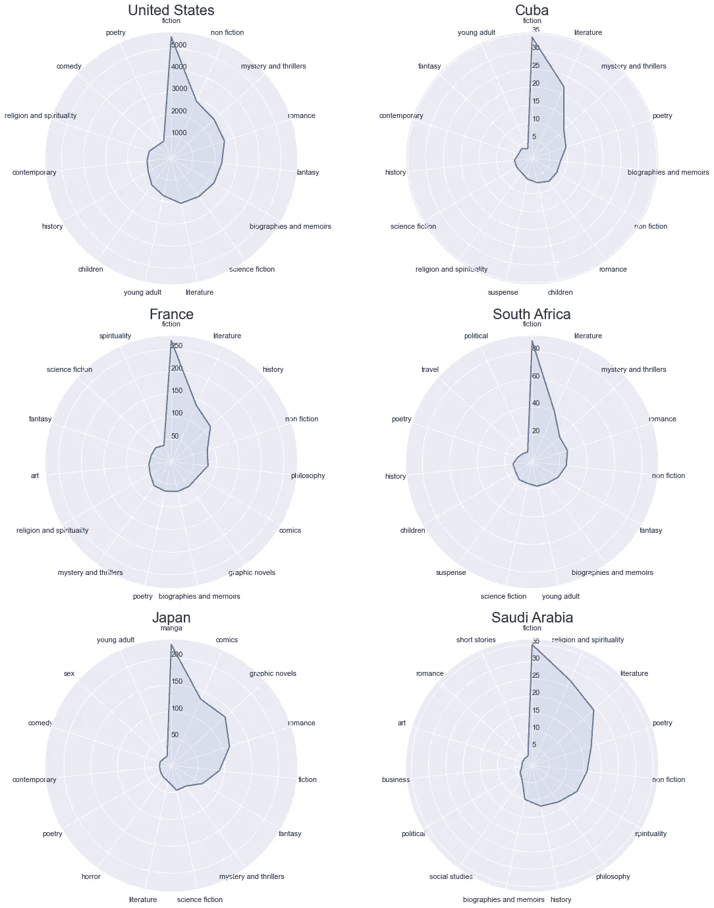

# 下一步是什么？

有了清理过的作者数据集，我们可以进行更多的分析，并做出其他有见地的可视化。不要犹豫，从 Kaggle 获取数据集，并开始使用它。

在接下来的部分，我们将更深入地了解作者的传记和他们的书籍描述。我们也将看看作者的共同阅读网络。

# 信用

*   你刚刚读到的；是 [**内达·索尔塔尼·哈尔瓦伊**](https://www.linkedin.com/in/nedasoltanih/) 和 [**梅**](https://www.linkedin.com/in/saeedchoobani/) **合作的结果。**
*   感谢[**Vahab Khoshmagham**](https://www.linkedin.com/in/vahab-khoshmagham-b1521969/)为图表添加视觉元素。

# 有用的链接

*   [从 GoodReads 抓取数据的 Python 脚本](https://github.com/schoobani/goodreads-analysis)
*   [作者在 Kaggle 的数据](https://www.kaggle.com/choobani/goodread-authors)
*   [波斯文的同一篇文章](https://virgool.io/@saeed.choobani/goodreads-part1-jgimcnudnbma)