# 你需要知道的 Python 熊猫的所有核心功能

> 原文：<https://towardsdatascience.com/all-the-core-functions-of-python-pandas-you-need-to-know-d219cbd87636?source=collection_archive---------5----------------------->


照片由 [Pixabay](https://pixabay.com/photos/street-art-graffiti-wall-painting-2254146/) 上的 [Sarah_Loetscher](https://pixabay.com/users/Sarah_Loetscher-4248505/) 拍摄

## 成为一名合格的 Python 数据分析师所需的所有 Pandas 函数。

作为 Python 编程语言中最受欢迎的库之一，Pandas 是数据 I/O、清理、转换和聚合的“必学”库。

在 Stack Overflow 中看到这类关于熊猫的问题是很常见的:

*   如何将我的数据框转换为…
*   如何计算一列的不同值…
*   如何将列类型从…转换为…
*   如何合并两个数据框…
*   等等

在我看来，所有熊猫的新手都应该至少知道基本的熊猫功能，并在开始实际使用它们之前练习它们。不算太多，但是可以帮你解决大部分常规问题。

# 功能列表

这些功能是什么？好的。在本文中，我用不同的表格将所有这些函数组织成不同的类别。如果你相信你可能已经知道一些(如果你曾经使用过熊猫你一定至少知道一些)，下面的表格是**TD；DL** 让你在通读之前检查你的知识。

表格中的符号:

*   pd 熊猫
*   **df** :数据框对象
*   **s** :系列对象(数据框的一列)

## 数据输入输出

## 数据预览

## 数据清理

## 数据转换

## 数据聚合

接下来，让我演示这些功能。我将给出它们的示例用法，但是当然，我不能列举这些函数可能被使用的所有场景。所以，强烈建议你自己练习。

# 数据输入输出


照片由[与 Raj](https://unsplash.com/@roadtripwithraj?utm_source=medium&utm_medium=referral) 在 [Unsplash](https://unsplash.com?utm_source=medium&utm_medium=referral) 的公路旅行拍摄

CSV、Excel 和 JSON 文档的读写使用非常相似。请注意，您可以从本地路径或 URL 读取。

```
# Read from local path
df1 = pd.read_csv('./data.csv')
df2 = pd.read_excel('./data.xlsx', sheet_name='Sheet1')
df3 = pd.read_json('http://example.com/data.json', orient='records')
```

在`read_excel`中，如果存在多个工作表，我们可以通过给出`sheet_name`来指定加载哪个电子表格。

对于`read_json`，正确使用`orient`参数很重要。当 JSON 文档是一个数组时，最常用的是`records`，如果您想使用根键作为索引，则使用`index`。

`to_csv`、`to_excel`、`to_json`是对应的书写功能。重要的区别在于，我们需要从数据框对象而不是 Pandas 对象调用这些函数。

```
df1.to_csv('./data.csv')
df2.to_excel('./data.xlsx')
df3.to_json('./data.json')
```

直接从/向数据库读写要稍微复杂一些。Pandas 支持多个库，比如 SQL Server 的`pymssql`和 MySQL 的`pymysql`。然而，我最喜欢的是`sqlalchemy`，它支持最流行的数据库，甚至包括云数据库，如雪花数据库。

```
from sqlalchemy import create_enginedb_engine = create_engine(
    'snowflake://{user}:{password}@{account}/'.format(
    user='...',
    password='...',
    account='...',
))df = pd.read_sql("SHOW TABLES", db_engine)
df.head()
```

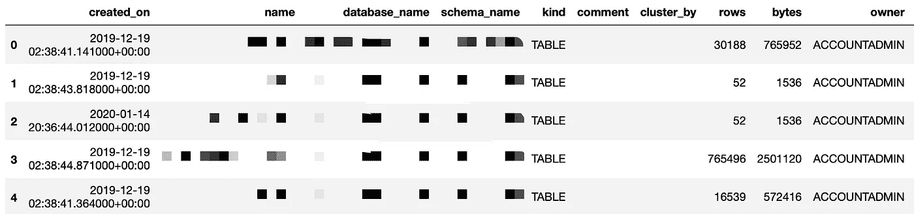

# 数据预览


照片由 [Christian Wiediger](https://unsplash.com/@christianw?utm_source=medium&utm_medium=referral) 在 [Unsplash](https://unsplash.com?utm_source=medium&utm_medium=referral) 上拍摄

很多时候，我们想要得到我们所拥有的数据集的一个大概情况，或者仅仅想要检查数据是否已经被正确地加载到 Pandas 数据框中。为此，我们需要知道几个函数。

## df.head()

```
df = pd.DataFrame({
    'id': [1, 2, 3, 4, 5, 6, 7, 8, 9, 10],
    'name': ['Alice', 'Bob', 'Chris', 'David', 'Ella', 'Frank', 'Grace', 'Hellen', 'Iva', 'Jack']
})df.head()
```


出于演示的目的，我首先创建了一个包含两列的数据框——“id”和“name”。

默认情况下，`df.head()`函数显示前 5 行。

然而，你可以指定显示多少行，比如`df.head(10)`显示 10 行。

## df.tail()

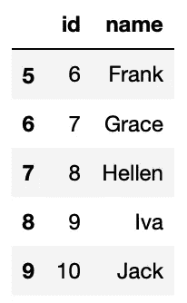

```
df.tail()
```

与`df.head()`类似，该函数将显示尾部 n 行。

当数据集被排序，并且您想要检查结果时，这将很有帮助。

## df.sort_values()

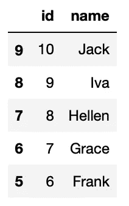

```
df.sort_values(by='name', ascending=False, inplace=True)df.head()
```

我们可以按升序或降序排序。请注意，如果您想将排序后的数据框赋回您的变量，需要将`inplace`设置为`True`。否则，您的数据帧`df`将不会改变。

## df.columns

请注意，这不是函数，而是数据框的属性。

```
df.columns
```

获取属性值将返回以下结果。


此外，您可以为此属性分配一个列表来重命名数据框的所有列。例如:

```
df.columns = ['no', 'firstname']
```

## df.dtypes

这也是返回列的所有数据类型的数据框的属性。当您想要检查数据类型，尤其是处理`datetime`列时，这非常有用。

```
df.dtypes
```

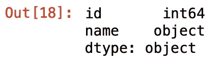

## df.shape

这可能是我使用最多的属性。我们可能经常想要检查数据框的行数和列数。

```
df.shape
```


请注意，这个属性是一个元组，其中第一个元素是行数，第二个元素是列数。

## df.describe()

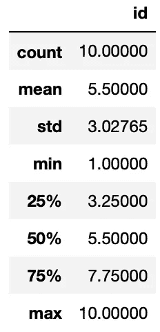

```
df.describe()
```

当我们处理一些度量时，我们可能想要有一个数据分布的图像。`df.describe()`给出了这个粗略的统计数据。

当对具有多列的数据框调用此函数时，非数字列将被忽略。

注意，`id`列的统计数据没有任何意义，但是它演示了函数。

## s .值计数()

此函数适用于熊猫系列，而非数据框。它计算序列中每个值的出现次数。

让我们用一些重复的名称创建另一个数据框。然后，统计这个数据框中的名字频率。请注意，我们使用`df.name`或`df['name']`来获取数据框的名称列，作为一个可以应用`value_counts()`功能的序列。

```
df = pd.DataFrame({'id': [1, 2, 3, 4, 5],
                   'name': ['Alice', 'Bob', 'Chris', 'Chris', 'Alice']})
df.name.value_counts()
```

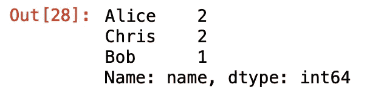

# 数据清理


由[在](https://unsplash.com/@thecreative_exchange?utm_source=medium&utm_medium=referral) [Unsplash](https://unsplash.com?utm_source=medium&utm_medium=referral) 上创意交流拍摄的照片

我们得到的原始数据集不完美是很常见的。因此，我们需要在使用前清理数据集。以下是相关的熊猫函数。

## 伊斯纳酵母

当我们想要过滤数据框中的“空”值时，此函数会有所帮助。让我们创建另一个数据框，在名称列中包含一些空值。注意，我们在 Python 中使用`None`表示空对象。

```
df = pd.DataFrame({'id': [1, 2, 3, 4, 5],
                   'name': ['Alice', 'Bob', None, 'Chris', None]})
```

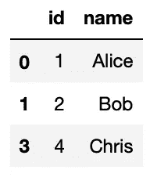

然后，假设我们想过滤掉所有的空值。

```
df[~df.name.isna()]
```

`df.name`帮助获取数据框的“name”列作为一个序列，然后`isna()`返回一系列表示名称是否为 null 的布尔值。之后，开头的`~`符号反转了布尔值，因为我们想要保留没有空值的行。最后，数据帧`df`将被这个布尔序列过滤，其中具有“假”布尔值的行将被丢弃。

## df.dropna()

```
df = pd.DataFrame({'id': [1, 2, 3, None, 5], 'name': ['Alice', 'Bob', None, 'Chris', None]})df.dropna()
```

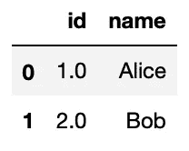

如果我们有多个包含空值的列，并且我们希望过滤掉至少包含一个空值的所有行，该怎么办？我们仍然可以使用上面的方法，但是你需要对每一列重复很多次。

## df.fillna()

```
df = pd.DataFrame({'id': [1, 2, 3, 4, 5],
                   'name': ['Alice', 'Bob', None, 'Chris', None]})df.fillna('Unknown')
```

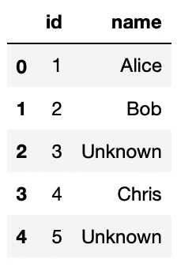

有时，我们可能不想简单地丢弃具有空值的行。相反，我们希望用其他东西填充空值。

在本例中，带有空值的 name 列被替换为“Unknown”字符串，我们仍然有这些行。

## df.drop_duplicates()

```
df = pd.DataFrame({'id': [1, 2, 3, 4, 3],
                   'name': ['Alice', 'Bob', 'Chris', 'David', 'Chris']})df.drop_duplicates()
```

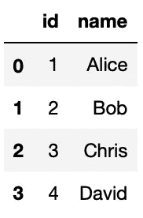

有时原始数据集可能有一些重复的行，而我们实际上并不需要它们。

在本例中，我们有两个 id = 3 的“Chris”。所以，函数丢弃了第二个。

## df.drop()

```
df = pd.DataFrame({'id': [1, 2, 3, 4, 3],
                   'name': ['Alice', 'Bob', 'Chris', 'David', 'Ella'],
                   'comments': ['', '', 'author', '', '']})df.drop(columns=['comments'])
```

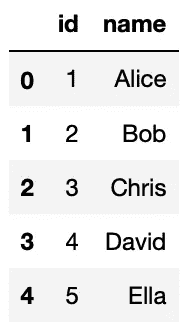

在本例中，数据帧有 3 列。

假设我们不需要“comments”列，我们可以使用`df.drop()`函数删除它。

这个函数也可以用来删除行。

## df.rename()

```
df = pd.DataFrame({'id': [1, 2, 3, 4, 5],
                   'name': ['Alice', 'Bob', 'Chris', 'David', 'Ella']})df.rename(columns={'id': 'no', 'name': 'firstname'})
```

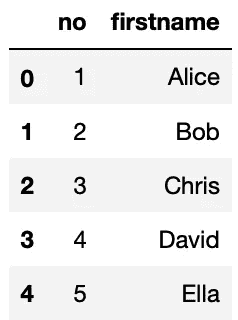

在本例中，仍然使用列名“id”和“name”创建数据框。然而，`df.rename()`函数有助于重命名列标题。

请注意，它将一个字典作为参数，其中键是旧的头，值是新的头。

## df.reset _ 索引()

```
df = pd.DataFrame({'name': ['Alice', 'Bob', 'Chris', 'David', 'Ella']})df.reset_index()
```

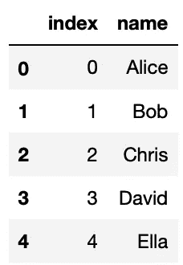

在本例中，数据框只有“名称”列。那么，如果我们想创建另一个列作为标识呢？

如果您认为行号中的某一列没有问题，只需使用`df.reset_index()`函数。

这个函数还有一个典型的用法。假设我们刚刚清理了数据集，丢弃了一些重复的行。但是，索引将不再是连续的。如果你想有一个连续的索引，这个函数也有帮助。

# 数据转换


由 [SwapnIl Dwivedi](https://unsplash.com/@momentance?utm_source=medium&utm_medium=referral) 在 [Unsplash](https://unsplash.com?utm_source=medium&utm_medium=referral) 上拍摄的照片

在数据清理之后，我们可能需要转换数据。

## pd.to_datetime()

通常，我们的原始数据集包含字符串格式的所有日期或时间。为了稍后的分析目的，比如排序，我们可能想要将这些字符串转换成`datetime`对象。

```
df = pd.DataFrame({'datetime': ['01/04/2020', '02/04/2020', '03/04/2020']})pd.to_datetime(df.datetime, format='%d/%m/%Y')
```

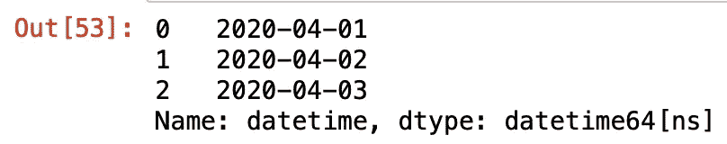

请注意，这个函数返回一个序列，所以我们可以将它赋回数据框的列。

## s.astype()

这个函数帮助我们轻松地转换列的数据类型。在本例中，创建的数据框的“id”字段包含所有字符串类型。然后，`s.astype()`函数帮助将它们转换成整数。

```
df = pd.DataFrame({'id': ['1', '2', '3', '4', '5']})df.id.astype(int)
```

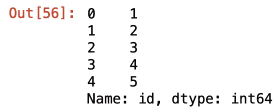

## s.apply()

这大概是我用的最多的功能了。虽然 Pandas 允许我们轻松地对一个数据帧的一整列执行一些转换，例如，`df.col + 1`会将该列的所有值加 1。然而，有时我们可能需要做一些熊猫内置功能不支持的独特事情。在这种情况下，`apply()`功能会有所帮助。

当我们使用`apply()`函数时，通常会同时使用`lambda`函数。在下面的例子中，我们手动使用`apply()`功能实现了`df.number + 1`。

```
df = pd.DataFrame({'number': [1, 2, 3, 4, 5]})df.number.apply(lambda n: n+1)
```

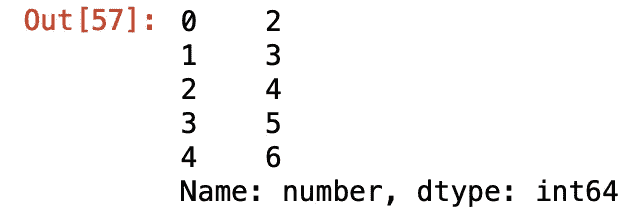

在某些特殊情况下，lambda 函数可能不够用。例如，我们有一大堆逻辑应用于一个列，而这些逻辑只能放在一个定制的函数中。因此，`apply()`功能也可以与定制功能一起使用。

下面的例子使用了一个定制的功能来做同样的事情。

```
def add1(n):
    return n+1df.number.apply(add1)
```

## df.apply()

如果我们需要在一个`apply()`函数中使用多列怎么办？事实上，`apply()`函数也可以用于数据框对象。

```
df = pd.DataFrame({'num1': [1, 2, 3, 4, 5],
                   'num2': [5, 4, 3, 2, 1]})df.apply(lambda row: row['num1'] + row['num2'], axis=1)
```

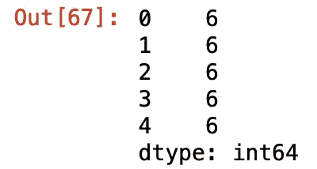

在上面的示例中，数据框是用两个数字列创建的。然后，我们使用`lambda`函数获取包含所有单元格的每一行。之后，我们仍然可以使用`['col_name']`来访问这些值。因此，`row[‘num1’] + row[‘num2’]`将返回两列值的总和。

非常重要的是，这里必须指定参数`axis=1`，因为数据框对象上的`apply()`函数将默认应用于行索引。

同样，我们也可以使用定制功能。

```
def sum_cols(row):
    return row['num1'] + row['num2']df.apply(sum_cols, axis=1)
```

## df.explode()

我以前处理 JSON 文档的时候用这个函数。由于 JSON 的风格，有时我们有一个带有数组值的键。在这种情况下，我们可以轻松地展平数组。

```
df = pd.DataFrame([{
    'name': 'Chris', 
    'languages': ['Python', 'Java']
},{
    'name': 'Jade',
    'languages': ['Java', 'Javascript']
}])
```

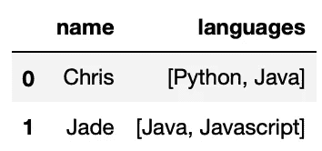

在这个例子中，直接从 JSON 文档加载的语言仍然是数组。然后，我们用`df.explode()`函数把它拉平。

```
df.explode('languages')
```

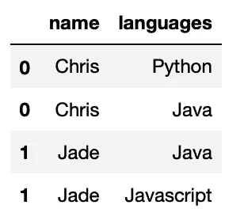

# 数据聚合


马丁·桑切斯在 [Unsplash](https://unsplash.com?utm_source=medium&utm_medium=referral) 上拍摄的照片

数据聚合在数据分析中起着重要的作用。Pandas 提供了许多执行数据聚合的方法。这里我整理了一些你必须知道的基本功能。

## pd.concat()

```
df1 = pd.DataFrame({'id': [1, 2, 3],
                   'name': ['Alice', 'Bob', 'Chris']})
df2 = pd.DataFrame({'id': [4, 5],
                    'name': ['David', 'Ella']})pd.concat([df1, df2])
```

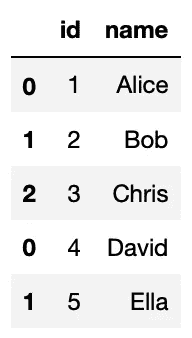

在本例中，创建了两个数据框。

然后，我们可以使用`pd.concat()`函数将它们连接在一起。

请注意，我们也可以使用这个函数来垂直连接。对指数感到不舒服？你还记得`df.reset_index()`功能吗？:)

## pd.merge()

这是另一个我在实践中经常用到的。如果您有 SQL 查询的经验，这就像连接两个表一样。

```
df1 = pd.DataFrame({'id': [1, 2, 3],
                   'name': ['Olivier', 'Jade', 'Chris']})
df2 = pd.DataFrame({'id': [1, 2, 3],
                    'language': ['Objective-C', 'Java', 'Python']})pd.merge(df1, df2, on='id', how='inner')
```

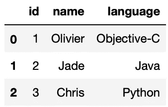

如上面的代码块所示，创建了两个数据框，分别包含“name”列和“language”列。然后，我们可以使用这个函数将它们“连接”在一起。请注意，我们需要指定哪一列用于与`on='id'`连接，并指定两个数据帧如何连接`how='inner'`。

## df.groupby()和 df.groupby()。agg()

这两个函数一起演示会更好，因为函数`df.groupby()`本身不能产生有意义的结果。它必须与适用于群组的其他功能一起使用，我相信`df.groupby().agg()`是最常见的功能。

```
df = pd.DataFrame({'id': [1, 2, 3, 4, 5],
                   'name': ['Alice', 'Bob', 'Chris', 'David', 'Ella'],
                   'language': ['Python', 'Java', 'Python', 'COBOL', 'Java'],
                   'age': [21, 32, 31, 68, 29]})df.groupby('language').agg({'name': 'count', 'age': 'mean'})
```

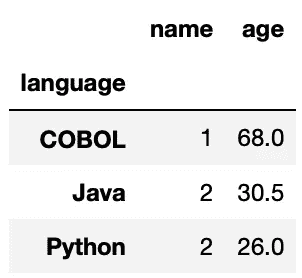

在本例中，我们创建了一个包含“姓名”、“语言”和“年龄”的数据框。

然后，数据框按语言分组，我们计算这些人的姓名数量和平均年龄。嗯，列标题现在没有意义，但是我们可以使用`df.rename()`函数来修复它们。

## pd.pivot_table()

对于上面的例子，我们也可以使用`pd.pivot_table()`函数来实现它。也就是说，我们需要如下指定组键和测量值(使用上例中的相同数据框):

```
pd.pivot_table(df, 
               values=['name', 'age'], 
               index=['language'], 
               aggfunc={'name': 'count', 'age': ['min', 'max', 'mean']})
```

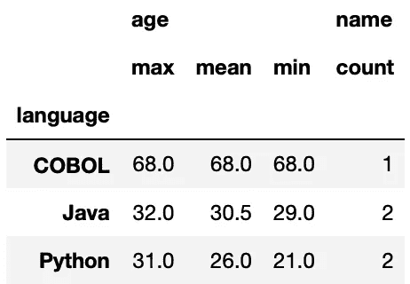

因此，很明显，当我们有多级组键和度量值时，`pd.pivot_table()`函数更方便。

# 摘要


照片由 [Aaron Burden](https://unsplash.com/@aaronburden?utm_source=medium&utm_medium=referral) 在 [Unsplash](https://unsplash.com?utm_source=medium&utm_medium=referral) 上拍摄

事实上，Python 的 Pandas 库有更多的功能，使它成为 Python 中如此灵活和强大的数据分析工具。在这篇文章中，我只是整理了一些我认为最有用的基本原则。如果一个人能搞定所有这些问题，肯定可以开始使用熊猫来进行一些简单的数据分析。当然，要成为大师还有很多要学的。

[](https://medium.com/@qiuyujx/membership) [## 通过我的推荐链接加入 Medium 克里斯托弗·陶

### 作为一个媒体会员，你的会员费的一部分会给你阅读的作家，你可以完全接触到每一个故事…

medium.com](https://medium.com/@qiuyujx/membership) 

如果你觉得我的文章有帮助，请考虑加入 Medium 会员来支持我和成千上万的其他作者！(点击上面的链接)