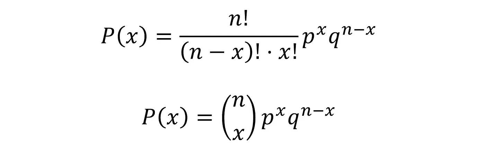
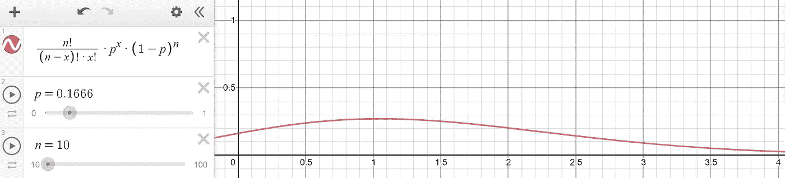
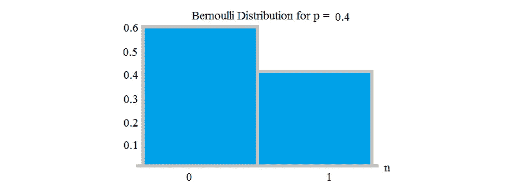
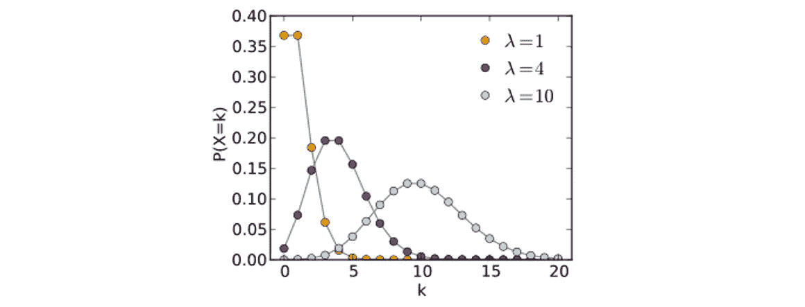
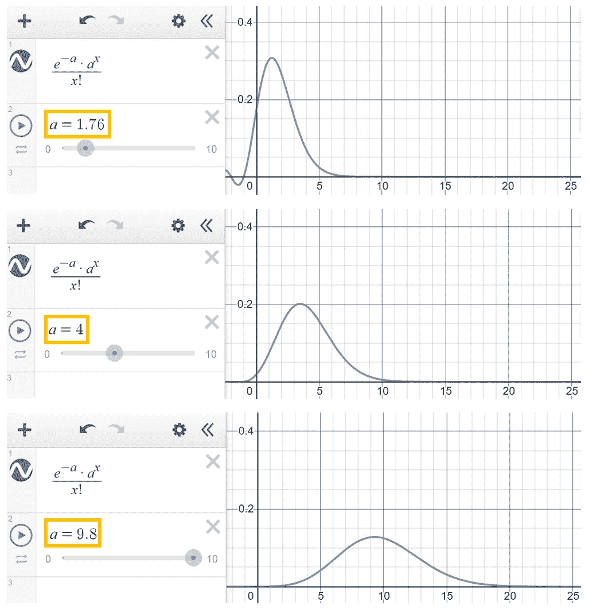
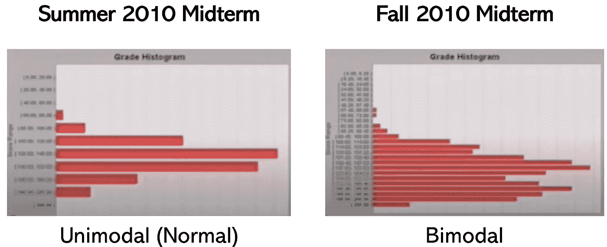
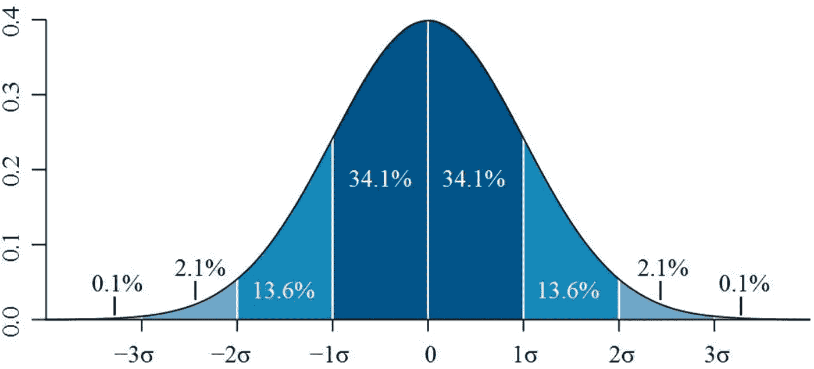
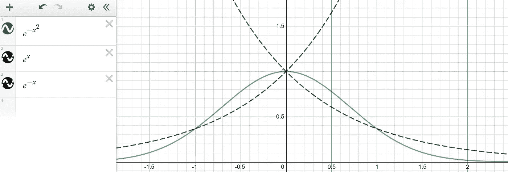
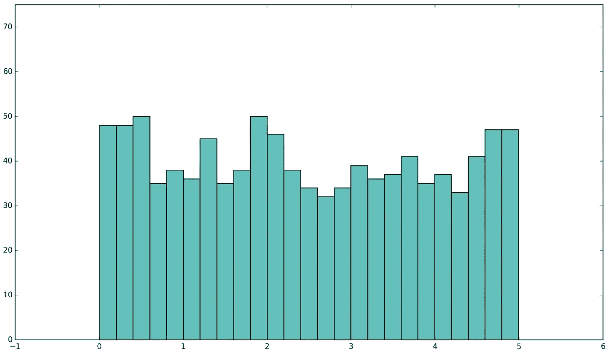

# 你需要知道的所有分布

> 原文：<https://towardsdatascience.com/all-the-distributions-you-need-to-know-ad570514987b?source=collection_archive---------12----------------------->

来源: [Vecteezy](https://static.vecteezy.com/system/resources/previews/000/124/801/non_2x/free-bell-curve-icons-vector.jpg) 。图片免费分享。

## 二项式、双峰式、泊松、+更多

分布不仅在统计学中很重要，在解释你周围的世界时也很重要。因为*一切*都是由数据定义的，所以可以根据数据最终是如何分布的来提取各种属性和观察结果。

在本文中，我们将讨论几种类型的分布，包括类比、真实世界的例子和属性。

*   二项式分布。
*   伯努利分布。
*   泊松分布。
*   双峰分布。
*   正态分布。
*   均匀分布。

# 二项分布

你掷一个标准骰子 10 次。你正好 3 次降落在 1 上的几率有多大？还是正好 7 次？5 次怎么样？

二项式分布接受两个参数:实验次数 *n* (在这种情况下，10，因为骰子滚动了 10 次)，以及成功的概率 *p* (在这种情况下，1/6，意味着六个结果中的一个)。然后， *x* 的每个值是在所有实验 *n* 中，确切地说是 *x* 实验产生成功结果的机会。

这是由二项分布概率质量函数给出的，它比看起来更直观。

q 定义为 1-p，即实验不正确的概率。

等式的第一个元素是 choose 函数，它选择从总共 *n* 个对象中选择 *x* 个对象的不同方式的数量。第二部分求实验成功 *x* 次的概率，第三部分求实验不成功 *n-x* 次的概率，实验的余数。

当用我们初始设置的参数绘制二项分布图时——1/6 = 0.1666……在右边脸着陆的机会，重复 10 次——在总共 10 次实验中，有多少可能或不太可能恰好在那张脸上着陆就很清楚了。从分布图来看，答案似乎是 1 倍。

和德斯莫斯一起创造的。

二项式分布出现在许多现实环境中。如果一种情况符合以下所有四个标准，那么你看到的很可能是二项分布:

*   只有两种可能且相互排斥的结果——例如，是或否、客户与否等。(*二项式中的 *bi* 。*)
*   有一个预定义的、有限的和恒定数量的重复实验或试验。
*   所有的试验/实验都是相同的，因为它们都是以与其他试验相同的方式进行的，但又是独立的，因为一个试验的结果不会影响其他试验。
*   每次试验的成功概率是一样的。

例如，考虑一家公司，该公司希望预测客户在看到相同的广告后购买产品的可能性。在确定了 *p* 和公司希望投放的最大广告量( *n* 之后，公司可以使用二项式分布的质量概率函数来确定在他们的营销活动中有多少广告值得投放。

# 二项分布

伯努利分布是只有一次试验的二项分布。它发生在只有两种结果的实验中，成功的概率为 *p* ，失败的概率为 *q* = *1 - p* 。

资料来源:统计方法。图片免费分享。

伯努利分布实际上不是一个分布，因为它是二项分布的特例，但它是一个很好理解的行话。

# 泊松分布

泊松分布模拟给定数量的事件在固定的时间或空间间隔内发生的概率，前提是这些事件以恒定的平均速率发生，与自上次事件以来的时间无关。每个分布的可控因子是λ，也就是平均速率。

资料来源:统计方法。图片免费分享。

例如，如果你记录每天收到的电子邮件数量，并注意到你平均每天收到 14 封。如果收到一封邮件不影响未来邮件的到达时间，那么你一天收到的邮件数量很可能服从泊松分布。在其他场景中，还有许多这种分布的其他示例。例如，呼叫中心每天接到的电话数量或每秒钟从放射源发出的衰变事件数量都遵循泊松分布。

分布遵循以下概率质量函数:

a 用λ代替。用德斯莫斯画的。

# 双峰分布

双峰分布有两个峰(因此得名， *bi* modal)。它们通常是两个唯一单峰(只有一个峰值，例如正态或泊松分布)分布的混合，依赖于两个分布变量 *X* 和 *Y* ，混合系数为α。

这意味着，当双峰分布出现在看似单峰的场景中时，可能有外力在起作用。事实上，2010 年，理查德·奎因教授在中佛罗里达大学发现他的学生在期中考试中作弊，作弊的依据是分数的分布。考试成绩几乎总是正态分布的，几乎任何大学的期中考试都是如此，ACT 或 s at 也是如此。然而，2010 年秋季中期选举有两个高峰。

你可以在 YouTube [这里](https://www.youtube.com/watch?v=rbzJTTDO9f4)找到完整的作弊指控讲座。图片免费分享。

因为不自然的双峰分布几乎总是两个独特的单峰分布的部分组合，所以教授意识到这两个分布代表了两组学生:没有作弊的学生和作弊的学生。表现更差的单峰分布与 2010 年夏季的中期分布有着明显的相似之处。教授发现这一点后，做了一番调查，发现题库已经泄露给了一群学生。

虽然双峰(或多峰)分布可以揭示系统偏差或问题，但它们也经常自然发生。这些自然双峰分布变量包括:

*   间歇泉喷发的间隔时间
*   星系的颜色
*   工蚁的大小
*   霍奇金淋巴瘤的发病年龄
*   交通分析
*   需水量

# 正态分布

最标准的(因此也是“正态”)分布是正态分布，根据其外观也称为钟形曲线。

它最标准和众所周知的属性包括数据的百分位数和标准偏差之间的关系。

*   68.2%的数据在数据的一个标准偏差内。
*   95.4%的数据在数据的两个标准偏差之内。
*   99.6%的数据在数据的三个标准偏差之内。

资料来源:ExcelUser。图片免费分享。

方程式 exp(- *x* )给出了钟形曲线。虽然这不是正式的概率质量函数(这要复杂得多)，但正态分布可以使用该方程来创建。思考这个问题的一个好方法是，exp( *x* )创建一条向左逐渐减小、向右逐渐增大的曲线，而 exp( *-x* )创建一条向右逐渐减小、向左逐渐增大的曲线。通过应用平方函数，这两个函数被“组合”，两个函数的属性逐渐减少。

有趣的是，概率质量函数成功地包含了π，而我们也可以完全不用π，只用 Desmos 中的 e 来写。

在统计学和机器学习中，正态分布起着重要的作用，例如在机器学习模型的假设中。例如，线性回归模型假设残差(线拟合的数据点误差)呈正态分布。毫无疑问，这是研究最多、最广为人知的分布，各种定理、性质以及在其他领域的应用都得到了很好的证明和探索。

在自然界中，植物和动物的物理特征(如身高或体重)形成正态分布。股票价格的表现倾向于符合正态分布，常见的预测和计量误差倾向于正态分布。据观察，自然流行病遵循钟形曲线的路径。其他衡量表现的指标，如智商、音乐能力和标准化测试都是正态分布的。这和中心极限定理有关，中心极限定理本质上是说各种随机信号自然组合在一起形成正态分布。

# 均匀分布

均匀分布是指对于插入概率质量函数的每个 *x* 值来说， *y* 值大致相同。

近似均匀分布。来源:ResearchGate。图片免费分享。

这种分布在等概率中是最标准的，比如掷骰子。均匀分布虽然看起来很无聊，但它有许多有用的统计特性。例如，考虑德国的坦克问题。在二战中，盟军需要估计德国人正在生产多少辆坦克，并意识到他们可以使用缴获的坦克上的连续序列号来估计坦克的总数。

在从 1 到 *n* 的均匀分布中，捕获的序列号可以被假设为彼此距离相等。利用这一特性，盟军能够创建一个公式来估计生产中的坦克数量。通常，如果分布未知，根据上下文，通常可以假设它是均匀分布。统计推断的许多原理都是基于这个前提。

# 感谢阅读！

如果你喜欢，你可能会喜欢我的其他一些关于统计的文章:

 [## 统计学和数据科学中最基本也是最有争议的争论

### 频繁主义者-贝叶斯之争

medium.com](https://medium.com/dataseries/the-most-fundamental-and-controversial-debate-in-statistics-and-data-science-e8dd1bad737a)  [## 你的终极数据科学统计和数学小抄

### 机器学习指标、统计指标等

medium.com](https://medium.com/analytics-vidhya/your-ultimate-data-science-statistics-mathematics-cheat-sheet-d688a48ad3db)