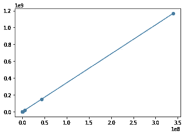
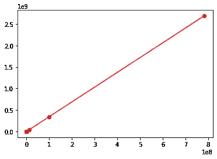
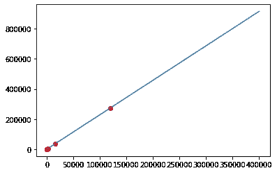

# 所有他们认为你不应该知道的事情

> 原文：<https://towardsdatascience.com/all-the-eigen-stuff-they-never-thought-you-should-know-3d87ddfa5346?source=collection_archive---------19----------------------->

## [入门](https://towardsdatascience.com/tagged/getting-started)

## 无限和…线性代数？！


信用:Pixabay

特征值(向量、值、分解)是线性代数的基础概念之一。这种东西往往会让 STEM 学生在挫折中“一头撞墙”。对我来说，特征向量(和行列式)是这个数学分支中最具挑战性的想法。更重要的是，它是统计学、物理学、工程学、计算机科学等领域的基础。在这篇文章中，我将把 Eigen-stuff 描述得非常简单，希望它能在你处理基于它的更复杂的话题时提升你的自信。

万圣节就要到了，因此，我将使用一个牵强的例子来说明特征分解:比方说，你正在某条街上“不给糖就捣蛋”——所有奇数编号的房子都在左边，偶数编号的房子在右边——所以当你沿着糖果巷前进时，你从左到右反弹回来。街道左侧的邻居只分发 KitKats，而右侧的邻居只分发 M&Ms。一个“回合”将包括敲街道左侧的一扇门，然后敲街道右侧的一扇门。

不管出于什么原因，所有的邻居都遵守一些规则，即左边的邻居会根据你目前拥有的糖果给你 M & Ms。即:

```
MM = 1*MM + 2*KK #left
KK = 3*MM + 7*KK #right
```

这些规则由下面矩阵中的“线性变换”表示:

```
[[1,3],
 [2,7]]
```

所以问题变成了——*当你走过整条街(或者任意长的一段距离)* ***你的糖果包会是什么样子？*** 和 ***你的糖果包的首发成分有多重要？*** 假设你从包里的每种糖果开始:

```
[1,1]
#KK, MM 
```

一轮(街道的左右两侧)后，你更新的袋子有 3 个 KitKats 和 5 个 M & Ms 换句话说，你增加了 2 个 KK 和 9 毫米。*(记住要做出区分:线性变换矩阵缩放你的糖果数量，它不只是简单地增加它们-尽管我们可以计算加法量。)*

```
[1*1 + 1*2, 1*3 + 1*7] = [3,10] 
```

那么两轮过后你的包包是什么样子的呢？

```
[3*1 + 10*2, 3*3 + 7*10] = [23, 79] 
```

让我们看看我们的包在 10 个回合后是什么样子，使用 python:

```
import numpy as np
import matplotlib.pyplot as pltj = np.array([[1,3],[2,7]])
curr = np.array([1,1])
results = [curr]for i in range(10):
    curr = np.matmul(j,curr)
    results.append(curr)x = [i[0] for i in results]
y = [i[1] for i in results]
plt.plot(x,y)
plt.scatter(x,y)
```



一个非常明显的趋势出现了:首先，迭代 1-8 彼此映射得非常接近，靠近原点，而迭代 9 和 10 伸展得更远，这表明缩放效应的幅度随着每次迭代而复合。第二个趋势是这些迭代遵循一条线！回想一下高中代数——直线由两个参数描述，斜率和 y 截距。如果直线通过原点(0，0)，则直线完全由坡度单独定义。如果你还记得“上升超过下降”，这条线描述了 y 与 x 或者 M&Ms 与 KitKats 的比率。**这条线显示，几乎就在你开始不给糖就捣蛋之后，你的书包也会被定义成同样的比例！这真是太棒了。**

在我们兴奋之前，让我们试试不同的起始包组合:

```
j = np.array([[1,3],[2,7]])
curr = np.array([3,2])
results = [curr]for i in range(10):
    curr = np.matmul(j,curr)
    results.append(curr)x = [i[0] for i in results]
y = [i[1] for i in results]
plt.plot(x,y,color='r')
plt.scatter(x,y,color='r')
```



现在这是令人兴奋的！我们已经看到了*两种不同的开始糟糕组合*，然而**它们汇聚在相同的 KitKat 对 M & M 比率上。**

然而，这并不是普遍适用的。请注意，如果您从任一糖果的 0 开始，由于线性变换的乘法性质，所述糖果将永远不会增加，因此您的旅行将糖果巷不会收敛于此比率。(但是，如果在一个或两个糖果中以负数开始，收敛仍然会发生！然而，这在我们的问题中毫无意义。)

现在，让我们在特征向量上绘制这些数据点:

```
eigVec1 = np.linalg.eig(j)[1][:,0]
eigVec2 = np.linalg.eig(j)[1][:,1]e1_x = [eigVec1[0]*-i for i in range(0,1_000_000,100)]
e1_y= [eigVec1[1]*-i for i in range(0,1_000_000,100)]
e2_x = [eigVec2[0]*-i for i in range(0,1_000_000,100)]
e2_y= [eigVec2[1]*-i for i in range(0,1_000_000,100)]plt.scatter(x[:7],y[:7],color='r') #points
plt.plot(e2_x,e2_y) # dominant eigenvector 
```



想象一下，在第一次迭代之后，包的 KK 与 MM 的比率遵循特征向量中的*，完全正确！但这意味着什么呢？*

我们可以像考虑微积分极限一样考虑线性代数的特征向量！它们描述了系统的最终行为。注意，就像不是所有的代数函数都有极限(有时极限不存在)——不是所有的矩阵都有实特征向量:比如旋转矩阵就有虚特征向量。为什么？因为，你可以旋转一个向量无限次，但它永远不会以任何比例收敛！鉴于这种线性变换收敛于 KitKats 与 Peanut M 的特定比率，本征分解在数学中有许多应用；一个这样的应用是解微分方程系统。为什么？因为我们说的正是比率！

注意:沿特征向量有无穷多个点，由于共享相同的斜率，它们只是相同比值的倍数(虽然没有明确限定为整数倍)。记住这条线和点的概念。

到目前为止，我们已经忽略了非常重要的考虑:一个系统可以有多个特征向量，然而，我们的分析表明，我们只收敛于一个特征向量。解释在于特征值:一个特征向量拉伸了一个向量(或者旋转——同样是虚数),但是特征值定义了这些效应的相对大小。

```
np.linalg.eig(j) #eigenvalue 1, eigenvalue 2 
array([0.12701665, 7.87298335]) #eigenvector 1, #eigenvector 2
array([[-0.96017331, -0.40004303],         
       [ 0.2794051 , -0.91649636]]))
```

请注意，第一个特征值约为 0.13，而第二个特征值约为 7.88。当你用 7.88 除以 0.13 时，得到的数大约是 60。这意味着，每当线性变换矩阵被(递归地)应用于一个向量时，**第二个特征向量的效果是另一个的 60 倍。**经过几次迭代后，第一个特征向量的影响可以忽略不计，并被第二个特征向量的主要影响所抵消。这就引出了特征向量的第二个(软)定义:**线性变换的主要效应。**

从我们的不给糖就捣蛋的例子中，你可以看到特征向量可以描述随机变量的最终行为。我们会很快接近 KK 和 MM 的特定比例**，一旦达到这个比例**，*敲更多的门只会巩固这个比例，真的无法逃避！如果这听起来像马尔可夫链，那么恭喜你，你很好地掌握了上下文线索。*

考虑下面的网页网络；下面矩阵的列描述了你*来自*的网页，行代表你*来到*的网页。所以`chain[0,1]`代表从页面 1 过渡到页面 0 的概率。这个矩阵从何而来？它基于网页上的链接；例如，第 0 列表示，在第 0 页的所有链接中，25%指向自身，20%指向第 1 页，25%指向第 2 页，最后 30%指向第 3 页。

```
chain = np.array([[0.25, 0.20, 0.25, 0.30],
                  [0.20, 0.30, 0.25, 0.30],
                  [0.25, 0.20, 0.40, 0.10],
                  [0.30, 0.30, 0.10, 0.30]])np.linalg.eig(chain)
```

我们想知道，哪些页面或多或少相关。做到这一点的一种方法是使用随机行走:我们让一个机器人从上述任意页面开始执行任务，随机选择，然后根据当前网页对应的列定义的转移概率随机移动。如果允许机器人无限期行走(或任意长的一段时间)，并且我们将它对每个页面的访问次数归一化，我们会发现*平稳分布*，这是机器人在每个页面上被发现的概率，如果它的无限行走在某个时间被随机停止。

这种平稳分布非常重要。这是最终行为比率的另一个例子！这意味着，**它可以通过特征分解很快找到。**但它变得更好了——马尔可夫链的转移矩阵的一个方便的属性是主要特征值等于 1。这意味着*它将输入向量拉向最终行为比率，而不缩放它*。换句话说，它将输入向量拉向空间中的特定点，而不仅仅是比率的任意倍数(就像前面的例子一样)。)

请注意，该属性非常有用，计算机通常就是这样计算任何本征向量的(然而，在每一步都需要进行一些缩放/调整，以迫使系统表现得好像本征值等于 1 一样。)有关代码和解释，请参见[幂迭代法](https://en.wikipedia.org/wiki/Power_iteration)。

```
# eigenvalues
array([ 1\.       , -0.0961781,  0.0773547,  0.2688234]),# eigenvectors
array([[ 0.49854055,  0.55341887, -0.62120306,  0.08851168],              
       [ 0.52623725,  0.41236876,  0.75039074,  0.11472596],           
       [ 0.46746621, -0.31362083,  0.0814811 , -0.79384381],         
       [ 0.50597137, -0.6521668 , -0.21066878,  0.59060617]])
```

将注意力集中在特征值数组的第一个元素和特征向量矩阵的第一列。这是平稳分布。我们看到页面 1 的访问频率比页面 0、2 和 3 稍高。**注意:**在实践中，使用了 PageRank 算法，它解决了各种棘手的问题——比如一个网页只链接到它自己(一种吸收状态)，或者成对的网页只链接到彼此。这些问题往往会从网络中“窃取”比他们应得的更多的可信度，从而导致错误的排名。但这是完全不同的问题。

为什么马尔可夫链如此重要？它是许多统计技术的理论基础——贝叶斯统计中的 MCMC 抽样、随机过程的蒙特卡罗方法(密切相关)以及许多其他应用。总体思路是，如果你有一些随机过程，比如糖果街上的不给糖就捣蛋，你可以估计这个过程的最终行为，一些事件发生的可能性，或者一些结果的相对频率。*这一切都始于 Eigens-stuff！*

**注意:**毫无疑问，你知道我从未使用过，`A*x = lambda*x,`，它用简单的英语说:“给定的向量 x 是矩阵 A 的特征向量，当(且仅当)当被 A 变换时，返回一个缩放的向量——按特征值缩放。”你可以从我上面展示的一切中证实这是真的。事实上，既然我们已经从自顶向下的方法探索了一些核心思想，那么这条规则就更加合理了。对我来说，自下而上的学习在数学教育中太常见了。

如果你喜欢这篇文章，请关注我的类似内容！欢呼:)