# 所有的熊猫合并()你应该知道合并数据集

> 原文：<https://towardsdatascience.com/all-the-pandas-merge-you-should-know-for-combining-datasets-526b9ecaf184?source=collection_archive---------2----------------------->

## 你应该知道的一些最有用的熊猫把戏


Galymzhan Abdugalimov 在 [Unsplash](https://unsplash.com/collections/9038523/marketing?utm_source=unsplash&utm_medium=referral&utm_content=creditCopyText) 上拍摄的照片

Pandas 提供了各种内置函数来轻松组合数据集。其中，`merge()`是一个非常类似于 SQL 这样的关系数据库的高性能内存操作。当您想进行类似数据库的连接操作时，可以随时使用`merge()`。

在本文中，我们将浏览一些使用熊猫`merge()`函数合并数据集的例子。我们将介绍以下常见用法，应该可以帮助您开始使用数据组合。

1.  没有任何键列的最简单的调用
2.  使用`on`指定关键列
3.  使用`left_on`和`right_on`合并
4.  各种形式的连接:`inner`、`left`、`right`和`outer`
5.  使用`validate`避免无效记录

源代码请查看[笔记本](https://github.com/BindiChen/machine-learning/blob/master/data-analysis/018-pandas-merge/pandas-merge.ipynb)。

# 1.没有任何键列

当您使用`merge()`时，最简单的调用必须有两个参数:`left`数据帧和`right`数据帧。例如，要组合`df_customer`和`df_info`:

```
df_customer = pd.DataFrame({
    'id': [1, 2, 3, 4],
    'name': ['Tom', 'Jenny', 'James', 'Dan'],
})df_info = pd.DataFrame({
    'id': [2, 3, 4, 5],
    'age': [31, 20, 40, 70],
    'sex': ['F', 'M', 'M', 'F']
})pd.merge(**df_customer**, **df_info**)
```

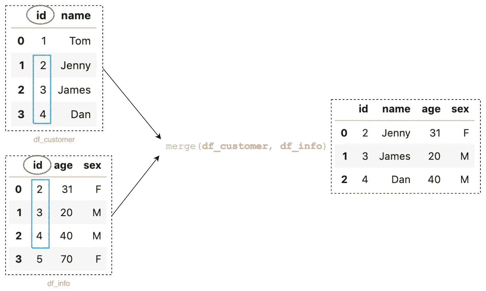

最简单的呼叫(图片由作者提供)

默认情况下，该函数将组合公共列(在我们的示例中是列 ***id*** )上的数据，并且只生成在左右数据帧中都匹配的结果。

如果您喜欢从左侧数据帧调用 merge，下面是一个等效的语句。

```
**df_customer**.merge(df_info) 
```

# 2.使用上的参数指定键列

您可以指定用于合并的公共列。为此，向函数`merge()`传递一个额外的参数`on`作为公共列的名称，在我们的示例中为`'id'`:

```
pd.merge(df_customer, df_info, **on='id'**)
```

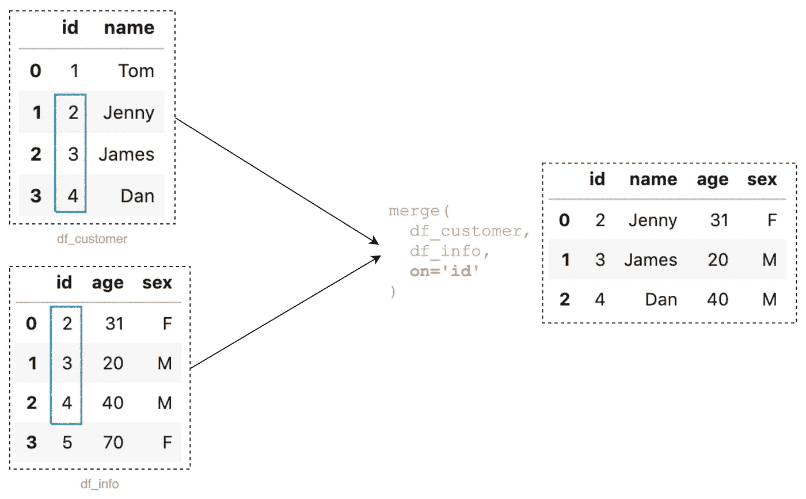

pd.merge(df_customer，df_info， **on='id'** )(图片由作者提供)

如果你使用`on`，你必须**确保你指定的列必须出现在左右数据帧**中。

要合并多个公共列上的数据，您可以将一个列表传递给`on`:

```
pd.merge(df_customer, df_order, **on=['id', 'name']**)
```

# 3.使用`left_on`和`right_on`合并

您要合并数据框的列可能会有不同的名称。对于这种合并，您必须指定`left_on`作为左侧数据帧名称，指定`right_on`作为右侧数据帧名称，例如:

```
pd.merge(
  df_customer, 
  df_info_2, 
  **left_on='id', 
  right_on='customer_id'** )
```

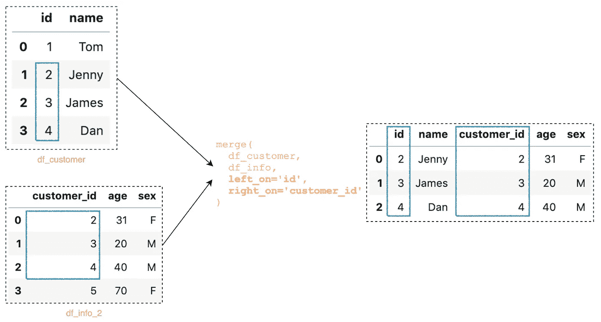

合并左 _ 开和右 _ 开(图片由作者提供)

结果将同时包含 ***id*** 和 ***customer_id*** 列。

# 4.各种类型的连接:`inner`、`left`、`right`和`outer`

它们是 Pandas `merge()`函数可用的 4 种连接类型。这些连接背后的逻辑与您在 SQL 中连接表时的逻辑非常相似。您可以通过使用以下值指定`how`参数来执行一种类型的连接:

*   `inner`:Pandas`merge()`函数中的默认连接类型，它产生在两个数据帧中都有匹配值的记录
*   `left`:从左侧数据帧产生所有记录，从右侧数据帧产生匹配记录
*   `right`:从右侧数据帧产生所有记录，从左侧数据帧产生匹配记录
*   `outer`:当左侧或右侧数据帧中存在匹配时，生成所有记录

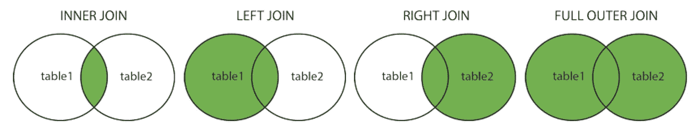

来源[https://en . Wikipedia . org/wiki/Join _(SQL)](https://en.wikipedia.org/wiki/Join_(SQL))

下面是我们测试数据集的维恩图

```
df_customer = pd.DataFrame({
    'id': [1,2,3,4],
    'name': ['Tom', 'Jenny', 'James', 'Dan'],
})df_info = pd.DataFrame({
    'id': [2,3,4,5],
    'age': [31,20,40,70],
    'sex': ['F', 'M', 'M', 'F']
})pd.merge(df_customer, df_info, **on='id'**, **how=?**)
```

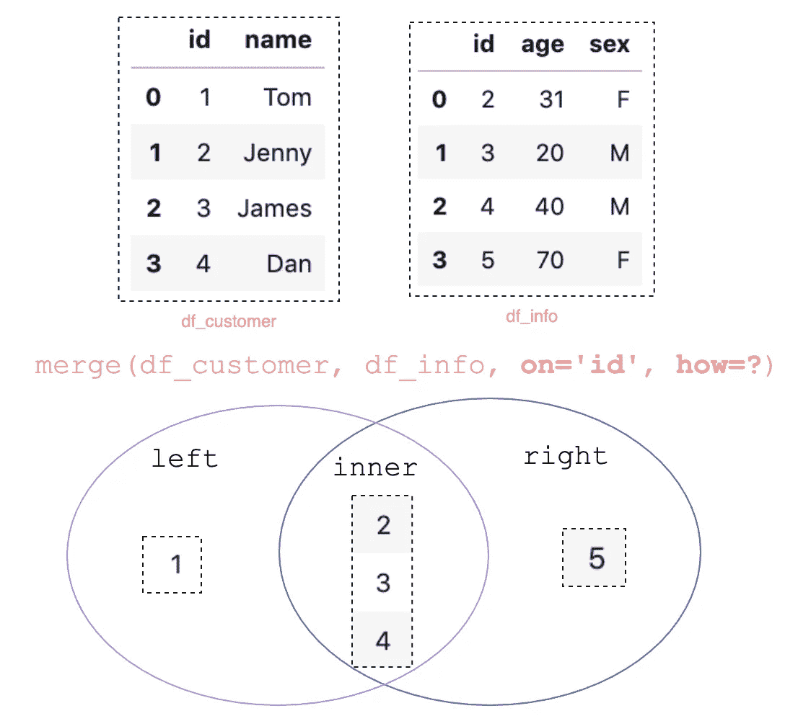

维恩图(图片由作者提供)

## 4.1 内部连接

默认情况下，Pandas `merge()`执行内部连接，它只产生在两个数据帧中匹配的记录集。

```
pd.merge(df_customer, df_info, on='id')
```

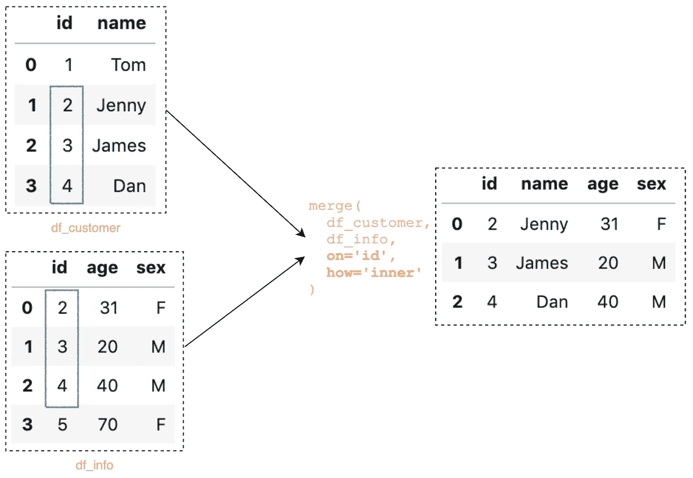

`Pandas merge with inner join` (图片作者提供)

下面是等效的 SQL 查询:

```
SELECT * from customer
**INNER JOIN** info
ON customer.id = info.id
```

要显式指定内部连接，可以设置参数`how='inner'`

```
pd.merge(df_customer, df_info, **how='inner'**, on='id')
```

## 4.2 左连接

左连接从左侧数据帧产生所有记录，从右侧数据帧产生匹配的记录。如果没有匹配，左侧会包含`NaN`。您可以将参数`how='left'`设置为左连接:

```
pd.merge(df_customer, df_info, **how='left'**, on='id')
```

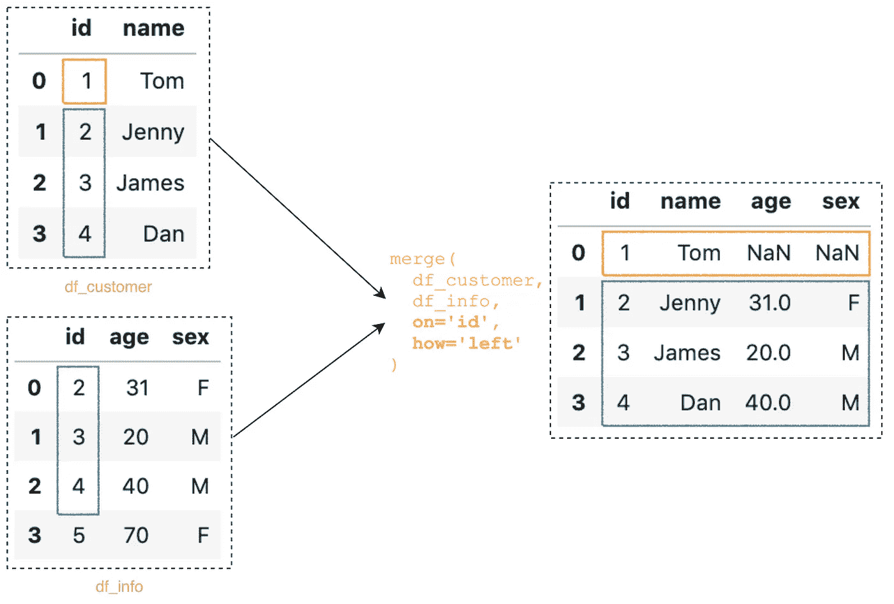

带左连接的 Panda merge()

下面是等效的 SQL 查询:

```
SELECT * from customer
**LEFT OUTER JOIN** info
ON customer.id = info.id
```

## 4.3 右连接

右连接从右数据帧产生所有记录，从左数据帧产生匹配的记录。如果没有匹配，右边将包含`NaN`。您可以设置参数`how='right'`来执行右连接:

```
pd.merge(df_customer, df_info, **how='right'**, on='id')
```

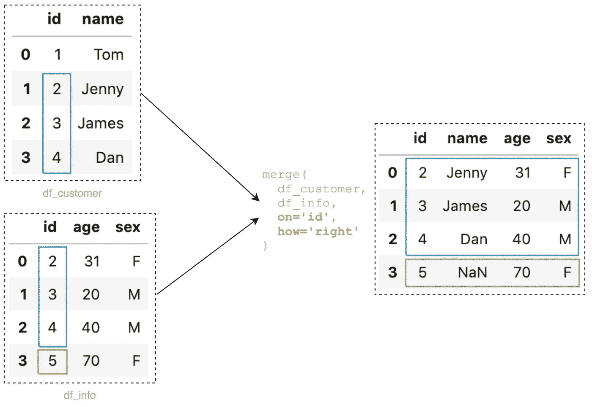

熊猫合并()带右连接(图片由作者提供)

下面是等效的 SQL 查询:

```
SELECT * from customer
**RIGHT OUTER JOIN** info
ON customer.id = info.id
```

## 4.4 外部连接

当左数据帧或右数据帧中有匹配时，外部连接产生所有记录。`NaN`将因双方无比赛而被填满。您可以设置参数`how='outer'`进行外部连接:

```
pd.merge(df_customer, df_info, **how='outer'**, on='id')
```

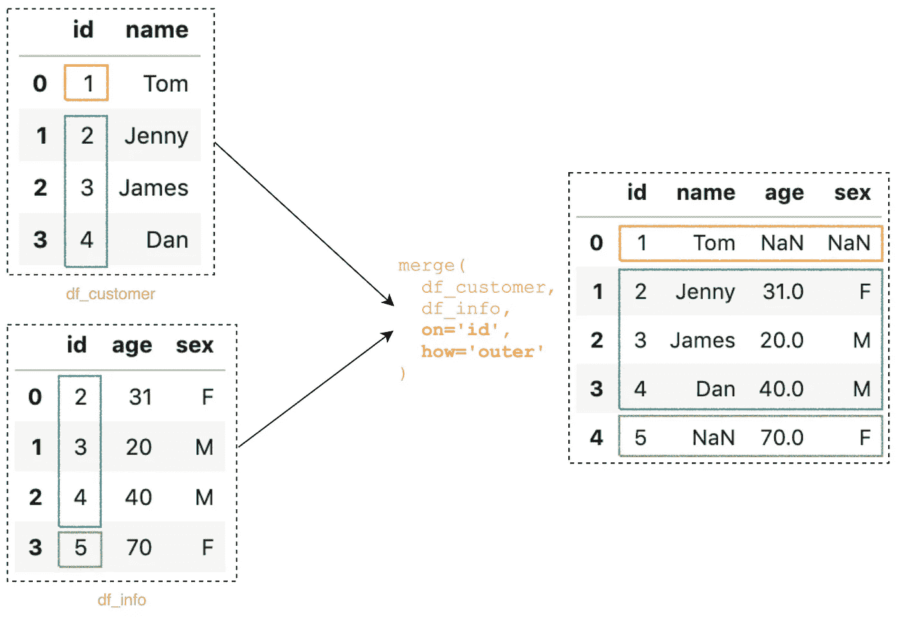

熊猫合并()与外部连接(图片由作者提供)

下面是等效的 SQL 查询:

```
SELECT * from customer
**FULL OUTER JOIN** info
ON customer.id = info.id
```

# 5.使用`validate`避免无效记录

如果合并键不是唯一的，那么`merge()`的结果可能会增加行数。例如

```
df_customer = pd.DataFrame({
    'id': [1,2,3,4],
    'name': ['Tom', 'Jenny', 'James', 'Dan'],
})df_order_2 = pd.DataFrame({
    'id': [2, 2, 4, 4],
    'product': ['A', 'B' ,'A', 'C'],
    'quantity': [31, 21, 20,40],
    'date': pd.date_range('2019-02-24', periods=4, freq='D')
})
```

`df_customer`和`df_order_2`都有 4 条记录。但是，当运行以下 merge 语句时，您将得到包含 6 条记录的结果:

```
pd.merge(df_customer, df_order_2, **how='left'**, **on='id'**)
```

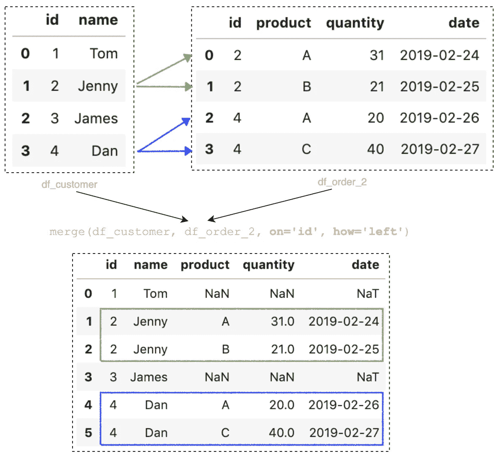

(图片由作者提供)

原因如下:

*   `how='left'`将产生来自`df_customer`的所有记录，以及来自`df_order_2`的匹配记录。
*   另外，`df_order_2`中的`id`不是唯一的，所有匹配的记录将被合并返回。

这是一个 ***一对多*** 合并的例子。在我们的示例中，这是一个有效的场景，其中一个客户可以有多个订单。但是，**一对多**在其他一些情况下可能无效，例如`df_info`中有两条 id 值为`2`的记录

```
df_customer = pd.DataFrame({
    'id': [1, **2**, 3, 4],
    'name': ['Tom', **'Jenny'**, 'James', 'Dan'],
})df_info = pd.DataFrame({
    'id': [**2**, **2**, 3, 4, 5],
    'age': [**31**, **21**, 20, 40, 70],
    'sex': [**'F'**, **'F'**, 'M', 'M', 'F']
})
```

合并结果将以同一个客户的两个不同记录结束**珍妮**:

```
pd.merge(df_customer, df_info, **how='left'**, **on='id'**)
```

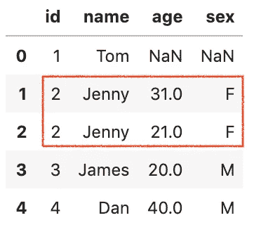

(图片由作者提供)

这当然是错误的，因为同一个客户不可能有不同的信息。为了避免这个问题，我们可以将参数`validate`设置为`'1:1'`，这样它可以检查合并键在左右数据帧中是否是唯一的。如果验证失败，将引发 **MergeError** ，例如:

```
pd.merge(df_customer, df_info, **how='left'**, **on='id', validate='1:1'**)
```

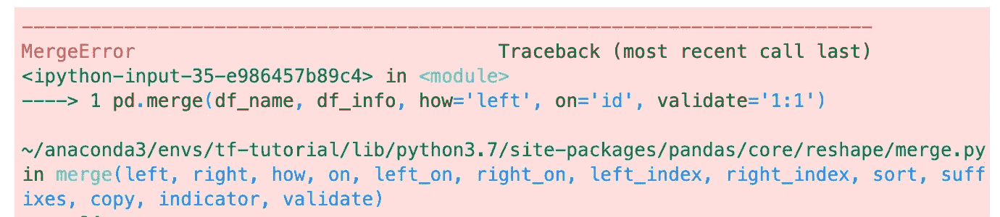

合并错误

参数`validate`采用以下值之一，因此您可以使用它来验证不同的合并输出。

*   `one_to_one`或`1:1`:检查合并键在左右数据集中是否唯一。
*   `one_to_many`或`1:m`:检查合并键在左侧数据集中是否唯一。
*   `many_to_one`或`m:1`:检查右数据集中合并键是否唯一。
*   `many_to_many`或`m:m`:允许，但不检查。

# 结论

Pandas `merge()`函数是一个简单、强大、高性能的内存操作，非常类似于 SQL 这样的关系数据库。

我希望这篇文章能帮助你节省组合数据集的时间。我建议你查看一下关于`merge()` API 的[文档](https://pandas.pydata.org/pandas-docs/stable/reference/api/pandas.DataFrame.merge.html),并了解你可以做的其他事情。

感谢阅读。请查看[笔记本](https://github.com/BindiChen/machine-learning/blob/master/data-analysis/018-pandas-merge/pandas-merge.ipynb)获取源代码，如果您对机器学习的实用方面感兴趣，请继续关注。

## 你可能会对我的其他一些熊猫文章感兴趣:

*   [熊猫重采样()你应该知道的处理时间序列数据的技巧](https://bindichen.medium.com/pandas-resample-tricks-you-should-know-for-manipulating-time-series-data-7e9643a7e7f3)
*   [如何对熊猫数据帧进行自定义排序](/how-to-do-a-custom-sort-on-pandas-dataframe-ac18e7ea5320)
*   [何时使用 Pandas transform()函数](/when-to-use-pandas-transform-function-df8861aa0dcf)
*   [你应该知道的熊猫串联()招数](/pandas-concat-tricks-you-should-know-to-speed-up-your-data-analysis-cd3d4fdfe6dd)
*   [Pandas 中应用()和转换()的区别](https://medium.com/@bindiatwork/difference-between-apply-and-transform-in-pandas-242e5cf32705)
*   [使用熊猫方法链接提高代码可读性](https://medium.com/@bindiatwork/using-pandas-method-chaining-to-improve-code-readability-d8517c5626ac)
*   [在 Pandas 数据帧中处理日期时间](/working-with-datetime-in-pandas-dataframe-663f7af6c587)
*   [熊猫阅读 _csv()你应该知道的招数](https://medium.com/@bindiatwork/all-the-pandas-read-csv-you-should-know-to-speed-up-your-data-analysis-1e16fe1039f3)
*   [你应该知道的用熊猫 read_csv()](/4-tricks-you-should-know-to-parse-date-columns-with-pandas-read-csv-27355bb2ad0e) 解析日期列的 4 个技巧

更多教程可以在我的 [Github](https://github.com/BindiChen/machine-learning) 上找到