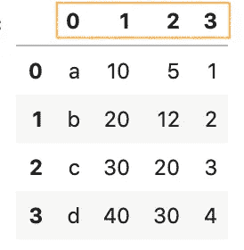
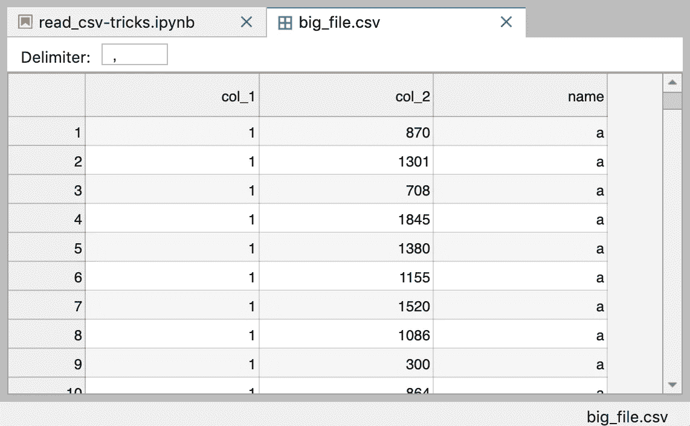

# 熊猫 read_csv()加快数据分析速度你应该知道的小技巧

> 原文：<https://towardsdatascience.com/all-the-pandas-read-csv-you-should-know-to-speed-up-your-data-analysis-1e16fe1039f3?source=collection_archive---------1----------------------->

## 一些最有帮助的熊猫技巧来加速你的数据分析


来自 https://www.flaticon.com/search?word=csv%20file[的搜索结果](https://www.flaticon.com/search?word=csv%20file)

导入数据是任何数据科学项目的第一步。通常，您会处理 CSV 文件中的数据，并在一开始就遇到问题。在本文中，您将看到如何使用 Pandas `read_csv()`函数来处理以下常见问题。

1.  处理不同的字符编码
2.  处理标题
3.  处理列
4.  解析日期列
5.  设置列的数据类型
6.  查找和定位无效值
7.  向现有 CSV 文件追加数据
8.  用`chunksize`加载一个巨大的 CSV 文件

请查看我的 [Github repo](https://github.com/BindiChen/machine-learning/blob/master/data-analysis/006-pandas-read_csv/read_csv-tricks.ipynb) 获取源代码。

# 1.处理不同的字符编码

**字符编码**是从原始二进制字节串映射到组成人类可读文本的字符的特定规则集[1]。Python 内置了对标准编码列表的支持。

字符编码不匹配现在不太常见，因为 UTF-8 是包括 Python 在内的大多数编程语言中的标准文本编码。然而，如果你试图读取一个不同于原始编码的文件，这肯定还是一个问题。当这种情况发生时，您很可能会以类似下面的内容或 **DecodeError** 结束:


来源于 [Kaggle 字符编码](https://www.kaggle.com/alexisbcook/character-encodings)

熊猫`read_csv()`函数有一个名为`encoding`的参数，允许您指定读取文件时使用的编码。

让我们看看下面的一个例子:

首先，我们用一些汉字创建一个数据框架，并用`encoding='gb2312'`保存。

```
df = pd.DataFrame({'name': '一 二 三 四'.split(), 'n': [2, 0, 2, 3]})df.to_csv('data/data_1.csv', **encoding='gb2312'**, index=False)
```

然后，当试图用默认的 utf8 编码读取文件时，您应该得到一个 **UnicodeDecodeError** 。

```
# Read it with default encoding='utf8'
# You should get an error 
pd.read_csv('data/data_1.csv')
```


为了正确地读取它，您应该传递文件编写的编码。

```
pd.read_csv('data/data_1.csv', **encoding='gb2312'**)
```


# 2.处理标题

标题是指列名。对于某些数据集，标题可能完全缺失，或者您可能希望将不同的行视为标题。`read_csv()`函数有一个名为`header`的参数，允许您指定要使用的头。

## 没有标题

如果您的 CSV 文件没有头，那么您需要将参数`header`设置为`None`，熊猫将生成一些整数值作为头

例如导入 **data_2_no_headers.csv**

```
pd.read_csv('data/data_2_no_headers.csv', **header=None**)
```



## 将不同行视为标题

我们来看看 ***data_2.csv***

```
x1,       x2,      x3,     x4
**product,  price,   cost,   profit**
a,        10,      5,      1
b,        20,      12,     2
c,        30,      20,     3
d,        40,      30,     4
```

看起来更合理的列名应该是`product`、`price`、… `profit`，但是它们不在第一行。参数`header`还允许您指定用作列名和数据开始的行号。在这种情况下，我们希望跳过第一行，使用第二行作为标题:

```
pd.read_csv('data/data_2.csv', **header=1**)
```

# 3.处理列

当您的输入数据集包含大量列，并且您想要将这些列的子集加载到 DataFrame 中时，那么`usecols`将非常有用。

就性能而言，这样做更好，因为不必将整个数据帧加载到内存中，然后删除备用列，我们可以在加载数据集时选择我们需要的列。

让我们使用同一个数据集 ***data_2.csv*** 并选择 ***产品*** 和 ***成本*** 列。

```
pd.read_csv('data/data_2.csv',
            header=1,
            **usecols=['product', 'cost']**)
```


我们还可以将列索引传递给`usecols`:

```
pd.read_csv('data/data_2.csv',
            header=1,
            **usecols=[0, 1]**)
```

# 4.解析日期列

从 CSV 文件加载数据时，默认情况下日期列表示为**对象**。

```
df = pd.read_csv('data/data_3.csv')
df.info()RangeIndex: 4 entries, 0 to 3
Data columns (total 5 columns):
 #   Column   Non-Null Count  Dtype 
---  ------   --------------  ----- 
 **0   date     4 non-null      object**
 1   product  4 non-null      object
 2   price    4 non-null      int64 
 3   cost     4 non-null      int64 
 4   profit   4 non-null      int64 
dtypes: int64(3), object(2)
memory usage: 288.0+ bytes
```

为了正确读取 ***日期*** 列，我们可以使用参数`parse_dates`来指定日期列的列表。

```
df = pd.read_csv('data/data_3.csv', **parse_dates=['date']**)
df.info()<class 'pandas.core.frame.DataFrame'>
RangeIndex: 4 entries, 0 to 3
Data columns (total 5 columns):
 #   Column   Non-Null Count  Dtype         
---  ------   --------------  -----         
 **0   date     4 non-null      datetime64[ns]**
 1   product  4 non-null      object        
 2   price    4 non-null      int64         
 3   cost     4 non-null      int64         
 4   profit   4 non-null      int64         
dtypes: datetime64[ns](1), int64(3), object(1)
memory usage: 288.0+ bytes
```

有时日期被拆分成多个列，例如， ***年*** ， ***月*** ， ***日*** *。为了将它们组合成一个日期时间，我们可以将一个嵌套列表传递给`parse_dates`。*

```
df = pd.read_csv('data/data_4.csv',
                 **parse_dates=[['year', 'month', 'day']]**)
df.info()RangeIndex: 4 entries, 0 to 3
Data columns (total 5 columns):
 #   Column          Non-Null Count  Dtype         
---  ------          --------------  -----         
 **0   year_month_day  4 non-null      datetime64[ns]**
 1   product         4 non-null      object        
 2   price           4 non-null      int64         
 3   cost            4 non-null      int64         
 4   profit          4 non-null      int64         
dtypes: datetime64[ns](1), int64(3), object(1)
memory usage: 288.0+ bytes
```

要指定一个自定义的列名来代替自动生成的***year _ month _ day***，我们可以通过一个字典来代替。

```
df = pd.read_csv('data/data_4.csv',
                 **parse_dates={ 'date': ['year', 'month', 'day'] }**)
df.info()
```

如果您的日期列是不同的格式，那么您可以定制一个日期解析器并将其传递给参数`date_parser`:

```
from datetime import datetime
**custom_date_parser = lambda x: datetime.strptime(x, "%Y %m %d %H:%M:%S")**pd.read_csv('data/data_6.csv',
             parse_dates=['date'],
             **date_parser=custom_date_parser**)
```

有关解析日期列的更多信息，请查看本文

[](/4-tricks-you-should-know-to-parse-date-columns-with-pandas-read-csv-27355bb2ad0e) [## 您应该知道的用 Pandas read_csv()解析日期列的 4 个技巧

### 一些最有用的熊猫把戏

towardsdatascience.com](/4-tricks-you-should-know-to-parse-date-columns-with-pandas-read-csv-27355bb2ad0e) 

# 5.设置数据类型

如果要设置 DataFrame 列的数据类型，可以使用参数`dtype`，例如

```
pd.read_csv('data/data_7.csv',
                 **dtype={
                     'Name': str,
                     'Grade': int
                 }**)
```

# 6.查找和定位无效值

当使用参数`dtype`设置数据类型时，您可能会得到**类型错误**


发生这种错误时，查找并定位无效值总是有用的。以下是找到它们的方法:

```
df = pd.read_csv('data/data_8.csv')**is_error = pd.to_numeric(df['Grade'], errors='coerce').isna()**df[is_error]
```


# 7.向现有 CSV 文件追加数据

你可以在熊猫`to_csv()`函数中指定一个 Python 写模式。为了将数据添加到现有的 CSV 文件中，我们可以使用`mode='a'`:

```
new_record = pd.DataFrame([['New name', pd.to_datetime('today')]],
                      columns=['Name', 'Date'])new_record.to_csv('data/existing_data.csv',
              **mode='a',**
              **header=None,**
              **index=False**)
```

# 8.用`chunksize`加载一个巨大的 CSV 文件

默认情况下，Pandas `read_csv()`函数会将整个数据集加载到内存中，当导入一个巨大的 CSV 文件时，这可能是一个内存和性能问题。

`read_csv()`有一个名为`chunksize`的参数，它允许您以相同大小的块来检索数据。这在作为数据科学项目的一部分读取大型数据集时尤其有用。

让我们看看下面的一个例子:

首先，让我们创建一个 400，000 行的大型数据集，并将其保存到 **big_file.csv**

```
# Make up a huge datasetnums = 100_000for name in 'a b c d'.split():
    df = pd.DataFrame({
        'col_1': [1]*nums,
        'col_2': np.random.randint(100, 2000, size=nums)
    }) df['name'] = name
    df.to_csv('data/big_file.csv',
              mode='a',
              index=False,
              header= name=='a')
```



接下来，让我们在用`read_csv()`加载数据时指定一个 50，000 的`chucksize`

```
dfs = pd.read_csv('data/big_file.csv',
                  **chunksize=50_000,**
                  dtype={
                      'col_1': int,
                      'col_2': int,
                      'name': str
                  })
```

让我们对每个块执行一些聚合，然后将结果连接成一个数据帧。

```
res_dfs = []
**for chunk in dfs:**
    res = chunk.groupby('name').col_2.agg(['count', 'sum'])
    res_dfs.append(res)**pd.concat(res_dfs).groupby(level=0).sum()**
```


让我们对照没有`chunksize`的解决方案来验证结果

```
pd.read_csv('data/big_file.csv',
              dtype={
                  'col_1': int,
                  'col_2': int,
                  'name': str
              }).groupby('name').col_2.agg(['count', 'sum'])
```

你应该得到相同的输出。


# 好了

感谢阅读。

请在我的 Github 笔记本上查看源代码。

如果你对机器学习的实用方面感兴趣，请继续关注。

这里有一些相关的文章

*   [用 Pandas read_csv()解析日期列应该知道的 4 个技巧](/4-tricks-you-should-know-to-parse-date-columns-with-pandas-read-csv-27355bb2ad0e)
*   [你应该知道的 6 个熊猫技巧，以加速你的数据分析](/6-pandas-tricks-you-should-know-to-speed-up-your-data-analysis-d3dec7c29e5)
*   [数据科学项目开始时你应该包括的 7 个设置。](/7-setups-you-should-include-at-the-beginning-of-a-data-science-project-8232ab10a1ec)

# 参考

*   [1] Kaggle 数据清理:[字符编码](https://www.kaggle.com/alexisbcook/character-encodings)