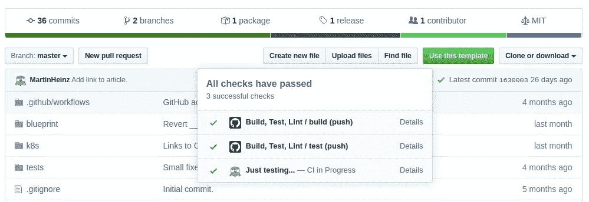
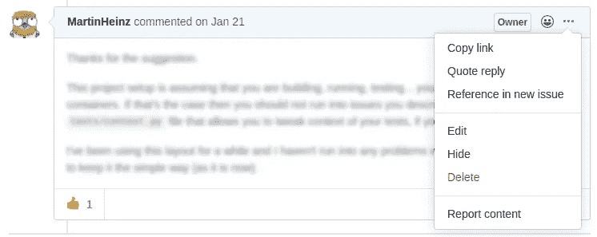

# 你可以用 GitHub API 和 Python 做的所有事情

> 原文：<https://towardsdatascience.com/all-the-things-you-can-do-with-github-api-and-python-f01790fca131?source=collection_archive---------4----------------------->

## GitHub REST API 允许您管理问题、分支、回购、提交等等，所以让我们看看您如何使用 Python 来做到这一点！

我们大多数人每天都在使用 GitHub，要么使用 CLI，要么使用它的网站。然而，有时您需要自动执行这些相同的任务，例如创建 Gist、查询存储库分析或只是拉取、修改和推送新文件。使用 [GitHub API](https://developer.github.com/v3/) 可以很容易地完成所有这些事情，Python 可以在这方面提供帮助，让事情变得更加简单。

[贝利·马洪](https://unsplash.com/@baileymahon?utm_source=unsplash&utm_medium=referral&utm_content=creditCopyText)在 [Unsplash](https://unsplash.com/s/photos/sea?utm_source=unsplash&utm_medium=referral&utm_content=creditCopyText) 上的原始照片

# 我们需要什么

在我们开始使用 GitHub API 之前，我们首先需要生成一个个人访问令牌，它将允许我们根据 API 进行身份验证。我们可以通过点击*生成新令牌*在[https://github.com/settings/tokens](https://github.com/settings/tokens)获得一个。您将被要求为令牌选择范围。您选择的范围将决定您能够对 API 执行哪些信息和操作。你应该小心那些以`write:`、`delete:`和`admin:`为前缀的，因为这些可能具有相当大的破坏性。您可以在处的[文档中找到每个范围的描述。](https://developer.github.com/apps/building-oauth-apps/understanding-scopes-for-oauth-apps/)

现在我们有了令牌，让我们测试它是否真的工作:

这是预期的(经过修整的)回应，显示了我的公共*列表*:

# 用 Python 做这件事

我们有了个人令牌，并用`cURL`测试了它，所以现在我们可以切换到用 Python 做同样的事情。不过，我们有两个选择。我们可以使用原始请求，也可以使用。

*PyGitHub* 公开了一些 GitHub API 端点，用于最常见的操作，如存储库、问题或分支管理。它不能用于通过 GitHub API 公开的每一个单独的特性，所以在下面的章节中，我将展示 *PyGitHub* 和 *Requests* 调用的混合，这取决于是否可以用 *PyGitHub* 来完成。

首先，让我们安装两个库( *PyGitHub* 和 *Requests* )并查看一个简单的例子:

使用 *PyGitHub* 的示例:

使用*请求*的示例:

上面的两个片段都使用相同的 API 端点来检索指定存储库的所有开放问题。

在这两种情况下，我们都从环境变量中获取 GitHub 令牌开始。接下来，在使用 *PyGitHub* 的示例中，我们使用令牌来创建`GitHub`类的实例，然后使用该实例来获取存储库并查询其处于*打开状态的问题*。结果是分页的问题列表，我们打印第一页。

在使用原始 HTTP 请求的示例中，我们通过从用户名和存储库名称构建 API URL 并向其发送 GET 请求来获得相同的结果，该请求包含作为主体参数的`state`和作为`Authorization`头的令牌。唯一的区别是结果没有分页。以下是两个示例的结果:

第一个是 *PyGitHub* 输出:

二、原始 Python 字典列表(JSON):

# 制造一个问题

在讨论话题的时候，让我们也创造一个话题，好吗？

这是用例之一，在这里 *PyGitHub* 非常方便。我们只需要获取存储库，针对它创建问题并指定一系列参数。在上面的代码片段中，我们使用了`title`、`body`、`assignee`和`labels`参数，但是您也可以添加里程碑或更多标签，使用它们的名称进行查询。

# 创造一个要点

我们可以创建的另一个东西是 GitHub *Gist* ，这次使用*请求*:

创建*gist*的请求非常简单。在 POST 请求中，您需要指定*要点*是否应该是`public`，接下来您需要填充将成为所述*要点*的一部分的`files`列表，其中每个*关键字*是一个文件名，其`content`包含文件的实际字符串内容。上面的代码使用`json.dumps()`将 Python 字典转换成 JSON 字符串来创建请求体和通常的*授权*头。

下面您可以看到预期响应的相关部分:

在创建了一个*要点*之后，你可能想要做其他的事情，比如更新它、列出提交、派生它或者只是获取它。对于所有这些操作，这些[文档](https://developer.github.com/v3/gists/)中列出了一个 API 端点。

# 以编程方式更新文件

使用 GitHub API 的一个非常实用但非常复杂的用例是以编程方式获取、修改、提交并最终将一些文件推送到存储库。让我们来分解一下，看一个例子:

从顶部开始，我们使用通常的存储库引用获取文件内容，将其解码为普通字符串并修改它。接下来，在`push`函数中，我们从使用`source.commit.sha`指定的提交创建新的分支。基于`if`的陈述，我们有两个选择:更新现有文件或创建新文件。如果我们正在进行更新，我们首先检索现有文件以获得其散列和路径，然后我们使用先前修改的数据(`content`)、提供的`message`、`branch`和`author`对象来执行更新。另一方面，如果我们想在存储库中创建一个新文件，那么我们只需忽略传入现有文件的 SHA，就完成了。

# 分析流量

如果您对数据科学和分析更感兴趣，您可能会发现从存储库中查询视图/克隆统计数据的有用可能性:

从 GiHub 中检索数据所需的代码实际上只有一行用于*克隆*和一行用于*视图*。`clones`和`views`对象都包含`count`、`uniques`和`views`属性。我们使用 print 语句中的前两个来分别显示实际的和唯一的克隆和视图。

令人讨厌的(漂亮的)一行遍历包含每天视图`count`的`View`对象列表，以及我们提取到元组列表中的各个`timestamp`。然后，我们找到具有最大值`count`的元组，并在最后一行打印其日期和实际视图计数。这为我们提供了如下所示的输出:

# 渲染降价

这个例子使用 GitHub API，但是也可以用于非 GitHub 目的。我说的是 GitHub APIs 从 markdown 文本生成 HTML 的能力。如果你的网站不能直接显示 markdown，这可能很有用，但是你可以使用 GitHub API 为你创建 HTML。

同样，查询非常简单。我们所要做的就是发送文本到`text` body 参数中，同时将模式设置为`markdown`。上面的`text`示例包括，`code`片段，*斜体*和*粗体*文本，这正是我们以 HTML 形式返回的内容:

回应:

# 更新提交状态

你知道 CI 工具在你的提交旁边添加的这些漂亮的绿色对勾、黄色圆圈和难看的红叉吗？您想改变它们吗(也许只是为了好玩，也许是作为您自己的 CI 解决方案的一部分)？你当然知道。有这样的 API:

令人惊讶的是(对我来说),这个模糊的 API 端点是 *PyGitHub* 库的一部分。为了使用它，我们使用提交散列来检索 repo 及其提交。之后，我们通过使用参数描述其当前状态来为所述提交创建状态。

我们可以指定 4 种状态，即`error`、`failure`、`pending`或`success`——在这个例子中，我选择了`success`。接下来，`target_url`是*细节*链接指向的 URL。您可能已经注意到，`description`和`context`是下面对话框中显示的其他值。

为了能够验证状态改变实际上已经完成，我们接收到代表提交当前状态的`CommitStatus`响应。在这种情况下看起来像这样:

# 添加对问题评论的反应

GitHub 问题评论允许你添加各种[反应](https://developer.github.com/v3/reactions/#reaction-types)到其中。所以，也许你想给某人的评论加上`+1` / `-1`。也许只是加入一些庆祝的表情符号。如果是这样的话，那么你可以用 Python 来实现:

为了能够创建响应，我们需要注释 ID。可以从文档中此处显示的[API 中检索，或者点击问题评论右上角的*三点*图标，然后点击*复制链接*:](https://developer.github.com/v3/issues/comments/#list-comments-on-an-issue)

这样我们就可以在 URL 中插入`owner`用户名、`repo`姓名和这个`comment_id`，在`content`主体参数中插入表情名称(例如`hooray`)。此外，我们还需要包括`Accept`头，因为这个端点是开发者预览的一部分。

这里的预期响应是`201`,这意味着该反应已被创建，或者是`200`,在这种情况下，该反应已经被预先添加。

这是我们得到的(经过修整的)JSON 响应体:

# 结论

玩公共 API 是开始一个新项目的好方法(例如 CI 工具、存储库流量分析、GitHub 机器人), GitHub API 有很多这样的数据/内容。我在这里展示的只是一个小样本。要探索完整的 API，请查看这里的[文档](https://developer.github.com/v3/)或者如果您不想弄乱 REST API，请查看 [*PyGitHub* 示例](https://pygithub.readthedocs.io/en/latest/examples.html)。

如果你喜欢这篇文章，你应该看看我下面的其他 Python 文章！

*本文最初发布于*[*martinheinz . dev*](https://martinheinz.dev/blog/25?utm_source=tds&utm_medium=referral&utm_campaign=blog_post_25)

 [## 自动化 Python 项目的各个方面

### 每个 Python 项目都可以从使用 Makefile、优化的 Docker 映像、配置良好的 CI/CD、代码…

towardsdatascience.com](/automating-every-aspect-of-your-python-project-6517336af9da)  [## 下一个 Python 项目的最终设置

### 从零开始任何项目都可能是一项艰巨的任务…但如果您有这个最终的 Python 项目蓝图就不会了！

towardsdatascience.com](/ultimate-setup-for-your-next-python-project-179bda8a7c2c)  [## 使用 Python 实现 gRPC 服务器

### 你的下一个 API 不需要用 REST 和 JSON 来构建。gRPC 和协议缓冲区如何获得更好的性能…

towardsdatascience.com](/implementing-grpc-server-using-python-9dc42e8daea0)