# 从信息论到机器学习中的日志丢失

> 原文：<https://towardsdatascience.com/all-the-way-from-information-theory-to-log-loss-in-machine-learning-c78488dade15?source=collection_archive---------27----------------------->

## 熵、交叉熵、对数损失和背后的直觉

马库斯·斯皮斯克在 [Unsplash](https://unsplash.com/s/photos/information?utm_source=unsplash&utm_medium=referral&utm_content=creditCopyText) 上的照片

1948 年，Claude Shannon 在他长达 55 页的论文中介绍了信息论，这篇论文名为“[一种沟通的数学理论](http://people.math.harvard.edu/~ctm/home/text/others/shannon/entropy/entropy.pdf)”。信息论是我们开始讨论的地方，这将把我们带到 log loss，这是机器学习和深度学习模型中广泛使用的成本函数。

信息论的目标是有效地将信息从发送者传递到接收者。在数字时代，信息用比特 0 和 1 来表示。根据香农的说法，发送给接收者的一位信息意味着将接收者的不确定性降低两倍。因此，信息与不确定性的减少成正比。

考虑抛一枚公平硬币的情况。正面朝上的概率 P(正面)是 0.5。在你(接收者)被告知正面朝上后，P(正面)变成 1。因此，1 比特的信息被发送给你，不确定性被降低了两倍。我们获得的信息量是不确定性的减少，不确定性是事件概率的倒数。

信息的位数可以通过不确定性减少的对数(以 2 为底)很容易地计算出来。

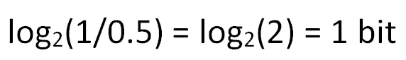

(图片由作者提供)

让我们来看一个稍微复杂一点的案例。你的两个朋友去商店买一件 t 恤，有 4 种不同的颜色可供选择。

你的朋友朱莉娅有点犹豫不决，她告诉你她可以选择任何颜色。你的另一个朋友约翰告诉你，他喜欢蓝色，他很可能会买一件蓝色的 t 恤。

你对朱莉娅的决定肯定比对约翰的更不确定。**熵**是一种量化不确定性的度量。更准确地说，它是从概率分布内的样本接收的平均信息量。

下表显示了 Julia 和 John 购买 t 恤衫事件的概率分布。

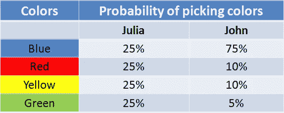

朱莉娅和约翰购买 t 恤衫的概率分布(图片由作者提供)

让我们从朱莉娅开始。如果朱莉娅选蓝色，不确定性减少 4 (1/0.25)。在以 2 为底的对数中等于 2 位(熵的基本单位是位)。因此，在蓝色的情况下，我们获得的信息量是 2 位。由于熵是样本的平均信息量，我们对其他颜色重复相同的计算。因为概率相同，所以它们的位数相同。对于 Julia，熵的计算如下:

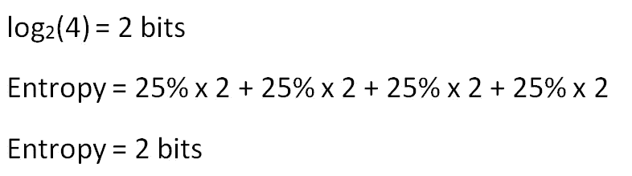

(图片由作者提供)

对约翰来说，步骤是一样的，但结果是不同的。

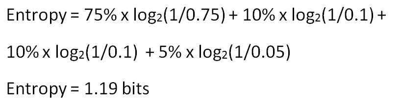

(图片由作者提供)

熵更多的是在朱莉娅的情况下，所以我们对朱莉娅的决定有更多的不确定性，这是我们开始时预期的。

我们已经计算了熵。是时候引入公式了:

熵的公式(图片作者提供)

**注意**:我们在计算中没有包括负号，因为它已经通过取概率的倒数(1 / p)而被消除了。

我们有两个事件，有四个结果。第一个事件是朱莉娅买了一件 t 恤衫，第二个事件是约翰买了一件 t 恤衫。熵分别是 2 比特和 1.19 比特。换句话说，平均来说，我们接收到关于第一个事件的 2 比特信息和关于第二个事件的 1.19 比特信息。

我们正在朝着机器学习中使用的概念前进。下一个主题是**交叉熵**，它是平均消息长度。

你的朋友选择的颜色是以数字方式(即以比特为单位)传输给你的。下表表示用于传输有关 John 选择的信息的两种不同编码。

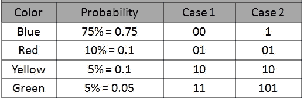

(图片由作者提供)

在情况 1 中，每种颜色使用两位。因此，平均消息长度为 2。

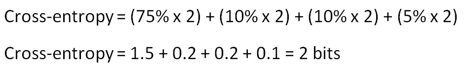

(图片由作者提供)

Julia 可以接受这种编码，但 John 不能接受。约翰的选择的概率分布的熵是 1.19 比特，因此平均使用 2 比特来发送关于他的选择的信息不是最佳方式。

在情况 2 中，交叉熵结果是 1.3 比特。它仍然大于 1.19，但肯定比情况 1 更好。

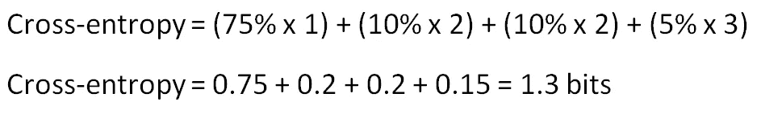

(图片由作者提供)

但是,“十字架”这个词从何而来？在计算交叉熵时，我们实际上是在比较两种不同的概率分布。一个是变量的实际概率分布，另一个是比特选择的预测概率分布。

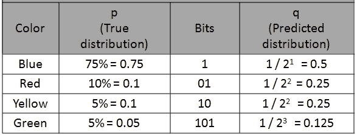

(图片由作者提供)

交叉熵可以表示为真实分布和预测分布的函数，如下所示:

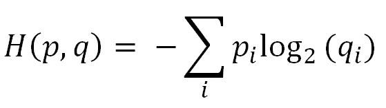

交叉熵公式(图片由作者提供)

如果你看看我们为寻找交叉熵所做的计算，你会注意到这些步骤与这个公式重叠。

我们现在可以开始讨论交叉熵如何用于机器学习领域。交叉熵损失(即对数损失)是机器学习和深度学习模型中广泛使用的成本函数。

交叉熵量化了两个概率分布的比较。在监督学习任务中，我们有一个目标变量，我们试图预测。使用交叉熵比较目标变量的实际分布和我们的预测。结果是交叉熵损失，也称为对数损失。

交叉熵和交叉熵损失略有不同。计算损失时，通常使用自然对数，而不是以 2 为底的对数。

交叉熵损失:

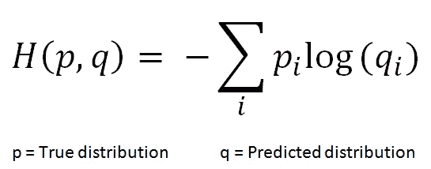

交叉熵损失(图片由作者提供)

我们来做一个例子。我们有一个 4 类的分类问题。我们的模型对特定观测值的预测如下:

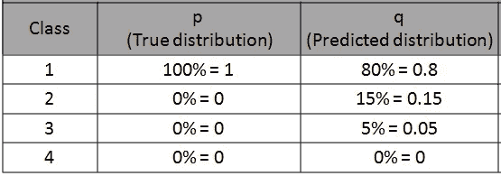

(图片由作者提供)

因为我们知道真实的概率分布，所以对于真实类是 100%，对于所有其他类是 0。根据我们的模型，这个观察值所属的类是有 80%概率的类 1。该特定观察的交叉熵损失计算如下:

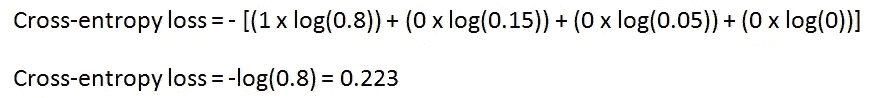

(图片由作者提供)

因为除了实际类别之外，所有类别的真实概率都是零，所以只有实际类别的预测概率对交叉熵损失有贡献。

请记住，这是特定观察的损失。训练集或测试集的损失是该集中所有观测值的交叉熵的平均值。

# **为什么会日志丢失？**

您可能想知道为什么使用对数损失而不是分类精度作为成本函数。

下表显示了两个不同模型对一个由 5 个观察值组成的相对较小的集合的预测。

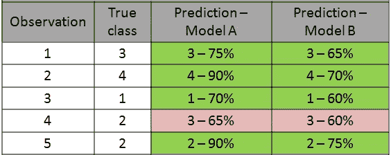

(图片由作者提供)

两个模型都正确地对 5 个观察值中的 4 个进行了分类。因此，在分类精度方面，这些模型具有相同的性能。然而，概率揭示了模型 1 在预测中更确定。因此，总体而言，它的表现可能会更好。

对数损失(即交叉熵损失)提供了对分类模型的更稳健和准确的评估。

感谢您的阅读。如果您有任何反馈，请告诉我。

# **参考文献**

*   [http://people . math . Harvard . edu/~ CTM/home/text/others/Shannon/entropy/entropy . pdf](http://people.math.harvard.edu/~ctm/home/text/others/shannon/entropy/entropy.pdf)
*   [https://www.youtube.com/watch?v=ErfnhcEV1O8](https://www.youtube.com/watch?v=ErfnhcEV1O8)