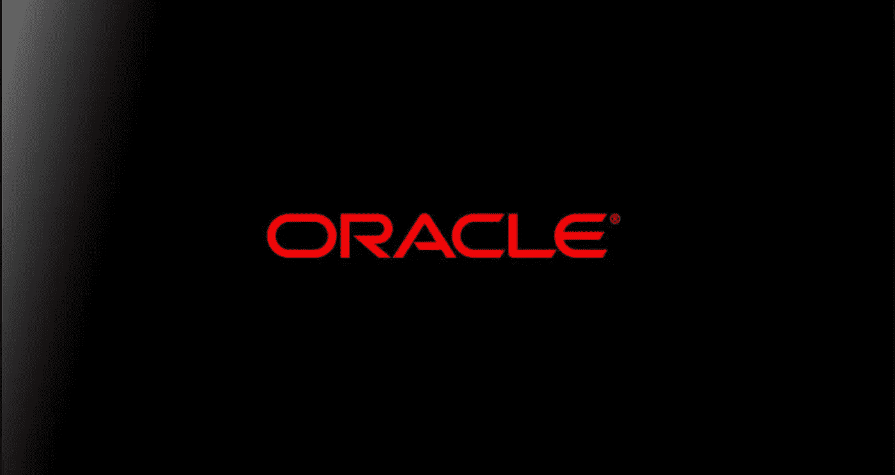
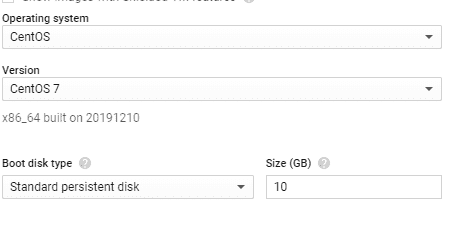
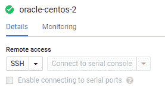
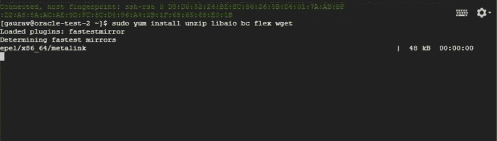
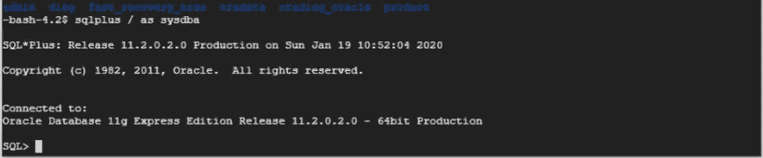

# 全 GCP:在虚拟机实例中安装 ORACLE 数据库

> 原文：<https://towardsdatascience.com/all-things-gcp-installation-of-the-oracle-database-in-vm-instance-ab35c200b7b1?source=collection_archive---------16----------------------->

众所周知，ORACLE 是甲骨文公司的专有数据库之一。由于这不是开源软件，在云上使用它相当困难。

如果你真的想在云中使用 oracle，最简单的(也可能是唯一的)解决方案是使用支持 Oracle 数据库的 [Oracle cloud](https://www.oracle.com/database/cloud-services.html) 。

据我所知，甲骨文不支持任何其他[云提供商](https://blog.dbi-services.com/google-cloud-platform-instances-and-oracle-database-performance/)的许可。但大多数用户使用 AWS、GCP 和 Azure 的云解决方案。仅将 Oracle 云用于数据库实际上是错误的。

# 动机

对于我的组织，我需要从。dmp 文件。由于我们严重依赖 GCP，使用 GCP 进行数据库存储是显而易见的。

# 安装步骤

**启动虚拟机实例**

1.  启动虚拟机实例
2.  使用 Centos 图像

3.虚拟机初始化后，点击 SSH(如果需要，我们可以使用 [putty](https://www.freecodecamp.org/news/how-to-create-and-connect-to-google-cloud-virtual-machine-with-ssh-81a68b8f74dd/) )

**将 Oracle 安装到 Centos 虚拟机**

1.  安装所需的软件包

> *sudo yum 安装 unzip libaio bc flex wget*

2.我们将使用 dd 命令创建一个 2GB 大小的交换文件，如下所示。请注意，bs=1024 表示一次最多读取和写入 1024 个字节，count = (1024 x 2048)MB 文件大小。

> sudo DD if =/dev/zero of =/mnt/swap file bs = 1024 count = 2097152

3.对文件设置适当的权限；使它只对根用户可读，如下所示。

> sudo chmod 600 /mnt/swapfile

4.现在用 mkswap 命令为交换空间设置文件。

> sudo mkswap /mnt/swapfile

5.启用交换文件，并将其作为交换文件添加到系统中。

> swapon /mnt/swapfile

6.允许在引导时挂载交换文件。

> 编辑 **/etc/fstab** 文件，并在其中添加以下行。
> 
> /mnt/swapfile 交换交换默认值 0 0

7.下载 Oracle 数据库[快速版 11g](https://www.oracle.com/database/technologies/xe-prior-releases.html)

8.使用 wget

> 重命名文件名(我将其命名为 Oracle-xe-11 . 2 . 0–1.0 . x86 _ 64 . rpm . zip)

9.更改权限

> chmod 755 Oracle-xe-11 . 2 . 0–1.0 . x86 _ 64 . rpm . zip
> 
> 解压缩 Oracle-xe-11 . 2 . 0–1.0 . x86 _ 64 . rpm . zip

10.然后转到文件夹

> 光盘 1
> 
> sudo rpm-IVH Oracle-xe-11 . 2 . 0–1.0 . x86 _ 64 . rpm
> 
> sudo/etc/init . d/Oracle-xe configure

11.安装好了！

**通过虚拟机登录 Oracle**

1.  切换到 oracle 用户

> sudo 密码 oracle

2.检查类型

> 显示本用户信息
> 
> 苏——甲骨文

3.去…

> vi $HOME/。轮廓

4.写

> 。~/product/11 . 2 . 0/xe/bin/Oracle _ env . sh

5.注销

> 注销

6.再次登录

> 苏——甲骨文

7.注册

> sqlplus / as sysdba

您已经成功登录到 Oracle 数据库。万岁！

# 视频教程

# 尾注

谢谢你达到这个目的。如果你想了解更多与此相关的内容，你可以通过 [Linkedin](https://www.linkedin.com/in/gauravc2708/) 或 [email](http://gauravc2708@gmail.com) :)联系我