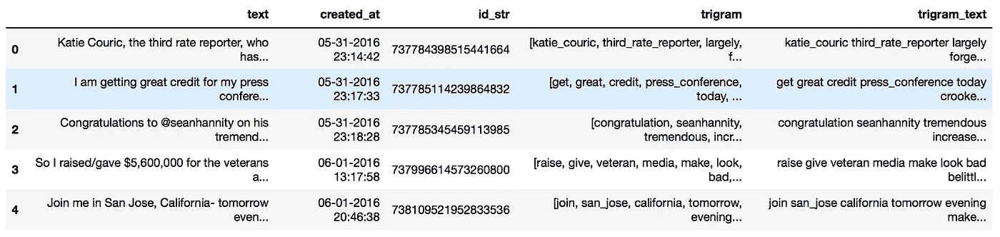
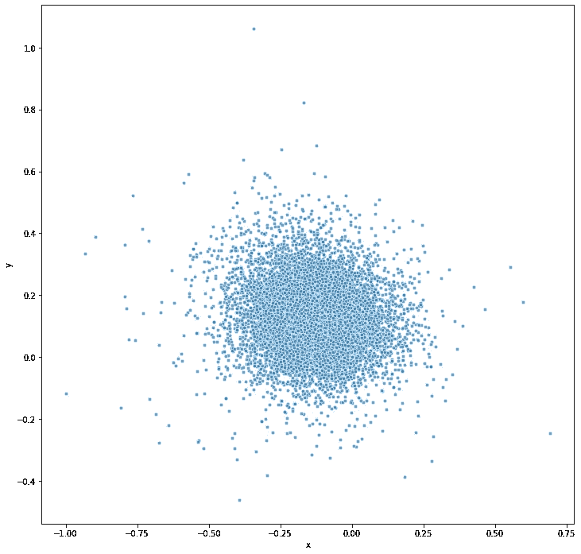
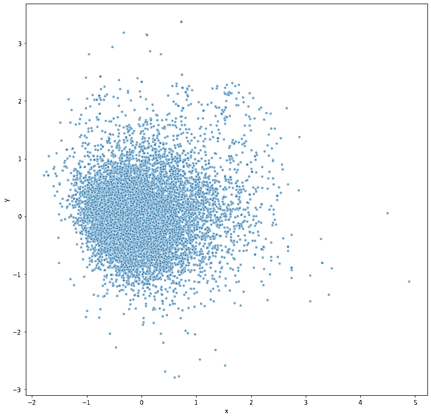
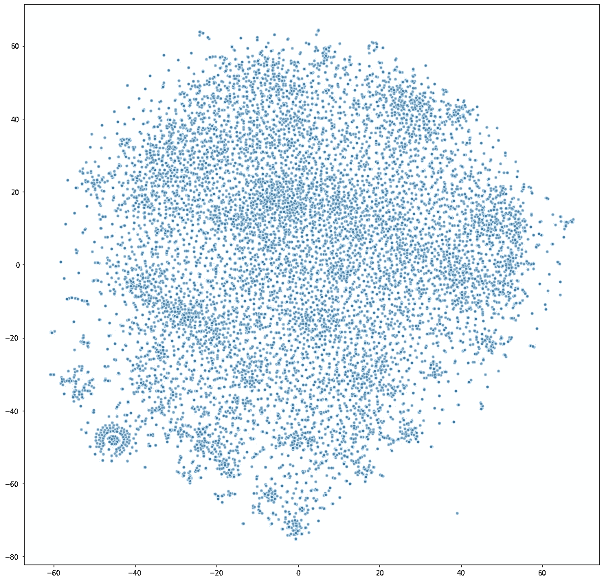
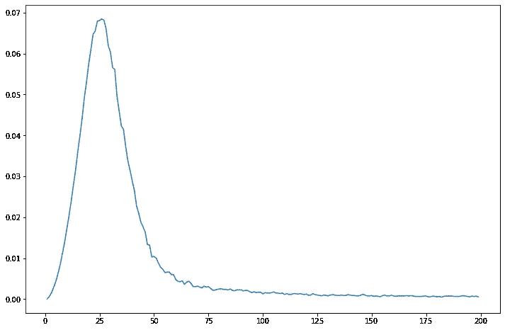
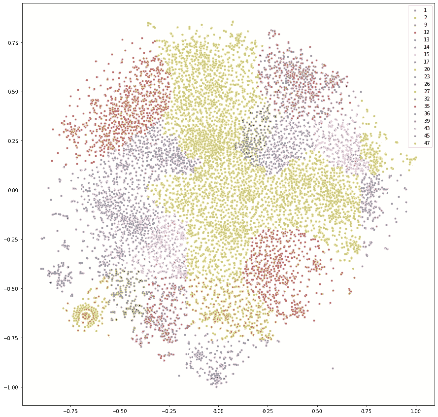
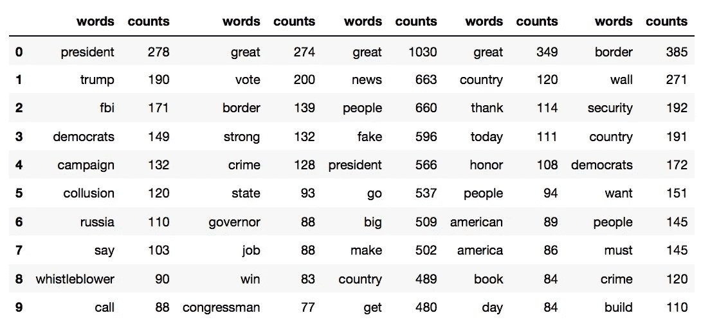
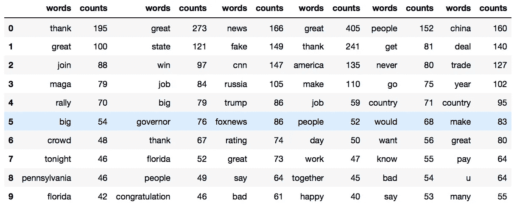
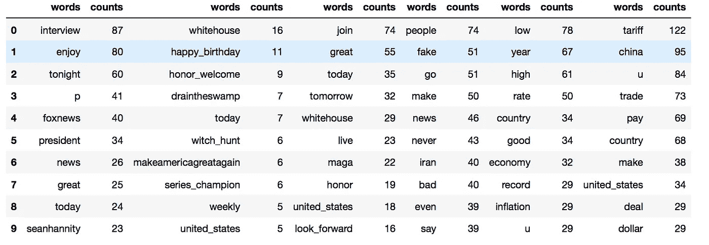
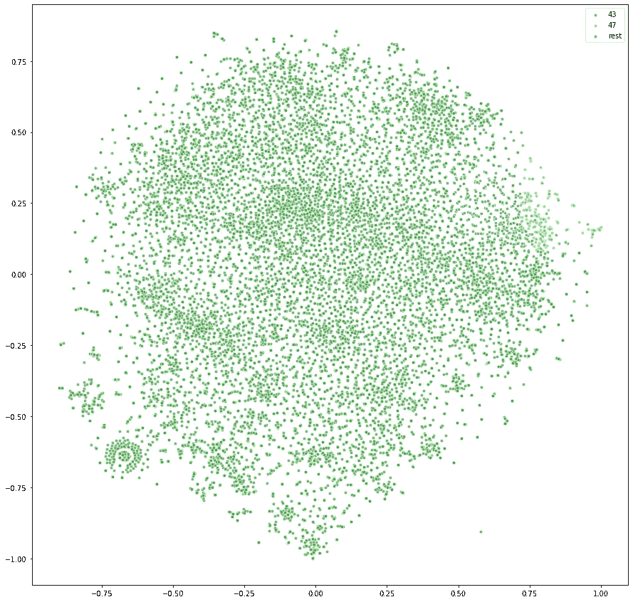

# 所有的向量都不相等，但有些向量比其他向量更不相等…

> 原文：<https://towardsdatascience.com/all-vectors-are-unequal-but-some-are-more-unequal-than-the-others-2e39bc398085?source=collection_archive---------83----------------------->


照片由[戴维斯科](https://unsplash.com/@codytdavis?utm_source=unsplash&utm_medium=referral&utm_content=creditCopyText)在 [Unsplash](https://unsplash.com/s/photos/orange?utm_source=unsplash&utm_medium=referral&utm_content=creditCopyText) 拍摄

## 在特朗普的推文中寻找意义。第二部分。

*从我们在第一部分停止的地方继续，深入到矢量文本。讨论使用文本向量表示的问题，并为最后一部分设置场景，我们将尝试解决这些问题。*

在第一部分中，我们设置了问题，并对数据集进行了一些基本的探索性分析。概括地说，我们使用特朗普四年的推文历史作为 NLP 分析的试验场。好处是，这是一个具有挑战性的数据集，相当混乱，有许多缩写和连接的单词，标签。每条推文都是一个相对较短的句子，有时是句子的一部分(因为几条推文之间的分裂，或者因为它是对附加链接或图像的一个单词的评论)。格式的简洁为主题识别提供了一个特殊的挑战，因为我们实际上没有太多的文本可以继续。

关于数据集的链接和初始处理步骤(以及一些额外的分析),请参见本系列的第一部分:

[](https://medium.com/swlh/searching-for-meaning-in-trumps-tweets-part-i-dbb453be26ee) [## 在特朗普的推文中寻找意义。第一部分

### 这比你想象的要难。使用 LDA、TSNE、Spacy、Gensim 和 XX-Berts 进行深入的 NLP 分析，以获得良好的…

medium.com](https://medium.com/swlh/searching-for-meaning-in-trumps-tweets-part-i-dbb453be26ee) 

在这里，我们将运行预处理的数据帧，其中我们已经创建了一个三元组集合。

这里有一张快照，让您更好地了解我们面临的情况:



## Word2Vec

在这篇文章中，我们将使用 Spacy 的大型语料库来看看一个相当标准的 word2vec 表示(请参见第一部分的导入/设置)。Bert 表示将非常相似，至少在我们需要采取的步骤方面，以获得最终答案(我们将使用预先计算的权重)，所以我将把它们留到第 3 部分。

把这些都放在一个地方:

```
import spacy
import en_core_web_lg
nlp = en_core_web_lg.load()X_w2v = np.array(
    trgrms['trigram'].apply(
        lambda x: nlp(' '.join(x)).vector
    ).apply(pd.Series).values
)
```

这里发生的是——我们首先将 *nlp.vector* 应用于“三元模型”列中的令牌列表。本质上，我们将每个句子的整个单词/二元模型/三元模型集合转换成一个 300 维的向量(如果你认为这很多，那就等着看 Bert 模型家族吧)。第二个 apply 将每个维度拆分成一个单独的列，因此我们可以得到一个包含 300 列的漂亮而干净的 numpy 数组:

```
array([[-0.23228563, -0.17819926,  0.00618625, ...,  0.18152575,
         0.003564  , -0.00292437],
       [-0.13923544,  0.16094644, -0.08356622, ...,  0.01945878,
        -0.00872067,  0.00360556],
       [-0.38719398,  0.3154016 ,  0.0200642 , ..., -0.0342296 ,
         0.0602775 , -0.01440797],
       ...,
       [-0.27288002,  0.22488602, -0.18610317, ...,  0.01231567,
        -0.29833835, -0.0486265 ],
       [-0.01917143,  0.09390885, -0.20039713, ...,  0.08660271,
        -0.22473843,  0.14869857],
       [-0.0496735 ,  0.20026001, -0.156335  , ..., -0.039683  ,
         0.476     ,  0.07886   ]], dtype=float32)
```

即使我们不能完全想象这一点，因为我们局限于可怜的 3D 视觉，我们当然可以尝试并找到一些表示，让我们至少知道我们面对的是什么。

我们要做的第一件事是，我们只看前两个维度(或者我们想要选择的任何一对维度，只是为了对其中潜藏的东西有所了解):

```
plt.figure(figsize=(12,12))
sns.scatterplot(
    x='x',
    y='y',
    data=pd.DataFrame(X[:, [0, 1]], columns=['x', 'y']),
    s=20,
    alpha=0.7
)
```



这看起来就像一个大斑点。如果你在其他维度中循环——你会发现所有维度都非常相似。虽然乍一看令人失望，但这实际上给出了一个重要的见解。我一次又一次地看到人们进行向量转换，然后直接使用 KMeans 进行聚类，并试图从他们不可避免地识别的聚类中得出一些结论(这就是 KMeans 的工作方式——如果你告诉它在这里找到 36 个聚类，它会毫不犹豫地找到所有 36 个聚类)。现实是，**这种集群化是没有意义的，被识别的组和随机的一样好**。

也许这太令人惊讶了，因为单词或整个句子甚至句子集合的向量表示主要与它们的共现频率有关。它背后确实有一些含义，但不一定是为了主题识别而准备的。很难在 300 个维度(或伯特模型中的 768 个维度)中的每一个背后建立任何类型的直觉，尽管人们可以推测其中只有一小部分会负责语义关系的大部分。问题是我们不知道哪一个，并且在无监督的模型设置中很难找到它们。

向前跳一点——使用 Bert 嵌入对这一点来说特别具有挑战性，因为我们有更多的维度，并且它们根本没有为向量相似性做好准备。事实上，试图计算不同句子之间的余弦将导致它们都非常接近 1，并且从句子到句子的比较中得出任何意义将是极其困难的。已经进行了一些尝试来重新训练专门用于相似性任务的权重，然而结果并不足够普遍以用于任何设置。我们需要为我们的特定目的训练模型，这是我们在这里试图避免的，因为我们的数据集不够大。

这并不意味着我们应该就此止步。我发现尝试降低问题的维度，看看我们是否可以通过这种方式获得更好的结果，这很有启发性。

## 降维

首先，我们来看看主成分分析。如果你以前没有使用过，这里的是一个很好的教程，可以提供一个快速的概述，或者在维基百科[这里](https://en.wikipedia.org/wiki/Principal_component_analysis)阅读更深入的理论概述。本质上，我们正在做的是拟合一个为数据集定制的新坐标系，并删除最不重要的轴。我们将把它减少到只有 2D，可视化它，看看我们是否喜欢我们的新数据表示比我们以前玩的随机选择的维度更好。请注意，PCA 并不只是从我们的原始数据集中选择两个最重要的维度——生成的维度是全新的，它们本身是我们原始的 300 维轴的线性组合。还值得注意的是，除非我们做一个完整的 300 到 300 转换，否则我们将无法转换回来，通过下降到 2D，我们将不可避免地丢失一些信息。

```
from sklearn.decomposition import PCA
pca = PCA(n_components=2)
X_w2v_pca = pca.fit_transform(X_w2v)
plt.figure(figsize=(12,12))
sns.scatterplot(
    x='x',
    y='y',
    data=pd.DataFrame(X_w2v_pca, columns=['x', 'y']),
    s=20,
    alpha=0.7
)
```



好不了多少……结构有些变化，但是如果你在寻找被一些与意义或情感有一点点联系的东西分开的文本组，你可能在这里找不到。

但是我们不会轻易放弃。让我们看看，如果我们能得到更多的使用 SNE 霸王龙。它代表 t-分布式随机邻居嵌入，除了比 PCA 年轻 75 年之外，它通常可以更好地处理多维非线性系统。关于 t-SNE 更深入的讨论，请看这里的。让我们看看，如果将 t-SNE 应用于数据集，我们可以达到什么程度:

```
from sklearn.manifold import TSNE
X_w2v_tsne = TSNE(n_components=2).fit_transform(X_w2v)
plt.figure(figsize=(15,15))
sns.scatterplot(X_w2v_tsne[:,0], X_w2v_tsne[:,1])
```



这已经好多了。数据无疑是聚集的。我仍然会非常小心这里的 KMeans 应用程序，因为我们无法真正确定这里的最佳集群数量，而且它看起来非常大。

## 研究星团

我将在这里应用一些定制的东西——我在我的 2 篇文章系列中描述的聚类算法:

[](/a-fresh-look-at-clustering-algorithms-c3c4caa1a691) [## 重新审视聚类算法

### 深入研究一种新的聚类识别方法。

towardsdatascience.com](/a-fresh-look-at-clustering-algorithms-c3c4caa1a691) [](/clustering-algorithm-part-2-57907f5c0437) [## 聚类算法。第二部分。

### 更快、更聪明、更快乐…

towardsdatascience.com](/clustering-algorithm-part-2-57907f5c0437) 

第 2 部分附有所有需要的代码。理论上，我们可以将该算法应用于第一步中的 300 维矩阵，但是维数灾难在那里非常活跃，我们将最终只得到一个聚类。这在一定程度上与我们的数据集不够大的事实有关，考虑到我们处理的维度数量，数据点实在是太少了。或者，这可能是 SNE 霸王龙在没有结构的地方找到了结构，所以我们需要更详细地观察它。

让我们将聚类算法应用于 t-SNE 结果，然后我们可以看到这些聚类是否既合理(图形上)又有意义(语义上)。

第一步，我们需要确定每个维度的最佳分割数。此外，该算法的当前版本需要标准化的数据，因此让我们继续并同时执行这两项操作:

```
import sklearn
Xtsne_norm = sklearn.preprocessing.normalize(X_w2v_tsne, axis=0, norm='max')
prop=[]
for d in range(1,200,1):
    Xint = (Xtsne_norm * d).astype(int)
    unique, counts = np.unique(Xint, axis=0, return_counts=True)
    prop.append(
        len(counts[counts > 7]) / (
            len(counts[counts == 1]
               ) + len(Xint) - len(unique)
        )
    )plt.figure(figsize=(12, 8))
plt.plot(list(range(1, 200, 1)), prop)
```



在我们的*道具*列表上应用 *np.argmax* 得到 25，所以我们将运行 25 作为 D 参数(每个方向的分裂数)和第 90 百分位置信水平。降低置信度将导致一些集群合并在一起。更高的值会导致一些不太明显的集群被忽略。就目前而言，我们希望变得更加细化。我们还应用了算法的最近邻版本来对所有被遗漏的点进行属性化。

```
yh=density_trees_fit_nn(Xtsne_norm, 25, 90, attribute=True)
```

获取我们:

```
Processed 99.24% ids
19 clusters found
```

首先，让我们想象一下:

```
plt.figure(figsize=(15,15))
for i in np.unique(yh):
    sns.scatterplot(Xtsne_norm[yh==i][:,0],Xtsne_norm[yh==i][:,1], s=20, alpha=0.7, label=i)
```



也许不完美，但也没那么糟。让我们看看我们是否能从这些组中得到一些合理的东西，看看一些较大的组中的前 10 个词:

```
res = []
for yi, ci in zip(*np.unique(yh, return_counts=True)):
    if ci>600:
        w,c = np.unique(
            trgrms[yh == yi]['trigram'].sum(),
            return_counts=True
        )
        res.append(
            pd.DataFrame(
                {
                    'words':w,
                    'counts':c
                }
            ).sort_values(
                'counts',
                ascending=False
            ).reset_index(drop=True).head(10)
        )
600up = pd.concat(res,axis=1)
600up
```



计数在 300 和 600 之间:



200 到 300:



一方面，它看起来一点也不坏，我们开始在这里发展一些主题。关于贸易/关税和中国的推文明显分组在一起(尽管它们分成两组，可能应该合并)，关于边境和臭名昭著的隔离墙的推文也有联系，fake/news/cnn 在另一组。关于集会的公告，为即将到来的采访做广告，或者宣传一个受欢迎的州长候选人——所有这些现在都清晰可辨。

有趣的是，看起来像是可以合并的群组，确实是紧挨着出现的。例如，提及中国和关税的两个组与集合中的其他组相比如下:



当然也有问题。例如，大多数连接在一起的单词和二元模型最终都堆积在一起，因为它们没有得到适当的处理，所以它们最终都是一个通用向量(左下角的两个同心圆)。大量的术语出现在多个组中，这是意料之中的，因为我们使用整个 tweets 而不是单个单词进行分组。这可能可以通过查看单词重要性的度量来减轻。然而，并非所有情况下都是如此，因为，例如，许多关于“假新闻”的推文最终与通用组捆绑在一起，所以这些只是没有被识别出来。也有本该上来却没有上来的话题。

有些问题我们应该可以通过使用更通用的文本向量表示法来解决，这种向量表示法使用的是 Bert 模型族。这些将未知单词分解成组件，并尝试以这种方式匹配它们，这对连接单词很有帮助。我将在第 3 部分讨论这些，以及基于 LDA 和两者结合的更直观的主题建模。

今天到此为止。感谢您的阅读。