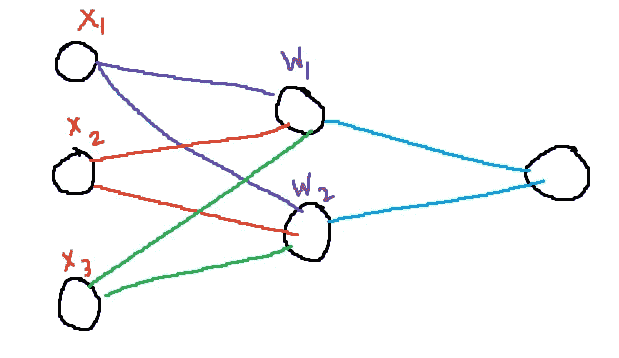
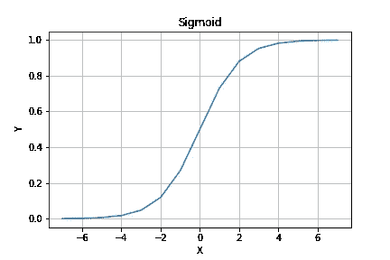
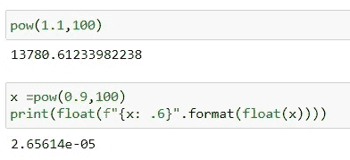
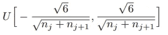
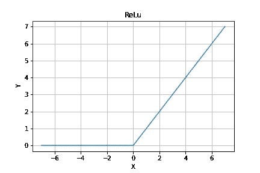
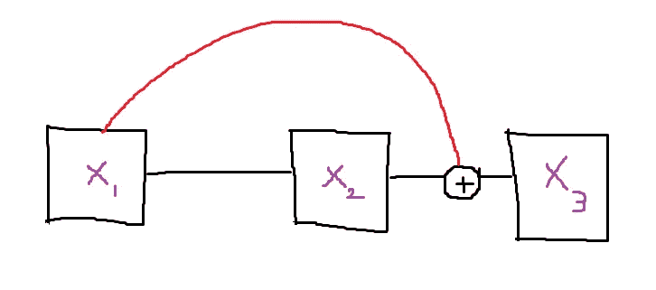
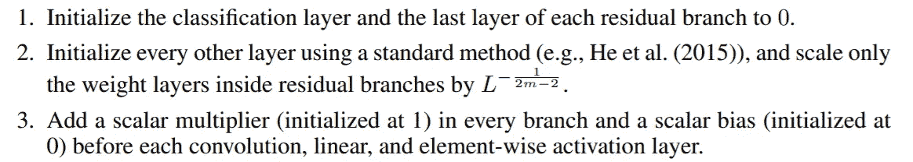
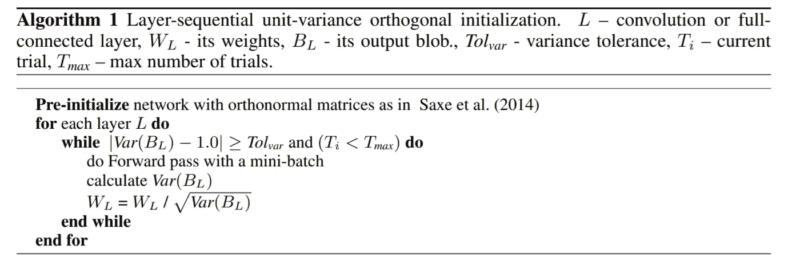

# 初始化你的神经网络的所有方法

> 原文：<https://towardsdatascience.com/all-ways-to-initialize-your-neural-network-16a585574b52?source=collection_archive---------17----------------------->

## 在本文中，我评估了权重初始化的许多方法和当前的最佳实践。

# 零初始化

**将权重初始化为零不起作用。**那为什么我在这里提到了？为了理解权重初始化的需要，我们需要理解为什么将权重初始化为零**不会**工作。



图一。简单的网络。图片由作者提供。

让我们考虑一个如上所示的简单网络。每个输入只是一个定标器 X₁，X₂，X₃.每个神经元的权重是 W₁和 W₂.每次重量更新如下:

out₁=x₁*w₁+x₂*w₁+x₃*w₁
out₂=x₁*w₂+x₂*w₂+x₃*w₂

正如你现在看到的，如果权重矩阵 W = [W₁ W₂]被初始化为零，那么 out1 和 out2 完全相同。

即使我们向两者添加非零随机偏置项，权重也被更新为非零，然而，它们将保持相同，因此隐藏单元的两个神经元正在计算相同的东西。换句话说，它们是 ***对称*** 。

这是非常不希望的，因为这是浪费计算。这就是零初始化不起作用的原因。

# 随机初始化

现在我们知道权重必须不同，下一个想法是随机初始化这些权重。随机初始化比零初始化好很多，但是这些随机数可以是 ***任意*** 数吗？

让我们假设您使用的是 sigmoid 非线性。函数如下图所示。



乙状结肠。图片由作者提供。

我们可以看到，即使对于大到 6 的值，sigmoid 的值也几乎是 1，而对于小到-6 的值，sigmoid 的值是 0。这意味着如果我们的权重矩阵被初始化为太大或太小的值，所有有用的信息都会在 sigmoid 函数中丢失。

如果我们使用 ReLu 非线性，这并不重要，但是当权重被初始化为大或小的值时，会有其他问题。有更好的方法来初始化我们的权重。

# Xavier 初始化

[Xavier 初始化](http://proceedings.mlr.press/v9/glorot10a/glorot10a.pdf)由 Xavier Glorot 和 Yoshua Bengio 在 2010 年提出。本文的主要目的是初始化权重，使激活的平均值为零，标准差为 1。考虑如下所示计算的函数。

> Z = WX + b

这里 W 是权重矩阵，X 是来自前一层的输入，b 是偏差。z 是由也称为激活的层计算的输出。我们希望 Z 的平均值为 0，标准差为 1。(从技术上讲，Z 是类似 ReLu 的非线性激活后的结果)

为什么均值为零和标准差为 1 很重要？
考虑一个有 100 层的深度神经网络。在每一步，权重矩阵与来自前一层的激活相乘。如果每一层的激活数大于 1，当它们重复相乘 100 次时，它们将继续变大，并且**将**爆炸到无穷大。类似地，如果激活少于一次，它们将**消失**到零。这就是所谓的 ***爆炸和消失渐变*** 问题。我们可以在下图中看到这一点。稍大于 1 的值会爆炸成非常大的数字，稍小于 1 的值会消失为零。



图片由作者提供。

为了避免渐变和激活的爆炸和消失，我们希望激活的平均值为 0，标准差为 1。我们可以通过精心选择砝码来实现这一目标。

在本文发布期间，权重的最佳实践是从[-1，1]的 [***均匀分布***](https://en.wikipedia.org/wiki/Continuous_uniform_distribution) 中随机选择，然后除以输入维度的平方根。事实证明，这不是一个好主意，梯度消失，训练非常缓慢，如果可能的话。

Xavier 初始化解决了这个问题，他建议我们从均匀分布中随机初始化权重，如下所示。



泽维尔初始化均匀分布。图片由作者提供。

如今，Xavier 初始化是通过从标准正态分布[](https://en.wikipedia.org/wiki/Normal_distribution#Standard_normal_distribution)*中选择权重来完成的，并且每个元素被除以输入维度大小的平方根。在 PyTorch 中，代码如下。*

```
*torch.randn(n_inp, n_out)*math.sqrt(1/n_inp)*
```

*Xavier 初始化非常适合 sigmoid 和 Tanh 等对称非线性。然而，对于现在最流行的非线性项 ReLu 来说，它就不那么适用了。*

# *明凯初始化*

*何等人在 2015 年写了一篇名为《深入研究 [*整流器:在 ImageNet 分类*](https://arxiv.org/pdf/1502.01852.pdf) 上超越人类水平的性能》的论文，他们在论文中介绍了现在广为人知的明凯 Init。*

*但是我们为什么需要明凯呢？Xavier Init 在 ReLu 非线性方面有什么问题？*

**

*雷鲁。图片由作者提供。*

*从上图可以看出，对于所有 X <0 and Y=X for all X> 0，ReLu 给出 0。ReLu 没有很好地定义为 0，但是大多数现代程序赋予它一个接近于 0 的近似值，就像[机器ε](https://en.wikipedia.org/wiki/Machine_epsilon#:~:text=Formal%20definition,-Rounding%20is%20a&text=For%20a%20number%20system%20and,of%20the%20chosen%20rounding%20procedure.&text=%2C%20so%20machine%20epsilon%20also%20is,rounding%20to%20the%20unit%20value%22.)。*

**

*左图:平均值为 0、标准差为 1 的正态分布。右图:经过 ReLu 后的正态分布。图片由作者提供。*

*上面我们可以看到两个散点图，左边是 ReLu 之前的数据，右边是 ReLu 之后的数据。从图像中可以清楚地看到，在 ReLu 之后，方差几乎是一半，平均值略高。这改变了激活，方差减半，所以我们需要将方差加倍，以获得 Xavier Init 的原始效果。因此，我们将权重乘以额外的
**√2** 。所以在 PyTorch 中，明凯 Init 如下所示。*

```
*torch.randn(n_inp, n_out)*math.sqrt(2/n_inp)*
```

> *如果你仍然感到困惑:
> 方差=(标准差)
> 因此，如果你想将方差加倍，你可以将数据乘以 **√2***

# *修复初始化*

*[Fixup](https://arxiv.org/abs/1901.09321) 是张等人在 2019 年提出的一种初始化。他们的观察是，明凯初始化和其他标准初始化对于具有剩余分支的网络(又名[剩余网络](https://arxiv.org/abs/1512.03385))来说效果不佳。他们发现使用标准初始化**的残差网络仅在使用** [**批处理**](https://arxiv.org/abs/1502.03167) 时工作良好。*

*让我们看看为什么明凯 Init 在剩余网络上不起作用。考虑下图所示的跳过连接。**X2 = f(X1)****X3 = f(X2)+X1**。我们知道，明凯初始化选择权重，使得每层之后的激活具有 0 均值和 1 方差。所以我们知道 X1 的方差为 1，X2 的方差为 1。但是明凯初始化不考虑跳过连接。因此，根据总方差定律，X3 的方差是双倍的。剩余分支增加的额外差异在明凯初始化中没有考虑。因此，剩余网络不能很好地与标准 init 一起工作，除非它们有 BatchNorm。如果没有 BatchNorm，输出方差会随深度呈指数增长。*

> *Var[Xₗ₊₁] ≈ 2Var[Xₗ ]*

**

*跳过剩余网络中的连接。图片由作者提供。*

*论文中的作者进行了重要的观察，即 [SGD](https://en.wikipedia.org/wiki/Stochastic_gradient_descent) 对每个剩余分支的权重的更新以高度相关的方向更新了网络输出。这意味着，如果剩余分支权重全部由 X 更新，网络输出也在权重更新的相同方向上与 X 成比例地变化。*

*作者将所需的网络输出变化定义为θ(η)。如我们所知，平均而言，每个剩余分支更新对输出更新的贡献是相等的，如果我们将剩余分支的数量称为 L，则平均而言，每个剩余分支应该将输出改变θ(η/L ),以实现输出的总改变θ(η)。*

*接下来，作者展示了他们如何初始化 m 层的剩余分支，以便它的 SGD 更新将输出改变θ(η/L)。作者表明，这可以通过以下方式重新调整这些权重层的标准初始值来实现:*

**

*重量比例因子。图片由作者提供。*

*作者还讨论了偏差和乘数的效用。他们发现，在每次卷积之前添加一个初始化为 0 的偏置层，线性层和逐元素激活可以显著改善训练。他们发现，在每个剩余分支上增加一个乘法定标器，有助于模拟标准化网络的权重范数动态。*

*总结一下修正:*

**

*修复摘要。图片摘自张等人的修图论文。*

> *Fixup 有点令人困惑，所以如果你有任何问题，请在评论中自由提问，我将很乐意尽我所能回答。*

# *LSUV 初始化*

*LSUV 是由 Mishkin 等人在 2016 年的一篇名为 [***的论文中介绍的，你需要的只是一个好的 Init***](https://arxiv.org/abs/1511.06422) 。LSUV Init 是一种数据驱动的方法，具有最小的计算量和非常低的计算开销。初始化是一个两部分的过程，首先初始化正交矩阵的权重(与高斯噪声相反，高斯噪声只是近似正交的)。下一步是用一个小批量进行迭代，并调整权重，使激活的方差为 1。作者断言，在很大范围内，小批量对方差的影响可以忽略不计。*

*在本文中，作者列出了如下初始化步骤。*

1.  *将权重初始化为具有单位方差的高斯噪声。*
2.  *用 [SVD](https://en.wikipedia.org/wiki/Singular_value_decomposition) 或 [QR](https://en.wikipedia.org/wiki/QR_decomposition) 将它们分解成正交基。*
3.  *使用第一个小批量在网络中迭代，并在每次迭代中调整权重，以使输出方差更接近 1。重复直到输出方差为 1 或最大迭代次数已经发生。*

> *在论文中，作者提出缩放因子为 **√Var(BL)** ，其中
> BL——其输出 blob*
> 
> *作者还提出了一个最大迭代次数的值来防止无限循环，然而，在他们的实验中，他们发现单位方差是在 1-5 次迭代中达到的。*

*LSUV Init 可视为正交初始化和 BatchNorm 的组合，batch norm 仅在第一个小批量上执行。作者在实验中表明，与完全批处理相比，这种方法具有很高的计算效率。*

**

*LSUV 算法。图像取自 LSUV 纸张。*

# *迁移学习*

*[迁移学习](https://en.wikipedia.org/wiki/Transfer_learning#:~:text=Transfer%20learning%20(TL)%20is%20a,when%20trying%20to%20recognize%20trucks.)是在我们的新模型中使用已经训练过的模型的权重的方法，该模型是为类似的任务而训练的。这些重量已经学习了许多有用的信息，我们可以简单地为我们的特定目标进行微调，然后*瞧*！我们有一个惊人的模型，没有初始化的麻烦。*

*每次都使用另一个模型的预训练权重是最好的方法。我们唯一需要初始化我们自己的权重的时候是我们在一个从来没有人训练过的网络上工作。而在大多数实际场景中，几乎不会出现这种情况。*