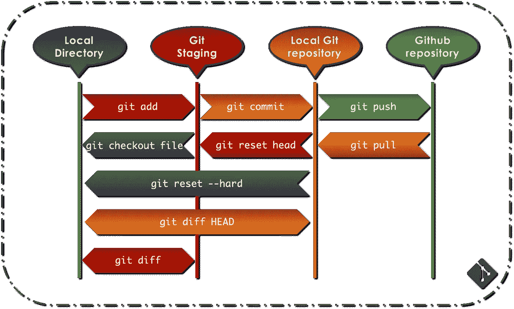
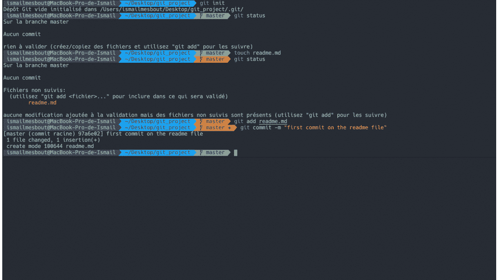
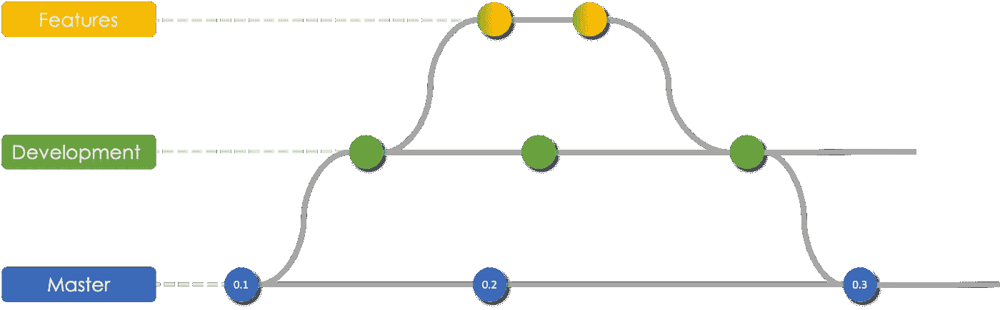
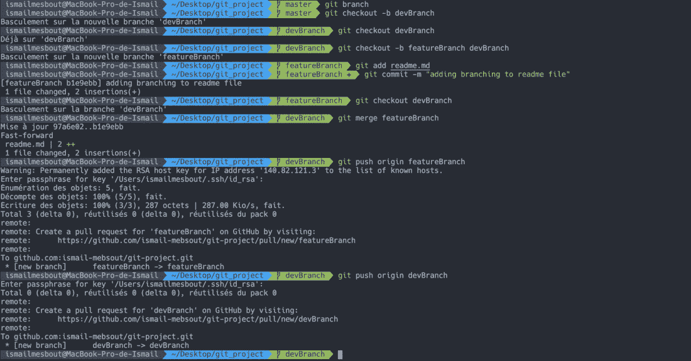
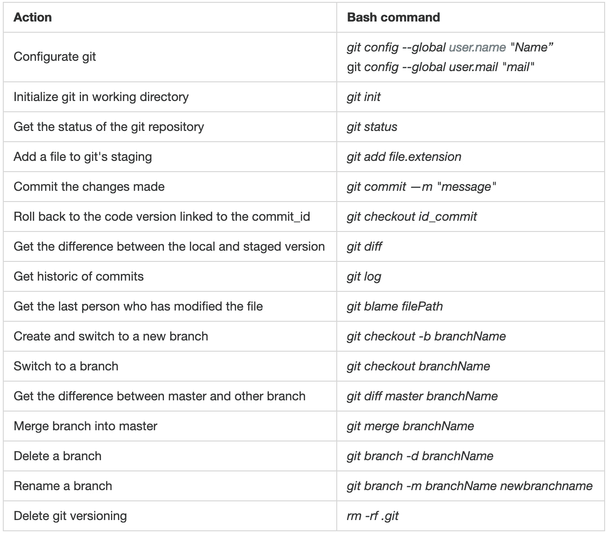
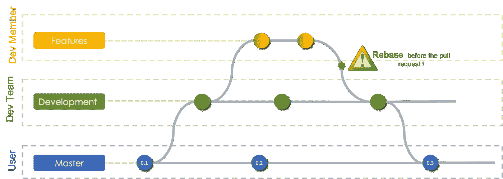
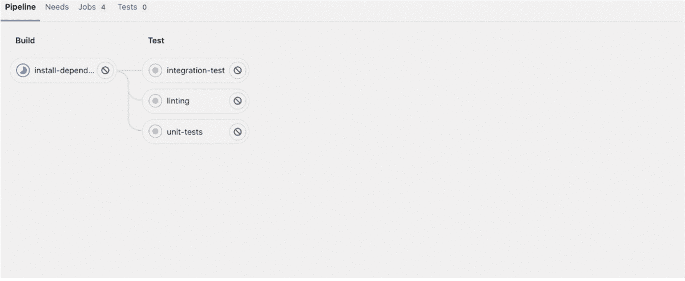

# 关于 Git、GitHub 和 GitLab 您需要知道的一切

> 原文：<https://towardsdatascience.com/all-you-need-to-know-about-git-github-gitlab-24a853422ff3?source=collection_archive---------29----------------------->


照片由[扬西·敏](https://unsplash.com/@yancymin?utm_source=unsplash&utm_medium=referral&utm_content=creditCopyText)在 [Unsplash](https://unsplash.com/s/photos/git?utm_source=unsplash&utm_medium=referral&utm_content=creditCopyText) 上拍摄

## 数据科学家入门包—第 2 部分

在[上一篇文章](https://medium.com/swlh/data-scientists-starter-pack-32ef08f7829c)中，我谈到了在从事数据科学项目时需要使用的一些最重要的工具，包括 VS 代码中的`Git`小部件。在本文中，我们将揭开工具`Git`的神秘面纱，该工具允许对代码进行`versioning`以及对`collaborative`库的处理。

# 目录

摘要如下:

1.  Git & GitHub/GitLab
2.  **你的第一个*库*库**
3.  **推拉码**
4.  **Git 项目理念**
5.  **带 GitLab 的 CI-CD**

# 1.Git & Github

Git 是一个编码工具，主要用于三个原因:

*   代码的时间版本控制
*   跟踪所做的更改
*   允许多个部分的并行协作

为此，git 分三个阶段工作:

1.  `Working directory`:是存放你项目所有文件的本地文件夹，更确切地说，是 git 被初始化的文件夹
2.  `Staging directory`:记录并索引每一个修改过的文档
3.  `Git local repository`:每次执行的更改都会产生一个版本的文档或快照，可以使用消息对其进行拍摄和标记。

在深入 git 的命令行之前，让我们先看看如何安装和配置它。

## 安装 Git

*   Windows:从以下[网站](https://gitforwindows.org/)下载 Windows Git 安装程序
*   Mac:大部分版本的 MacOs 都已经安装了 git。

## 配置 Git

如前所述，git 是一个版本控制和协作工具，因此了解项目中每个文件的工作人员非常重要，这就是为什么您应该使用您的姓名和邮件来配置 git:

```
git config --global user.name "Name" 
git config --global user.mail "mail"
```

# 2.您的第一个存储库

## 创建您的第一个 Git 回购

一旦安装并配置了 git，您就可以使用以下命令行创建您的第一个 git 项目:

```
mkdir projectFolder
cd projectFolder
git init #initialize git on your project
git status
touch file.md # create new file
open file.md # open the file and modify it
git status # file untracked -> add it to git index
git add file.md
git commit -m "file.md modified ..."
```

在下一段中，你会发现图表总结了不同阶段之间的关系。

## **在 GitHub/GitLab 上托管您的存储库**

Github 或 GitLab 是允许托管您的项目和协调多方协作的平台。以下步骤详细说明了如何做到这一点:

1.  在 GitHub/GitLab 中创建一个帐户
2.  创建新存储库
3.  复制它的链接
4.  将其克隆到您计算机上的一个文件夹中
5.  对它们的提交进行所有必要的更改
6.  将更改推送到 GitHub/GitLab

NB1:前四步只进行一次，而第五步和第六步重复进行(见下一段)。NB2:也可以使用以下命令将现有文件夹推入 github 目录:

```
git remote add origin gitAdress 
git branch -M master 
git push -u origin master
```

# 3.推拉代码

一旦你完成了所有的修改，你会想要把你的工作分享给 GitHub/GitLab 库，以便让你团队的其他成员也能访问到它。以下是需要遵循的必要步骤:

*   修改您计算机上的文件
*   运行:

```
git add file.extension #Add it to the git index:
git commit -m "message" #Commit the changes
git push #Push the changes to github
```

您可能还想通过使用以下命令行来获取其他人所做的最新更改:

```
git pull
```

下图显示了本地存储库和 GitHub/GitLab 之间的连接。



作者图片

注意:当从 GitHub/GitLab 推送或拉取时，您的凭证将被填写。

## **插图**

在下面的 GIF 中，我将创建一个本地文件夹，在其中启动 git 版本控制，并创建一个名为 README.md 的文件，然后添加并提交更改。稍后，我将创建一个 Github repo，将本地文件夹推送到这个 repo，并检查 Github 是否得到了更新:



作者图片

## 合作

在处理一个复杂的项目时，团队的每个成员通常都被分配到一个任务或功能上，他或她可以独立地工作。也就是说，每个项目可以被看作由不同成员处理的多个子项目。为了协调他们的工作，git 使用了分支的概念:主分支被称为`master`，一旦其他分支上的工作稳定下来，其他分支就可以合并到其中。分支也可以用来将`production`版本从`development`版本中分离出来，其中新的功能不断被开发，因此得名。以下是结合两者的智能工作流程:



作者图片

为此，一旦进入 git 存储库，就可以使用下面的 bash 脚本:

```
git branch # get current branch (master)

git checkout -b devBranch # create and switch to development branch

git checkout -b featureBranch devBranch # Create feature branch over the development branch
git add file.extension # Add changed file to staging
git commit -m "message" # commit the message

git checkout devBranch # switch back to development branch
git merge featureBranch # merge featureBranch into devBranch

git push origin featureBranch # push the changes on featureBranch to github/gitlab
git push origin devBranch # push the changes on devBranch to github/gitlab
```

他用之前的项目举例说明了分支和合并:



作者图片

当合并分支时，可能会发生一些冲突，尤其是当两个人处理同一个文件时，在这种情况下，您应该

*   打开引发冲突的文件
*   解决冲突(例如使用 VSCode)
*   运行:

```
git add .
git commit -m "message"
```

NB 1 :分支也可以被看作是对开源项目做出贡献的一种方式，即它们的代码在 GitHub/GitLab 上公开发布。
**NB 2** :你可能想要在你的机器和你的 GitHub/GitLab 库之间设置一个`SSH`连接，以便让你的协作更加流畅。

## 忽略文件

在某些情况下，某些文件应该保存在本地，在这种情况下，这些文件的`relative path`应该添加到 git 启动时自动创建的`.gitignore`文件中。Github 和 Gitlab 主要用于处理商店代码，因此向它们发送数据库或深度学习权重没有意义，它们的路径通常被添加到`.gitignore`文件中。

```
WEIGHTS_DIR/ #ignoring the folder of DL weights
DATA_DIR/ # ignoring the folder of data
```

## 作弊的



作者图片

作为一个小小的提醒，有两种方法可以在 VS 代码中处理你的 git 版本:要么通过 Gitlens，要么通过你安装的终端。更多细节，请随意访问 git 的官方[文档](https://git-scm.com/doc)。

# 4.Git 项目理念

当从事一个项目时，比如说一个应用程序，最好考虑编码/分支的三个层次:

*   `Master branch`:或者主分支托管应用日常用户使用的代码版本(仅针对发布)
*   `Dev branch`:用于托管应用程序计划的新开发和功能
*   `Feature branch`:每次开发新功能时创建

**NB** :如果 dev 分支稳定了，你可以将它镜像到另一个分支上，这个分支可以被应用测试人员使用，例如在`UAT phase`中，以便尝试新的特性并最终报告 bug。

## 主要指导方针

鉴于上面描述的`workflow`，这里有一些重要的事情要记住:

**主支行:**

*   *千万不要在本地主机中提交！*
*   *保护好总支！*

**开发分支:**

*   *永远不要在本地开发中提交！*
*   保持分支开发受到保护！

**特征分支:**

*   即使你的工作没有完成，也要把它推到你的远程分支上！
*   在同一个分支上协作时，避免处理同一个文件或函数！
*   *每次停滞前检查状态:* `*git status*`
*   *始终检查您是否有最新版本的开发代码*

## 开发新功能

即从 dev 分支创建一个新分支:

1.  检查是否在开发分支中:

```
git branch
```

*   如果是这样:

```
git --rebase origin/dev #Check if you are up-to-date
git checkout -b branchName
```

*   如果不是:

```
git checkout dev
git --rebase origin/dev
git checkout -b branchName
```

2.进行更改，添加并提交它们

3.将您的工作推送到您的远程分支机构:

```
git push --set-upstream origin branchName
```

4.确保您的分支机构在开发方面是最新的:

```
git checkout branchName
git pull --rebase origin/dev
```

解决冲突有哪些:

```
git add path_to_resolved_file
git commit -m "message"
git push #sends automatically to your remote branch
```

5.在 GitHub/Gitlab 中创建一个拉请求，并分配一个审核者

注:Rebase 是另一种让你的日志更干净的合并技术

我们可以把上面描述的`git flow`总结成下图:



作者图片

当进行合并时，你需要通过运行自动测试来确保应用程序运行良好，并且与之前的版本相比没有退步。这就是为什么你需要 CI/CD！

# 5.带有 GitLab 的 CI-CD

CI/CD 代表持续集成和持续交付/部署。这是一种技术方法，通过运行测试来检查应用程序开发过程是否自动化

*   新功能按预期工作
*   旧的没有倒退

**Gitlab** 提供该选项，该选项与每个项目相关联，并提供 *runners* 或拾取并执行 CI/CD *作业*的流程。

CI/CD 渠道的开发遵循 3 个主要步骤:

1.  安装和注册 GitLab 转轮
2.  在本地创建一个 yml 文件，详细说明要进行的工作/测试
3.  将工作推给 Gitlab

## 5.1.GitLab 跑步者

如前所述，运行者是用于执行预定义测试的过程。有三种:

*   **git lab 实例中的所有组和项目都可以使用共享的 runners** 。
*   **组跑步者**可用于一个组中的所有项目和子组。
*   **具体跑者**与具体项目关联。

在本练习中，我们将深入研究一次用于一个项目的*特定转轮*，要手动设置特定转轮，我们首先需要安装 [GitLab 转轮](https://docs.gitlab.com/runner/install/)。为此，例如在 MacOS 上，我们可以使用 brew:

```
brew install gitlab-runner #Install GitLab Runner
brew services start gitlab-runner # Install GitLab Runner as a service and start it.
```

一旦我们安装了运行器，我们将需要通过运行以下命令将其注册到项目中:

```
gitlab-runner register
```

然后，我们需要输入以下信息:

*   GitLab 实例 URL:非常常用[*https://gitlab.com/*](https://gitlab.com/)
*   注册令牌:在*库>设置>跑步者*中找到
*   跑步者描述:跑步者的简短描述
*   与跑步者相关的标签
*   执行者:许多选项需要考虑(Docker、ssh、shell……)

## 5.2.YML 文件

为了使用 GitLab 的 CI/CD 服务，您需要在平台上托管您的项目，并且在其根目录下有一个名为`.gitlab-ci.yml`的 YAML 文件，它托管 CD/CD 配置。

脚本被分组到作业中，而**作业**作为一个更大的管道的一部分运行。您可以将多个独立的作业分成按定义顺序运行的**阶段**。**标签**用于选择一个跑步者。

```
variables:
  GIT_DEPTH: 1 #Shallows cloning: Last commit for each file of the project

stages:
  - build
  - test
  #- deploy

install-dependencies: #Job 1
  stage: build
  tags:
    - python
  script:
    - echo "Install dependencies"
    - conda install environment.yml

linting: #Job 2
  stage: test
  tags:
    - python
  script:
    - echo "check linting"
    - pylint

unit-tests: #Job 3
  stage: test
  tags:
    - python
  script:
    - echo "unit tests"

integration-test: #Job 4
  stage: test
  tags:
    - python
  script:
    - echo "Integration tests"
```

在将你的文件推送到 GitLab 之前，你可以先检查它的语法，并在 [CI Lint](https://gitlab.com/khemon/starter-ds/-/ci/lint) 上验证它的配置。

## 5.3.GitLab 上的管道

正如在 yml 文件中看到的，CI/CD 的配置由运行不同的作业组成，这些作业属于按时间顺序引用的不同阶段:**构建**、**测试**和**部署**。同一阶段的作业并行运行，而下一阶段的作业在前一阶段的作业成功完成后运行。在每次推送到 GitLab 时，都会执行作业，并且一旦成功计算了所有作业，就会传递合并请求。您可以通过检查 CI/CD 管道来跟踪执行过程:



作者图片

**NB** :如果测试不相似，可以对`master`和`dev`分支使用`separate` yml 文件。

# 结论

Git 是一个非常强大的工具，几乎在世界范围内的每一个应用程序中使用，特别是那些有多个开发团队的应用程序，因此需要掌握这项技术，以便拥有一个可持续和健壮的开发管道，从而实现更快更好的协作。

*原载于 2020 年 1 月 27 日 https://www.ismailmebsout.com*[](https://www.ismailmebsout.com/Data%20Scientist%20Starter%20Pack%20-%20Part%202/)**。**