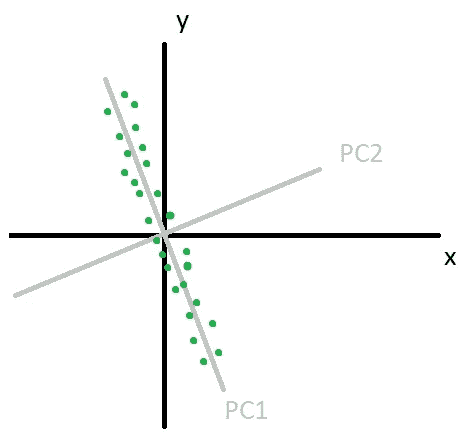
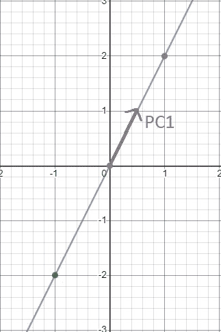

# 关于 PCA 的核心思想

> 原文：<https://towardsdatascience.com/all-you-need-to-know-about-pca-part-1-29590dd9fb65?source=collection_archive---------29----------------------->

来源:https://unsplash.com/photos/n6B49lTx7NM

*目的:读完这篇文章和第二部分后，读者应该对使用主成分分析感到舒适，并能够解释这些数字的含义。*

*观众:第一部分不需要任何数学背景，主要是逻辑和直觉。第 2 部分将假设读者熟悉矩阵、特征值和特征向量。*

**目录:**

*   介绍
*   主成分分析的直觉
*   简单的例子
*   摘要

# 介绍

## 什么是 PCA，你为什么关心它？

**主成分分析**广泛用于数据科学和机器学习。 **PCA 可以减小尺寸，从而减轻重量，便于进一步加工。但是这怎么可能呢？我们会失去信息吗？答案是，我们确实会丢失一些信息，但如果我们以一种聪明的方式去做，就不会丢失很多。这个帖子是可视化和手工计算可能带来的便利。**

## 有很多 PCA 教程。是什么让这个帖子与众不同？

网上有很多教 PCA 的资源。有些太浅，读者没有信心使用它。其中一些过于深入数学，需要读者有良好的数学背景。我个人非常喜欢数学，并且相信有一种方法可以从主成分分析中理解这些数字，而不需要通过许多数学定理。

在第一部分，我们将解释什么是 PCA，什么时候需要它，为什么需要它。我们将向您展示 PCA 非常基本的概念和直觉，以及一些简单的例子，并手动计算一些数字来给你一些味道。

在第二部分中，我们将把我们对主成分分析的直觉转化为数学，并解释来自主成分分析的数据。

# 主成分分析的直觉

## 除了旋转坐标

图 1。来源:作者手绘。

在我们解释什么是 PCA 之前，让我们看一下图 1。我们的数据就是那些绿点。它们最初用 **(x，y)** 坐标表示。在实际应用中， **XY** 对可以是体重和身高。它们可以是收入和健康，等等。只要确保它们在**均值-离差表**中，这意味着数据的均值在所有维度上都为零。不知何故，我们找到了一个新的正交坐标系 **(PC1，PC2)** 。在我们的数据中，我们可以清楚地看到数据沿着 PC1 轴传播。PC2 轴不能很好地代表数据，因为我们的大多数数据点在 PC2 轴上非常接近于零。

> 两个简单的问题
> 问:当我们使用(PC1，PC2)坐标时，我们可以去掉 PC2 轴，并且仍然能够保留大部分信息吗？是的，我们可以。移除 PC2-轴等同于将所有数据点投影到 PC1-轴上，并且在投影到 PC1-轴上之后(x，y)没有太大变化。
> 问:我们能从图像中看出 xy 轴对 PC1 轴的贡献有多大吗？是的，我们可以。很明显，PC1-轴在 y 轴上的投影比 x 轴上的多得多。

那么，什么是 PCA？PCA 就是在图像 1 中寻找新的坐标。更准确地说，PCA 就是旋转坐标系(参考系)以更好地表示数据。在大多数情况下，事实证明某些维度并不能很好地代表我们的数据，可以删除这些维度而不会丢失太多信息。但是，为什么我们要降低数据的维度呢？在实际应用中，我们的数据可能有数百个以上的维度。在许多情况下，从主成分分析中发现的新坐标，只有几百个维度中的几个负责 90%的数据。这是个好消息，因为数据的维度越少，计算量就越小。我们希望使用 PCA 的另一个原因是，我们可以深入了解我们的数据。它可以告诉我们原始坐标中哪几个维度支配了数据。好吧！怎么才能找到这个新坐标呢？让我们看一个例子。

# 简单的例子

## 平均偏差形式

在我们找到解决办法之前。我们需要量化数据在特定轴上的分布情况。不如给你举个例子。假设我们有 2D 数据和总共 3 个样本。我们的数据集是

> (-1，1)，(0，3)和(1，5)。

让我们先把数据转换成均值离差形式。我们数据的平均值是(0，3)。**均值离差形式就是原始数据集减去原始数据集的均值。**因此，我们的平均偏差形式的数据集为

> (-1，-2)，(0，0)和(1，2)。

## 数据如何在给定的轴上传播

现在我们测量数据集在 x 轴上的分布情况。我们简单地计算 x 分量到原点的距离的平方的平均值。我们有((-1) + (0) + (1) )/3 = 2/3。类似于 y 分量，我们有((-2) + (0) + (2) )/3 =8/3。所以数据在 x 轴上的扩散程度是 2/3。对于 y 轴是 8/3。y 轴上的扩散大于 x 轴上的扩散

如下图 2 所示，绿色、紫色和红色的点是我们的数据。很明显 y 轴更多。事实上，我们测量轴上分布的方式在统计学上被称为**方差**。

图 2 来源:作者手绘

方差的定义如图 3 所示

图 3 来源:[https://www.onlinemathlearning.com/variance.html](https://www.onlinemathlearning.com/variance.html)

为了简单起见，我们使用了总体方差。由于我们的数据是均值离差形式，所以总体的均值为零。

就现在。我们的数据集在 x 轴上的方差为 2/3，在 y 轴上的方差为 8/3。所以总方差是 10/3。请注意，无论我们选择使用什么正交坐标，总方差都应该是相同的。

## 寻找主轴

下一步是找到主成分轴。它被定义为在该轴上最大化数据的方差，从而与所有先前的主分量轴正交。从定义中不难得出结论:**第一主成分(PC1)方差最大；第二主成分(PC2)具有第二高的方差。**

下一步是找到**第一主成分轴(PC1)** ，它使该轴的数据方差最大化。之后，我们可以找到使数据方差最大化的**第二主成分轴(PC2)** ，此外，该轴与 PC1 正交。

在我们的例子中，如图 2 所示，很明显我们的数据集是 y=2x。并且 Arctan(2/1) = 63.4 度。(通常，您无法直观地找到 PC1。我们稍后会讨论如何找到这些轴。)这意味着我们的新轴应该是 x 轴逆时针旋转 63.4 度，如图 4 所示。

图 4 来源:作者手绘。

那么 PC1 轴上数据的方差是多少呢？它是从原点到 PC1 轴上的数据点的距离平方的平均值**。**即((-1) +(-2) + ⁰ + ⁰ + + )/3=10/3。高于 8/3 和 2/3。如果我们继续旋转轴，我们不会得到比 10/3 更高的值。为什么？因为总方差是 10/3。这也意味着单个轴可以代表 100%和 0%损失的 2D 数据。

现在，我们需要找到名为 PC2 的第二个轴。因为数据是 2D，第二个轴必须与第一个轴正交，所以只剩下一个轴。因此，我们必须考虑第二轴的最大方差。如下图所示。

图 5 来源:作者手绘。

我们的数据在 PC2 轴上的方差为 0。只是因为我们的数据集太理想了，三个点都在一条线上。在现实生活中，数据应该包含一些噪声。它应该看起来更像图 1。

因此，我们可以将坐标从(-1，–2)，(0，0)，(1，2)更改为(-5，0)，(0，0)，(5，0)。因为 PC1 代表所有方差，而 PC2 代表零方差，所以我们可以去掉 PC2。所以我们有(-5)，(0)，(5)。

## 一般找主轴。

我们的情况有点极端，因为三点都在一条直线上。在现实生活中，你的数据有噪音。这意味着不是所有的点都在一条直线上。一种不用线性代数就能找到主轴的方法是尝试所有可能的轴，然后选择方差最大的一个。但是因为即使在 2D 情况下也有无穷多个轴，所以你需要离散它们。然后你会有一个近似值。这是一种非常低效的寻找主轴的方法，尤其是在高维空间中。因此，我们需要线性代数来使它快速准确。

## 下降主轴

当您的数据有少量噪声时，您可能会发现总方差为 200。PC1 的方差为 180，PC2 的方差为 20。这 10%是否必要由你决定。大多数情况下，如果您的计算机能够承担进一步处理的计算，您不希望丢失信息。

# 摘要

PCA 就是寻找一个新的轴，使方差最大化，并与之前找到的轴正交。您还可以检查单个新轴代表数据的能力。

我没有告诉你如何用线性代数找到主轴。在我们的示例中，数据非常简单，您只能直观地看到 PC1 和 PC2。在第 2 部分中，我将向您展示如何用线性代数找到 PC1 和 PC2。它又快又准确。

敬请期待；我将很快更新第 2 部分