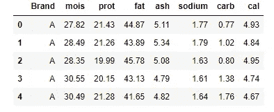
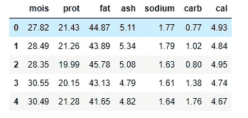
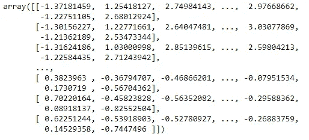
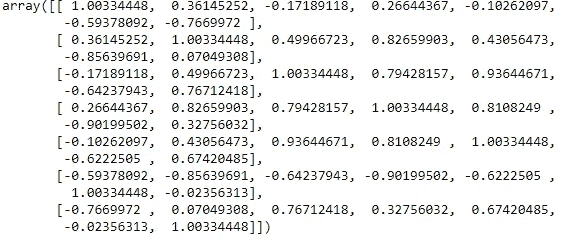
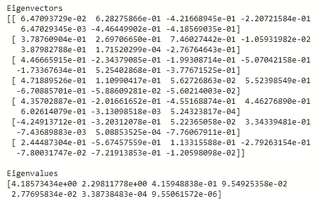
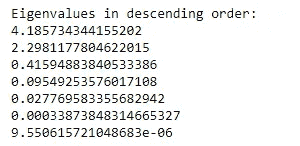
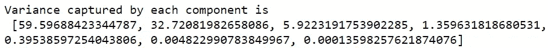
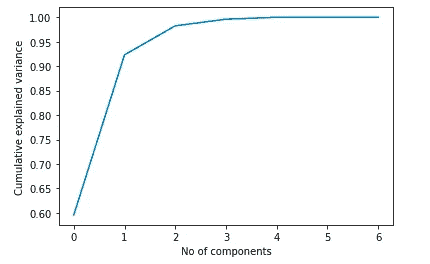

# 机器学习中的 PCA 技术

> 原文：<https://towardsdatascience.com/all-you-need-to-know-about-pca-technique-in-machine-learning-443b0c2be9a1?source=collection_archive---------29----------------------->

## 最广泛使用的降维技术的详细解释


王占山在 Unsplash 上拍摄的照片

*有没有人遇到过这样的情况，在建立模型时处理大量的变量，并担心准确性和效率低下？如果是这样，主成分分析(PCA)将会来救你* ✌️

**什么是主成分分析？**

它是最广泛使用的降维技术之一，通过识别相关性和模式将较大的数据集转换为较小的数据集，同时保留大部分有价值的信息。

**对认证后活动的需求？**

它用于克服数据集中的要素冗余。此外，它还旨在获取有价值的信息，解释导致提供最佳准确性的高差异。它使得数据可视化易于处理。它降低了模型的复杂性，提高了计算效率。

在选择主成分数量的概念背后有很多混乱。在本文中，我们将浏览所有步骤，并理解确定需要为数据集选择的组件数量的逻辑。

我们将使用包含 8 个变量的披萨数据集。你可以在这里找到数据集[。](https://github.com/SushmithaPulagam/PCA)

下面是披萨数据集的前几条记录。“品牌”为目标变量，其余为自变量。



披萨数据集的前几条记录

删除“品牌”列，因为我们只需要对独立变量进行 PCA。



去除“品牌”变量后

让我们来看看这些步骤

👉**第一步:数据标准化**

在进行 PCA 之前，我们需要对数据进行标准化。

*执行标准化是至关重要的一步，因为原始变量可能有不同的标度。我们需要将它们带到相似的范围，以获得合理的协方差分析。*

从 sklearn 库中，我们可以使用下面的代码来标准化数据。

```
from sklearn.preprocessing import StandardScaler
df_std = StandardScaler().fit_transform(df)
df_std
```



应用标准化后的输出

👉**步骤 2:用标准化数据计算协方差矩阵**

*协方差矩阵表示两个变量之间的相关性。这有助于我们理解哪两个变量严重依赖于彼此，并捕捉数据集中的偏差和冗余。*

如果矩阵中的条目带有负号，则意味着它们彼此成间接比例。如果符号是正的，意味着它们成正比。

```
df_cov_matrix = np.cov(df_std.T)
df_cov_matrix
```



协方差矩阵的输出

👉**步骤 3:计算协方差矩阵上的特征向量和特征值**

这两个代数公式总是成对计算，也称为特征分解，通过压缩数据来减少维数空间。主成分分析的核心就是建立在这些值之上的。

每个特征向量将具有相应的特征值，并且所有特征值的总和表示整个数据集中的总体方差。计算特征值非常重要，因为它解释了数据集中最大方差的位置。

要了解更多关于特征向量和特征值的信息，请访问此[ [链接](https://medium.com/fintechexplained/what-are-eigenvalues-and-eigenvectors-a-must-know-concept-for-machine-learning-80d0fd330e47#:~:text=Eigenvectors%20and%20eigenvalues%20revolve%20around,to%20represent%20a%20large%20matrix.)

```
eig_vals, eig_vecs = np.linalg.eig(df_cov_matrix)print(‘Eigenvectors \n%s’ %eig_vecs)
print(‘\nEigenvalues \n%s’ %eig_vals)
```



特征向量和特征值的输出

👉**步骤 4:按降序排列特征值列表**

完成特征分解后，我们需要按降序排列特征值，其中第一个值是最重要的，从而形成我们的第一个主成分。

```
eig_pairs = [(np.abs(eig_vals[i]), eig_vecs[:,i]) for i in range(len(eig_vals))]print(‘Eigenvalues in descending order:’)
for i in eig_pairs:
 print(i[0])
```



排序特征值的输出

👉**第五步:选择主成分数**

> 第一个主成分将捕获原始变量的大部分方差，第二个主成分捕获第二高的方差，依此类推…

```
total = sum(eig_vals)
var_exp = [(i / tot)*100 for i in sorted(eig_vals, reverse=True)]
cum_var_exp = np.cumsum(var_exp)
print(“Variance captured by each component is \n”,var_exp)
print(“Cumulative variance captured as we travel with each component \n”,cum_var_exp)
```



每个组件捕获的差异的输出

从上面可以看出，第一个主成分(PC1)获得了总方差的 60%,其次是 PC2，方差为 32.7%。


从累积差异来看，总体上 92%是由 2 个组件捕获的，98%的差异是由前 3 个组件解释的。因此，我们可以决定数据集的主成分数为 3。

我们也可以通过下面的 scree 图用解释的方差比率的累积和来形象化同样的情况。

```
pca = PCA().fit(df_std)
plt.plot(np.cumsum(pca.explained_variance_ratio_))
plt.xlabel(‘No of components’)
plt.ylabel(‘Cumulative explained variance’)
plt.show()
```



确定组件数量的 Scree 图

👉**步骤 6:创建主成分**

通过上面提到的所有步骤，考虑到最大方差，我们已经确定数据集所需的组件数量为 3。

```
from sklearn.decomposition import PCA
pca = PCA(n_components = 3)
pcs = pca.fit_transform(df_std)
df_new = pd.DataFrame(data=pcs, columns={‘PC1’,’PC2',’PC3'})
df_new[‘target’] = df1[‘Brand’] 
df_new.head()
```


用主成分创建的新数据集的数据框架

PCA 只能对数值变量进行。如果您有分类数据，那么您需要在应用 PCA 之前将其转换为数字特征。另外，请注意，这些主成分是原始数据集的线性组合。这些组件不像原始特征那样可读和可解释。

**总结**

在本文中，我们已经经历了所有的步骤，以了解如何选择数据集所需的主成分的数量。应该记住，需要极其小心地选择组件，否则可能会丢失信息。

如果您要处理数据集中的多重共线性问题，可以应用这种 PCA 技术，这将是一个很大的帮助。如果你想了解更多关于多重共线性的知识，请访问我以前的博客[ [这里](/how-to-detect-and-deal-with-multicollinearity-9e02b18695f1?source=friends_link&sk=693ee8780b09f4a19a0f2d6ac33533a7)

你可以从我的 Github [ [这里](https://github.com/SushmithaPulagam/PCA) ]获得数据集和完整的代码

感谢阅读，快乐学习！🙂