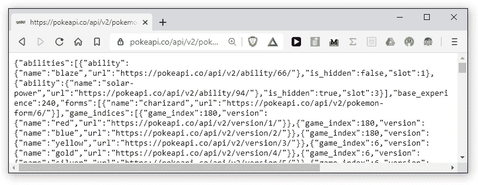
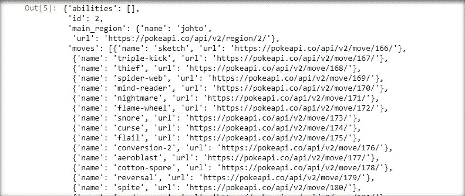
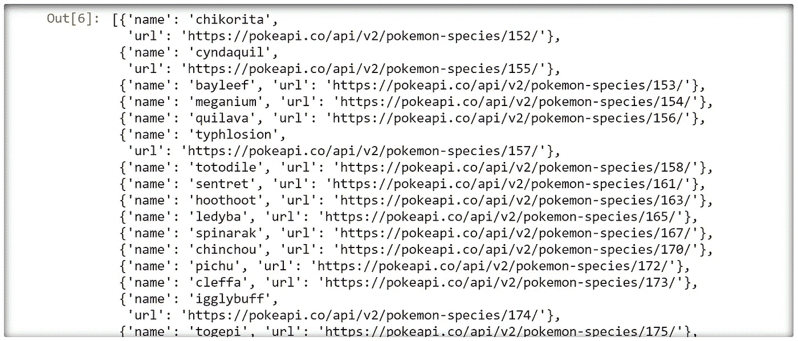
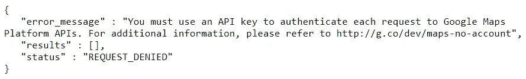
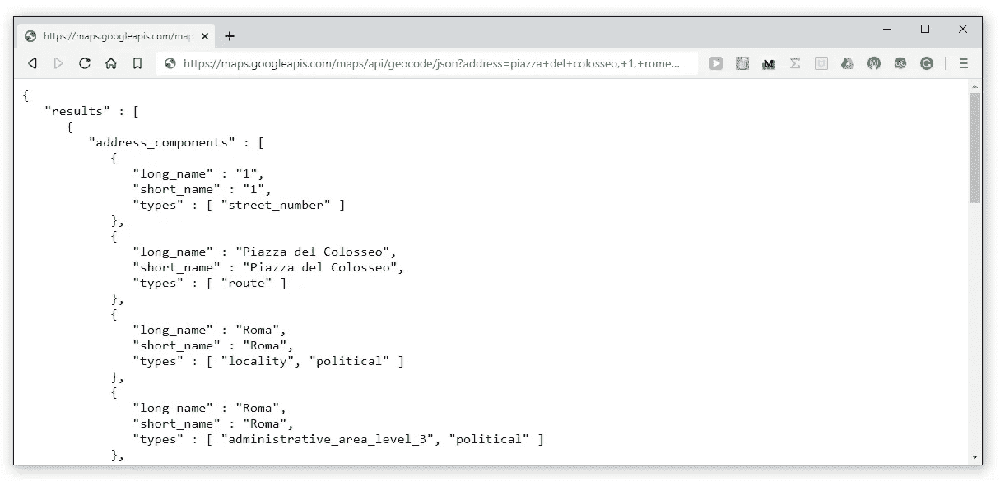
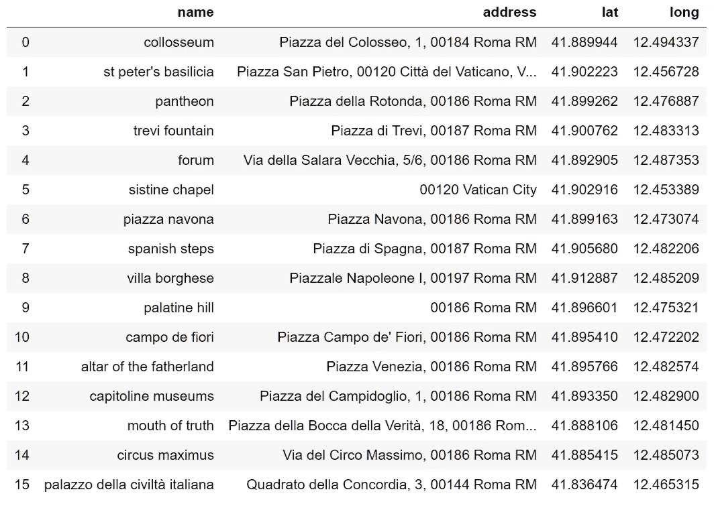
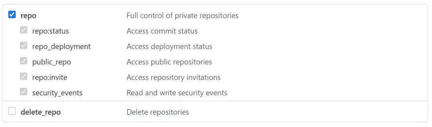

# 您需要了解的关于 Python 的所有信息

> 原文：<https://towardsdatascience.com/all-you-need-to-know-on-apis-with-python-927fb572d723?source=collection_archive---------9----------------------->

## 看看我们如何使用 Python 通过 API 与网络通信


照片由 [Pavan Trikutam](https://unsplash.com/@ptrikutam?utm_source=medium&utm_medium=referral) 在 [Unsplash](https://unsplash.com?utm_source=medium&utm_medium=referral) 上拍摄

用 Python 在网上聊天，听起来很恐怖，对吧？幸运的是，互联网很长一段时间以来一直处于良好的状态。我们与互联网交流的方法已经很成熟，而且出奇的简单。

我们将跳过简短的介绍，直接进入正题。本文将涵盖我们通过网络进行有效沟通所需的所有内容，包括:

```
- Application Program Interfaces (**APIs**)
- JavaScript Object Notation (**JSON**)
- **Requests** with Python
- Real world **use-cases**
```

# 应用程序接口

应用编程接口就像一个魔术盒。我们以指定的格式发送数据。然后，我们以指定的格式获取数据。

这个神奇的盒子只是保存在服务器上的一个脚本。它就像一个看门人——我们告诉看门人我们想知道、更改或删除一些东西，看门人会(希望)执行我们要求的动作，并告诉我们进展如何。

幸运的是，API 通常都有很好的文档记录，并且遵循相同的使用模式。绝大多数的 Web APIs 使用代表性的状态转移(REST)结构——这听起来比实际情况复杂得多。

## 休息

RESTful API 体系结构应用了**六个关键约束**:

*   所有请求都通过 [**单个外向接口**](https://restfulapi.net/rest-architectural-constraints/#uniform-interface) 处理。
*   [**客户机-服务器独立性**](https://en.wikipedia.org/wiki/Client%E2%80%93server_model)——一方的开发和功能变化不应该影响另一方(客户机指我们，服务器指 API)。
*   [**无国籍状态**](https://en.wikipedia.org/wiki/Stateless_protocol)**——服务器不保留我们会话的任何信息；每个请求都被视为新的。**

*   **使用 [**分层系统**](https://www.mulesoft.com/resources/api/what-is-rest-api-design#:~:text=Layered%20System&text=Each%20layer%20is%20separate%20but,more%20scalable%20and%20modular%20application.)**——意味着 API 由层组成，其中每一层都连接到另一层，从而创建模块化结构。****
*   ****如果适用，API 应该能够根据请求 为用户提供可执行的 [**代码。**](https://www.mulesoft.com/resources/api/what-is-rest-api-design#:~:text=Layered%20System&text=Each%20layer%20is%20separate%20but,more%20scalable%20and%20modular%20application.)****

****所有这些对我们来说意味着，我们将与单个位置进行通信，并期待特定的行为——这将使用一组 HTTP 方法进一步标准化。****

## ****方法****

****当与 API 通信时，我们倾向于使用四种方法:****

*   ******GET** —用于从 API 中检索信息。****
*   ******POST** —创建新资源(例如，GitHub repo)。****
*   ******上传** —更新现有资源。****
*   ******删除** —删除现有资源。****

****其中最常用的是 **GET** 协议。在大多数情况下，对于数据，我们更感兴趣的是下载它。****

****如果我们想使用 Google Maps API 获取一个地址的经度和纬度坐标，我们会发送一个 get 请求——因为我们实际上是从 API 获取 T21 数据。****

******修改信息**时会用到**发布、上传、删除**。以 GitHub repo 为例，我们可以用 **POST** 创建它，用 **PUT** 更新它，用 **DELETE** 删除它。****

****您可能还会看到**补丁**——这用于部分更新，类似于 PUT。我以前没用过这个，看起来不太常见但值得了解。****

## ****HTTP 代码****

****当使用 GET、POST、PUT 和 DELETE 时，我们通常会收到以下代码之一:****

```
****2xx - Success Codes
200 OK** - success (most common with **GET**)
**201 Created** - request fulfilled and new resource created (**POST**/**PUT**)
**204 No Content** - success but no content is returned in response**4xx - Client Error Codes
400 Bad Request** - request could not be understood due to bad syntax
**401 Unauthorized** - most likely we missed the auth key
**403 Forbidden** - we're trying to go places we're not allowed
**404 Not Found** - what we're trying to access doesn't exist**Honorable Mentions**
**418 I'm a teapot** - stop asking a teapot to brew coffee
**420 Enhance Your Calm** - sending to many requests to Twitter**
```

****记下最后两个——它们非常重要，**永远不要忘记它们。******

# ****JavaScript 对象符号****

****当与 API 通信时，我们需要一个发送和接收数据的标准化模板，这样 API 和我们都可以正确地处理数据。这种格式是 JavaScript 对象符号(JSON)。****

****JSON 实现了与 Python 字典中相同的键值对层次结构。****

****[点击此处](https://pokeapi.co/api/v2/pokemon/charizard)将使用我们的浏览器向 Pokemon API(所有东西都有 API)发送请求，然后加载来自 API 的 JSON 响应:****

********

****来自口袋妖怪 API 的 JSON 响应****

****在 Python 中，我们使用字典和`json`库来构建 JSON 字符串以包含在请求中，通常如下所示:****

```
**request = {'name': 'John',
           'age': 21}
json_obj = **json.dumps(**request**)**
requests.post('https://api.com', data=json_obj)**
```

# ****Python 中的请求****

****好了，我们知道它是怎么工作的了。但是我们怎么做这些事情呢？****

****我们使用`requests`——一个非常容易使用的库。例如，如果我们需要发送一个 **GET 请求**，我们只需编写:****

```
**import requests
data = **requests.get(**http**)****
```

****`http`是 API 的网址，包括指定我们想要的信息的参数。****

****让我们以[神奇宝贝 API](https://pokeapi.co/) 为例——它使用起来非常简单。****

****该 API 包括一种方法，用于查找每个新一代中添加的所有口袋妖怪——我特别记得有 151 个口袋妖怪，现在有[多于](https://en.wikipedia.org/wiki/List_of_Pok%C3%A9mon#Lists_of_Pok%C3%A9mon)896 个。所以让我们看看他们用第二代增加了多少。****

## ****1.调用 API****

****首先，我们简单地使用 GET 请求来请求数据，指定我们对`**generation**` 数据感兴趣，特别是`**generation-ii**`:****

```
**API_CALL = "https://pokeapi.co/api/v2/**generation/generation-ii**"
requests.**get**(API_CALL)**
```

****`**[Out]:** <Response [200]>`****

****好的，`<Response [200]>`是什么意思？嗯，这是 HTTP `200 OK`状态码。意味着我们的请求成功了！但是我们想要的数据在哪里呢？****

## ****2.提取数据****

****我们返回的是一个`requests.Response Object`——它包含许多有用的方法，我们想要检索实际 JSON 响应的方法是:****

```
**RES = requests.**get**(API_CALL)
RES**.json()  # returns a dictionary****
```

********

****来自 Pokemon API 的 JSON 响应—显示所有第二代相关数据。****

****现在，我们有一个非常详细的响应，包含了第二代中添加的所有内容。为了统计新口袋妖怪的数量，我们访问了`pokemon_species`列表:****

```
**DATA = RES.json()
DATA[**'pokemon_species'**]**
```

********

****来自口袋妖怪 API 的 JSON 响应—显示所有第二代口袋妖怪物种****

****最后，我们可以键入`len(DATA['pokemon_species'])`来查找新口袋妖怪的数量(它是 **100** )。****

****现在我们可以找到我们需要知道的关于口袋妖怪的一切。这很好，但可能没那么有用。****

# ****真实世界的使用案例****

****让我们使用真正的 API 和用例来编写一些更相关的代码。****

## ****使用 Google Maps API 可视化地址****

****我写的第一个代码很大程度上依赖于谷歌地图地理编码 API。现在看着它让我感到恶心——所以我们要重写它。****

****我们的目标是在地图上绘制一个地址目录。为此，我们需要它们的相对 x-y 坐标(对于 Matplotlib 来说)，这就需要我们找到它们的经纬度坐标。****

****我目前住在罗马——所以我整理了一份这里著名地标的小清单；我们将在示例中使用这些数据——所以请随意下载并跟随。****

> *******授权*******

****首先，我们需要一个授权密钥来使用 Google Maps 地理编码 API ( [~每月 40，000 次请求是免费的](https://developers.google.com/maps/documentation/geocoding/usage-and-billing))。大多数 API 总是需要我们在调用中包含一个授权密钥；否则，我们的请求将被拒绝:****

********

****我们在没有授权密钥的情况下尝试访问 API 时的反应，[单击此处尝试相同的](http://maps.googleapis.com/maps/api/geocode/json?address=piazza+del+colosseo,+1,+rome)。****

****[地理编码 API 文档](https://developers.google.com/maps/documentation/geocoding/get-api-key)包含获取 API 密钥的说明。****

> *******API 参数*******

****如果我们想找到罗马斗兽场[的坐标，我们从 HTTP 地址内部将街道地址传递给 API。](https://www.google.com/search?safe=active&sxsrf=ALeKk00HNFVN1lk12fdsEKaJqqy1T1p2sA%3A1592419794401&ei=0mXqXr6IGKyX1fAPk_ingAY&q=colosseum+address&oq=colosseum+address&gs_lcp=CgZwc3ktYWIQAzICCAAyAggAMgYIABAWEB4yBggAEBYQHjIGCAAQFhAeMgYIABAWEB4yBggAEBYQHjIGCAAQFhAeMgYIABAWEB4yBggAEBYQHjoECAAQQzoECCMQJzoFCAAQkQI6BwgAEBQQhwI6BAgAEApQ5LEmWM_nJmD87iZoAnAAeACAAXOIAaAOkgEEMTMuNpgBAKABAaoBB2d3cy13aXo&sclient=psy-ab&ved=0ahUKEwi-ubaBwonqAhWsSxUIHRP8CWAQ4dUDCAw&uact=5)****

****API 需要两个变量，`address`和`key`。我们在`[http://maps.googleapis.com/maps/api/geocode](http://maps.googleapis.com/maps/api/geocode.)` [访问地理定位 API。](http://maps.googleapis.com/maps/api/geocode.)****

```
**API = "http://maps.googleapis.com/maps/api/geocode"
ADDR = "piazza+del+colosseo,+1,+rome"
KEY = "API_KEY"  # replace this with the API key from Googlerequests.get(f"{API}/json?address={ADDR}&key={KEY}")**
```

****此代码将发送一个 GET 请求到:****

```
**[http://maps.googleapis.com/maps/api/geocode/json?address=piazza+del+colosseo,+1,+rome&key=**AUTH_KEY**](http://maps.googleapis.com/maps/api/geocode/json?address=piazza+del+colosseo,+1,+rome&key=AUTH_KEY)**
```

****如果您用`**AUTH_KEY**`在浏览器中输入这个，我们将看到来自 API 的 JSON 响应:****

********

****当请求罗马斗兽场的位置数据时，来自 Google maps 的 JSON 响应。****

> *******请求数据*******

****我们可以通过遍历列表并为每一项发送 **GET** 请求来找到地址列表中每一项的坐标:****

> *******结果*******

****在收到我们的响应`RES`后，我们使用`json`方法将其转换成 Python 字典，允许我们访问纬度`LAT`和经度`LONG`的值。我们将坐标添加到`COORDS`列表中——现在可以用来在地图上绘制位置。****

********

****该数据与我们新的 **lat** 和 **long coordinate** 列一致。****

****我们不会涉及绘图代码，但如果这是你想做的事情，我会建议使用 Matplotlib 的[底图扩展](https://basemaptutorial.readthedocs.io/en/latest/first_map.html) —尽管现在可能有更好的工具可用(我很久以前就这样做了)。****

## ****与 GitHub 交互****

****我们也可以使用 API 与 GitHub 交互。简单来说，我们将使用 POST 请求创建一个名为`api_test`的新 repo。****

> *******授权*******

****首先，和往常一样，我们需要一个授权令牌。幸运的是，我们可以比使用 Google Maps API 更快地完成这个设置——你可以在这里找到一个分步指南。****

****请注意，在第七步中，选择哪些权限完全由您决定——但是我们需要的只是`repo`:****

********

****我们只需要回购许可。我避免勾选**delete _ repo**——这似乎是个坏主意****

****现在，我们可以通过在请求中添加`headers={'Authorization': f'token {TOKEN}'}`来验证自己。****

> *******创建一个回购*******

****要创建 repo，我们只需向`[https://api.github.com/](https://api.github.com/)` `user/repos`发送 POST 请求。这里唯一需要的字段是`name`值，它指定了新的回购协议名称。我们还将`public`设置为`true`，这只是将回购隐私设置设置为 public——而不是 private(默认设置)。****

****注意，我们使用`PAYLOAD`来包含我们对 API 的指令，我们将这些指令传递给`requests.post`中的`data`参数。我们还使用`headers`参数包含了我们的授权密钥/令牌。****

> *******结果*******

****如果我们成功创建了 repo，我们将收到代码`**201 Created**`——表明请求已经成功，我们已经创建了一个新的资源。****

********

****我们也可以在 GitHub 上查看，果然`api_test`回购就在那里:****

********

****GitHub API 非常酷，我们可以用它做很多事情，正因为如此，它非常适合学习——如果你想了解更多，我建议你看一下[文档](https://developer.github.com/v3/)(也可以随时问我问题！).****

# ****最终注释****

****这就是开始使用 Python 中的 API 所需要知道的一切。当然，还有更多更相关的用例。****

****对我自己来说，我现在几乎只在公司环境中使用 APIs 主要用于数据传输和操作，以及模型设置和培训。****

****从互联网上获取数据也是一项经常性的任务，因此，这是一项非常重要的技能。理解并实践 API 是非常有用的。****

****希望这篇文章有用。如果你有任何问题或建议，请告诉我，随时通过 [Twitter](https://twitter.com/jamescalam) 或在下面的评论中联系我。****

****感谢阅读！****

****有兴趣学习更多关于数据和 web 开发的知识吗？试试我最近写的这篇关于使用 Angular 部署 Python 构建的 TensorFlow 模型的文章:****

****[](/how-to-use-angular-to-deploy-tensorflow-web-apps-5675b5a042cc) [## 如何使用 Angular 部署 TensorFlow Web 应用程序

### 在角度构建的 web 应用程序中使用 Python 构建的模型

towardsdatascience.com](/how-to-use-angular-to-deploy-tensorflow-web-apps-5675b5a042cc)****