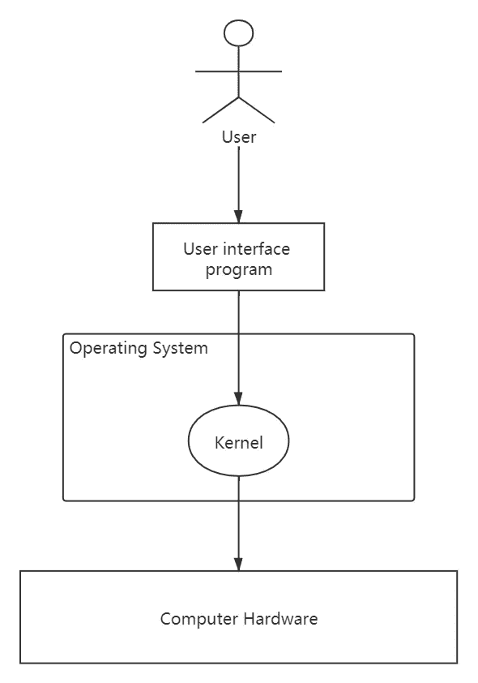
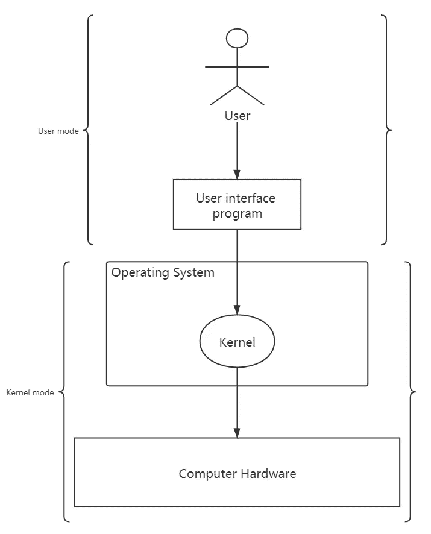
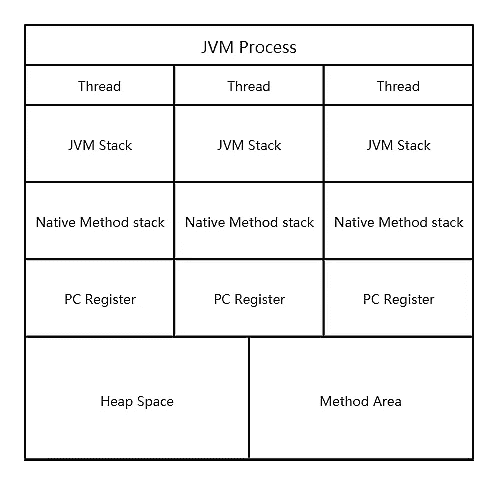
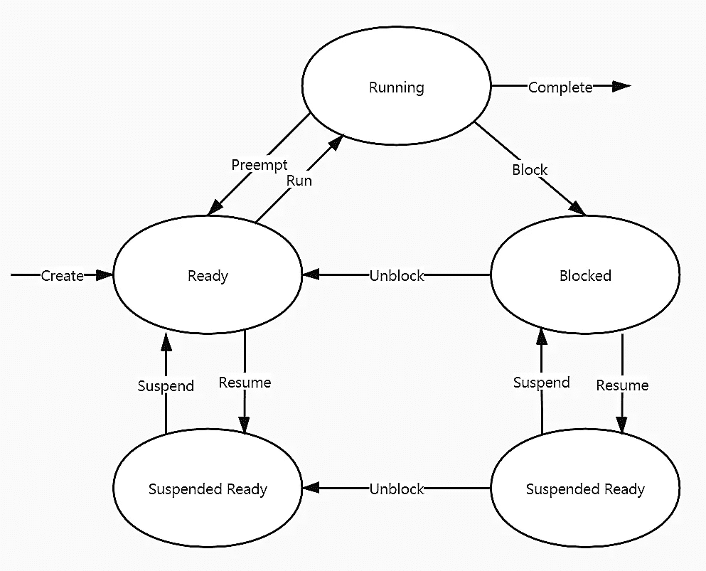
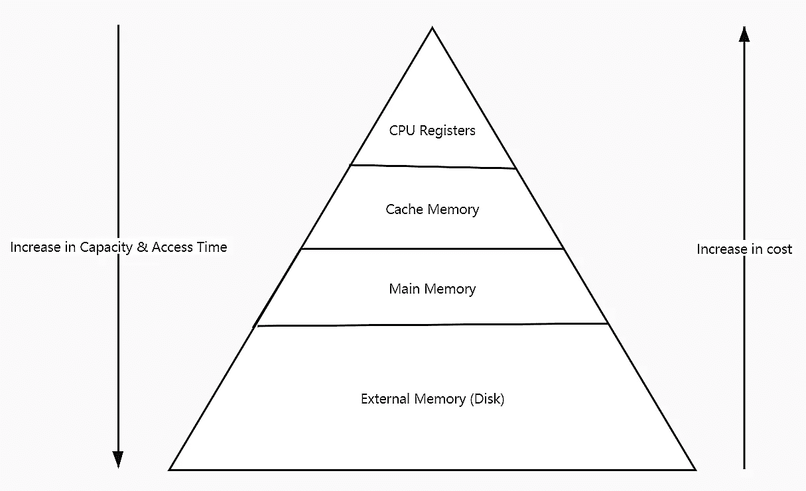
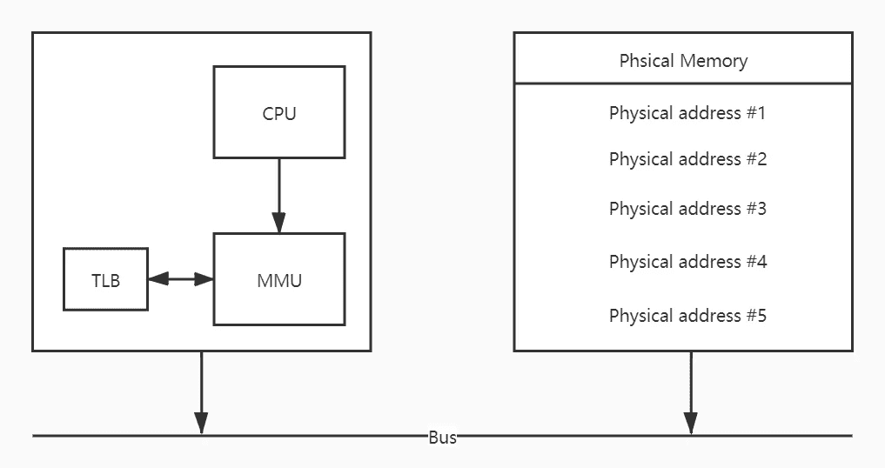
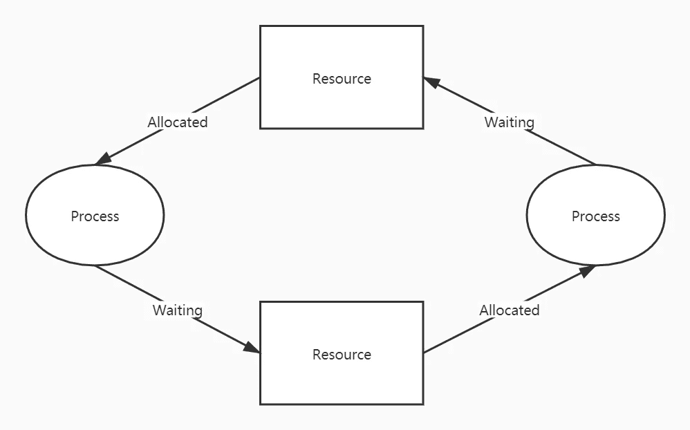

# 在技术面试中你应该知道的关于操作系统的一切

> 原文：<https://towardsdatascience.com/all-you-should-know-about-operating-systems-in-technical-interviews-4dcc55210fea?source=collection_archive---------11----------------------->

## 意见

## 处理技术访谈中常见操作系统问题的完整指南

马库斯·斯皮斯克在 [Unsplash](https://unsplash.com?utm_source=medium&utm_medium=referral) 上的照片

“你现在准备好面试了吗？”

“是的，当然。”

“太好了。可以请你说说你对操作系统的理解吗？”

“嗯……嗯……”

“好的，谢谢你今天抽出时间。请在未来几天等待我们的进一步通知。”

你觉得这类似吗？

不要放弃。你肯定能做得更好。

以下是一些你在技术面试中会遇到的常见操作系统问题。你可以按照这个指南从零开始学习操作系统，并清楚地向你的面试官解释。

# 1.什么是操作系统？

操作系统的定义可以分为三个部分:

1.  操作系统为用户提供了与计算机硬件交互的接口。
2.  操作系统(OS)是管理计算机硬件和软件资源的程序。
3.  操作系统由内核和其他一些基本组件构成。一般来说，内核是应用程序和硬件之间的桥梁。它负责管理进程、内存、文件和网络等东西，直接访问硬件，维护系统的稳定性和性能。

操作系统架构。作者图片

# 2.用户如何访问计算机资源？

计算机操作可分为两种模式:

1.  **用户模式**:该级别下的流程只能访问用户提供的数据。
2.  **内核模式**:该级别下的进程对计算机硬件有完全的访问权，可以执行机器的一些特殊操作(如 I/O)。

典型的应用程序通常运行在用户模式下。当内核模式下有服务需求时，应该发出系统调用。它是一个请求，要求内核进程执行设备管理、文件管理、进程管理和内存管理等功能。

用户和内核模式的范围(图片由作者提供)

# 3.进程和线程的区别是什么？

简而言之，进程是一个活动的程序。它可以在执行时生成多个线程。进程通常是相互独立的，但是线程不是必需的。进程会导致更多的开销，但也更便于管理，而线程正好相反。

以 JVM 进程为例，里面的线程是共享堆空间和方法区(metaspace)等全局变量的，但是程序计数器寄存器、JVM 栈、native 方法栈是私有的。

JVM 进程结构(图片由作者提供)

# 4.流程的状态是什么？

该过程有 7 个状态，分别是:

1.  **新建**:流程正在创建。
2.  **就绪**:进程准备运行，即等待来自处理器的资源(如时间片)。
3.  **运行**:该进程当前正在 CPU 下运行。一次只允许一个进程。
4.  **等待(或阻塞)**:流程暂停，等待所需资源可用。
5.  **完成(或终止)**:流程执行完毕。它可能因某些原因或正常退出而中断。
6.  **暂停就绪**:就绪队列已满，进程暂停。
7.  **暂停块**:等待队列已满，进程暂停。

流程生命周期(作者图片)

# 5.什么是上下文切换？什么时候会发生？

上下文切换意味着保存正在运行的进程状态并加载另一个进程的状态。这通常发生在高优先级进程进入就绪状态或发生中断时。

# 6.什么是竞争条件？

当多个进程共享相同的代码或资源时，就会发生争用情况。在这种情况下，可能会出现意外的结果，因为每个进程都可以随时访问共享变量。

# 7.进程之间是如何通信的？

进程间通信(IPC)有六种方式:

1.  **Pipe** :使一个流程的输出成为与**有共同原点**的另一个流程的输入，即同一个流程。使用管道的数据流是单向的(例如，Linux 中的“|”命令)。
2.  **命名管道**:这允许来自不同来源的进程的通信。它遵循先进先出(FIFO)规则。
3.  **消息排队**:这两种管道都是低效的，因为将数据发送到缓冲区的进程需要等待，直到另一个进程取回数据。消息队列能够解决这个问题，生产者不需要等待消费者检索数据。
4.  **共享内存:**消息排队还有一个缺点，就是发送数据的规模太大的时候比较耗时。因此出现了共享内存的想法。它允许多个进程访问同一个内存区域。这是最有效的方法，因为每个进程都可以立即看到数据的更新。
5.  **信号量**:共享内存最大的问题是多个进程会争夺资源。信号量是在进程同步中使用的程序计数器，用于控制访问共享内存的进程数量并避免竞争情况。它表示共享内存中有多少可用资源。
6.  **插座**:上面提到的所有通信方式都只基于一个设备。套接字是允许多个设备之间远程通信的接口。它主要用于客户/服务器通信。

# 8.线程之间是如何同步的？

线程同步的目的类似于进程间通信，避免并发线程之间竞争共享资源。有三种常见的线程同步方式:

1.  **互斥**:是一种互斥的机制。互斥一次只允许一个线程访问共享资源(如 Java 中的`synchronized`)。
2.  信号量(Semaphore):它与互斥量非常相似，但是它的值可以大于 1，并且允许多个线程同时进入共享资源。
3.  **事件**:通过通知(wait/notify)保持线程同步。

# 9.CPU 如何调度进程？

为了实现最大的 CPU 利用率，有几种 CPU 调度算法:

1.  **先来先服务(FCFS)** :将资源分配给就绪队列中首先请求 CPU 的进程。它是一种非抢占式算法(计划的进程将一直运行，直到完成或被阻塞)。
2.  **最短作业优先(SJF)** :将资源分配给就绪队列中执行时间最短的进程。它是一种非抢占式算法。此外，还有一个最长作业优先(LJF)调度算法。
3.  **最短剩余时间优先(SRTF)** :将资源分配给就绪队列中剩余执行时间最短的进程。它是一种抢占式算法(当一个更高优先级的进程进入时，被调度的进程可以被抢占)。还有一种最长剩余时间优先(LRTF)调度算法。
4.  **Round Robin** :每个进程被分配给一个给定的时间，称为时间片，执行到时间用完为止。
5.  **基于优先级的**:每个进程被赋予一个给定的优先级。优先级越高，越早被选中。
6.  **多级队列**:流程按照优先级被分配到不同的队列中。低级队列中的进程被允许执行，直到高级队列中的进程完成。
7.  **多级队列反馈**:这是 UNIX 系统中使用的调度算法，允许进程在各级队列之间移动。如果该进程花费太多的执行时间，它将被移到较低级别的队列中。

# 10.操作系统中的内存模型是如何设计的？

操作系统中有两种类型的内存:

1.  **主存储器(内部存储器)** : CPU 寄存器、高速缓冲存储器和主存储器，可由处理器直接访问。
2.  **二级存储器(外部存储器)**:不同类型的磁盘(磁盘、光盘)，是处理器可以通过 I/O 访问的一些存储设备。

操作系统内存模型(图片由作者提供)

# 11.操作系统中的内存管理是如何工作的？

操作系统的内存管理负责为进程分配内存，包括将逻辑地址转换为物理地址或在内部和外部内存之间交换进程。

# 12.什么是虚拟地址和物理地址？

举个常见的例子，我们在一些编程语言中看到的指针概念，存储的是内存的虚拟地址，这个地址是由操作系统决定的。物理地址是物理存储器中的地址，即存储器地址寄存器。

虚拟地址(图片由作者提供)

现代处理器使用虚拟寻址技术，通过 MMU(内存管理单元)将虚拟地址转换成物理地址。虚拟寻址的过程如下图所示:

# 13.操作系统如何分配内存？

有四种常见的内存分配技术:

1.  **分区分配**:按块划分内存，每个块包含一个进程。如果进程只需要很小的内存来运行，空间就会被浪费。这是一种连续分配，因为这些块在内存中是连续的。
2.  **分页内存管理**:按页帧划分内存，页帧是比块小的单位。这增加了内存的使用并减少了内部碎片。这是一种不连续的分配，因为页面框架可以分开。分页表用于将虚拟地址映射到物理地址。
3.  **分段内存管理**:按段划分内存，段是数据或代码的逻辑组。它是不连续的分配，因为允许将数据段分开。段表用于将虚拟地址映射到物理地址。
4.  **带分页的分段**:结合了分页和分段内存管理的优点。它将内存分成几个段，然后将每个段分成几个页帧。

# 14.什么是 TLB(翻译后备缓冲器)？

在分页内存管理中，有两个问题需要处理:

1.  虚拟到物理的映射应该很快。
2.  当虚拟地址空间很大时，页表会变得更大。

TLB 可以用来加速虚拟内存和物理内存之间的转换。它可以被看作是一个缓存，在一个页表中存储一部分数据。有了这个缓存，我们在执行 I/O 时只需要访问主内存一次，而不是两次。

将虚拟地址转换成物理地址的过程是:

1.  搜索 TLB 内部的页码。
2.  如果找到给定的页面，从 TLB 中读取相应的物理地址。
3.  如果找不到给定的页，则读取页表中相应的物理地址，并将其存储到 TLB 中。
4.  当页面满了的时候，通过一定的策略来消除 TLB 内部的页面。

# 15.什么是多级页表？

除了加速映射，我们还可以使用多级页表来处理由大的虚拟地址空间引起的问题。它避免了总是将所有的页表放在主存中，这样可以节省更多的空间。

# 16.什么是虚拟内存？

当一个软件的内存成本超过计算机的空间时，这是很常见的。之所以能实现这个，是因为虚拟内存。它将一个程序分成几个部分，并允许在程序需要之前将它们临时存储在外部存储器(磁盘)中。通过这样做，程序将认为自己拥有一片连续的空间。

# 17.如何实现虚拟内存？

虚拟内存实现有两种常见类型:

1.  **按需分页**:基于分页技术，具有页面替换功能。如果我们在进程开始前找不到所需的页面，操作系统将在辅助内存中搜索它，并根据给定的页面替换算法交换在主内存中找到的页面。
2.  **需求细分**:这是一种类似于需求分页的技术。它们之间唯一的区别是，根据给定的段替换算法，按需分段将段而不是页面交换到主存中。

# 18.页面替换算法是什么？

当所需页面不在主存储器中时，发生页面错误。我们需要页面替换算法将页面从辅助内存交换到主内存中。下面列出了一些常见类型的页面替换算法:

1.  **最佳页面替换**:替换不再使用或最长时间不使用的页面。这将确保页面错误存在的最低可能性。然而，由于人们无法预测哪个页面在将来不会被再次使用，因此无法实现 OPT 替换。
2.  **FIFO(先进先出)页面替换**:清除在主存中停留时间最长的页面。
3.  **LRU(最近最少使用)页面替换**:清除自上次访问以来耗时最长的页面。
4.  **LFU(最少使用的)页面替换**:清除一段时间内最少使用的页面。

# 19.什么是操作系统中的死锁？

死锁是指两个以上的进程都在等待彼此持有的资源，但是没有一个进程会先释放资源。

如果系统满足以下所有条件，则会出现死锁:

1.  **互斥**:一次只允许一个进程访问。
2.  **Hold & wait** :一个进程正在持有一个其他人可能需要的资源，同时也在等待其他人持有的资源。
3.  **无抢占**:一个资源不能被其他进程访问，除非拥有者进程释放它。
4.  **循环等待**:每个进程都在等待另一个进程持有的资源。

死锁示例(作者图片)

# 20.如何处理死锁？

有三种方法可以处理死锁:

1.  **死锁预防和避免**:死锁是不允许的，应该被预防或避免。
    死锁预防是为了消除上面提到的死锁条件中的一个，因为当其中四个条件都满足时，就会发生死锁。
    死锁避免是一种测试进程发送的每个请求是否会导致死锁状态的技术。
2.  **死锁检测和恢复**:允许死锁。一旦检测到死锁，就抢占进程。
3.  **忽略问题:**当死锁很少发生时，只需重新启动系统。

# 参考

1.  [现代操作系统(第四版)](https://www.amazon.com/Modern-Operating-Systems-Andrew-Tanenbaum/dp/013359162X)
2.  [snail climb/*Java guide*—GitHub](https://github.com/Snailclimb/JavaGuide)
3.  [操作系统介绍](https://www.geeksforgeeks.org/operating-system-introduction-operating-system-set-1/)
4.  [操作系统中的微内核](https://www.geeksforgeeks.org/operating-system-microkernel/)
5.  [内核(操作系统)](https://en.wikipedia.org/wiki/Kernel_(operating_system))
6.  [操作系统—维基百科](https://en.wikipedia.org/wiki/Operating_system)
7.  [流程管理简介](https://www.geeksforgeeks.org/introduction-of-process-management/)
8.  [进程同步介绍](https://www.geeksforgeeks.org/introduction-of-process-synchronization/)
9.  [进程间通信的方法](https://www.geeksforgeeks.org/methods-in-interprocess-communication/)
10.  [操作系统中的 CPU 调度](https://www.geeksforgeeks.org/cpu-scheduling-in-operating-systems/)
11.  [操作系统调度算法](https://www.tutorialspoint.com/operating_system/os_process_scheduling_algorithms.htm)
12.  [操作系统分页](https://www.geeksforgeeks.org/paging-in-operating-system/)
13.  [操作系统需求分页](https://www.javatpoint.com/os-demand-paging)
14.  [什么是需求细分？](https://www.quora.com/What-is-demand-segmentation)
15.  [操作系统死锁介绍](https://www.geeksforgeeks.org/introduction-of-deadlock-in-operating-system/)

通过学习操作系统，你会发现这个领域涉及到如此多的计算机科学概念，因此深入研究其中的每一个主题都是非常值得和重要的。希望你觉得有用，祝你下次面试好运！