# 关于深度学习你想知道的

> 原文：<https://towardsdatascience.com/all-you-want-to-know-about-deep-learning-8d68dcffc258?source=collection_archive---------25----------------------->

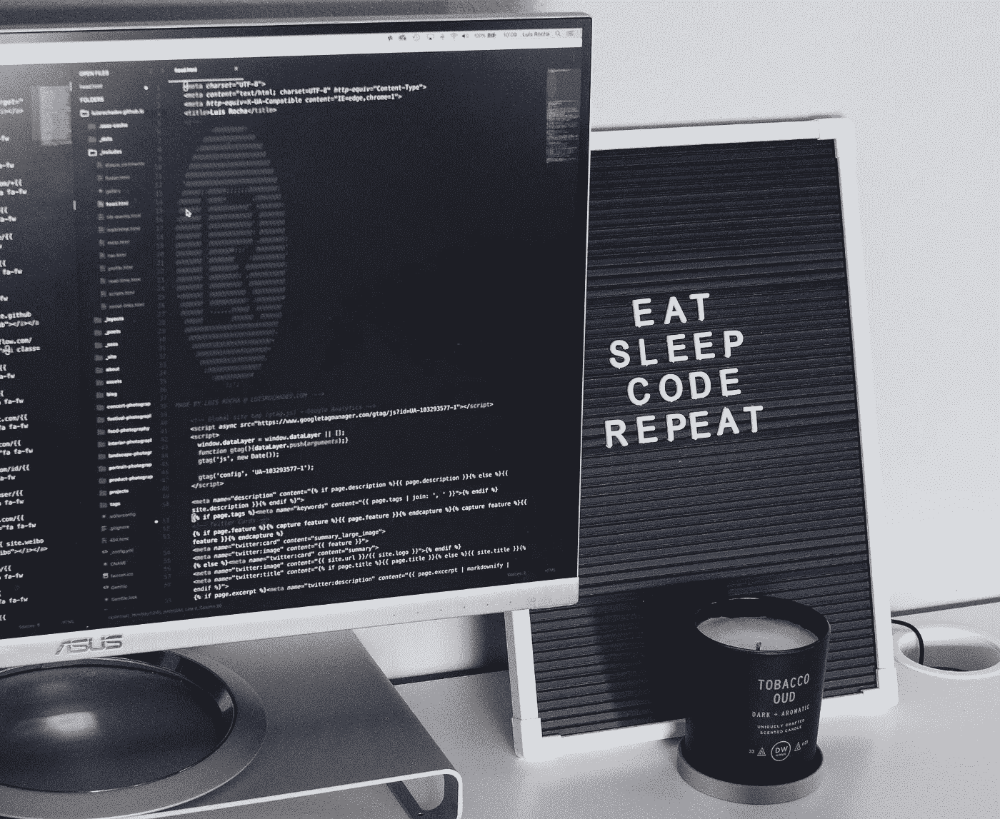

2020 年夏季学期总结。路易斯·罗查在 [Unsplash](https://unsplash.com/s/photos/deep-learning?utm_source=unsplash&utm_medium=referral&utm_content=creditCopyText) 上的照片

## [FAU 深度学习讲义](https://towardsdatascience.com/tagged/fau-lecture-notes)

## 在综合视频和博客文章中

电晕对我们许多人来说是一个巨大的挑战，并以各种方式影响着我们的生活。几年来，我一直在德国弗里德里希-亚历山大-纽伦堡大学教授深度学习课程。今年夏天，我们大学决定完全“虚拟化”。因此，我开始用 15 分钟的短片记录我的演讲。

深度学习地标检测也在 [X 射线投影](https://link.springer.com/chapter/10.1007/978-3-030-00937-3_7)中发挥作用。图片由 Bastian Bier 提供。

对于“深度学习”这样的课题，你每学期都要更新一次讲座的内容。因此，我至今无法提供课堂讲稿。然而，有了录像和自动语音识别的帮助，我能够转录整个讲座。这就是为什么我决定在媒体上为每一个视频发布一个相应的，手动更正的抄本。我很高兴“[走向数据科学](https://towardsdatascience.com)”在他们尊敬的出版物上发表了所有这些。他们甚至要求我创建一个专栏“ [FAU 讲座笔记](https://towardsdatascience.com/tagged/fau-lecture-notes)”。所以，我想借此机会感谢数据科学对这个项目的大力支持！

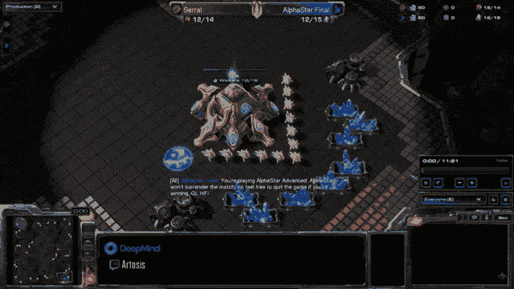

阿尔法星打塞拉勒。完整视频可以在[这里](https://www.youtube.com/watch?v=nbiVbd_CEIA&list=LLoiMqX5FHfk_KDow7xSe7pg&index=2&t=0s)找到。使用 [gifify](https://github.com/vvo/gifify) 生成的图像。

为了简化博客文章的创建，我创建了一个小工具链“ [autoblog](http://autoblog.tf.fau.de) ”，并且免费提供。除非另有说明，这里的所有内容都是在 [CC BY 4.0](https://creativecommons.org/licenses/by/4.0/) 下发布的。所以，你也可以自由地重用这些内容。

在下文中，我列出了按章节分组的个人帖子，并附有相应视频的链接。如果你喜欢视频，你也可以[通过播放列表](https://www.youtube.com/watch?v=p-_Stl0t3kU&list=PLpOGQvPCDQzvgpD3S0vTy7bJe2pf_yJFj)观看整个讲座。注意我这学期升级了两次录音设备。从第 7 章——架构和第 9 章——可视化&注意，您应该看到视频质量有所提高。

所以，希望你觉得这些帖子和视频有用。如果你喜欢，请留下评论，或者把这个项目推荐给你的朋友。

# 第 1 章—简介

显示 Yolo 能力的示例序列。完整的序列可以在[这里](https://youtu.be/VOC3huqHrss)找到。使用 [gifify](https://github.com/vvo/gifify) 生成的图像。

在这些视频中，我们介绍了深度学习的主题，并展示了一些文献和应用方面的亮点

第一部分:[动机&高调应用](/lecture-notes-in-deep-learning-introduction-part-1-5a1729abd580?source=your_stories_page---------------------------) ( [视频](https://www.youtube.com/watch?v=SCFToE1vM2U) )
第二部分:[FAU 集锦](/lecture-notes-in-deep-learning-introduction-part-2-acabbb3ad22?source=your_stories_page---------------------------) ( [视频](https://www.youtube.com/watch?v=IxnPzmZg4Is) )
第三部分:[深度学习的局限性及未来方向](/lecture-notes-in-deep-learning-introduction-part-3-22142caad28a?source=your_stories_page---------------------------) ( [视频](https://www.youtube.com/watch?v=fT9GhzjXZb8) )
第四部分:[模式识别短期课程](/lecture-notes-in-deep-learning-introduction-part-4-2e86af0498ce?source=your_stories_page---------------------------) ( [视频](https://www.youtube.com/watch?v=DjP_EAM3m-4) )
第五部分:【T20

# 第 2 章—前馈网络

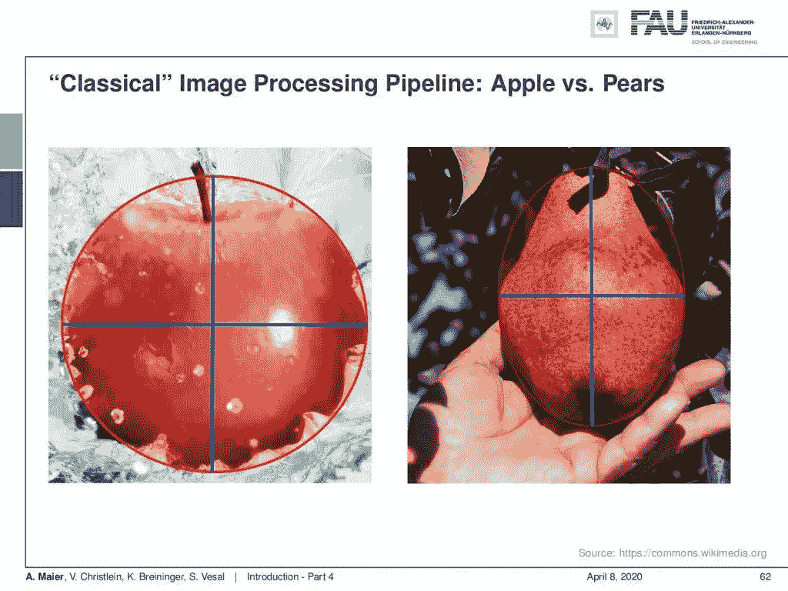

经典特征提取。 [CC 下的图片来自](https://creativecommons.org/licenses/by/4.0/)[深度学习讲座](https://www.youtube.com/watch?v=p-_Stl0t3kU&list=PLpOGQvPCDQzvgpD3S0vTy7bJe2pf_yJFj&index=1)的 4.0 。

在这里，我们介绍模式识别的基础，简单的前馈网络包括层抽象的概念。

第 1 部分:[我们为什么需要深度学习？](/lecture-notes-in-deep-learning-feedforward-networks-part-1-e74db01e54a8?source=your_stories_page---------------------------) ( [视频](https://youtu.be/9eWxcYDSoXE) )
第二部分:[网络究竟该如何训练？](/lecture-notes-in-deep-learning-feedforward-networks-part-2-c91b53a4d211?source=your_stories_page---------------------------) ( [视频](https://youtu.be/Yu4BAMXDp3k) )
第三部分:[反向传播算法](/lecture-notes-in-deep-learning-feedforward-networks-part-3-d2a0441b8bca?source=your_stories_page---------------------------) ( [视频](https://youtu.be/rWBPr2N5MVY) )
第四部分:[图层抽象](/lecture-notes-in-deep-learning-feedforward-networks-part-4-65593eb14aed?source=your_stories_page---------------------------) ( [视频](https://youtu.be/BTbHaKsH4y0))

# 第 3 章—损失和优化

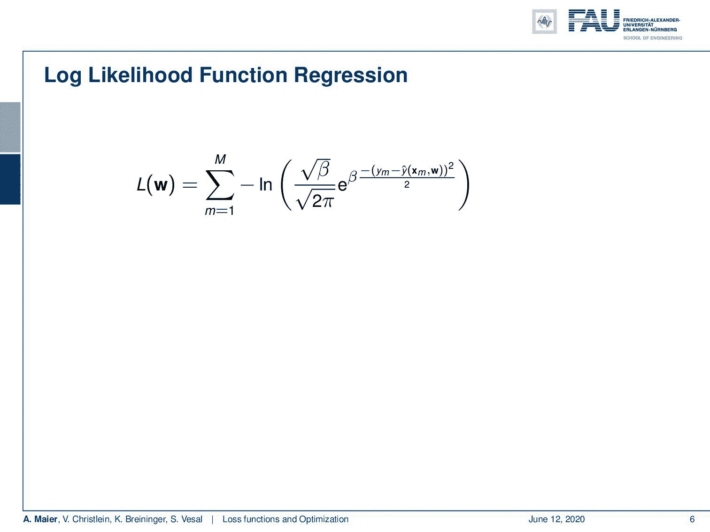

只需几个步骤，我们就可以转换高斯分布的对数似然。下图 [CC BY 4.0](https://creativecommons.org/licenses/by/4.0/) 来自[深度学习讲座](https://www.youtube.com/watch?v=p-_Stl0t3kU&list=PLpOGQvPCDQzvgpD3S0vTy7bJe2pf_yJFj&index=1)。

损失函数的一些背景知识以及深度学习与支持向量机(SVM)等经典方法的关系。

第一部分:[分类回归损失](/lecture-notes-in-deep-learning-loss-and-optimization-part-1-f702695cbd99?source=your_stories_page---------------------------) ( [视频](https://youtu.be/PYClfq-lR_w) )
第二部分:[支持向量机打败深度学习了吗？](/lecture-notes-in-deep-learning-loss-and-optimization-part-2-11b08f842aa7?source=your_stories_page---------------------------) ( [视频](https://youtu.be/pj6yzO3Lot8) )
第三部分:[优化与亚当和超越…](/lecture-notes-in-deep-learning-loss-and-optimization-part-3-dc6280284fc1?source=your_stories_page---------------------------) ( [视频](https://youtu.be/2uWk2c0tsOA))

# 第 4 章—激活、卷积和池化

使用多通道卷积的正向传递。 [CC 下的图片来自](https://creativecommons.org/licenses/by/4.0/)[深度学习讲座](https://www.youtube.com/watch?v=p-_Stl0t3kU&list=PLpOGQvPCDQzvgpD3S0vTy7bJe2pf_yJFj&index=1)的 4.0 。

在这一章中，我们讨论经典的激活函数，现代版本，卷积层的概念以及池机制。

第一部分:[经典激活](/lecture-notes-in-deep-learning-activations-convolutions-and-pooling-part-1-ddcad4eb04f6?source=your_stories_page---------------------------) ( [视频](https://youtu.be/b6gUGCD3l2E) )
第二部分:[现代激活](/lecture-notes-in-deep-learning-activations-convolutions-and-pooling-part-2-94637173a786?source=your_stories_page---------------------------) ( [视频](https://youtu.be/7mXWbQjZRMA) )
第三部分:[卷积层](/lecture-notes-in-deep-learning-activations-convolutions-and-pooling-part-3-d7faeac9e79d?source=your_stories_page---------------------------) ( [视频](https://youtu.be/89XsCExAHi0) )
第四部分:[池机制](/activations-convolutions-and-pooling-part-4-5dd7f85aa9f7?source=your_stories_page---------------------------) ( [视频](https://youtu.be/VcJU4ZvauLQ)

# 第 5 章——正规化

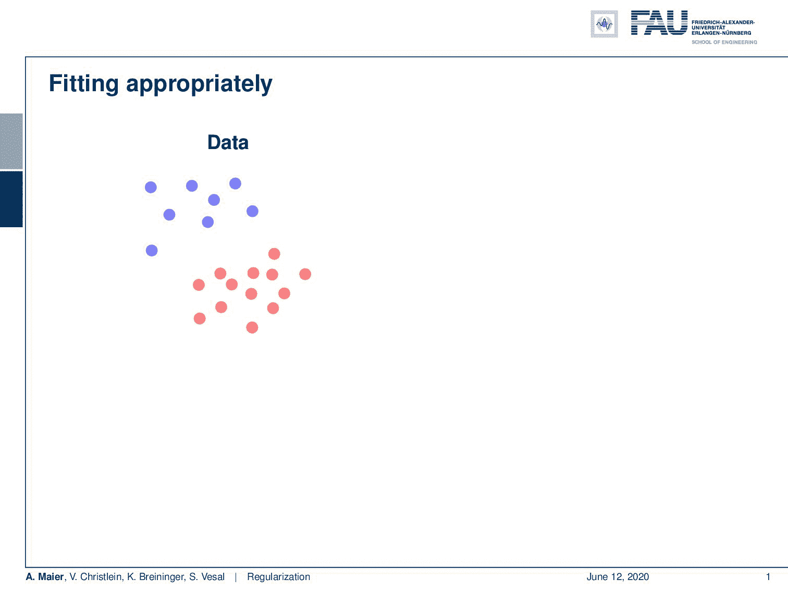

将函数拟合到数据可能会导致过度拟合或拟合不足。 [CC 下的图片来自](https://creativecommons.org/licenses/by/4.0/)[深度学习讲座](https://www.youtube.com/watch?v=p-_Stl0t3kU&list=PLpOGQvPCDQzvgpD3S0vTy7bJe2pf_yJFj&index=1)的 4.0 。

本章探讨了过拟合问题，并讨论了避免过拟合的几种常用方法。

第一部分:[偏差-方差权衡](/regularization-part-1-db408819b20f?source=your_stories_page---------------------------) ( [视频](https://youtu.be/-I3SQMfyZYw) )
第二部分:[古典技法](/regularization-part-2-5b729698d026?source=your_stories_page---------------------------) ( [视频](https://youtu.be/1RqnSkp9YS0) )
第三部分:[归一化&辍学](/regularization-part-4-2ee8e7aa60ec?source=your_stories_page---------------------------) ( [视频](https://youtu.be/-175v_5w4nc) )
第四部分:[初始化&迁移学习](/regularization-part-4-3518ec44ed85?source=your_stories_page---------------------------) ( [视频](https://youtu.be/sXCpj6sfxBc) )
第五部分:[多](/regularization-part-5-b4019720b020?source=your_stories_page---------------------------)

# 第 6 章—常见做法

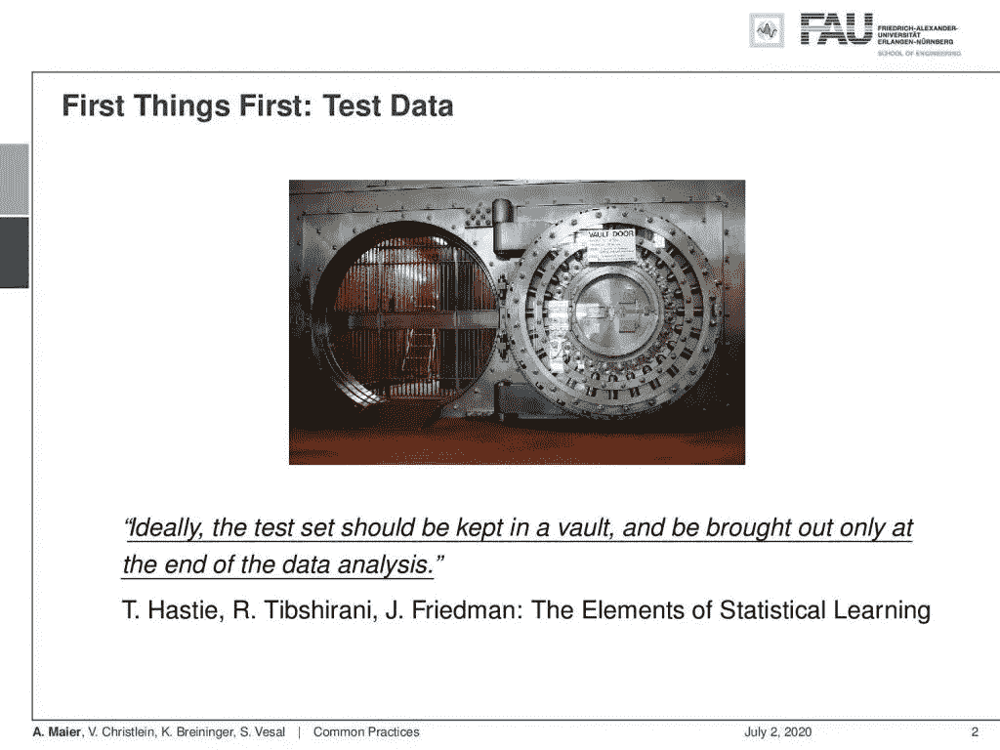

只有在我们设置了关于培训过程的所有其他重要选项之后，才会查看测试数据。 [CC 下的图片来自](https://creativecommons.org/licenses/by/4.0/)[深度学习讲座](https://www.youtube.com/watch?v=p-_Stl0t3kU&list=PLpOGQvPCDQzvgpD3S0vTy7bJe2pf_yJFj&index=1)的 4.0 。

本章致力于你在实践中会遇到的常见问题，从超参数到性能评估和显著性测试。

第一部分:[优化器&学习率](/common-practices-part-1-6a7c1b2eb6d4?source=your_stories_page---------------------------) ( [视频](https://youtu.be/R5FB6kwC-To) )
第二部分:[超参数和集合](/common-practices-part-2-23dad51e2aae?source=your_stories_page---------------------------) ( [视频](https://youtu.be/APqhOI6TUyI) )
第三部分:[班级失衡](/common-practices-part-3-f4853b0ac977?source=your_stories_page---------------------------) ( [视频](https://youtu.be/rKvVI1oCZTs) )
第四部分:[绩效评估](/common-practices-part-4-70c08fce3588?source=your_stories_page---------------------------) ( [视频](https://youtu.be/lua5KI8fpAo))

# 第 7 章—架构

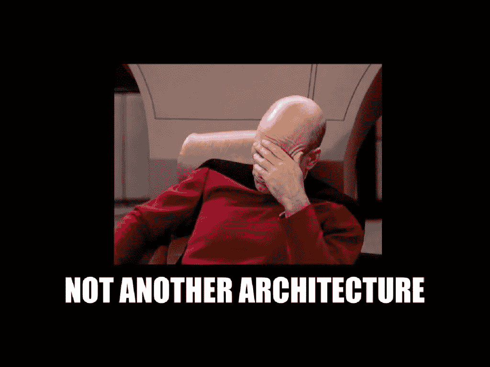

在这一章中可以看到很多很多的架构！下图 [CC BY 4.0](https://creativecommons.org/licenses/by/4.0/) 来自[深度学习讲座](https://www.youtube.com/watch?v=p-_Stl0t3kU&list=PLpOGQvPCDQzvgpD3S0vTy7bJe2pf_yJFj&index=1)。

在这一章中，我们介绍了深度学习中最常见和最流行的架构。

第一部分:[从 LeNet 到 GoogLeNet](/architectures-part-1-62c686f500c3?source=your_stories_page---------------------------) ( [视频](https://youtu.be/H4K3AY7xRy8) )
第二部分:[更深层次的架构](/architectures-part-2-2d2ac8f7458e?source=your_stories_page---------------------------) ( [视频](https://www.youtube.com/watch?v=8IULwh7xbCE) )
第三部分:[残余人脉](/architectures-part-3-34dcfd979344?source=your_stories_page---------------------------) ( [视频](https://www.youtube.com/watch?v=a6P24LadHus) )
第四部分:[残余人脉的崛起](/architectures-part-4-a56f1b70f12f?source=your_stories_page---------------------------) ( [视频](https://www.youtube.com/watch?v=SbBYPIxvNFE) )
第五部分:[学习架构](/architectures-part-5-7224dd8fcf39?source=your_stories_page---------------------------)(

# 第 8 章——递归神经网络

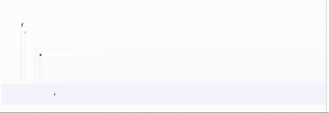

作家一代可以创作手写文字。更多的细节可以在文森特的博客[中找到。](https://lme.tf.fau.de/pattern-recognition-blog/spatio-temporal-handwriting-imitation/) [CC 下的图片来自](https://creativecommons.org/licenses/by/4.0/)[深度学习讲座](https://www.youtube.com/watch?v=p-_Stl0t3kU&list=PLpOGQvPCDQzvgpD3S0vTy7bJe2pf_yJFj&index=1)的 4.0 。

递归神经网络允许处理和生成依赖于时间的数据。

第一部:[艾尔曼细胞](/recurrent-neural-networks-part-1-498230290534?source=your_stories_page---------------------------) ( [视频](https://www.youtube.com/watch?v=0ZErqh2kE4w) )
第二部:[穿越时间反向传播](/recurrent-neural-networks-part-2-5f45c1c612c4?source=your_stories_page---------------------------) ( [视频](https://www.youtube.com/watch?v=ztVIn-9c6UU) )
第三部:[致敬施密德胡伯— LSTMs](/recurrent-neural-networks-part-3-1032d4a67757?source=your_stories_page---------------------------) ( [视频](https://www.youtube.com/watch?v=vZQxwDHvuug) )
第四部:[门控循环单元](/recurrent-neural-networks-part-4-39a568034d3b?source=your_stories_page---------------------------) ( [视频](https://www.youtube.com/watch?v=Gt6GLTkuoTs) )
第五部:

# 第 9 章——视觉化和注意力

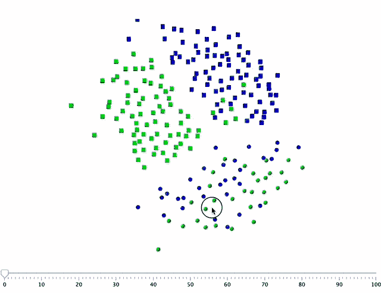

同样的说话者，用麦克风 1(蓝色)和麦克风 2(绿色)录音，这造成了我们想要抑制的混淆。 [CC 下的图片来自](https://creativecommons.org/licenses/by/4.0/)[深度学习讲座](https://www.youtube.com/watch?v=p-_Stl0t3kU&list=PLpOGQvPCDQzvgpD3S0vTy7bJe2pf_yJFj&index=1)的 4.0 。

可视化方法用于探索深层网络的弱点，并提供理解它们的更好方法。

第一部分:[架构&训练可视化](/visualization-attention-part-1-a16667295007?source=your_stories_page---------------------------) ( [视频](https://www.youtube.com/watch?v=o9qg7BmNVSQ) )
第二部分:[混杂因素&对抗性攻击](/visualization-attention-part-2-4b1dd17b9269?source=your_stories_page---------------------------) ( [视频](https://www.youtube.com/watch?v=Jb4SC7Wkfa4) )
第三部分:[直接可视化方法](/visualization-attention-part-3-84a43958e48b?source=your_stories_page---------------------------) ( [视频](https://www.youtube.com/watch?v=x7pG9q1W1vc) )
第四部分:[基于梯度和优化的方法](/visualization-attention-part-4-a1cfefce8bd3?source=your_stories_page---------------------------) ( [视频](https://www.youtube.com/watch?v=pdO7cz9pWy4) )
第五部分:

# 第 10 章—强化学习

[基于智能体的器官分割](https://arxiv.org/abs/1806.05724)。图片由夏忠提供。

强化学习允许训练能够独立行动并控制游戏和过程的代理系统。

第一部分:[序贯决策](/reinforcement-learning-part-1-a5518a7a0bed?source=your_stories_page---------------------------) ( [视频](https://www.youtube.com/watch?v=yU0Axu0E0mA) )
第二部分:[马尔可夫决策过程](/reinforcement-learning-part-2-d38cffee992d?source=your_stories_page---------------------------) ( [视频](https://www.youtube.com/watch?v=D49smMgiTBY) )
第三部分:[策略迭代](/reinforcement-learning-part-3-711e31967398?source=your_stories_page---------------------------) ( [视频](https://www.youtube.com/watch?v=fx0xgXH3jW8) )
第四部分:[备选方法](/reinforcement-learning-part-4-3c51edd8c4bf?source=your_stories_page---------------------------) ( [视频](https://www.youtube.com/watch?v=XbW-pUEs6PI) )
第五部分:[深度 Q 学习](/reinforcement-learning-part-5-70d10e0ca3d9?source=your_stories_page---------------------------) ( [视频](https://www.youtube.com/watch?v=ENVGSYX9itA)

# 第 11 章——无监督学习

呼吸和心脏运动使得心脏可以被模拟。 [CC 下的图片来自](https://creativecommons.org/licenses/by/4.0/)[深度学习讲座](https://www.youtube.com/watch?v=p-_Stl0t3kU&list=PLpOGQvPCDQzvgpD3S0vTy7bJe2pf_yJFj&index=1)的 4.0 。

无监督学习不需要训练数据，可以用来生成新的观察值。

第一部分:[动机&受限玻尔兹曼机器](/unsupervised-learning-part-1-c007f0c35669?source=your_stories_page---------------------------) ( [视频](https://www.youtube.com/watch?v=aoOE4bJxybA) )
第二部分:[自动编码器](/unsupervised-learning-part-2-b1c130b8815d?source=your_stories_page---------------------------) ( [视频](https://www.youtube.com/watch?v=GpAHm7dvP_k) )
第三部分:[生成对抗网络——基础知识](/unsupervised-learning-part-3-7b15038bb884?source=your_stories_page---------------------------) ( [视频](https://www.youtube.com/watch?v=fXO1fOXnOTI) )
第四部分:[条件&循环甘斯](/unsupervised-learning-part-4-eeb4d3ab601?source=your_stories_page---------------------------) ( [视频](https://www.youtube.com/watch?v=K27a_doRoxw) )
第五部分

# 第 12 章—分割和对象检测

在组织切片图像上检测有丝分裂是一项经典的检测任务。图片由 Marc Aubreville 提供。点击查看[完整视频。](https://www.youtube.com/watch?v=1UV1_a5qyQM)

分割和检测是使用深度学习的常见问题。

第一部分:[分割基础知识](/segmentation-and-object-detection-part-1-b8ef6f101547?source=your_stories_page---------------------------) ( [视频](https://www.youtube.com/watch?v=CG7UJIEl7KI) )
第二部分:[跳过连接&更多](/segmentation-and-object-detection-part-2-a334b91255f1?source=your_stories_page---------------------------) ( [视频](https://www.youtube.com/watch?v=BQIHiz1rKdc) )
第三部分:[一族区域 CNN](/segmentation-and-object-detection-part-3-abb4ec936fa?source=your_stories_page---------------------------)([视频](https://www.youtube.com/watch?v=A9XwYERjXFE) )
第四部分:[单镜头检测器](/segmentation-and-object-detection-part-4-f1d0d213976b?source=your_stories_page---------------------------) ( [视频](https://www.youtube.com/watch?v=tBzc2nqvFGk) )
第五部分:[实例分割](/segmentation-and-object-detection-part-5-4c6f70d25d31?source=your_stories_page---------------------------)

# 第 13 章——弱自我监督学习

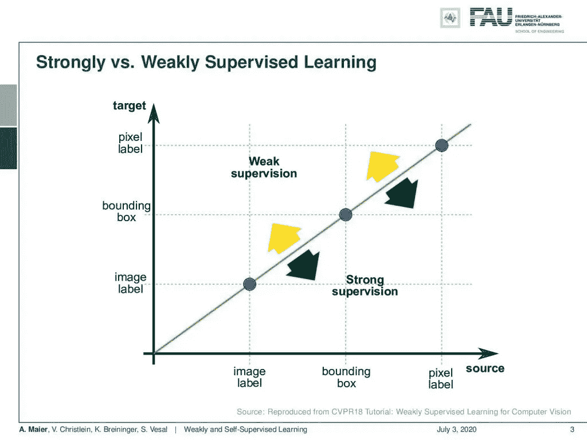

监管不力试图充分利用你的标签。 [CC 下的图片来自](https://creativecommons.org/licenses/by/4.0/)[深度学习讲座](https://www.youtube.com/watch?v=p-_Stl0t3kU&list=PLpOGQvPCDQzvgpD3S0vTy7bJe2pf_yJFj&index=1)的 4.0 。

弱监督试图最小化所需的标签努力，而自我监督试图完全摆脱标签。

第一部分:[从类到像素](/weakly-and-self-supervised-learning-part-1-8d29fce2dd92?source=your_stories_page---------------------------) ( [视频](https://www.youtube.com/watch?v=Vj_JeSZG1EA) )
第二部分:[从二维到三维标注](/weakly-and-self-supervised-learning-part-1-ddfdf8377f1d?source=your_stories_page---------------------------) ( [视频](https://www.youtube.com/watch?v=KjcSfpLin7U) )
第三部分:[自监督标签](/weakly-and-self-supervised-learning-part-3-b8186679d55e?source=your_stories_page---------------------------) ( [视频](https://www.youtube.com/watch?v=EqMwbP7Smxg) )
第四部分:[对比损失](/weakly-and-self-supervised-learning-part-4-2fbfd10280b3?source=your_stories_page---------------------------) ( [视频](https://www.youtube.com/watch?v=zIDdTstAqWU))

# 第 14 章—图形深度学习

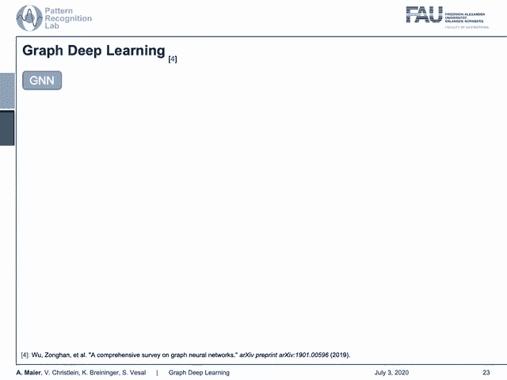

欢迎来到图形深度学习的世界。下图 [CC BY 4.0](https://creativecommons.org/licenses/by/4.0/) 来自[深度学习讲座](https://www.youtube.com/watch?v=p-_Stl0t3kU&list=PLpOGQvPCDQzvgpD3S0vTy7bJe2pf_yJFj&index=1)。

图形深度学习用于处理图形和网格中可用的数据。

第一部分:[光谱卷积](/graph-deep-learning-part-1-e9652e5c4681?source=your_stories_page---------------------------) ( [视频](https://www.youtube.com/watch?v=wcRFkJ5okt4) )
第二部分:[从光谱到空间域](/graph-deep-learning-part-2-c6110d49e63c?source=your_stories_page---------------------------) ( [视频](https://www.youtube.com/watch?v=oMOKFi2Lb4c))

# 第 15 章—已知操作员学习

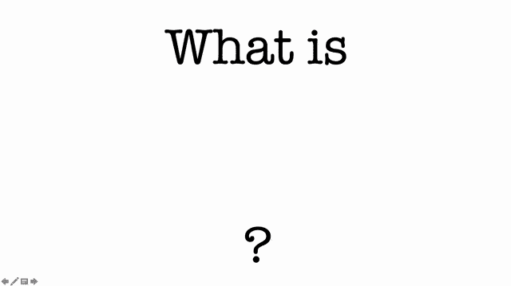

什么是已知算子学习？来源；[推特](https://twitter.com/maier_ak/status/1188007249798717440?s=20)。图像在[下 CC 乘 4.0](https://creativecommons.org/licenses/by/4.0/)

已知算子允许将先验知识插入到深度网络中，从而减少未知参数的数量并提高深度网络的泛化性能。

第一部分:[不要重新发明轮子](/known-operator-learning-part-1-32fc2ea49a9?source=your_stories_page---------------------------) ( [视频](https://www.youtube.com/watch?v=nauVuIMyb1M) )
第二部分:[学习上的界限](/known-operator-learning-part-2-8c725b5764ec?source=your_stories_page---------------------------) ( [视频](https://www.youtube.com/watch?v=zf_Lp1hxeDA) )
第三部分: [CT 重建重温](/known-operator-learning-part-3-984f136e88a6?source=your_stories_page---------------------------) ( [视频](https://www.youtube.com/watch?v=7amnWQJygPU) )
第四部分:[深度设计模式](/known-operator-learning-part-4-823e7a96cf5b?source=your_stories_page---------------------------) ( [视频](https://www.youtube.com/watch?v=AO8jSW_xSZ0))

# 承认

非常感谢 Katharina Breininger、Fu、Tobias Würfl、Vincent Christlein、Florian Thamm、Felix Denzinger、Florin Ghesu、、Yixing Huang Christopher Syben、Marc Aubreville 以及我们所有的学生导师在本学期和上个学期给予我们的支持，他们制作了这些幻灯片和相应的练习，在现场和虚拟环境中教授课程，以及在过去几年中伟大的团队工作！

如果你不是 Medium 的订阅者，并且在访问这些材料时有困难，我们还会在[模式识别实验室的网站](https://lme.tf.fau.de/category/lecture-notes/)上发布所有的博客文章。

如果你喜欢这篇文章，你可以在这里找到更多的文章，或者看看我们的讲座。如果你想在未来了解更多的文章、视频和研究，我也会很感激关注 [YouTube](https://www.youtube.com/c/AndreasMaierTV) 、 [Twitter](https://twitter.com/maier_ak) 、[脸书](https://www.facebook.com/andreas.maier.31337)或 [LinkedIn](https://www.linkedin.com/in/andreas-maier-a6870b1a6/) 。本文以 [Creative Commons 4.0 归属许可](https://creativecommons.org/licenses/by/4.0/deed.de)发布，如果引用，可以转载和修改。如果你有兴趣从视频讲座中获得文字记录，试试[自动博客](http://autoblog.tf.fau.de/)。