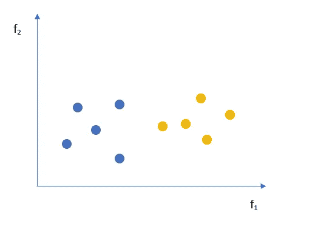

# 几乎你需要知道的关于决策树的一切(带代码)

> 原文：<https://towardsdatascience.com/almost-everything-you-need-to-know-about-decision-trees-with-code-dc026172a284?source=collection_archive---------5----------------------->

## 以你想不到的方式理解决策树的指南！

托德·夸肯布什在 [Unsplash](https://unsplash.com/s/photos/trees?utm_source=unsplash&utm_medium=referral&utm_content=creditCopyText) 上的照片

# 介绍

你一生中没有一天不做任何决定。从你早餐吃什么到你感兴趣的职业，你的生活被决定所包围。假设你想出去玩板球。出门前你会寻找哪些因素？今天会下雨吗？外面会不会太热？作为一名资深玩家，你被要求接最后的电话。你从气象部门网站上查了过去几天的数据。将这些数据与今天的天气状况进行了比较，并预测天气状况非常适合进行板球比赛。瞧啊。你只是在不知道的情况下用决策树解决了问题。

在使用决策树的实际功能之前，您需要精通以下术语

*   基尼杂质
*   熵

# 基尼杂质与熵

两个朋友乔和萨姆开始觉得无聊了。所以他们决定玩一个游戏。找到最能把下面的点分成蓝色和橙色的线的人赢得游戏。唯一的限制是这条线必须平行于任何轴。

图 1

两人都尝试了很多，想出了下面的台词。

图 2

仅仅通过视觉化的要点，很容易说乔的尝试比山姆好。然而，当我们有两种以上的颜色时，事情会变得疯狂。人们需要一个量化值来判断分裂。这就是基尼系数不纯的原因。它谈到了错误分类点的**概率。**

*没拿到？*

让我们看看拆分前的条件，即图 1。错误分类一个点的概率有多大？

我们可能有两种方法来错误地对一个点进行分类。首先，我们选择一个蓝点，将其归类为橙色。第二，我们选择一个橙色的点，将其归类为蓝色。

图 3

和

图 4

总概率= 0.25+0.25 =0.5(开始时的基尼杂质)

任何数据分割都会将该区域分成两个或多个部分。通过对所有部分进行加权求和，计算出最终的基尼系数。基尼系数越小，分割越好。

我们来分析一下乔的企图-

图 5

同样，我们也可以分析山姆的企图-

图 6

这两种尝试都显著降低了原始基尼系数的不纯度，但是，Joe 进行了更好的分割，因为他的分割得到了更大的基尼系数增益。

设 y 是一个随机变量，取值为{y₁,y₂,y₃,….,yₖ}那么计算基尼系数的一个简单方法是

图 7

## 基尼杂质的性质

设 y 取值 y₊，y₋(两个班)

案例一:

当 100%的数据点属于 y₊。在这种情况下，该系统的基尼系数为

图 8

案例二:

当 50%的数据点属于 y₊时。在这种情况下，该系统的基尼系数为

图 9

案例三:

当 0%的数据点属于 y₊时。在这种情况下，该系统的基尼系数为

图 10

基尼系数与 y₊的关系曲线如下:

图 11

受够了这种基尼不纯。先说一会熵。

**熵**，简单来说就是数据中的随机性。想象你面前有两个盒子。盒子 1 大部分是蓝色的球，而盒子 2 是不同颜色的球。

图 12

现在从每个盒子里抽出一个球。你认为从盒子 1 中抽出的球最有可能是什么颜色？蓝色，对吗？你能预测从盒子 2 中抽出的球的情况吗？我想不会。原因是盒子 2 与盒子 1 不同，具有很大的随机性。恭喜你，你已经知道熵意味着什么了！如果你选择熵作为度量，决策树会以这样一种方式分割数据，即在每次分割时，数据的随机性不断降低。

设 y 是一个随机变量，取值为{y₁,y₂,y₃,….,yₖ}接着计算出系统的熵为:

图 13

## 熵的性质

设 y 取值 y₊，y₋(两个班)

案例一:

99%的数据点属于 y₊。在这种情况下，系统的熵将是:-

图 14

案例二:

当 50%的数据点属于 y₊时。在这种情况下，系统的熵将是:-

图 15

案例三:

当 1%的数据点属于 y₊时。在这种情况下，系统的熵将是:-

图 16

从 H(y) w.r.t .到 y₊的曲线将会是:

图 17

必须注意的是，当所有值出现的概率相等时，熵最大= 1。

到目前为止一切顺利。*但是如何用熵来分割数据呢？*

类似于基尼增益，我们使用信息增益(I.G ),来决定分割的最佳特征。

它被定义为:-

图 18

图 19:显示基尼系数和熵随 y+变化的图表

# 为什么基尼不纯超过熵？

熵涉及对数计算，而基尼系数涉及计算开销较小的平方计算，这就是 S *klearn 库*使用基尼系数作为默认选择标准来构建决策树的原因。

但是，观察到它们之间的差异很小，可以使用这两个指标中的任何一个。

# 构建决策树的步骤

1.  **决定分解/分割数据的特征**:计算每个特征的信息增益，选择最大的一个。
2.  **继续拆分数据**
3.  **停止拆分数据，如果:-**

a)我们得到纯节点，即仅包含正或负数据点的节点，或者

b)我们在一个节点上得到很少的点，或者

c)我们到达树的一定深度

一旦您构建了一个决策树，对于一个查询点，从根到适当的叶节点遍历树。如果叶节点是纯的，预测查询点对应的类标签，否则执行多数投票。

# 分裂分类特征

假设我们的数据集是:

图 20

有两个特点。如果有一个特征，我们会简单地选择它。然而，当我们有一个以上的特征时，我们需要查看在分割后提供最大信息增益的特征。

从特写 F₁:开始

图 21

信息增益将是:

图 22

现在检查功能 F₂:

图 23

而信息增益(IG)₂会是:

图 24

由于 IG₂ > IG₁，我们将首先使用 F₂.要素分割数据请注意，F₂=IND 之后的节点可以使用特征 F₁.进一步分解最终的树看起来会像-

图 25

# 直觉

让我们使用简单的 if-else 条件重写上面的决策树:

图 26

我的朋友，这就是你的决策树。

从程序上讲，决策树只不过是一系列 if-else 条件语句。

从几何学上讲，它是一组轴平行的超平面。

# 分割数字特征

假设我们的数据集是:

图 27

1.  按 F₁值排序
2.  如果我们用 F₁分割每个值

图 28

您可以看到，我们在每个节点中只获得一个值，这导致了数据的过度拟合。

我们处理这个问题的方法是定义一个阈值，然后将数据分成两部分——一部分的值小于或等于阈值，另一部分的值大于阈值。

门槛如何确定？

图 29

我们检查每个可能阈值的信息增益，并选择使其最大化的值。这里，如果我们使用 F₁=4.2 分割数据，信息增益将最大。

# 有许多类别的范畴特征

我们已经看到了如何处理分类和数字特征。然而，当一个分类特征有许多类别时，事情会变得疯狂。

假设我们有一个 pin 码功能。它可能有 1000 个 pin 码，当我们使用此功能拆分数据时，它将创建 1000 个子节点，每个节点只有很少的数据点，这将导致过度拟合。

一种方法是将分类特征转换成数字特征。

代替 pin 码，我们可以有一个新功能，例如:

图 30

所以，现在如果我们使用这个新特性来分割数据，子节点将有足够的点来避免过度拟合。

# 过度拟合和欠拟合

当决策树的深度越大，底部节点出现非常少的数据点的可能性就越大，如果这些点是离群值，我们就会过度拟合我们的模型。因为每一个分割都只是一个 if-else 条件语句，所以模型的可解释性也会随着树的深度的增加而降低。

当树太浅时，我们可能得不到任何纯节点。纯节点是只有正点或负点的节点。在这种情况下，我们必须进行多数投票才能得出结果。

*那么决策树的高度应该是多少？*

身高是一个超参数，我们必须使用交叉验证数据集进行超参数调整，以获得最佳值。

# 训练和测试时间复杂性

列车时间复杂性:

图 31

在训练阶段发生的事情是，对于数据集中的每个特征(维度)，我们将对花费 O(n log n)时间的数据进行排序，然后我们遍历数据点以找到花费 O(n)时间的正确阈值。对于 d 维，总时间复杂度为:

图 32

列车空间复杂性:

在训练决策树时，我们需要的是通常作为 if-else 条件存储的节点。

因此，列车空间复杂度将为:***【O 节点】***

测试时间复杂度将是 ***O(深度)*** ，因为我们必须从决策树的根节点移动到叶节点。

测试空间复杂度将为***【O(节点)***

# 使用决策树的回归

当我们处理回归问题时，情况就变了。这里的输出不再是一个类，而是一个实数值。

*我们如何拆分数据？*

与分类中的熵或基尼系数不同，我们将使用均方误差(MSE)或中位数绝对偏差(MAD)来分割数据。选择降低 MSE 或 MAD 最大的特征进行分割。

*我们如何预测一个测试数据点的值？*

一旦我们到达一个叶节点，我们取那里已经存在的点的平均值/中值，并预测它是给定测试数据点的输出值。

# 真实案例

1.  **不平衡数据集**:建议通过上采样或类别权重来平衡数据集，因为这可能会影响熵值。
2.  **高维数据**:随着维数的增加，训练的计算时间也增加。建议如果一个特征有许多类别，应该避免一次性编码，而是将其转换为数字特征，如上所述。
3.  **多类分类**:决策树自然可以扩展处理多类。因为熵或基尼系数杂质可以针对两个以上的类别进行计算，并且可以通过多数表决来做出决定。
4.  **特征交互**:出现在遍历路径中的特征相互交互，因为子节点的条件取决于父节点的条件
5.  **离群值**:如果树很深，离群值会影响并使树不稳定。
6.  **可解释性**:由于决策树只不过是 if-else 语句的集合，所以它具有高度的可解释性。然而，可解释性随着树深度的增加而降低。
7.  **特征重要性:**那些信息增益高的特征是重要的。如果一个特征被多次用于分割，我们使用由于该特征的信息增益的归一化总和。

# 优势

1.  它不需要缩放或标准化数据
2.  高度的可解释性，尤其是当维数较少时
3.  适用于低延迟系统
4.  较少的超参数数量
5.  处理分类数据和数值数据
6.  容易理解

# 限制

1.  训练模型通常需要更长的时间
2.  当您有高维数据时，它可能不合适
3.  过度拟合数据的可能性很高
4.  数据的微小变化可能会导致决策树结构的整体变化
5.  随着深度的增加，树变得更加复杂
6.  决策树通常没有其他分类或回归算法那样的预测准确性

# 使用 Python 构建决策树

感谢 sci-kit 学习库的 *plot_tree* 函数可视化决策树。我们的决策树看起来会像-

图 33

# 参考

*   [https://victorzhou.com/blog/gini-impurity/](https://victorzhou.com/blog/gini-impurity/)
*   统计学习导论:R 中的应用
*   [https://towards data science . com/decision-tree-intuition-from-concept-to-application-530744294 bb6](/decision-tree-intuition-from-concept-to-application-530744294bb6)
*   M. Gopal 的应用机器学习