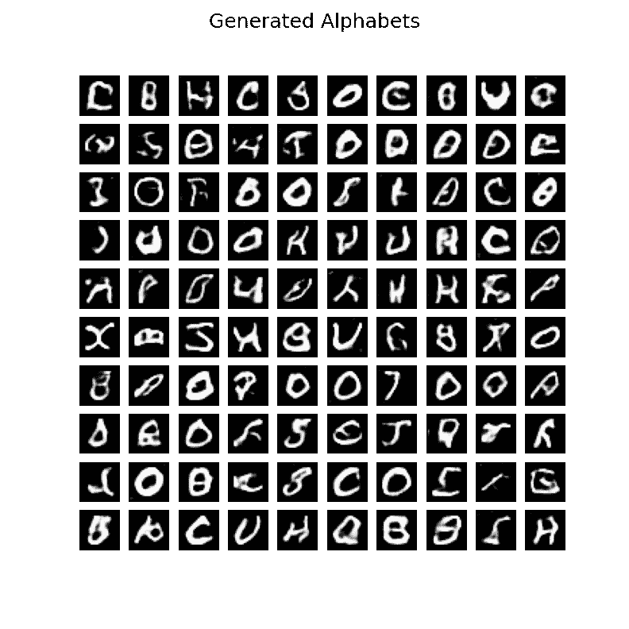
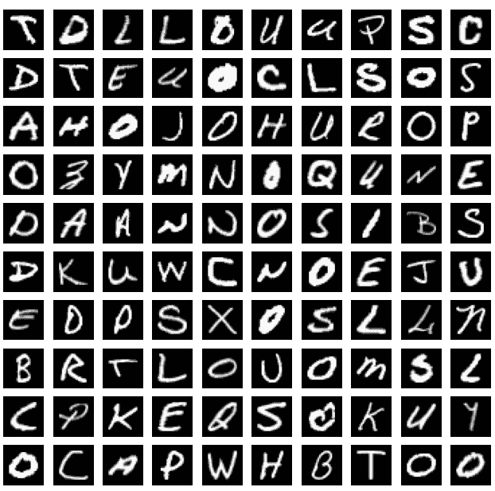
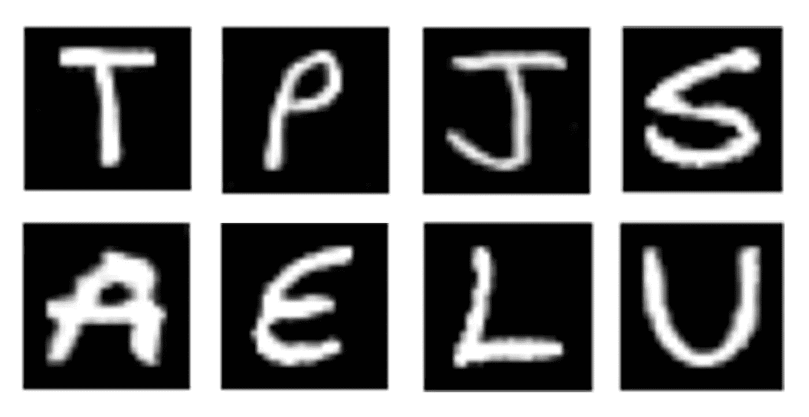

# 字母表甘:AI 生成英文字母表！

> 原文：<https://towardsdatascience.com/alphabet-gan-ai-generates-english-letters-589637068808?source=collection_archive---------37----------------------->

## 这就是我如何创建一个可以生成英文字母的 GAN。



GAN 输出在各个时期的演变

首先，你需要知道 GAN 到底是什么。这里有一个简单的描述。生成对抗网络是两个模型的组合，即生成器和鉴别器。生成器试图生成模仿原始数据的假数据。另一方面，鉴别器试图辨别一个给定的数据是原始的还是伪造的。多亏了这种对抗性的设置，最终，这两种模式在完成任务方面都变得越来越好。当然，关于甘斯还有更多需要了解的。如果你好奇，请观看这个视频…

甘是如何工作的？

在本文中，我想向您展示如何实现这样一个 GAN。我还会提到一大堆帮助你训练第一个 GAN 的技巧。但是，在进入模型之前，让我们先了解一下数据集。

# 数据集:A-Z 手写字母

这里，我使用的是 MNIST 风格的手写英文字母数据集。 [A-Z 数据集](https://www.kaggle.com/sachinpatel21/az-handwritten-alphabets-in-csv-format)包含来自 ***26*** 类的 ***372，450*** 个字符。每个数据样本都是字母表的灰度图像。像 MNIST 数据集一样，每幅图像的维数是 ***28px*28px*** 并表示为一个***784***(***28 * 28***)维向量。让我们想象一下其中的一些…



来自 EMNIST Letters 数据集的 100 张随机图像

最初，像素值的范围在***【0，255】***之间，但是我们应该在馈送到任何机器学习模型之前将它们归一化。一般情况下，我们通过划分*255.0 来归一化***【0，1】***之间的像素，但这里我们归一化的是 ***[-1，1】***之间的像素。这是因为我们后面会用到*tanh*(*tanh*=****[-1，1】***)函数。**

**现在让我们建立我们的 GAN。我喜欢按照 ***4*** 的步骤来做。**

# **1.建造发电机(G)**

**生成器是一个神经网络，它将噪声向量(***100***-维)作为输入，并输出单个英文字母的图像。当我们处理图像数据时，使用卷积神经网络是有意义的。其想法是在输入通过不同层时增加输入的空间维度，直到它达到期望的输出形状( ***28px*28px*** )。网络的前两层是具有 ReLu 激活的密集层。我强烈建议在每个图层的输出上使用 BatchNormalization。**

> **注:[批处理规范化](https://en.wikipedia.org/wiki/Batch_normalization)使训练收敛更快。快多了。**

**注意，第一密集层包含 ***1024*** 神经元，第二密集层包含 ***6272*** 神经元。之后是整形层。整形是很重要的，因为我们希望以后使用卷积，为了应用卷积，我们需要类似矩阵的实体，而不是列/行向量。**

> **注意:为了找到正确的尺寸，我们需要向后思考！首先，确定矩阵的维数( **7*7** )以及需要多少个矩阵( **128** )，然后将它们相乘得到密集层的维数( **7*7*128 = 6272** )。**

**在应用卷积之前，我们将对矩阵进行上采样。我使用了( ***2，2*** )上采样，将维度从 ***7*7*** 增加到 ***14*14*** 。**

> **上采样是池的一种反函数。**

**之后，我们有了 ***2*2*** 卷积滤波器( ***64*** )。注意，我已经根据正态分布初始化了内核的权重。这一层的激活是 LeakyReLu。同样，我们有一个上采样层，后面是卷积层。这一次上采样层将输出 ***28*28*** 维矩阵。最后一个卷积层只包含 ***1*** 滤镜，因为我们只想要一个通道用于灰度图像。这里的激活函数是 *tanh* 。这就是我们把 ***[-1，1】***之间的像素值归一化的原因。**

> **注意:我们可以通过使用转置卷积来避免对层进行上采样。因为它们也会增加矩阵的维数。**

## **代码:**

**发电机**

## **建筑:**

```
**Model: "sequential_1"
_________________________________________________________________
Layer (type)                 Output Shape              Param #   
=================================================================
dense_1 (Dense)              (None, 1024)              103424    
_________________________________________________________________
batch_normalization_1 (Batch (None, 1024)              4096      
_________________________________________________________________
activation_1 (Activation)    (None, 1024)              0         
_________________________________________________________________
dense_2 (Dense)              (None, 6272)              6428800   
_________________________________________________________________
batch_normalization_2 (Batch (None, 6272)              25088     
_________________________________________________________________
activation_2 (Activation)    (None, 6272)              0         
_________________________________________________________________
reshape_1 (Reshape)          (None, 7, 7, 128)         0         
_________________________________________________________________
up_sampling2d_1 (UpSampling2 (None, 14, 14, 128)       0         
_________________________________________________________________
conv2d_1 (Conv2D)            (None, 14, 14, 64)        32832     
_________________________________________________________________
batch_normalization_3 (Batch (None, 14, 14, 64)        256       
_________________________________________________________________
leaky_re_lu_1 (LeakyReLU)    (None, 14, 14, 64)        0         
_________________________________________________________________
up_sampling2d_2 (UpSampling2 (None, 28, 28, 64)        0         
_________________________________________________________________
conv2d_2 (Conv2D)            (None, 28, 28, 1)         577       
=================================================================
Total params: 6,595,073
Trainable params: 6,580,353
Non-trainable params: 14,720
_________________________________________________________________**
```

**你注意到我没有在这里编译生成器吗？这将在第 ***第三*** 步骤中完成。**

# **2.构建鉴别器(D)**

**我们的鉴别器只是一个二元分类器，它将灰度图像作为输入，并预测它是原始图像还是伪造图像，即由生成器创建的图像。前两层是卷积层。请注意，我使用了一个步幅 ***2*** ，这意味着输出尺寸将小于输入尺寸。所以，我们不需要池层。两层的滤波器大小都是 ***5*5*** ，但是第二层中的滤波器数量更多。**

> **注意:在构建鉴别器时，你应该记住我们的目标是支持生成器，因为我们想要生成假图像。因此，使鉴别器比发生器弱一点。例如，这里我在鉴别器中使用了较少的卷积层。**

**在卷积层之后，我们需要展平输出，这样我们就可以把它传递到一个密集层。密集层的大小是 ***256*** 与 ***50%*** 的落差。最后，我们有了 sigmoid 层，就像任何其他二元分类器一样。我们现在必须编译鉴别器。损失应该是二进制交叉熵，我已经使用了一个定制的亚当优化器(学习率= ***0.0002*** )。**

> **注意:默认的 Adam 学习率( **0.001** )对于 GANs 来说太高了，所以请始终定制 Adam 优化器。**

## **代码:**

**鉴别器**

## **建筑:**

```
**Model: "sequential_2"
_________________________________________________________________
Layer (type)                 Output Shape              Param #   
=================================================================
conv2d_3 (Conv2D)            (None, 14, 14, 64)        1664      
_________________________________________________________________
leaky_re_lu_2 (LeakyReLU)    (None, 14, 14, 64)        0         
_________________________________________________________________
conv2d_4 (Conv2D)            (None, 5, 5, 128)         204928    
_________________________________________________________________
leaky_re_lu_3 (LeakyReLU)    (None, 5, 5, 128)         0         
_________________________________________________________________
flatten_1 (Flatten)          (None, 3200)              0         
_________________________________________________________________
dense_3 (Dense)              (None, 256)               819456    
_________________________________________________________________
leaky_re_lu_4 (LeakyReLU)    (None, 256)               0         
_________________________________________________________________
dropout_1 (Dropout)          (None, 256)               0         
_________________________________________________________________
dense_4 (Dense)              (None, 1)                 257       
=================================================================
Total params: 1,026,305
Trainable params: 1,026,305
Non-trainable params: 0
_________________________________________________________________**
```

# **3.联合 G & D**

**根据[原 GAN 论文](https://arxiv.org/pdf/1406.2661.pdf)我们要分别训练发生器和鉴别器。那为什么要走这一步？**

> **可以通过反向传播在最后一个 sigmoid 层计算的损耗来直接训练鉴别器。但是为了训练生成器，我们需要在不影响鉴别器权重的情况下，将这种损失发送回生成器！**

**实现这一点的一种方法是通过堆叠生成器和鉴别器来创建新的模型。这也是我之前没有编译生成器的原因。我们把新型号叫做*甘*。它将噪声向量作为输入，然后通过生成器创建一个假图像。然后图像通过鉴别器，鉴别器计算它是原始图像的概率。当我们训练这个 gan 时，鉴别器不应该学习任何东西。因此，*' discriminator . trainiable = False '。* 只有生成器的权重会被修改。**

## **代码:**

**发电机+鉴频器= gan**

## **建筑:**

```
**Model: "model_1"
_________________________________________________________________
Layer (type)                 Output Shape              Param #   
=================================================================
input_1 (InputLayer)         (None, 100)               0         
_________________________________________________________________
sequential_1 (Sequential)    (None, 28, 28, 1)         6595073   
_________________________________________________________________
sequential_2 (Sequential)    (None, 1)                 1026305   
=================================================================
Total params: 7,621,378
Trainable params: 6,580,353
Non-trainable params: 1,041,025
_________________________________________________________________**
```

# **4.火车**

**终于准备好训练我们的 GAN 了！你觉得代码看起来奇怪吗？别担心，我会解释每一步。**

## **代码:**

**GAN 的训练环路**

**外层用于遍历各个时期，内层用于批处理。我已经训练了 80 个时期的模型，并且批次大小是 128。因此，在一个时期中，我们将有 2909(每时期步数= ⌊数据数量 samples/batch_size⌋=⌊372,450/128⌋= 2909)步。**

## **G 固定时的 D 列:**

**首先，通过从标准正态分布中随机抽取数字来形成噪声向量的 batch_size 数目。然后将这些向量交给生成器来创建假图像。现在我们从训练数据中画出真实图像的 batch_size 数。为了得到鉴别器的输入，我们需要连接假数据和真数据。相应的，我们需要提到标签向量(0:假数据，1:真数据)。但是等等，代码说的是 0.1 和 0.9！WTH 是怎么回事？**

> **这种技术叫做[水平平滑](https://arxiv.org/pdf/1906.02629.pdf)。它防止鉴别者对其预测过于自信。**

**然后，我们为鉴别器调用 train_on_batch 函数，并传递数据标签对。**

## **G 固定时的 D 列:**

**这里，我们只需要噪声向量和标签。标签向量包含 1。等等，生成器制造假数据，所以标签不应该是 0 吗？**

> **是的。但在这里我们故意给错误的标签，使歧视犯错误。原因是我们希望发电机的性能优于鉴别器。通过这样做，G 将知道 D 在被给定真实标签时的行为，并且它(G)将相应地改变它的权重来愚弄 D。记住，在这个阶段，我们没有改变鉴别器的权重，因此鉴别器没有“忘记”任何东西。**

**现在，我们为生成器调用 train_on_batch 函数，并传递数据标签对。而那就是朋友，一个甘是怎么练出来的！**

**让我向您展示一些我的模型产生的最佳(精选)结果…**

****

**人工智能生成的字母(T，P，J，S，A，E，L，U)**

**这里是这个项目的[完整代码](https://github.com/Suji04/NormalizedNerd/blob/master/Alphabet%20GAN/english-alphabet-gan.ipynb)。瞧啊。现在你知道如何训练甘了！**

## **如果你想进一步探索，请看这个…**

**人工智能生成 2 种语言的字母(英语和孟加拉语)**

**我希望你喜欢阅读。下次见…学习愉快！**