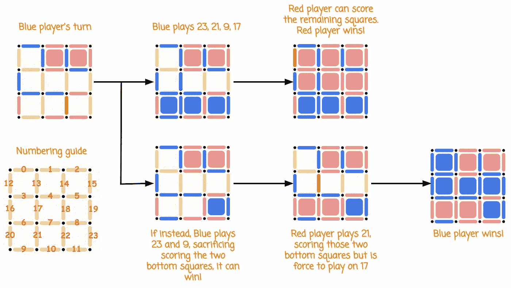
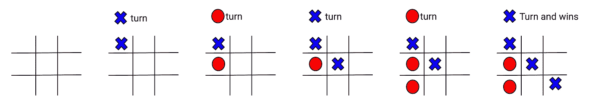
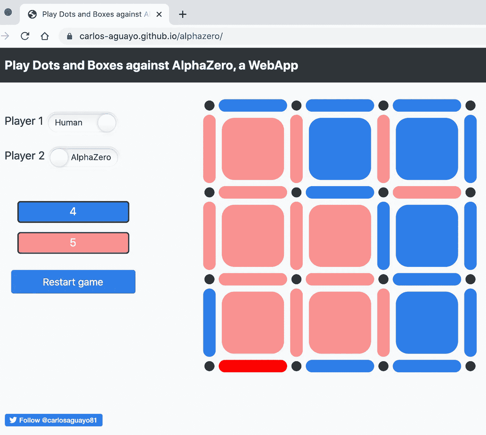

# 一种新的强化学习算法

> 原文：<https://towardsdatascience.com/alphazero-a-novel-reinforcement-learning-algorithm-deployed-in-javascript-56018503ad18?source=collection_archive---------8----------------------->

## 了解并实现 AlphaZero，完全用 JavaScript 实现！

在这篇博文中，你将了解并实现 [AlphaZero](https://deepmind.com/blog/article/alphazero-shedding-new-light-grand-games-chess-shogi-and-go) ，这是一种令人兴奋的新颖的强化学习算法，用于在[围棋](https://en.wikipedia.org/wiki/Go_(game))和国际象棋等游戏中击败世界冠军。您将使用它来掌握一个钢笔和铅笔游戏([点和方框](https://en.wikipedia.org/wiki/Dots_and_Boxes))，并将其部署到一个 web 应用程序中，完全用 JavaScript 编写。

AlphaZero 的关键和最令人兴奋的方面是它能够在不依赖外部知识的情况下，在棋盘游戏中获得超人的行为。AlphaZero 通过与自己对弈(自我对弈)和从那些经历中学习来学习掌握游戏。


我们将利用 [Github](https://github.com/suragnair/alpha-zero-general) 中可用的 [Surag Nair](https://github.com/suragnair) 的 AlphaZero 的“简化的、高度灵活的、有注释的、易于理解的实现”Python 版本。

你可以在这里玩游戏。WebApp 和 JavaScript 实现在这里[可用](https://github.com/carlos-aguayo/carlos-aguayo.github.io/tree/master/alphazero)。这段代码是从这个 Python [实现](https://github.com/carlos-aguayo/alpha-zero-general/tree/dotsandboxes/dotsandboxes)移植过来的。

[**https://carlos-aguayo.github.io/alphazero/**](https://carlos-aguayo.github.io/alphazero/)

AlphaZero 是由 *Silver，David 等人在论文中描述的“* [*掌握没有人类知识的围棋游戏*](https://www.nature.com/articles/nature24270)*”nature 550.7676(2017):354–359*。

# **点和盒子游戏**

《点和盒子》是一个初级的儿童游戏，有着惊人的复杂程度。

两名玩家轮流在两个相邻的点之间放置一条水平线或垂直线。完成 1×1 方块第四边的玩家得一分，并获得另一轮机会。棋盘满了，游戏结束，得分最多的玩家获胜。


# **人工智能和桌游**

我们已经思考了很长时间，如果机器可以证明智能。如何验证机器展现智能行为的能力？一种典型的方式是玩棋盘游戏，如国际象棋，并试图获得超人的行为来击败世界冠军。

1957 年，[希尔伯特·西蒙预言计算机系统将在十年内击败国际象棋世界冠军 i](https://www.aaas.org/birth-modern-computing) 。它花了更长的时间，但在 1997 年 5 月的[，一台计算机打败了国际象棋世界冠军加里·卡斯帕罗夫](https://en.wikipedia.org/wiki/Deep_Blue_versus_Garry_Kasparov#1997_rematch)。

尽管这个里程碑意义非凡，但人们可能会争论这个计算机系统是否是“智能的”。

这些计算机系统由三部分组成:

1.  自定义的[评估函数](https://en.wikipedia.org/wiki/Evaluation_function)。
2.  博弈树搜索算法。
3.  非常强大的硬件。

评估函数将棋盘作为输入，并返回棋盘的“值”。高值表示当前玩家处于非常有利的位置。例如，棋手将要将死的棋盘配置将具有非常高的值。

博弈树搜索算法(如 [Minimax](https://en.wikipedia.org/wiki/Minimax) )搜索**所有**可能的走法，寻找一个能保证有高价值的棋盘配置的路径。通过不访问那些我们知道找不到更好价值的配置，可以提高搜索效率。这就是[Alpha–beta 修剪](https://en.wikipedia.org/wiki/Alpha%E2%80%93beta_pruning)的作用。

最后，添加非常强大的硬件，你将拥有一台能够击败世界冠军的机器。

有什么条件？*有经验的玩家* [*手动工艺*](https://www.nytimes.com/1997/05/18/nyregion/what-deep-blue-learned-in-chess-school.html) *这些评价函数*。这些系统将依靠[开局](https://en.wikipedia.org/wiki/Chess_opening)书来指示最著名的棋步。中级游戏[将使用通过研究大师的游戏而创建的评估函数。然后大师们会进一步微调它们。](https://en.wikipedia.org/wiki/Chess_middlegame)

例如，我们可以为点和盒子游戏创建一个评估函数。一个合理而直接的评估函数是比较分数。分数中的正 delta 越高，棋盘游戏越有利。在大多数情况下，这是可行的。然而，在点和盒子游戏中，就像在许多棋盘游戏中一样，最好的行动可能包括牺牲短期利益以获得更好的长期收益。在点和盒子游戏中，有时最好不要在盒子中得分，以避免获得另一轮机会，相反，要迫使对方移动。然后，我们必须调整我们的评估函数，以考虑越来越多的复杂场景！

击败卡斯帕罗夫的[评价函数](https://www.sciencedirect.com/science/article/pii/S0004370201001291/pdf)有 8000 个特征！这些功能中的大部分都是手工创建和调整的！

因此，在不贬低像击败国际象棋世界冠军这样的重要里程碑的情况下，一个不可取的方面是需要顶级玩家定义这些计算机的行为，并手动调整如此多的变量。

# **alpha zero 是什么，为什么这么激动人心？**

AlphaZero 是第一个能够在国际象棋或围棋等游戏中获得超人行为的计算机系统，它击败了世界冠军，仅依靠游戏规则而没有人类领域的知识。

如果只给定游戏规则，AlphaZero 将开始自相残杀。一点一点地学习策略和技术，相对快速地获得超人的行为。

像深蓝这样的系统需要国际象棋专家的帮助，而 AlphaZero 会通过与自己对弈变得强大。此外，AlphaZero 不仅在国际象棋上表现出超人的力量，在围棋上也是如此。围棋对电脑来说是一个更复杂的游戏，因为它的[更大的游戏空间和其他因素](https://en.wikipedia.org/wiki/Go_(game)#Software_players)。

虽然人类从数千年的数百万场游戏中积累了像 T4 围棋和国际象棋这样的游戏知识，但 AlphaZero，一种只使用游戏规则的简单算法，在几天内重新发现了这些知识和新策略。

甚至还有一部关于它的电影。

# 仅通过自我游戏，AlphaZero 将如何学习？

回想一下，像 DeepBlue 这样的系统依赖于人定义的“[评估函数](https://en.wikipedia.org/wiki/Evaluation_function)，它将电路板状态作为输入，并输出状态的“值”。

如今，深度学习模型非常容易将图像作为输入，并将其分类为狗或猫。这个想法是将棋盘作为深度学习模型的输入，并训练它预测棋盘是赢还是输的配置。

但是训练机器学习，需要数据，大量的数据。你从哪里得到游戏的数据集？很简单，我们让计算机自己玩，生成一组游戏，并从中制作一个数据集。

# **AlphaZero 训练算法**

算法很简单:

1.  让电脑和自己玩几局游戏，记录棋盘的每一步棋。一旦我们知道了结果，在游戏结束时用给定的结果更新所有的棋盘，“赢”或“输”。然后，我们建立了一个数据集，提供给神经网络(NN ),并开始学习给定的电路板配置是赢还是输。
2.  克隆神经网络。使用上一步中生成的数据集训练克隆。
3.  让克隆神经网络和原始神经网络相互对抗。
4.  挑一个神经网络赢的，丢掉另一个。
5.  转到步骤 1。

就像魔术一样，经过多次迭代，你就有了世界级的模型。这个模型仅用了 [4 个小时](https://deepmind.com/blog/article/alphazero-shedding-new-light-grand-games-chess-shogi-and-go)就成功超越了最强的电脑象棋程序！

# AlphaZero 组件

AlphaZero 有两个组成部分。我们已经讨论过第一个，也就是神经网络。第二个是“蒙特卡罗树搜索”或 MCTS。

1.  **神经网络(NN)** 。将棋盘配置作为输入，输出棋盘的值，以及所有可能走法的概率分布。
2.  **蒙特卡罗树搜索(MCTS)** 。理想情况下，神经网络足以选择下一步行动。我们仍然希望看到尽可能多的董事会配置，并确保我们确实选择了最好的行动。像极小极大一样，MTCS 是一种算法，它将帮助我们了解董事会的配置。不像极小极大，MTCS 将有助于有效地探索游戏树。

# **让我们深入细节，确定下一步行动**

跟随 AlphaZero 更容易，首先看它在决定下一步棋(竞技模式)时的行为，然后再看训练套路。

神经网络已经很擅长对事物进行分类，比如猫和狗。这里的想法很简单，神经网络可以学习将棋盘配置分类为赢与输吗？更具体地说，神经网络将预测表示赢与输的概率的值。此外，它将输出所有可能移动的概率分布，表示我们下一步应该探索哪个动作。

神经网络将游戏状态作为输入，输出一个值和一个概率分布。具体对于点和方框来说，游戏状态由三个元素表示:首先，一条线是否已经玩过，使用 0 和 1 的数组表示穿过点的每条线。如果一个玩家已经给这条线着色，则为 1，否则为 0。第二，如果当前移动是通过，第三，分数。我们可以用这三个元素来表示所有需要的信息，以确定董事会的价值并预测其下一步行动。

我们来分析一下下面的博弈，该轮到蓝玩家了。蓝有两个选择，走上面的路输了，或者走下面的路赢了。



如果蓝色先玩 23 然后玩 21，红色赢。相反，如果蓝色先玩 23 再玩 9，蓝色就赢了。如果 AlphaZero 要出蓝色，它如何找到获胜的一步？

你可以用这个[笔记本](https://colab.research.google.com/github/carlos-aguayo/carlos-aguayo.github.io/blob/master/alphazero/notebooks/Get%20probabilities%20and%20values.ipynb)重现下面看到的结果。

如果我们将棋盘配置输入神经网络，我们将得到一个数组，其中包含每个动作移动概率:

```
move_probability[0]: 9.060527501880689e-12
move_probability[1]: 3.9901679182996475e-10
move_probability[2]: 3.0028431828490586e-15
move_probability[3]: 7.959351400188552e-09
move_probability[4]: 5.271672681717021e-11
move_probability[5]: 4.101417122592821e-12
move_probability[6]: 1.2123925357696643e-16
move_probability[7]: 6.445387395019553e-23
move_probability[8]: 2.8522254313207743e-22
**move_probability[9]: 0.0002768792328424752**
move_probability[10]: 1.179791128073232e-13
move_probability[11]: 5.543385303737047e-13
move_probability[12]: 3.2618200407341646e-07
move_probability[13]: 4.302984970292259e-14
move_probability[14]: 2.7477634988877216e-16
move_probability[15]: 1.3767548163795204e-14
move_probability[16]: 8.998188305575638e-11
move_probability[17]: 7.494002147723222e-07
move_probability[18]: 8.540691764924446e-11
move_probability[19]: 9.55116696843561e-09
move_probability[20]: 4.6348909953086714e-12
**move_probability[21]: 0.46076449751853943**
move_probability[22]: 2.179317506813483e-20
**move_probability[23]: 0.5389575362205505**
move_probability[24]: 5.8165523789057046e-15
```

我们还获得了板配置的值:

```
-0.99761635
```

你可以在这里找到生成这些值的代码。

这些输出中有一些有趣的东西:

1.  在 8 个可能的移动中，最有可能的移动是 23、21 和 9。如果 NN 打 23 或 21，他得一分。23 是赢棋，其值(0.53)略高于 21 的值(0.46)。
2.  神经网络将输出概率，即使是无效的移动。遵循游戏规则并确保我们不玩无效的动作是代码的工作。
3.  该值为-0.99。这表明 AlphaZero 认为它已经输掉了这场比赛。该值的范围从-1(失败)到 1(成功)。这个值应该更接近于 1(赢)而不是-1(输)，因为我们知道这是一个赢的状态。也许我们需要更多的训练回合来达到这样一种状态，即 AlphaZero 将学习这种板配置的正确值。

利用神经网络的输出来决定我们的下一步很有诱惑力。

在桌游中(在生活中！)，玩家在决定自己的下一步棋时，通常会看到许多“前面的棋”。这里也没什么不同。我们使用神经网络预测来选择下一步要探索的状态，并忽略那些低价值的状态。像 Minimax 一样，传统的人工智能博弈树搜索算法效率低下，因为它们必须在进入下一步之前分析每一步棋。即使有很小的分支因素的游戏也使他们的游戏空间难以处理。[分支因子](https://en.wikipedia.org/wiki/Branching_factor)是可能的移动次数。随着游戏的进行，可能的移动次数会发生变化。如果是这样，你计算一个平均分支因子。[国际象棋的平均分支因子是 35。围棋是 250。](https://www.wired.com/2014/05/the-world-of-computer-go/)

这意味着，在国际象棋中，仅仅走了两步，就有 1，225 (35)种可能的棋盘布局，而在围棋中，可能是 62，500 (250)。在点和框中，对于一个 3x3 的游戏，初始分支因子是 24，并且随着每一步棋而减少(除非是一次通过)。所以在中局中，当分支因子为 15 时，仅三步棋就有 2730(15 * 14 * 13)种棋盘布局。

相反，NN 会引导我们，告诉我们应该探索哪里，避免被许多无用的路径淹没。NN 告诉我们 23 和 21 是很强的移动。

这是蒙特卡洛树搜索的工作。

# **蒙特卡罗树搜索(MCTS)**

神经网络已经给了我们下一步行动的指示。蒙特卡洛树搜索算法将帮助我们遍历节点，选择下一步行动。

看看这个[链接](https://www.nature.com/articles/nature24270/figures/2)中这篇论文对蒙特卡罗树搜索的图形描述。

MCTS 的工作方式是，对于给定的电路板，它将运行 N 次模拟。n 是我们模型的一个参数。在这些模拟的最后，下一步将是最受欢迎的。你可以跟随代码[到这里](https://github.com/suragnair/alpha-zero-general/blob/5156c7fd1d2f3e5fefe732a4b2e0ffc5b272f819/MCTS.py#L37-L48)。

运行 n MCTS 模拟

MCTS 模拟包括遍历游戏树，从当前棋盘开始，通过选择具有最高“置信上限(UCB)”值(定义如下)的节点，直到我们到达我们以前没有访问过的游戏状态，这被称为“叶子”。这就是本文所称的 A 部分“选择”。

UCB 是什么？就是 Q(s，a) + U(s，a)。其中“s”是状态，“a”是动作。Q(s，a)是我们期望从动作“a”之后的状态“s”中得到的期望值，与 Q-Learning 中的值相同。请记住，在这种情况下，该值的范围将从-1(输)到 1(赢)。 *U* ( *s* ，*a*)∧*P*(*s*，*a*)/(1+*N*(*s*， *a* )。这意味着 U 与 P 和 N 成比例，其中 P(s，a)是元组(s，a)的先验概率，即 NN 返回的值，N(s，a)是我们访问状态 s 并采取行动 a 的次数。

```
# Upper Confidence Bound
ucb = Qsa[(s,a)] + Ps[s,a] * sqrt(Ns[s]) / (1 + Nsa[(s,a)]
```

UCB 的要点是最初偏好具有高先验概率(P)和低访问计数(N)的动作，但是渐近地偏好具有高动作值(Q)的动作。

你可以沿着[这里的](https://github.com/suragnair/alpha-zero-general/blob/5156c7fd1d2f3e5fefe732a4b2e0ffc5b272f819/MCTS.py#L108-L125)看代码。

A 部分—选择置信上限最高的行动(UCB)

一旦找到一片叶子，我们就用神经网络来搜索这块板子。这就是本文所说的 B 部分，“扩展和评估”。你可以跟随代码[到这里](https://github.com/suragnair/alpha-zero-general/blob/5156c7fd1d2f3e5fefe732a4b2e0ffc5b272f819/MCTS.py#L83-L102)。

B 部分—扩展和评估

最后，我们将传播神经网络返回的值。这就是论文所说的 C 部分“备份”。你可以跟随代码[到这里](https://github.com/suragnair/alpha-zero-general/blob/5156c7fd1d2f3e5fefe732a4b2e0ffc5b272f819/MCTS.py#L125-L136)。

C 部分—备份

**决定下一步棋**

我们来看看 AlphaZero 是如何针对上面提到的状态确定下一步行动的。


AlphaZero 将运行 50 次蒙特卡罗树搜索模拟。

您可以使用这个[笔记本](https://colab.research.google.com/github/carlos-aguayo/carlos-aguayo.github.io/blob/master/alphazero/notebooks/Get%20probabilities%20and%20values.ipynb)重现下面看到的结果。

这些是每次迭代遵循的路径:

```
Simulation #1 -> Expand root node
**Simulation #2 -> 23**
Simulation #3 -> 21
Simulation #4 -> 9
Simulation #5 -> 17
Simulation #6 -> 12
Simulation #7 -> 19
Simulation #8 -> 3
Simulation #9 -> 18
**Simulation #10 -> 23,24**
Simulation #11 -> 21,24
**Simulation #12 -> 23,24,21**
Simulation #13 -> 21,24,23,24
**Simulation #14 -> 23,24,9**
**Simulation #15 -> 23,24,17**
Simulation #16 -> 21,24,9
**Simulation #17 -> 23,24,12**
**Simulation #18 -> 23,24,18**
Simulation #19 -> 21,24,17
**Simulation #20 -> 23,24,21,24,9**
Simulation #21 -> 21,24,19
**Simulation #22 -> 23,24,3**
Simulation #23 -> 21,24,18
**Simulation #24 -> 23,24,19**
Simulation #25 -> 21,24,23,24,17
**Simulation #26 -> 23,24,21,24,18**
**Simulation #27 -> 23,24,21,24,3**
Simulation #28 -> 21,24,3
**Simulation #29 -> 23,24,21,24,19**
Simulation #30 -> 21,24,12
**Simulation #31 -> 23,24,21,24,9,24**
Simulation #32 -> 21,24,23,24,12
**Simulation #33 -> 23,24,21,24,9,24,18**
Simulation #34 -> 21,24,23,24,9,24,17
**Simulation #35 -> 23,24,21,24,9,24,12**
**Simulation #36 -> 23,24,21,24,9,24,3**
Simulation #37 -> 21,24,23,24,9,24,19
**Simulation #38 -> 23,24,21,24,9,24,18,17**
Simulation #39 -> 21,24,23,24,9,24,18,17,24
**Simulation #40 -> 23,24,21,24,9,24,18,17,24,19**
Simulation #41 -> 21,24,23,24,9,24,18,17,24,19,24
**Simulation #42 -> 23,24,9,21**
**Simulation #43 -> 23,24,9,18**
**Simulation #44 -> 23,24,9,17**
**Simulation #45 -> 23,24,9,19**
**Simulation #46 -> 23,24,9,12**
**Simulation #47 -> 23,24,9,21,24**
**Simulation #48 -> 23,24,9,3**
**Simulation #49 -> 23,24,9,21,24,18**
**Simulation #50 -> 23,24,9,21,24,17**
```

上面的意思是:在第一个模拟中，我们以前没有见过那个板，因此它是一个“叶”节点，并“扩展”它。扩展意味着它用神经网络评估该板。

```
Simulation #1 -> Expand root node
```

在第二个模拟中，我们已经扩展了根节点，因此它不再是“叶子”，因此我们可以搜索具有最高 UCB 的节点

UCB 最高的动作是 23。它进入那个状态，因为它以前没有见过那个状态，因此它是一个叶节点，它展开它，第二个模拟完成。

```
Simulation #2 -> 23
```

在这种情况下，神经网络给出 23 的损失值。我们之前讨论过这个。神经网络可以使用更多的训练来了解它确实是一个糟糕的状态。但是现在，这仍然有效，我们将在下面看到。

对于接下来的模拟，每次，具有最高 UCB 的选项是剩余的选项。这是因为在访问每个动作后，它发现它的值很低，因此 UCB 也很低。

```
Simulation #3 -> 21
Simulation #4 -> 9
Simulation #5 -> 17
Simulation #6 -> 12
Simulation #7 -> 19
Simulation #8 -> 3
Simulation #9 -> 18
```

在接下来的模拟中，一个令人兴奋的模式开始浮现。记住中奖顺序是 23，24(跳过)，9。

```
Simulation #10 -> 23,24
Simulation #11 -> 21,24
Simulation #12 -> 23,24,21
Simulation #13 -> 21,24,23,24
Simulation #14 -> 23,24,9
Simulation #15 -> 23,24,17
Simulation #16 -> 21,24,9
Simulation #17 -> 23,24,12
Simulation #18 -> 23,24,18
Simulation #19 -> 21,24,17
Simulation #20 -> 23,24,21,24,9
Simulation #21 -> 21,24,19
Simulation #22 -> 23,24,3
Simulation #23 -> 21,24,18
Simulation #24 -> 23,24,19
```

在模拟 10 到 24 中，MCTS 已经将其注意力集中在节点 21 和 23 上。这是有意义的，因为这两条路中的任何一条，我们都得了一分。

```
Simulation #33 -> 23,24,21,24,9,24,18
Simulation #34 -> 21,24,23,24,9,24,17
Simulation #35 -> 23,24,21,24,9,24,12
Simulation #36 -> 23,24,21,24,9,24,3
Simulation #37 -> 21,24,23,24,9,24,19
Simulation #38 -> 23,24,21,24,9,24,18,17
Simulation #39 -> 21,24,23,24,9,24,18,17,24
Simulation #40 -> 23,24,21,24,9,24,18,17,24,19
Simulation #41 -> 21,24,23,24,9,24,18,17,24,19,24
```

然后在模拟 33 到 41 中，它开始深入失败的组合。注意一个有趣的事情。尽管深入，它永远不会到达游戏的结尾，因为仍然有可玩的移动。

```
Simulation #42 -> 23,24,9,21
Simulation #43 -> 23,24,9,18
Simulation #44 -> 23,24,9,17
Simulation #45 -> 23,24,9,19
Simulation #46 -> 23,24,9,12
Simulation #47 -> 23,24,9,21,24
Simulation #48 -> 23,24,9,3
Simulation #49 -> 23,24,9,21,24,18
Simulation #50 -> 23,24,9,21,24,17
```

然后，在模拟 42 至 50 中，在 NN 的帮助下，它认识到 23、24、21 或 21、24、23 不是好的选项，并完全集中在获胜序列 23、24、9 上。

50 次模拟后，我们的时间到了，我们需要选择一步棋。MCTS 选择了我们去过最多的地方。以下是我们每次移动的次数(在第一次行动中):

```
counts[3] = 1
counts[9] = 1
counts[12] = 1
counts[17] = 1
counts[18] = 1
counts[19] = 1
counts[21] = 15
counts[23] = 28
```

在前 10 个模拟中，动作 3、9、12、17、18 和 19 仅被访问一次。然后 MCTS 把注意力集中在第 21 步和第 23 步。最近 9 次模拟访问行动 23。鉴于我们访问 23 号行动最多，达 28 次，MCTS 将其作为下一步行动。

有哪些外卖？

1.  通过每次模拟，MCTS 将依靠神经网络，使用累积值(Q)、神经网络给出的移动先验概率(P)以及它访问节点的频率的组合，来跟随看起来最有希望的路径。或者换句话说，具有最高 UCB 的路径。
2.  在每次模拟期间，MCTS 将尽可能深入，直到它到达一个它以前没有见过的板配置，它将依赖神经网络来评估板，以告诉板有多好。

如果我们将它与经典方法进行比较，如使用带有 Alpha-Beta 修剪和评估函数的 Minimax，我们可以说:

1.  在 Minimax 中，深度是由设计者建立的参数。它会深入到那个深度，然后使用评估函数。如果没有 Alpha-Beta 修剪，它将不得不访问给定深度的所有节点，效率非常低。在上面的场景中，还剩 8 步棋，深度为 3，这意味着评估 336 个棋盘。在 MTCS，有 50 个模拟，我们只需要评估 50 个板，并设法深入得多。
2.  阿尔法-贝塔剪枝会帮助我们减少 336 这个数字。然而，它不允许我们走一条智能的道路。
3.  我们依靠神经网络随时告诉我们电路板的“价值”,而不是使用人类定义的评估函数。
4.  有趣的是，神经网络在最初的移动中没有预测到正确的值。然而，当我们深入游戏而没有一直到游戏结束时，它有正确的预测。
5.  最后，注意 AlphaZero 的优雅和简单。而在 Alpha-Beta 剪枝中，您必须跟踪 Alpha 和 Beta 参数才能知道在哪里剪枝，并且人工定义的评估函数可能很难使用。MCTS 和 NN 让一切变得优雅而简单。你可以用 JavaScript 实现这一切！

# **训练神经网络**

我们遗漏了最后一个关键方面。我们如何训练神经网络？

幸运的是这很简单。我们之前提到过这些步骤:

1.  让电脑在“训练模式”下和自己玩几局，记录棋盘的一举一动。一旦我们知道了结果，在游戏结束时用给定的结果更新所有的棋盘，“赢”或“输”。然后，我们建立了一个数据集，提供给神经网络(NN ),并开始学习给定的电路板配置是赢还是输。
2.  克隆神经网络。使用上一步中生成的数据集训练克隆。
3.  让克隆神经网络和原始神经网络相互对抗。
4.  挑一个神经网络赢的，丢掉另一个。
5.  转到步骤 1。

玩“训练模式”是什么意思？差别很小。当在“竞争模式”下玩时，我们总是选择访问量最高的棋步。而在“训练模式”中，对于游戏开始时的一定数量的移动，计数成为我们的概率分布并鼓励探索。例如，假设有 3 个可能的操作，访问次数为[2，2，4]。在竞争模式下，我们总是选择第三个动作，因为它有最高的访问计数。但是在训练模式中，[2，2，4]变成了概率分布，2+2+4 = 8，因此[2/8，2/8，4/8]或[0.25，0.25，0.5]。换句话说，我们 50%的时间选择第三个动作，而 25%的时间探索第一个和第二个动作。

然后我们用一个简单的井字游戏来描述数据集。



在上面的游戏中，第一个玩家，Xs 获胜。

我们可以这样配置棋盘的状态:如果方块还没有下完，则为 0；如果第一个玩家下了方块，则为 1；如果第二个玩家下了方块，则为-1。

例如，董事会如下:

```
0 0 0    1 0 0     1 0 0     1 0 0     1 0 0     1 0 0
0 0 0 -> 0 0 0 -> -1 0 0 -> -1 1 0 -> -1 1 0 -> -1 1 0
0 0 0    0 0 0     0 0 0     0 0 0    -1 0 0    -1 0 1
```

或者:

```
[0, 0, 0, 0, 0, 0, 0, 0, 0]
[1, 0, 0, 0, 0, 0, 0, 0, 0]
[1, 0, 0,-1, 0, 0, 0, 0, 0]
[1, 0, 0,-1, 1, 0, 0, 0, 0]
[1, 0, 0,-1, 1, 0,-1, 0, 0]
[1, 0, 0,-1, 1, 0,-1, 0, 1]
```

然后我们必须做两件事。首先，更新每个棋盘，就好像轮到玩家 1 了。我们总是从第一个玩家的角度向神经网络提供训练数据。在 TicTacToe，这很简单。每次轮到第二个玩家时，我们可以翻转棋子，变成玩家 1 的视角。

我们从这里开始:

```
[0, 0, 0, 0, 0, 0, 0, 0, 0]  # Player 1 turn
**[1, 0, 0, 0, 0, 0, 0, 0, 0]  # Player 2 turn** 
[1, 0, 0,-1, 0, 0, 0, 0, 0]  # Player 1 turn
**[1, 0, 0,-1, 1, 0, 0, 0, 0]  # Player 2 turn**
[1, 0, 0,-1, 1, 0,-1, 0, 0]  # Player 1 turn
**[1, 0, 0,-1, 1, 0,-1, 0, 1]  # Player 2 turn**
```

对此:

```
[ 0, 0, 0, 0, 0, 0, 0, 0, 0]  # Player 1 turn
**[-1, 0, 0, 0, 0, 0, 0, 0, 0]  # Player 1 turn** 
[ 1, 0, 0,-1, 0, 0, 0, 0, 0]  # Player 1 turn
**[-1, 0, 0, 1,-1, 0, 0, 0, 0]  # Player 1 turn**
[ 1, 0, 0,-1, 1, 0,-1, 0, 0]  # Player 1 turn
**[-1, 0, 0, 1,-1, 0, 1, 0,-1]  # Player 1 turn**
```

第二，我们追加游戏结果。如果一号玩家赢了，我们就用“1”，如果输了，就用“0”。

```
[ 0, 0, 0, 0, 0, 0, 0, 0, 0, **1**]  # Winning board
[-1, 0, 0, 0, 0, 0, 0, 0, 0, **0**]  # Losing board
[ 1, 0, 0,-1, 0, 0, 0, 0, 0, **1**]  # Winning board
[-1, 0, 0, 1,-1, 0, 0, 0, 0, **0**]  # Losing board
[ 1, 0, 0,-1, 1, 0,-1, 0, 0, **1**]  # Winning board
[-1, 0, 0, 1,-1, 0, 1, 0,-1, **0**]  # Losing board
```

数据集开始有一些形状了！正如你从上面看到的，我们可以把它输入神经网络来学习棋盘上的输赢值。

不过，我们忽略了概率。那些是从哪里来的？请记住，在训练模式下，我们仍然会在每一步运行 MCTS 模拟。与我们记录棋盘配置的方式相同，我们将记录概率。

然后，我们克隆神经网络，并使用该数据集训练克隆，预计它会随着使用新数据而稍微变强。我们通过让它与原来的 NN 竞争来验证它确实更强。如果它赢了 55%以上的时间，我们认为它更强，并放弃原来的，克隆成为我们新的神经网络。

我们不断重复这个过程，神经网络会不断变强。

你可以从论文[这里](https://www.nature.com/articles/nature24270/figures/1)看到图表。

为什么数据集有更强的动作可以学习？通过学习 MCTS 生成的概率，他们通常会选择比神经网络给出的原始移动概率更强的移动。我们通过让 MCTS 深入许多路径来提供神经网络知识！

用这个[笔记本](https://colab.research.google.com/github/carlos-aguayo/alpha-zero-general/blob/dotsandboxes/dotsandboxes/Train%20Dots%20and%20Boxes%20using%20AlphaZero%20General.ipynb)训练一个点和方框模型。

**将其部署到 WebApp 中**

几个月前，我发表了一篇[博文](/deploying-a-simple-machine-learning-model-into-a-webapp-using-tensorflow-js-3609c297fb04)，带你完成将 Keras 或 Tensorflow 模型转换成供 Tensorflow.js 使用的 JavaScript 的过程。我们将转换我们在 Keras 中训练的模型，以便在 Tensorflow.js 中使用。

这个[笔记本](https://colab.research.google.com/github/carlos-aguayo/alpha-zero-general/blob/dotsandboxes/dotsandboxes/Convert%20Keras%20Model%20for%20use%20with%20Tensorflow.js.ipynb)将预先训练的点和方框模型转换成 Tensorflow.js 模型。

一旦我们这样做了，我们就可以轻松地用 JavaScript 加载模型，如这里的[所示。](https://github.com/carlos-aguayo/carlos-aguayo.github.io/blob/50de28a29d198df07eed60478fcd0e6de8d5913a/alphazero/index.html#L138)

# **结论**

在这篇博文中，你了解了 AlphaZero，这是一种新颖的强化学习算法，可以在双人零和棋盘游戏中击败世界冠军。

您了解了它如何沿着神经网络使用蒙特卡罗树搜索来找到最佳的下一步行动。你也学会了如何训练这个神经网络。

我希望你喜欢这篇博文，并发现它很有价值。如果是，[伸出](https://twitter.com/carlosaguayo81)！

我是 [Appian](https://www.appian.com/) 的[软件开发高级总监兼机器学习工程师](https://www.linkedin.com/in/carlosaguayo)。我在 Appian 工作了 15 年，我一直很开心。这个疫情并没有让我们放慢脚步，我们正在[招聘](https://www.appian.com/careers/)！给我发一条[消息](https://twitter.com/carlosaguayo81)如果你想知道我们是如何制作软件的，请取悦我们的客户，玩得开心！

