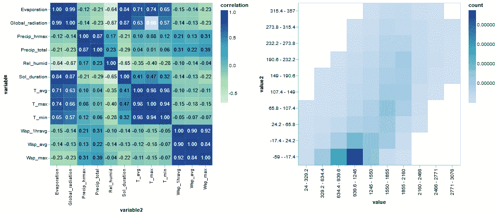
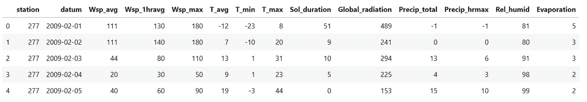
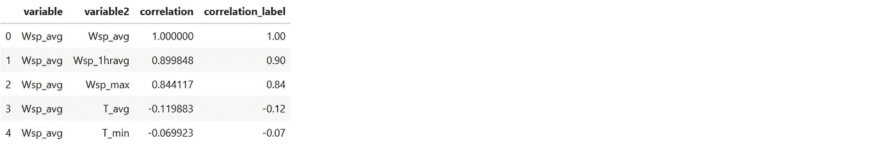
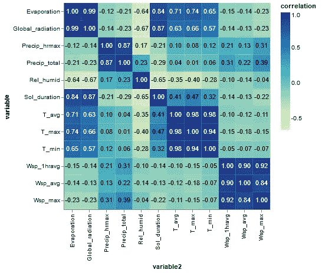
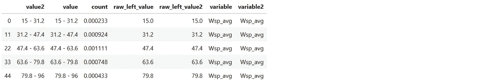
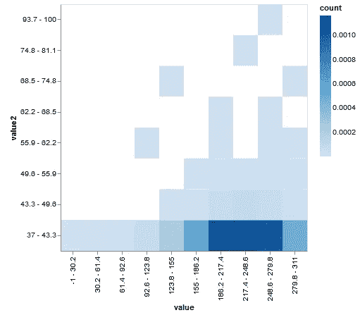
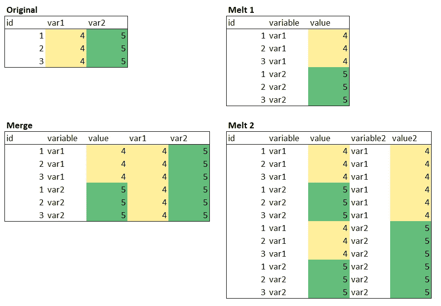

# 牛郎星情节解构:可视化天气数据的相关结构

> 原文：<https://towardsdatascience.com/altair-plot-deconstruction-visualizing-the-correlation-structure-of-weather-data-38fb5668c5b1?source=collection_archive---------17----------------------->

## 使用交互式 Altair plots、Python 和 Pandas 更有效地探索天气数据集的相关结构

*本文的一个 Jupyter 笔记本，包括资料，在我的 GitHub* *上有* [*。另外，这是我写的关于用 Python 制作朱朱情节的*](https://github.com/PaulHiemstra/altair_cor2dbinnedplot_article) [*系列文章*](https://towardsdatascience.com/tagged/plot-deconstruction-paul) *的一部分。*

即使在我的[上一篇文章](/plotnine-plot-deconstruction-visualizing-the-billboard-hot-100-8048808fd629)中对 plotnine 大加赞赏之后，它在一个主要方面还是有所欠缺:交互性。幸运的是，一篇关于媒介的文章为我指出了一个专门研究交互性的绘图框架。Altair 是一个用于 Python 的声明式统计可视化库，基于 Vega 和 [Vega-Lite](https://vega.github.io/vega-lite/) 。Vega-Lite 是由华盛顿大学交互数据实验室(UW IDL)开发的，它提供了一种简单、直观和一致的定义绘图的方法。定义地块的风格与 plotnine 和 ggplot2 具有类似的声明性原理(视觉语法):您不指定单独的线和点，而是指定地块轴和地块层。在我看来，这使得代码更加易读和紧凑。

本文的主要情节使用两个相连的子情节探索了天气数据集的相关性结构:一个相关性热图和一个显示点密度的 2d 直方图。下面的动画 gif 展示了实际的情节:

单击热图中的矩形，将显示与该特定单元格相关的变量在 2d 直方图中的相应数据。该图使您能够使用热图快速查看相关性模式，并允许您放大 2d 直方图中这些相关性背后的数据。

在本帖中，您将了解以下主题:

*   如何通过在 2d 直方图中聚合数据来处理 Altair 和大量数据。
*   如何在 Altair 中使用相同数据中的数值对分类轴上的值进行排序。当数据动态变化并且您无法预先计算值应该如何排序时，这尤其有用。
*   如何动态连接热图和二维直方图？这里的主要困难在于如何格式化数据以使其工作，另请参见 Altair Github 页面上的[这个问题](https://github.com/altair-viz/altair/issues/1617)。

在本文中，我将读取和处理数据，并慢慢构建静态版本的关联热图和 2d 直方图。最后，我将把情节连接在一起，实现交互性，并创建一个有凝聚力的交互情节。

## 读取数据

本文中的数据集包含我从荷兰皇家气象研究所( [KNMI](http://knmi.nl) )下载的气候数据。下面的代码将文本文件读入一个熊猫`DataFrame`:

`DataFrame`包含单个气象站 nr 277 (Lauwersoog)在 2009 年和 2020 年之间的天气数据。除了日期(数据)和站 id，所有其他列包含天气相关变量的测量值。在这种情况下，`Wsp`代表风速，`T`代表温度，`Precip`代表降雨量，`humid`代表湿度。KNMI 使用这些数据来跟踪荷兰各地不同时间的所有天气变量。比如:6 月份的平均气温是如何随时间变化的，或者说降水量与平均气温有什么相关性。

## 静态关联热图

本文的主要目标是理解我们数据集中 12 个天气变量的相关模式。如果有的话，这个数据集中不同变量之间的相互作用是什么。本部分的最终目标是静态版本的关联热图。

我们在 pandas 中使用`. corr '函数来计算相关性，这产生了一个相关性矩阵。请注意，我使用[堆栈](https://pandas.pydata.org/pandas-docs/stable/reference/api/pandas.DataFrame.stack.html)将[相关矩阵](https://www.displayr.com/what-is-a-correlation-matrix/)中的数据转换为[长格式](https://www.quora.com/What-is-long-and-wide-format-data)数据集，这是在 Altair 中绘图所需要的。

有了这些数据，我们可以制作关联热图:

该图由两层组成:具有相关性的文本层(text)和颜色对应于相关性的矩形层(cor_plot)。标签显示了实际的相关性，矩形层显示了相关性中的模式。

## 静态二维直方图

既然我们可以可视化相关的模式，我们可以构建 2d 直方图来显示单个相关的细节。我选择使用 2d 直方图而不是常规散点图来:

*   减少数据量。我们不必单独显示所有点，而只需显示分箱的数据。尤其是在绘图时，点太多会显著降低绘图速度。
*   使重叠点清晰可见。在正常的散点图中，重叠点往往会聚集在一起。在 2d 直方图中，重叠点导致该条柱中的点密度更高，使观察者清楚地看到这里有更多的点。

牛郎星可以执行宁滨的飞行，但随着我们的数据量牛郎星情节变得非常缓慢。为了加快绘图速度，我们使用 numpy.histogram2d 预先计算 2d 直方图。我们首先定义一个执行宁滨的函数，并将数据转换为 Altair 所需的长格式:

然后，我们使用该函数计算每个变量组合的面元 2d 数据:

还要注意`raw_left_value`列，它们是宁滨区间的左侧。这些将用于在绘图中正确排序轴标签。

根据该数据，这产生了下面的`Rel_humid`对`Precip_hrmax`的 2d 直方图:

这很好地说明了这两个变量之间 0.17 的低相关性。还要注意使用`EncodingSortField`根据 raw_left_value 变量对 x 轴和 y 轴上的标签进行正确排序。通常这些是按字母顺序排列的，但现在是从小到大。

## 交互所需的 2d 直方图数据的格式化

也许你已经注意到我组织 2d 直方图数据的方式有些奇怪。对于我在上面展示的单个图，我可以更简单地组织数据，就像在下图的原始表格中所做的那样:简单地为每个入库的变量列出一列:

但是，2d 直方图的数据格式类似于图中的 Melt2 表。我们:

*   将数据从宽格式转换为长格式
*   用长格式合并原始数据
*   再次转换为长格式

这是获得关联热图和 2d 直方图工作之间的交互性所必需的。当我们点击关联热图时，Altair 会跟踪选择了哪个变量，例如`Precip_hrmax`和`Rel_humid`。接下来，我们需要更新二维直方图。Altair 的一个怪癖是我们只能基于行而不是列进行子集划分。所以我们不能简单地取`Precip_hrmax`列和`Rel_humid`列中的值。复杂的熔融-合并-熔融数据格式对于仅使用行选择获得每个变量组合的装箱数据至关重要。核心是简单地重复每个变量的数据。

有了这种数据格式，我们就可以为`Precip_hrmax`选择所有数据，通过`variable2`仍然可以获得所有其他变量:

通过在“变量 2”上设置子集，我们得到了绘图所需的最终数据:

## 结合两个图

现在我们已经设置了两个图，我们需要连接两个图。连接通过选择器完成，在本例中为`selection_single`:

我们将选择器耦合到数据集(corr 和 binned 2d)中的变量和变量 2 字段，并将选择器分别初始化为变量和变量 2 的蒸发和 T_max。现在我们要做的就是:

*   将选择器连接到关联热图。这意味着，如果我单击热图，它会记录单击了 variable 和 variable2 的哪个值。
*   在绘制图之前，使用选择器对 2d 直方图数据进行子集划分。这自动化了我们之前通过调用`knmi_data_2dbinned.query()`手动完成的工作。

使用`transform_filter`完成 2d 面元数据的子集化:

以下代码定义了所有的图，通过选择器将它们连接起来，并生成所需的连通交互式图形:

这张最终的图表允许您自由探索数据的关联结构，并产生一些有趣的见解:

*   `Global_radiation`对`Sol duration`显示了 0.87 的高相关性。2d 直方图支持这一点，但也使图片有细微差别。大多数点位于图的左下边缘。这表明相关性严重依赖于数据的尾部。
*   `Wsp_1hravg`对`Precip_total`显示 0.31 的低相关性，但是 2d 直方图显示有一个信号:在较高风速期间，风速的增加似乎与降雨量的增加相关。这种相关性主要被较低的风速所抵消。

这使得读者可以很容易地发现相关性的趋势，但也可以深入到一个特定相关性的细节。

现在这个图的一个缺陷是轴的标题还没有更新。现在最好的方法就是记住`value`和`variable`属于同一个地方，而`value2`和`variable2`属于同一个地方。但是让这一点更清楚是我留给读者的一个很好的练习。

## 最后

Altair 是一个很棒的工具，它通过交互性极大地扩展了你创作引人注目的相关插图的选择。语法是一致的，选项是无穷无尽的。此外，与 Jupyter 笔记本的集成是无缝的，并且部署到现有网站上也很容易。为了让你的牵牛星更上一层楼，我建议你去看看[人物画廊](https://altair-viz.github.io/gallery/index.html)，探索一下哪些类型的情节是可能的。

我要感谢 [Rob Wanders](https://www.linkedin.com/in/rob-wanders-77581778/) 为本文的早期草稿提供反馈。

*本文的一个 Jupyter 笔记本，包括数据，在我的 GitHub* *上有* [*。*](https://github.com/PaulHiemstra/altair_cor2dbinnedplot_article)

如果你喜欢这篇文章，你可能也会喜欢我的其他一些文章:

*   [通过规范化扩展您的回归曲目](/expanding-your-regression-repertoire-with-regularisation-903d2c9f7b28)
*   [Plotnine 剧情解构:使用排名剧情可视化公告牌热门 100 名](/plotnine-plot-deconstruction-visualizing-the-billboard-hot-100-8048808fd629)
*   [数据科学的高级函数编程:用函数运算符构建代码架构](/advanced-functional-programming-for-data-science-building-code-architectures-with-function-dd989cc3b0da)